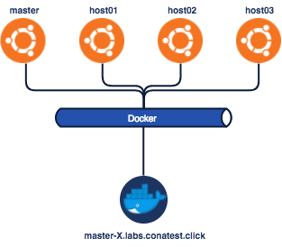
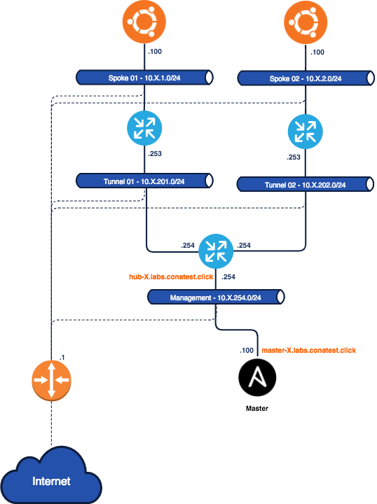

# Ansible Lab

Este directorio contiene todos los archivos relevantes para la ejecución de los laboratorios de ansible. Dentro del mismo encontrarán tres carpetas:

1. `docker/`
2. `net/`
3. `volume/`

Las primeras dos contienen los archivos necesarios para interactuar con las dos partes del laboratorio. La tercera existe solo para almacenar archivos persistentes entre ejecuciones de la primera parte del lab, la cual corre sobre contenedores. Como los containers no cuentan con estad, vinculamos esta carpeta como un volumen para almacenar archivos que continuarán existiendo tras reiniciar los contenedores.

## Primera Parte



En la primera parte del laboratorio trabajaremos sobre un laboratorio construido con contenedores. Esto nos permitira practicar algunos conceptos básicos de Ansible, sin necesidad de grandes configuraciones. Además, contaremos con la posibilidad de reestablecer el laboratorio directamente desde la línea de comandos, en caso de que queramos trabajar sobre un ambiente limpio.

Para comenzar el lab, nos conectaremos por `ssh` a la maquina `master`. Cada participante del curso debe contar con un `POD` individual, donde se estarán ejecutando todas las maquinas que componen el laboratorio. La clave para acceder a este servidor se las proveera el instructor del curso al momento de comenzar el laboratorio.

```bash
ssh -i key_pair_X ubuntu@master-X.labs.conatest.click
```

_OBS: Las `X` identifican el núemero de su `POD` el cual les será asignado por el instructor al comienzo del workshop._

Una vez conectados a la maquina `master` deberán dirigirse a la carpeta `/home/ubuntu/ansible_lab/docker`. Dentro de esta carpeta, podrán ejecutar 3 comandos para: prender, apagar, y conectarse, a los contenedores que conforman el laboratorio. Los comandos son:

- `make up`: comienza a ejecutar el lab. Por defecto, ya debería estar corriendo.
- `make down`: detiene y elimina los contenedores que conforman el lab.
- `make attach`: levanta una conexión `ssh` con uno de los contenedores, que usaremos para interactuar con los demás.

Para comenzar a interactuar con esta infraestructura ejecutaremos el comando `make attach`. Luego, en cualquier momento, podemos salir de esta consola, y ejecutar el comando `make down && make up` para reinciar los contendores. Una vez que vuelvan a conectar, podemos volver a la consola de control ejecutando el comando `make attach` nuevamente. Podemos repetir estos pasos tantas veces como queramos.

Además, el ambiente tiene configurado un `volumen` persistente levantado en el directorio `/var/ans`. Todos los archivos almacenados en este directorio quedarán almacenados en la carpeta `../volume`. Les recomendamos almacenar todos los archivos en esta carpeta para que no desaparezcan cuando reinicien el servicio.

### Segunda Parte

Una vez finalizada esta etapa saldremos de los contenedores y nos dirigiremos a la raiz de nuestro usario. Dentro de este directorio crearemos una nueva carpeta llamada `net`

```bash
cd ~
mkdir net
cd net
```

Todos los archivos del resto del laboratorio los escribiremos en esta carpeta.



El resto de este laboratorio lo realizaremos sobre maquinas virtuales corriendo sobre la nube pública de AWS (Amazon Web Services). La arquitectura esta compuesta de 3 maquinas virtuales corriendo `ubuntu` y tres routers Cisco corriendo `ios xe`.

Todas la redes de estos equipos están conectados a un router de AWS para poder salir a Internet. Sin embargo, dentro de ellos están configurados rutas estaticas que fuerzan el tráfico dentro de la red `10.X.0.0/16` por los tres routers Cisco.

Al router principal también podemos acceder por `ssh`.

```bash
ssh -i key_pair_X ec2-user@hub-X.labs.conatest.click
```
