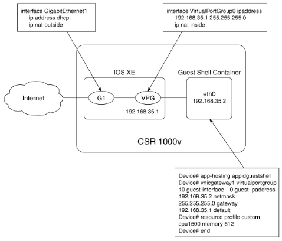
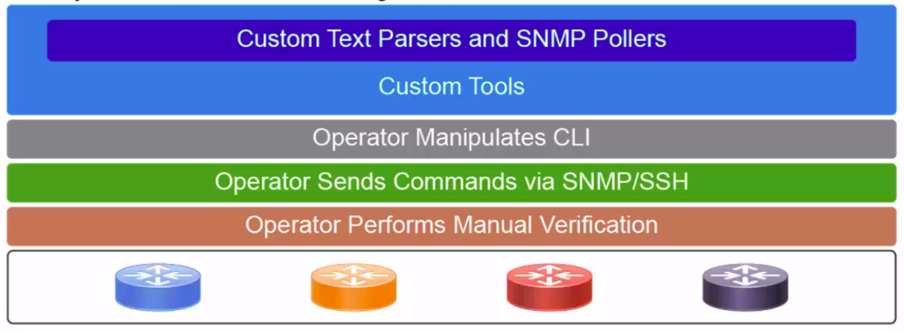
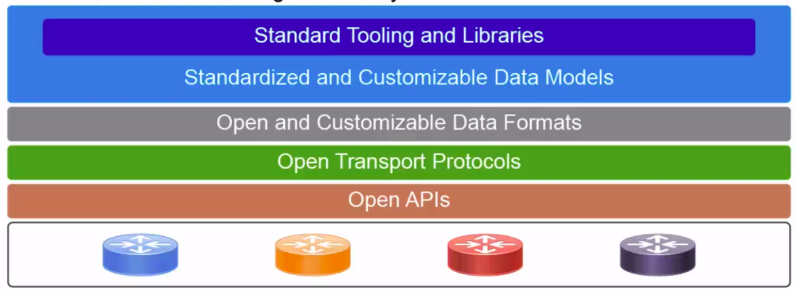
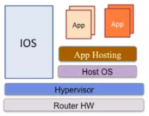
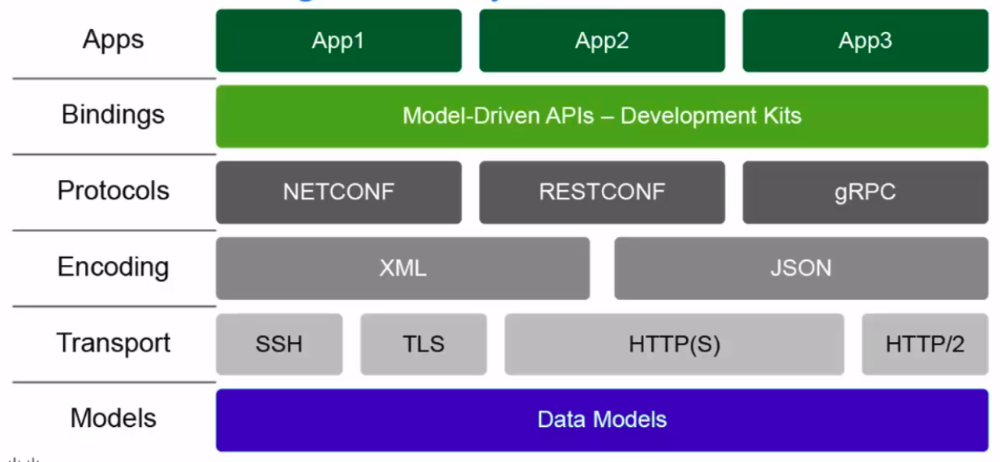
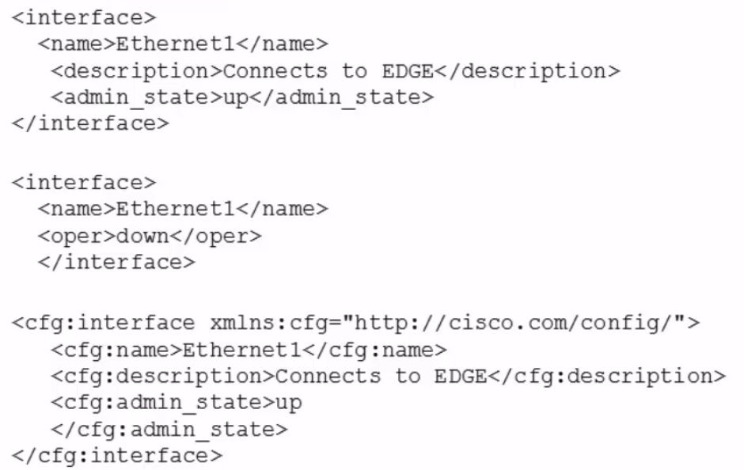
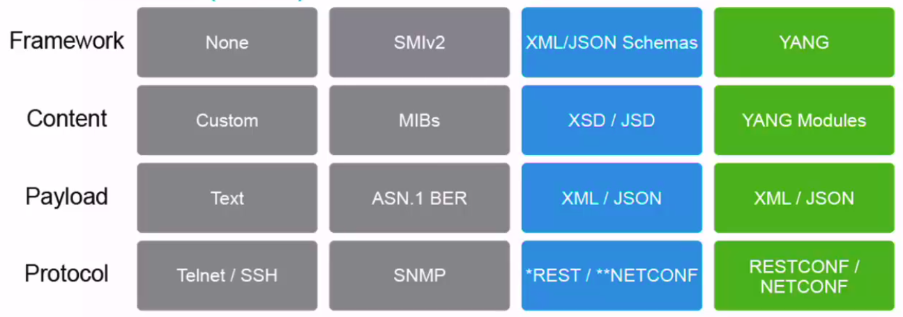
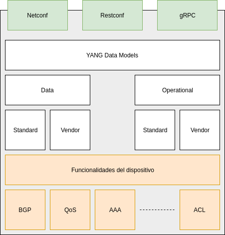

# Verificación del ambiente

* Grupo de `Webex Teams`
*  `pycharm`
*  `git`
* Repositorio actualizado
* Librerías Python
  * `requests`
  * `ncclient`
  * `xmltodict`
  * `pyang`

# Programabilidad tradicional

## Repaso de Python

A continuación haremos un repaso de los conceptos básicos del lenguaje Python. Para el lector que esté siguiendo el curso en modalidad autodidacta, fuera de un entrenamiento prescencial, le recomendamos repasar utilizando el [siguiente material](https://github.com/conapps/Devops-101/blob/48123fcc1ab831843d363a305f9ce235a3b9d559/Devnet%20Express/devnet/guias/02%20-%20Python.md).

En particular se debe poner foco en:

* Tipos de datos: listas, tuplas, diccionarios.
* Condicionales
* Bucles
* Funciones 

## Expresiones regulares

Las expresiones regulares son algo muy útil cuando necesitamos interactuar con dispositivos pensados para ser utilizados por humanos, en contraposición a aquellos dispositivos que soportan "programabilidad orientada a modelos" (model driven programmability). Concretamente, estas nos permiten buscar patrones dentro del texto de forma de poder luego incorporar los datos obtenidos a partir de dichos patrones a las estructuras de datos del lenguaje de programmación. Veremos a continuación como funcionan las expresiones regulares a través de ejercicios, pero antes disponibilizamos una tabla con las expresiones mas comunes para poder utilizar como referencia.

### Special Characters

`^` | Matches the expression to its right at the start of a string. It matches every such instance before each `\n` in the string.

`$` | Matches the expression to its left at the end of a string. It matches every such instance before each `\n` in the string.

`.` | Matches any character except line terminators like `\n`.

`\` | Escapes special characters or denotes character classes.

`A|B` | Matches expression `A` or `B`. If `A` is matched first, `B` is left untried.

`+` | Greedily matches the expression to its left 1 or more times.

`*` | Greedily matches the expression to its left 0 or more times.

`?` | Greedily matches the expression to its left 0 or 1 times. But if `?` is added to qualifiers (`+`, `*`, and `?` itself) it will perform matches in a non-greedy manner.

`{m}` | Matches the expression to its left `m` times, and not less.

`{m,n}` | Matches the expression to its left `m` to `n` times, and not less.

`{m,n}?` | Matches the expression to its left `m` times, and ignores `n`. See `?` above.

### Character Classes (a.k.a. Special Sequences)

`\w` | Matches alphanumeric characters, which means `a-z`, `A-Z`, and `0-9`. It also matches the underscore, `_`.

`\d` | Matches digits, which means `0-9`.

`\D` | Matches any non-digits.

`\s` | Matches whitespace characters, which include the `\t`, `\n`, `\r`, and space characters.

`\S` | Matches non-whitespace characters.

`\b` | Matches the boundary (or empty string) at the start and end of a word, that is, between `\w` and `\W`.

`\B` | Matches where `\b` does not, that is, the boundary of `\w` characters.

`\A` | Matches the expression to its right at the absolute start of a string whether in single or multi-line mode.

`\Z` | Matches the expression to its left at the absolute end of a string whether in single or multi-line mode.

### Sets

`[ ]` | Contains a set of characters to match.

`[amk]` | Matches either `a`, `m`, or `k`. It does not match `amk`.

`[a-z]` | Matches any alphabet from `a` to `z`.

`[a\-z]` | Matches `a`, `-`, or `z`. It matches `-` because `\` escapes it.

`[a-]` | Matches `a` or `-`, because `-` is not being used to indicate a series of characters.

`[-a]` | As above, matches `a` or `-`.

`[a-z0-9]` | Matches characters from `a` to `z` and also from `0` to `9`.

`[(+*)]` | Special characters become literal inside a set, so this matches `(`, `+`, `*`, and `)`.

`[^ab5]` | Adding `^` excludes any character in the set. Here, it matches characters that are not `a`, `b`, or `5`.

### Groups

`( )` | Matches the expression inside the parentheses and groups it.

`(? )` | Inside parentheses like this, `?` acts as an extension notation. Its meaning depends on the character immediately to its right.

`(?PAB)` | Matches the expression `AB`, and it can be accessed with the group name.

`(?aiLmsux)` | Here, `a`, `i`, `L`, `m`, `s`, `u`, and `x` are flags:

- `a` — Matches ASCII only
- `i` — Ignore case
- `L` — Locale dependent
- `m` — Multi-line
- `s` — Matches all
- `u` — Matches unicode
- `x` — Verbose

`(?:A)` | Matches the expression as represented by `A`, but unlike `(?PAB)`, it cannot be retrieved afterwards.

`(?#...)` | A comment. Contents are for us to read, not for matching.

`A(?=B)` | Lookahead assertion. This matches the expression `A` only if it is followed by `B`.

`A(?!B)` | Negative lookahead assertion. This matches the expression `A` only if it is not followed by `B`.

`(?<=B)A` | Positive lookbehind assertion. This matches the expression `A` only if `B` is immediately to its left. This can only matched fixed length expressions.

`(?<!B)A` | Negative lookbehind assertion. This matches the expression `A` only if `B` is not immediately to its left. This can only matched fixed length expressions.

`(?P=name)` | Matches the expression matched by an earlier group named “name”.

`(...)\1` | The number `1` corresponds to the first group to be matched. If we want to match more instances of the same expresion, simply use its number instead of writing out the whole expression again. We can use from `1` up to `99` such groups and their corresponding numbers.

## Python `re`

A continuación exploraremos como trabajar con expresiones regulares en Python a través del módulo `re`. Las principales funciones que utilizaremos de este modulo son `re.search(pattern, text)` y `re.match(pattern, text)`

### re.match()

Busca una expresión regular en un texto **a partir del inicio del texto**

``` python
import re
>>> texto = 'tres tristes tigres comen trigo en un trigal'

# matchea todo aquello que comience con 'tre' o 'tri'
>>> resultado = re.match('tr[e,i].+', texto)
>>> resultado.group(0)
'tres tristes tigres comen trigo en un trigal'

# ahora modifico para que haga match solo comenzando con 'tri'
>>> resultado = re.match('tri.+', texto)

# 'match' solo toma en cuenta matcheos al comienzo del string por lo que da un error
>>> resultado.group(0)
Traceback (most recent call last):
  File "<input>", line 1, in <module>
AttributeError: 'NoneType' object has no attribute 'group'
```


### re.search()

Busca una expresión regular **en cualquier lugar del texto**

Ejemplo de uso:

```python
>>> import re
>>> texto = 'tres tristes tigres comen trigo en un trigal'
>>> resultado = re.search('(tri)(.*)tri', texto)

""" aquí se ve como search busca en cualquier parte del string. También podemos ver como las búsquedas son 'greedy' abarcando tantos caracteres como sea posible.
"""
>>> resultado.group(0)
'tristes tigres comen trigo en un tri'
>>> resultado.group(1)
'tri'
>>> resultado.group(2)
'stes tigres comen trigo en un '

# probemos ahora el caracter especal '?' para que la búsqueda no sea 'greedy'
>>> resultado = re.search('(tri)(.*?)tri', texto)
>>> resultado.group(0)
'tristes tigres comen tri'
>>> resultado.group(1)
'tri'
>>> resultado.group(2)
'stes tigres comen '
```


### Ejercicio 1

Resolver el punto 1) del siguiente script de manera que el mismo imprima el usuario y el password (en formato MD5) de forma correcta.

``` python
import re
# Definirmos el texto como "string literal" para "escapar" los caracteres especiales
texto = """username conatel privilege 15 secret 5 $1$4Sf.$rjl0RjHG5\nODaninR1Myen0"""

exp = # 1) Escribir la expresion regular

username = re.search(exp, texto).group(1)
password =  re.search(exp, texto).group(2)

print('El usuario es:', username)
# repr() hace que los caracteres especiales como ser \n se impriman tal cual, sin interpretarse
print('El password es:', repr(password))
```


## Python nativo en el dispositivo

`guestshell` es un ambiente virtualizado, basado en linux, diseñado para correr aplicaciones customizadas dentro del router, incluyendo Python. Este entorno se corre como un Linux Container, completamente desacoplado del router.

Al ser un contenedor, el `guestshell` comparte el kernel con el host, el router en este caso, y al funcionar como un entorno Linux completo, se pueden instalar nuevas librerías y aplicaciones. Gracias a la seguridad provista por la tecnología de contenedores, un usuario dentro del `guestshell` no puede modificar procesos ni el filesystem del router, (salvo por la carpeta `flash:` que se monta automáticamente en el `guestshell` al iniciarlo). El container`guestshell` es administrado a través de `IOx`, tecnología diseñada para hostear aplicaciones en infraestructura (routers, switches, etc) que corran IOS-XE. `IOx` en detalle está fuera del alcance de este curso.

Para habilitar la posiblidad de correr una terimanl linux (shell) y por tanto scripts de Python en el dispositivo primero configuro `IOX`:

``` bash
router# configure terminal
router(config)# iox
router(config)# exit

router# #show iox-service 
Virtual Service Global State and Virtualization Limits:

Infrastructure version : 1.7
Total virtual services installed : 0
Total virtual services activated : 0

Machine types supported   : LXC
Machine types disabled    : KVM

Maximum VCPUs per virtual service : 0
Resource virtualization limits:
Name                         Quota     Committed     Available  
--------------------------------------------------------------
system CPU (%)                  75             0            75  
memory (MB)                   1024             0          1024  
bootflash (MB)               20000             0          5765  


IOx Infrastructure Summary:
---------------------------
IOx service (CAF)    : Running 
IOx service (HA)     : Not Running 
IOx service (IOxman) : Running 
Libvirtd             : Running 

```

Luego habilito `guestshell`:

``` bash
router# guestshell enable
guestshell enable 
Interface will be selected if configured in app-hosting
Please wait for completion
guestshell installed successfully
Current state is: DEPLOYED
guestshell activated successfully
Current state is: ACTIVATED
guestshell started successfully
Current state is: RUNNING
Guestshell enabled successfully

router# #show app-hosting list 
App id                           State
------------------------------------------------------
guestshell                       RUNNING

```

Para que el contenedor que corre `guestshell` tenga conectividad con el mundo exterior hay que configurar lo siguiente:

>  Nota: en nuestro laboratorio la siguiente configuración ya se ha realizado

````bash
! interface que tiene conectividad con el exterior
Router(config)# interface GigabitEthernet1
Router(config-if)# ip address <ip/mask>
Router(config-if)# ip nat outside
Router(config-if)# exit

! interface sobre la cual se conectara el contenedor que correo el guestshell
Router(config-if)# interface VirtualPortGroup0
Router(config-if)# ip address 192.168.35.1 255.255.255.0
Router(config-if)# ip nat inside
Router(config-if)# exit

! nat para darle salida al exterior
Router(config)# ip nat inside source list GS_NAT_ACL interface GigabitEthernet1 overload
Router(config)# ip access-list standard GS_NAT_ACL
Router(config)# permit 192.168.0.0 0.0.255.255

! conexion del contenedor y asignacion de IP y recursos
Router(config)# app-hosting appid guestshell
Router(config-app-hosting)# vnic gateway1 virtualportgroup 0 guest-interface 0 guest-ipaddress 192.168.35.2 netmask 255.255.255.0 gateway 192.168.35.1 name-server 8.8.8.8 default
Router(config-app-hosting)# resource profile custom cpu 1500 memory 512
Router(config-app-hosting)# end
````

De esta forma el contenedor con la `guestshell` queda conectado al exterior a través de un NAT, tal como lo muestra la siguiente figura:





Una vez habilitada y configurada la `guestshell`  podemos, por ejemplo, instalar nuevas librerías.

``` bash
router# guestshell run sudo pip install requests
Collecting requests
...
<-- salida omitida para mayor claridad -->
```

Para correr la consola interactiva del intérprete de Python:

``` bash
router# guestshell run python
Python 2.7.5 (default, Jun 17 2014, 18:11:42) 
[GCC 4.8.2 20140120 (Red Hat 4.8.2-16)] on linux2
Type "help", "copyright", "credits" or "license" for more information.
>>> print('hello world')
hello world
```

Cisco desarrolló un módulo que permite interactuar con la consola (IOS) de forma programática. Podemos importar algunas de sus funciones y luego utilizar `help()` para investigar su funcionamiento.

``` python
>>> from cli import cli, clip, configure, configurep, execute, executep
>>> help(cli)
Help on function cli in module cli:

cli(command)
    Execute Cisco IOS CLI command(s) and return the result.
    
    A single command or a delimited batch of commands may be run. The
    delimiter is a space and a semicolon, " ;". Configuration commands must be
    in fully qualified form.
    
    output = cli("show version")
    output = cli("show version ; show ip interface brief")
    output = cli("configure terminal ; interface gigabitEthernet 0/0 ; no shutdown")
    
    Args:
        command (str): The exec or config CLI command(s) to be run.
    
    Returns:
        string: CLI output for show commands and an empty string for
            configuration commands.
    
    Raises:
        errors.cli_syntax_error: if the command is not valid.
        errors.cli_exec_error: if the execution of command is not successful.
```


> Para que el módulo `cli` funcione es necesario que el router tenga el servicio HTTP habilitado. Podemos habilitarlo de la siguiente manera:
>
> ```bash
> router(config)# ip http server 
> ```


### Ejercicio 2

En este ejercicio implementaremos el siguiente caso de uso. 
Supongamos que queremos actualizar de forma dinámica la base local de usuario y password de los equipos en función de los datos provistos por la siguiente API:

`GET https://t35nbzlj21.execute-api.us-east-1.amazonaws.com/produccion/users`

Para ello, crearemos un script que se asegure, cada vez que corre, que los usuarios configurados localmente en el router son exactamente los mismos, con los mismos privilegios y los mismos passwords, que los que devuelve la API. De forma adicional, queremos que el script nos avise al grupo de Spark si la base de datos de usuarios fue actualizada con éxito o hubo algún inconveniente.

#### 2.1

Para apoyarnos en este ejercicio, utilizaremos una librería de utilidades que implementa algunas funciones útiles llamada `conatel.py`. La misma está ubicada en el repositorio en `Devops-101/Advanced Network Programmability/dia_1/codigo_dia_1/ejercicios`.

Lo primero que haremos será copiar `conatel.py` a la `flash` del router:

En el router:

``` cisco
router(config)# username conatel privilege 15 secret conatel
```

En la máquina local

``` bash
$ scp conatel.py conatel@url_recibida_por_correo:/conatel.py
```

> Nota: en caso de que se esté trabajando con Windows, el siguiente comando se puede instalar desde la consola de GIT

#### 2.2

**En su máquina local** realice un script que imprima en consola de forma "legible"  la información devuelta por la API.

#### 2.3

**En su máquina local** complete el script **2.3** para implementar una función llamada `get_users()` que devuelva **un diccionario** con los usuarios obtenidos de la API, o levante una excepción en caso de que no pueda obtener los mismos.

#### 2.4

**En su máquina local** utilice la función `get_users()` desarrollada en el ejercicio pasado y la función `send_message(message, key)` para enviar al grupo del curso en Webex Teams los datos completos de los 3 primeros usuarios.

La función `send_message(message, key)`  de la librería `conatel.py`, toma como parámetros un mensaje y la clave de desarrollador individual de Webex Teams para enviar dicho mensaje al grupo del curso.

> Nota: puede obtener su clave de desarrollador de Webex Teams en la siguiente URL: 
> `https://developer.webex.com/`.
>
> Nota2: asegurese de estar logueado.

#### 2.5

Ahora escribiremos un script que cumpla con el caso de uso planteado al principio del ejercicio.
Complete el script 2.5 **que está pensado para ser corrido en el router** para que haga lo siguiente:

1) traer los usuarios a configurar desde la API
2) borrar los usuarios actuales utilizando la función `delete_users()` de la librería `conatel.py`
3) configurar en el router todos los usuarios obtenidos desde la API utilizando la funcion `configure()` del módulo `cli` desarrollado por Cisco.
4) Enviar un mensaje al grupo de Teams del curso indicando el éxito o fracaso de la operación.

> Nota: tenga en cuenta que no podrá correr el script aún, dado que está pensado para correr en el router. Para verificar su código, comparelo con la solución
>
> Pista: recordar que el `level` que devuelve la API de usuarios es un int.

#### 2.6

Copiar el script al router con el nombre `script.py`:

``` bash
$ scp 2.6.py conatel@url_recibida_por_correo:/conatel.py
```

Entrar al router y verficiar que el script funciona de acuerdo a lo esperado:

``` bash
router# guestshell run python /flash/script.py
```

### Ejercicio 3

Ahora que tenemos una buena cantidad de usuarios configurados en el router, exploraremos  como utilizar expresiones regulares para modificar la salida de los comandos directamente desde la consola del router (sin utilizar Python).

Escriba una expresión regular de forma tal que el siguiente comando liste únicamente los usuarios que comienzan con la letra `g` y que terminan con un número.

````bash
router# show runninng-config | include <expresion regular>
````

> Nota: las expresiones regulares soportadas por el software Cisco IOS-XE no son las mismas que las soportadas por Python. [Aquí](https://www.cisco.com/c/en/us/td/docs/ios-xml/ios/fundamentals/configuration/xe-3s/fundamentals-xe-3s-book/cf-cli-search.html#GUID-A26947FE-801A-4597-8FD2-57FDCDD1AADB) podrá encontrar una referencia sobre que está soportado en Cisco IOS-XE:.


<details>

<summary>Solucion</summary>

<code>

`show running-config | include username g[^_]+[0-9]_`

</code>

</details>

# Programación orientada a modelos

## Introducción

Hasta ahora el principal protocolo utilizado para la administración de redes empresariales es SNMP, (en alguna de sus variantes). Si bien SNMP ha hecho un buen trabajo desde su estandarización en 1990, hoy en día muestra una serie de limitantes que hacen que en muchas ocaciones ya no sea el mecanismo mas adecuado para gestionar redes de datos. Las principales limitantes que muestra este protocolo hoy en día son:

- Falta de MIBs con posibilidad de escritura.
- Es difícil hacer un rollback de configuración.
- Falta de librerías adecuadas para varios lenguajes de programación.

En cuanto a la configuración y "troubleshooting" de los equipos de red, el principal método utilizado en la actualidad es la línea de comandos (CLI), en general accedida a través de protocolos como telnet o ssh. Este tipo de interacción con los dispositivos para su configuración tiene algunas desventajas:

- La CLI está pensada para ser utilizada por seres humanos, por lo que es dificil generar automatizaciones.
- No presenta un modelo de datos (no hay una estructura bien definida).
- No es modularizable o re-utilizable.

De acuerdo a lo visto anteriormente, podemos resumir gráficamente como sería el modelo de gestión de red utilizado hasta ahora. Notemos que en este modelo, la verficación se realiza **manualmente y en tiempo de ejecución**. 




Por el contrario, la disciplina a la que llamamos **network programmability**, utiliza un enfoque basado en modelos de datos, APIs abiertas, protocolos abiertos y formatos de datos optimizados para la comunicación machine-to-machine. La figura a continuación presenta un resumen gráfico del modelo que exploraremos en este curso.





Las capas de este modelo están compuestas por un ecosistema de protocolos, lenguajes y formatos que han cobrado mucha popularidad en los últimos años y sobre los cuales nos enfocaremos en este curso.

Ya comenzamos explorando la posibilidad que brindan los equipos de red de correr aplicaciones dentro de los mismos. Una tecnología comunmente denominada como "FOG computing". En particular, como administradores de infraestructura que somos, nos centramos un caso de uso específico de esta tecnología que es cómo correr scripts de "Python" para automatizar tareas de configuración y troubleshooting. 





A continuación, veremos las dificultades y limitantes que presenta este modelo de trabajo, e introduciremos el concepto de "Model Driven Programmability", que busca resolver los problemas que plantea el hecho de interactuar con un dispositivo de red mediante interfaces diseñadas para el uso por parte de seres humanos.

Dentro del paradigma de "Model Driven Programmability", entenderemos como modelar los datos mediante un lenguaje de modelado llamado `YANG` y cual es la utilidad de hacer esto. Veremos como codificar la información del modelo de datos definido para poder ser transmitida. En particular exploraremos dos tipos de codificación diferentes: `XML` y `JSON`. Luego trabajaremos con los dos principales protocolos disponibles hoy en día `Netconf` y `RestConf`.





En el segundo día de curso, daremos un paso mas al explorar herramientas que hacen uso de las técnicas vistas anteriormente para escalar y profesionalizar el trabajo. En particular, estudiaremos Ansible en profundidad, una aplicación que nos permitirá tratar a la infraestructura como código ("Infrastructure as Code"); paso indispensable para llegar al objetivo la automatización total de la misma.

## Encoding formats

Los formatos con que se codifican los datos son un componente fundamental debido a que son los que permiten realizar la comunicación machine-to-machine de forma eficiente. Estos formatos de datos cuentan con una estructura que permite fácilmente traducir los datos transmitidos de un sistema a otro en las estructuras de datos del lenguaje de programación que se esté utilizando. 

### JSON

JavaScript Object Notation, o JSON, es un formato de datos diseñado para la comunicación machine-to-machine que a la vez es muy sencillo de leer por humanos.

Una de las propiedades principales de JSON, es que se mapea completamente a las estructuras de datos (objetos) de Javascript y casi completamente a las estructurdas de datos (diccionarios) de Python, lenguaje con el que estaremos trabajando en este curso. Dicho de otra forma, una estructura de datos en JSON, es casi indistinguible en su estructura de un diccionario de Python, y existen librerías y funciones para pasar de uno a otro con mucha facilidad.

La importancia de comprender el formato de datos JSON en profundidad es que generalmente las APIs y los dispositivos de red, responden las consultas hechas de forma programática con este formato. Por tal motivo, luego de hacer una consulta a un dispositivo de red (y de recibir su respuesta), deberemos convertir la misma, que estará en formato JSON, a un diccionario de python. Para hacer esto utilizaremos la librería `json` de la siguiente manera.


``` python
import json
from utilidades import traer_config

""" hago una consulta a un dispositivo de red y guardo la respuesta, en JSON, en la variable resultado_json """
resultado_json = traer_config()

""" Para poder acceder a los distintos campos presentes en la respuesta tengo que convertir los datos a diccionarios de Python """
resultado_dict = json.loads(resultado_json)

# ahora puedo, por ejemplo, imprimir el hostname
print(resultado_dict['hostname'])
```


Del mismo modo, cuanto tenemos datos que queremos enviar a un dispositivo de red, tendremos que convertirlo a JSON antes de poder enviarlos. Veámoslo con un ejemplo:

``` python
import json
from utilidades import configurar_dispositivo

ip = '1.2.3.4'
datos = {
    'hostname': 'router1',
    'snmp-community': 'test123'
}

# antes de poder enviar los datos al equipo tengo que convertirlos a JSON
datos_json = json.dumps(datos)

# ahora si puedo configurar el dispositivo
configurar_dispositivo(ip, datos_json)
```


En resumen, al recibir datos JSON desde una API o dispositivo de red puedo convertirlos a diccionarios de Python utilizando la función `json.loads(json_data)` ; por otro lado, cuando necesito enviar los datos que tengo en un diccionario los puedo convertir en JSON de la siguiente manera `json.dumps(python_data)`

> **Nota**: la función `json.dumps` también es útil para imprimir en consola de forma "bonita" una estructura de datos compleja, podemos hacer esto utilizando el parámetro `indent` de la misma. Por ejemplo `print(json.dumps(python_data, indent=4))`


#### JSON schema definition

Para el intercambio efectivo de información en formato JSON, es imprescindible conocer (y respetar) la estructura de los datos. De este modo, para escribir un script que, por ejemplo, monitoree cuanto tráfico se envía a través de una interface, es imprescindible conocer si el campo que tengo que evaluar se llama `intf_counter`, `interface_count`, o `int_count` de lo contrario no podré referenciarlo dentro de la estructura de datos de mi script. Mas aún, no es suficiente con conocer los nombres de los campos relevantes, sino que es necesario conocer también el tipo de datos, dado que no es lo mismo que recibir el conteo de bytes en un `string` que como un `int` (recordemos que Python es un lenguaje fuertemente tipado).

Para dar respuesta a esta necesidad existe una especificación llamada [JSON schema definition](https://json-schema.org/). Esta especificación define de forma inequivoca cual es la estructura de los datos intercambiados. JSON schema definition es modular y permite reutilizar distintos bloques en varios puntos dentro de la estructura de datos forma de hacer el código mas legible y eficiente. Veamos esto con un ejemplo.

Supongamos que dentro de la estructura de datos a definir existen "direcciones". JSON schema definition me permite escribir un bloque de código que define como es la **estructura** de una dirección.

``` json
{
  "definitions": {
    "direccion": {
      "type": "object",
      "properties": {
        "calle":  { "type": "string" },
        "numero": { "type": "string" },
        "ciudad": { "type": "string" }
      },
      "required": ["calle", "numero", "ciudad"]
    }
  }
}
```

De esta forma, cuando reciba datos en formato JSON que representen una dirección y quiera acceder al número de puerta, sabré que el nombre del campo que nececito es `numero` y también sabré que el valor contenido en dicho campo será un string y no un entero. Mas aún sabre que todo objeto que contenga una dirección, necesariamente tendrá una `calle`, un `numero` y una `ciudad` dado que son campos requeridos.

Como se mencionó anteriormente, en caso de que quiera establecer una estructura de datos mas compleja, JSON schema definition me permite re-utilizar la definición de dirección en distintos lugares del código. De esta forma, si en un futuro decido agregar un campo que indique el país al que pertenece la dirección, sólo necesito modificar la estructura de datos en un único lugar. Para referenciar la dirección en otras partes del código se utiliza la siguiente sintáxis: `{ "$ref": "definitions.json#/direccion" }`.

```json
{
  "$schema": "http://json-schema.org/draft-07/schema#",
  "definitions": {
    "direccion": {
      "type": "object",
      "properties": {
        "calle":  { "type": "string" },
        "numero": { "type": "string" },
        "ciudad": { "type": "string" }
      },
      "required": ["calle", "numero", "ciudad"]
    }
  },

  "type": "object",

  "properties": {
    "direccion_de_facturacion": { "$ref": "#/definitions/direccion" },
    "direccion_de_envio": { "$ref": "#/definitions/direccion" }
  }
}
```

Un objeto válido creado a partir de la definición anterior sería:

``` json
{
  "direccion_de_envio": {
    "calle": "Ejido",
    "numero": "1690",
    "ciudad": "Montevideo"
  },
  "direccion_de_facturacion": {
    "calle": "Javier Barrios Amorin",
    "numero": "1672",
    "ciudad": "Montevideo"
  }
}
```

JSON schema definition es extremadamente útil para definir estructuras de datos pensadas para el intercambio de información machine-to-machine de forma genérica. Sin embargo, para modelar la complejidad de la estructura de datos en un dispositivo de comunicaciones, en general se utiliza un lenguaje de modelado diseñado específicamente para este fin (YANG). Si bien es importante entender que es y cual es el problema que resuelve JSON schema definition, en este curso nos centraremos casi exclusivmanete en el modelado de estructuras de datos mediante YANG.


#### Ejercicio 3

La siguiente URL:

`https://t35nbzlj21.execute-api.us-east-1.amazonaws.com/produccion/mundiales`

Corresponde a una API que devuelve datos sobre la historia de los mundiales de fútbol con la siguiente estructura:

``` json
{
  "$schema": "http://json-schema.org/draft-07/schema#",
  "definitions": {
    "pais": {
      "type": "object",
      "properties": {
        "nombre":  { "type": "string" },
        "copas": { "type": "integer" },
        "organizo_mundiales": {"type": "boolean"}
      },
      "required": ["nombre", "copas"]
    }, 
    "mundial": {
      	"type": "object",
        "properties": {
          "fecha": {
            "enum": [
              1930, 
              1934, 
              1938, 
              1950, 
              1954, 
              1958, 
              1962, 
              1966, 
              1970, 
              1974, 
              1978, 
              1982, 
              1986, 
              1990, 
              1994, 
              1998, 
              2002, 
              2006, 
              2010, 
              2014, 
              2018
            ],
		},
        "organizador": {"type": "string"},
        "campeon": {"$ref": "#/definitions/pais"},
        "organizador_campeon": {"$ref": "boolean"}
      },
	  "required": ["fecha", "organizador", "campeon"]
    }
  },

  "type": "object",
  "properties": {
    "mundiales": { 
        "type": "array",
        "items": {"$ref": "#/definitions/mundial"}
    }
  }
}
```


##### 3.1

Basado en la información del JSON schema definition construya un script de Python que liste el año del mundial, el organizador y el nombre del campeón para todos los mundiales. El formato de salida debe ser el siguiente: 

``` bash
Mundial 1930
	Organizador: Uruguay
	Campeon: Uruguay
Mundial 1934
	Organizador: Italia
	Campeon: Italia
...
```

##### 3.2

Liste todos mundiales que hayan sido ganados por paises que a su vez hayan ganado al menos dos mundiales. El formato de salida debe ser el siguiente:

``` bash
Mundial 1930
	Organizador: Uruguay
	Campeon: Uruguay
	Copas totales de Uruguay: 2
Mundial 1934
	Organizador: Italia
	Campeon: Italia
	Copas totales de Italia: 4
...
```

##### 3.3

Despliegue año y pais de cada mundial donde los datos indiquen que el organizador fue el campeón. La selección de los mundiales a desplegar debe hacerse en base al campo `organizador_campeon` y **no comparando los nombres del organizador y el campeón**. El formato de salida debe ser el siguiente:

``` bash
Mundial 1930
	Organizador: Uruguay
	Campeon: Uruguay
Mundial 1934
	Organizador: Italia
	Campeon: Italia
...
```


### XML

XML es un lenguaje de Markup similar a HTML. Mientras que HTML fue diseñado para mostrar datos de forma clara y legible para seres humanos, XML fue diseñado para describir datos en comunicaciones machine-to-machine al igual que JSON.

Mientras que los tags de HTML son estándar, los tags de XML son definidos por el autor de los modelos.
Esto naturalmente abre la puerta a que se generen conflictos de nombres; para mitigar estos riesgos XML incorpora el concepto de `namespaces`. En el siguiente ejemplo, podemos ver que hay definidos dos elementos con el mismo nombre, uno representa la configuación de una interface y otro el estado operacional, hecho que lógicamente implica un problema. Una forma de resolver este inconveniente es introducir el concepto de `namespace`. En el ejemplo, al `namespace` `http://cisco.com/config/` se le asigna un alias `cfg`. Luego, todos los elementos que sean prependeados con `cfg:` pertenecerán al `namespace` correspondiente. De forma adicional, podría definirse un otro `namespace` `http://cisco.com/oper/`, asignarle el alias `oper`, y hacer lo mismo.





A diferencia de JSON, XML es más verboso y difícil de leer para los seres humanos. Una dificultad adicional que presenta XML respecto a JSON, es que no se mapea directamente a las estructuras de datos de los lenguajes de programación, por lo que, cuando un request nos devuelva datos en XML tendremos que utilizar una librería, no nativa, llamada `xmltodict` que se encargará de transformar el XML a los tipos de datos del lenguage. Veamos esto con el siguiente script a modo de ejemplo:

``` python
import xmltodict
import json

resultado = """<interface>
                  <name>GigabitEthernet1</name>
                  <description>Conectada a Internet</description>
                  <enabled>true</enabled>
                  <ipv4 xmlns="urn:ietf:params:xml:ns:yang:ietf-ip">
                    <address>
                      <ip>1.2.3.4</ip>
                      <netmask>255.255.255.0</netmask>
                    </address>
                  </ipv4>
                </interface>"""
resultado_convertido = xmltodict.parse(resultado)
print('resultado_convertido es del tipo:')

# Notemos que no es un diccionario sino un diccionario ordenado
print(type(resultado_convertido))
print('resultado_convertido:')
print(json.dumps(resultado_convertido, indent=2))

# El diccionario ordenado se accede de la misma forma que el diccionario estándar
print('El nombre de la interface es:', resultado_convertido['interface']['name'])
```

Si lo corremos el resultado es el siguiente:

``` python
resultado_convertido es del tipo:
# Notemos que no es un diccionario sino un diccionario ordenado
<class 'collections.OrderedDict'>   

resultado_convertido:
{
  "interface": {
    "name": "GigabitEthernet1",
    "description": "Conectada a Internet",
    "enabled": "true",
    "ipv4": {
      "@xmlns": "urn:ietf:params:xml:ns:yang:ietf-ip",
      "address": {
        "ip": "1.2.3.4",
        "netmask": "255.255.255.0"
      }
    }
  }
}

# El diccionario ordenado se accede de la misma forma que el diccionario estándar
El nombre de la interface es: GigabitEthernet1
```


#### XSD XML Schema definition

Del mismo modo en que el modelo de datos se puede especificar utilizando JSD, también para XML existe una especificación análoga llamada XML schema definition XSD. A modo de ejemplo, el snippet a continuación muestra el mismo modelo de `direccion` que vimos con JSD, pero ahora escrito en XSD.

``` xml
<xs:element name="direccion">
  <xs:complexType>
    <xs:sequence>
      <xs:element name="calle" type="xs:string"/>
      <xs:element name="numero" type="xs:string"/>
      <xs:element name="ciudad" type="xs:string"/>
    </xs:sequence>
  </xs:complexType>
</xs:element>
```

Si bien tanto JSD como XSD son perfectamente válidos para modelar cualquier estructura de datos, en lo que refiere a dispositivos de comunicaciones, (routers, switches, firewalls, etc), se está tendiendo a utilizar YANG para modelar dichas estructuras. En este curso seguiremos esta tendencia, explorando YANG de forma extensiva, por lo que no profundizaremos mas de lo ya visto sobre JSD y XSD.

#### Ejercicio 4

En la URL:

`https://t35nbzlj21.execute-api.us-east-1.amazonaws.com/produccion/mundiales-xml`

Encontraremos la misma información sobre la historia de los mundiales de fútbol que en los ejercicios anteriores sólo que ahora en formato XML.

##### 4.1

Construya un script de Python que imprima en pantalla el XML completo que devuelve dicha URL.

##### 4.2

Utilice ahora la siguiente función para que su script anterior entregue un formato mas legible a la salida:

``` python
def pretty_print_xml(xml_string):
    """
    Funcion que recibe un string XML y lo imprime de forma bonita
    :param xml_string: string con formato XML
    :return: None
    """
    import xml.dom.minidom
    xml = xml.dom.minidom.parseString(xml_string)
    print(xml.toprettyxml())
```

##### 4.3

Utilizando la librería `xmltodict` imprima ahora la misma infomación pero en formato JSON.

##### 4.4

Imprima la información de todos los mundiales ganados por Brasil con el siguiente formato:

``` python
Mundial Suecia 1958
	Campeón: Brasil
Mundial Chile 1962
	Campeón: Brasil
...
```


## Data models

Los modelos de datos son una forma de modelar la información disponible en los dispositivos. A modo de ejemplo, se puede modelar la información de estado de una interface especificando una entidad llamada "interface-state", este proceso de modelado especifíca que datos podemos obtener y en que unidades a partir de dicha entidad. De esta forma, se podría definir que la entidad "interface-state" tendrá los siguientes campos:

**"interface-state"**

* "name" (que se almacenará como un string)
* "state" (que se almacenará como un booleano)
* "ifIncounter" (que se almacanará como un entero)
* "ifOutcounter" (que se almacanará como un entero)

A este proceso se le llama modelar los datos. En el ejemplo anterior, el modelado de los datos se expresó en el texto a través de viñetas, hecho que obviamente no es de ninguna utilidad en la realidad.

Para poder describir los modelos de datos (que no son mas que abstracciones conceptuales) de forma práctica y escalable existen distintos lenguajes de modelado.  `JSD` y `XSD` son ejemplos de este tipo de lenguajes. Para el caso del equipamiento de comunicaciones, la IETF definió, a través de la RFC 6020, un lenguaje de modelado diseñado específicamente para contemplar las particularidades que surgen al intentar modelar la información en este tipo de equipamiento. Este lenguaje, llamado YANG (Yet Another Next Generation), es lo que se ha establecido en la industria como el estándar de facto.

La figura a continuación muestra, de izquierda a derecha, como ha sido la evolución a lo largo del tiempo hasta llegar a lo que hoy definimos como "model driven programmability"





> Nota: Originalmente, los Nexus 7000 usaban xsd en lugar de Yang


El objetivo último detrás del paradigma "model driven programmability" es poder generar abstracciones conceptuales (modelos de datos) que apliquen a todos los dispositivos del mismo tipo, un router por ejemplo, sin importar cual sea su fabricante.

La figura a continuación muesrta como es la arquitectura interna de un equipo preparado para "model driven programmability"




Hoy en día existe una entidad que trabaja en pos de lograr este objetivo. 
[Openconfig](http://www.openconfig.net/) es una asociación que está desarrollando modelos de datos agnósticos a los fabricantes. Según su propia descripción.

> ### What is OpenConfig?
>
> OpenConfig is an informal working group of network operators sharing the goal of moving our networks toward a more dynamic, programmable infrastructure by adopting software-defined networking principles such as declarative configuration and model-driven management and operations.
>
> Our initial focus in OpenConfig is on compiling a consistent set of vendor-neutral data models (written in YANG) based on actual operational needs from use cases and requirements from multiple network operators.

Algunos de los principales contribuyentes a Openconfig son:

* Alibaba
* Apple
* AT&T
* British Telecom
* Deutsche Telekom
* Facebook
* Google
* Microsoft
* Oracle
* Telefónica
* Yahoo!

## Protocolos

Hasta ahora vimos como modelar los datos y codificar la información de dichos modelos para poder ser intercambiada entre dispositivos. Este intercambio se producirá típicamente entre una estación de gestión y un dispositivo de comunicaciones. Lo que nos resta explorar son los protocolos de capa de aplicación utilizados para realizar este intercambio intercambio.

Existen tres protocolos principales hoy en día para el intercambio de información entre dispositivos de red:

### Netconf - 2006 - RFC 4741 (updated in 2011)

Netconf es el mas antiguo de los protocolos y el que tiene mayor grado de adopción. Como veremos mas adelante presenta algunas desventajas frente a otros protocolos como Restconf en cuanto a su facilidad de uso. Sin embargo, su alto nivel de adopción hace que el mismo sea una herramienta imprescindible a la hora de automatizar infraestructura.

### RESTConf - 2017 - RFC 8040

RESTConf es el mas nuevo de los protocolos disponibles y muy probablemente será el protocolo hacia el cual tenderán los principales fabricantes. RESTConf permite interactuar con los dispositivos de red de la misma forma que lo hacemos con el resto del software, mediante APIs REST. Lo cual lo hace muy simple de uilizar y le permite tomar ventaja de un ecosistema de software (el de las APIs REST) que está hiper desarrollado.

### gRPC - 2015 - OpenSource by Google

gRPC es un protocolo similar a los anteriores, desarrollado por Google y liberado como OpenSource en 2015. Su nivel de adopción es bajo, por lo que en este curso no profundizaremos mas allá de lo mencionado en esta introducción. Sin embargo, hay un movimiento creciente alrededor del mismo, por lo que vale la pena mencionarlo y tenerlo presente dado que es muy probable que gane mayor tracción en el futuro cercano.