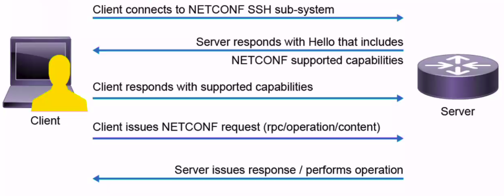
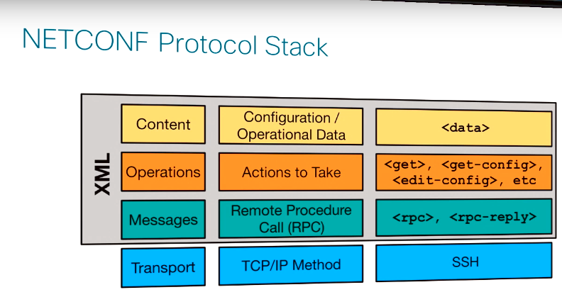
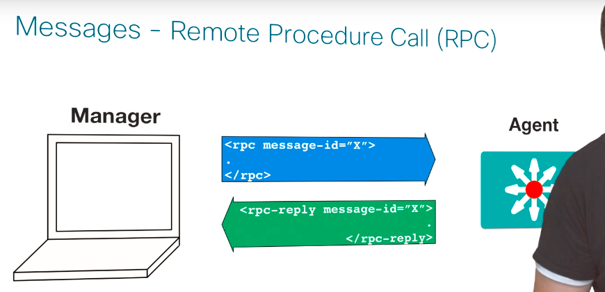
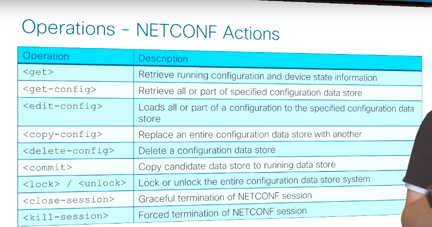
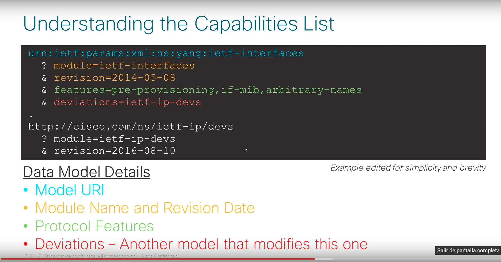
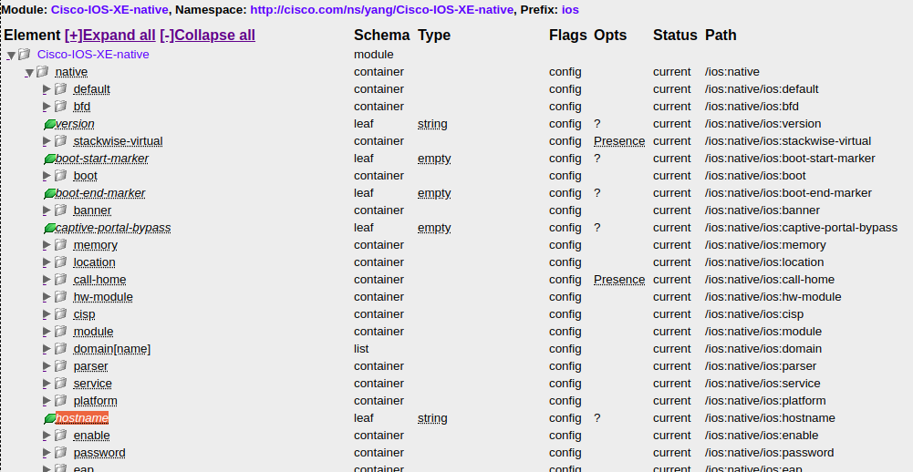
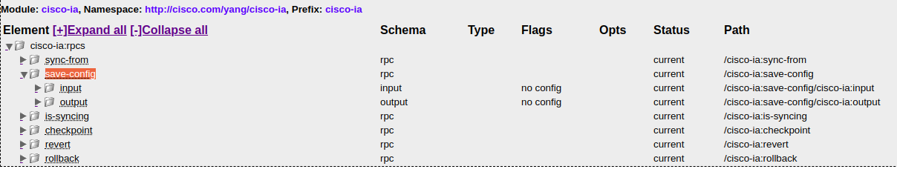

# Netconf - 2006 - RFC 4741 (updated in 2011)

## Introducción

Netconf es un protocolo IETF pensado como una evolución de SNMP. Usa ssh, SOAP, o TLS como transporte. En este curso utilizaremos únicamente ssh.

La arquitectura es cliente-servidor, donde el router es el servidor y la notebook (o sistema de gestión) es el cliente.

**A diferencia de REST (que es stateless), Netconf es basado en transacciones.**

Las configuraciones de los equipos se guardan en "datastores".
NetConf prevee que los equipos puedan soportar tres tipos de datastore:

- candidate
- running
- startup

No obstante, el único data-store mandatorio es el de la running-config. Los equipos Cisco típicamente soportan `running-config` y `startup-config`  en todos los modelos y la `candidate-config` en algunos modelos selectos como los que corren IOS-XR.

Cuando un cliente establece una conexión con un servidor, este le responde enviando sus "capabilites". En el contexto de este curso las "capabilites" se corresponden a modelos de YANG, aunque esto no necesariamente tiene que ser así; de hecho antes de existir YANG, los routers modelaban sus estructuras de datos con XSD y utilizaban Netconf como transporte. Acto seguido el cliente debe respoder con sus propias "capabilites"; una vez hecho esto está listo para enviar peticiones al servidor. En Netconf las peticiones son conocidas como "Remote  Procedure Call (RPC)" . El diagrama a continuación muestra este procedimiento de forma resumida.





Si analizamos Netconf mas en profundidad podremos ver que dentro de los mensajes RPCs se envían operaciones, un concepto muy similar a los métodos de HTTP y finalmente dentro de las operaciones se envian los datos, (en caso de que corresponda). Tanto los mensajes, como los métodos que van dentro de estos, como los datos que van dentro de los propios métodos, se codifican utilizando XML. La figura a continuación resume esto último de forma gráfica.





Dado que Netconf es orientado a transacciones, cada mensaje RPC tiene un identificador único que identifica a la transacción. De esta forma, el cliente, o Manager figura en la imágen a continuación, puede distinguir a que RPC corresponde una respuesta determinada.





Cómo se mencionó anteriormente, de forma muy similar a como lo hace HTTP con sus métodos, Netconf define una serie de operaciones que le indican al servidor la naturaleza del pedido realizado. La lista a continuación muestra algunas de las operaciones existentes y su significado. Una lista completa de las operaciones puede encontrarse [aquí](http://www.netconfcentral.org/rpclist).





> Nota: vale la pena destacar que ademas de las operaciones nativas de Netconf, los fabricantes pueden definir acciones propias especificandolas mediante, por ejemplo, modelos de YANG.

Dado que Netconf utiliza ssh como transporte, en teoría podríamos realizar cualquier operación únicamente con una consola (aunque obviamente no sería demasiado práctico). De cualquier forma, como una primera aproximación al protocolo, veremos como funciona el intercambio de capabilites de esta manera para introducir luego una metodología mas práctica de acceso. 

Antes de poder trabajar con NetConf es necesaro habilitar dicha funcionalidad en los equipos.
Para ello, el procedimiento es el siguiente:

**Habilitar un usuario con privilegios de nivel 15**

``` bash
router(config)# username conatel privilege 15 secret conatel
router(config)# aaa new-model
router(config)# aaa authentication login default local
router(config)# aaa authorization exec default local 
```

*Verificación:*

````bash
$ ssh conatel@hostname
Password:
router#
````

**Habilitar Netconf**

``` bash
router(config)# netconf-yang
```

Esto por defecto habilita YANG mediante `ssh` en el puerto `830`

*verficiación:*

``` bash
router#show platform software yang-management process 
confd            : Running 
nesd             : Running 
syncfd           : Running 
ncsshd           : Running 
dmiauthd         : Running 
nginx            : Running 
ndbmand          : Running 
pubd             : Running
```

> Nota: para que Netconf funcione correctamente no es necesario que el proceso `nginx` esté corriendo. Este proceso corre cuando ejecutamos `ip http server` o `ip http secure server` y sólo es necesario para correr RESTConf

### Ejercicio 7

Ejectuar el siguiente comando para conectarnos al router:

```bash
$ ssh -p 830 conatel@hostname 
```

Una vez conecados deberíamos poder ver el mensaje de `<hello>` del router donde comunica sus capabilites. El mensaje debería ser algo parecido al siguiente:

```bash
<?xml version="1.0" encoding="ISO-8859-1"?>
<hello xmlns="urn:ietf:params:xml:ns:netconf:base:1.0">
  <capabilities>
    <capability>urn:ietf:params:xml:ns:netconf:base:1.0</capability>
    <capability>urn:ietf:params:netconf:base:1.0</capability>
    <capability>urn:ietf:params:netconf:capability:validate:1.0</capability>
    <capability>urn:ietf:params:netconf:capability:writable-running:1.0</capability>
    <capability>urn:ietf:params:netconf:capability:url:1.0?scheme=file</capability>
    <capability>urn:ietf:params:netconf:capability:rollback-on-error:1.0</capability>
    <capability>urn:ietf:params:netconf:capability:candidate:1.0</capability>
    <capability>urn:ietf:params:netconf:capability:confirmed-commit:1.0</capability>
    ... salida omitida para mayor claridad
  </capabilities>
  <session-id>21992</session-id>
</hello>
]]>]]>
```

Para establecer una conexión exitosa, en necesario que el cliente envie su propio `<hello>`, indicando sus "capabilites".  Haremos esto de la siguiente forma:

```xml
<?xml version="1.0" encoding="UTF-8"?>
<hello xmlns="urn:ietf:params:xml:ns:netconf:base:1.0">
    <capabilities>
        <capability>urn:ietf:params:netconf:base:1.0</capability>
    </capabilities>
</hello>]]>]]>
```

Ahora estamos listos para enviar pedidos (RPCs) al router. Enviaremos un RPC con una operación `get-config` pidiendo por la configuración de la datastore `running`. Si todo sale bien, el router debería respondernos con su running-config en formato XML.

```xml
<rpc xmlns="urn:ietf:params:xml:ns:netconf:base:1.0" message-id="534">
    <get-config>
        <source>
            <running/>
        </source>
    </get-config>
</rpc>]]>]]>
```

> Nota: al enviar los mensajes no olvidar incluir el `]]>]]>` esto es lo que indica el fin del mensaje.

## Netconf ncclient

Como vimos anteriormente, si bien es totalmente posible interactuar con un router mediante Netconf a través de la consola, esto no es práctico ni escalable.

Python dispone de una librería llamada `ncclient` (Netconf client), que nos abstrae gran parte de la complejidad y nos permite trabajar con mayor comodidad. Veremos a continuación como utilizarla para interactuar con los routers de forma programática.

``` python
from ncclient import manager

with manager.connect(host=host, port=port, username=username, password=password, hostkey_verify=False) as router:
    for capability in router.server_capabilities:
        print(capability)
```

---

### Ejercicio 8

Escribir una función llamada `print_capabilities`que imprima en pantalla todas las "capabilites" de un equipo **que contengan un cierto string**. En caso de que el usuario no ingrese el campo `filter` se deben mostrar todas las capabilities.

---

## Capabilites

Ahora, exploraremos con mayor profundidad la sintáxis con la que el router devuelve sus "capabilities".
Lo primero que hay que entender es que hoy en día hay dos versiones de Netconf disponibles: la `1.0` y la `1.1`. Los routers informan cual/cuales veriones soportan durante el intercambio de "capabilities".

---

### Ejercicio 9

Utilizar la función elaborada en el ejercicio 8 filtrando con lo siguiente `filter='params:netconf:base'` para obtener las versiones de Netconf soportadas por el router.

---

Cómo se comentó anteriormente, las "capabilities" se corresponden con los módulos de YANG soportados. La figura a continuación muestra como interpretar lo que devuelve el router.





## Descarga de modelos

Ahora que sabemos como identificar qué modelos de YANG soporta el equipo, veremos como descargarlos para poder trabajar con ellos.

Netconf soporta un `RPC` llamado `get-schema` que solicita al equipo que devuelva un `schema` determinado por su nombre. Dado que en el caso del CSR1000V  los `schemas` están implementados mediante módulos de YANG; esto será lo que el router devolverá como respuesta a un `RPC get-schema`.

La librería `ncclient` implementa esta funcionalidad lo que nos permite descargar cualqueir módulo de YANG que necesitemos.

``` python
import xmltodict
from ncclient import manager

def get_schema(schema, host, username, password, port='830'):
    with manager.connect(host=host, port=port, username=username, password=password, hostkey_verify=False) as router:
        netconf_reply = router.get_schema(schema)
        print(xmltodict.parse(netconf_reply.xml)['rpc-reply']['data']['#text'])
```

---

### Ejercicio 10

* Utilizar la función mostrada en el snippet anterior para descargar el módulo `ietf-interfaces`.
* Copiar el contenido de la respuesta y crear un archivo llamado `ìetf-interfaces.yang`
* Utilizar `pyang` para analizar la estructura del módulo.

<details>

<summary>Solucion</summary>

<code>

``` bash
$ pyang -f tree ietf-interfaces.yang 
module: ietf-interfaces
  +--rw interfaces
  |  +--rw interface* [name]
  |     +--rw name                        string
  |     +--rw description?                string
  |     +--rw type                        identityref
  |     +--rw enabled?                    boolean
  |     +--rw link-up-down-trap-enable?   enumeration {if-mib}?
  +--ro interfaces-state
     +--ro interface* [name]
        +--ro name               string
        +--ro type               identityref
        +--ro admin-status       enumeration {if-mib}?
        +--ro oper-status        enumeration
        +--ro last-change?       yang:date-and-time
        +--ro if-index           int32 {if-mib}?
        +--ro phys-address?      yang:phys-address
        +--ro higher-layer-if*   interface-state-ref
        +--ro lower-layer-if*    interface-state-ref
        +--ro speed?             yang:gauge64
        +--ro statistics
           +--ro discontinuity-time    yang:date-and-time
           +--ro in-octets?            yang:counter64
           +--ro in-unicast-pkts?      yang:counter64
           +--ro in-broadcast-pkts?    yang:counter64
           +--ro in-multicast-pkts?    yang:counter64
           +--ro in-discards?          yang:counter32
           +--ro in-errors?            yang:counter32
           +--ro in-unknown-protos?    yang:counter32
           +--ro out-octets?           yang:counter64
           +--ro out-unicast-pkts?     yang:counter64
           +--ro out-broadcast-pkts?   yang:counter64
           +--ro out-multicast-pkts?   yang:counter64
           +--ro out-discards?         yang:counter32
           +--ro out-errors?           yang:counter32
```

</code>

</details>

---

## Obteniendo información del equipo

Ahora que sabemos identificar que modelos de YANG soporta el equipo, que podemos descargarlos y analizar su estructura utilizando `pyang`, es hora de comenzar a obtener datos útiles.

A continuación vamos a analizar el módulo `Cisco-IOS-XE-native`. Comencemos por descubrirlo dentro de las "capabilites" utilizando nuestra función `print_capabilities`.

```` python
>>> print_capabilities(filter='native')
http://cisco.com/ns/yang/Cisco-IOS-XE-native
    ?module=Cisco-IOS-XE-native
    &revision=2018-02-01
````

Ahora vamos a descargar el modelo de YANG utilizando nuestra función `get_schema` 

``` python
>>> get_schema('Cisco-IOS-XE-native')

module Cisco-IOS-XE-native {
  namespace "http://cisco.com/ns/yang/Cisco-IOS-XE-native";
  prefix ios;
  import ietf-inet-types {
    prefix inet;
  }
  ...
  --> Salida omitida para mayor claridad <--
```

> Nota: tomar nota del campo `namespace` porque lo vamos a necesitar mas adelante

Lo salvamos en un archivo llamado `Cisco-IOS-XE-native.yang` y lo analizamos utilizando `pyang`

``` bash
ialmandos$ pyang -f tree Cisco-IOS-XE-native.yang 

--> omitimos errores por no tener descargadas las dependencias <--

module: Cisco-IOS-XE-native
  +--rw native
     +--rw default
     |  +--rw crypto
     |     +--rw ikev2
     |        +--rw proposal?   empty
     |        +--rw policy?     empty
     +--rw bfd
     +--rw version?                 string
     
--> Salida omitida para mayor claridad <--     
     
     +--rw hostname?                string
     +--rw enable
     |  +--rw password
     
--> Salida omitida para mayor claridad <--  
```

Como se puede ver, la salida de este modelo utilizando el formato `tree` es demasiado larga para poder ser analizada por lo que, para este tipo de casos conviene utilizar la versión `html`. Una copia de la misma se pueden encontrar [aquí](<https://s3.amazonaws.com/adv-network-programmability/Cisco-IOS-XE-native.html>) 

Ahora utilizaremos la función `get(filter)` del módulo `ncclient` para obtener el hostname del equipo.
El parámetro filter se debe definir mediante XML utilizando la estructura del módulo YANG como base. Para ello partimos de una etiqueta `<filter></filter>` y dentro colocamos todas las etiquetas en la jerarquía hasta llegar a la parte del modelo que queremos modificar. En resumen, el archivo `hostname.xml` debería tener el siguiente contenido:

``` xml
<filter>
    <native xmlns="http://cisco.com/ns/yang/Cisco-IOS-XE-native">
        <hostname></hostname>
    </native>
</filter>
```

Ya tenemos todo lo necesario para crear nuestra función `get_hostname()`

> Nota: aquí usamos además lo aprendido en la primera parte del curso para trabajar con estructuras XML en Python

``` python
def get_hostname(host, username, password, port='830'):
    filter = open('./hostname.xml').read()

    with manager.connect(host=host, port=port, username=username, password=password, hostkey_verify=False) as router:
        netconf_reply = router.get(filter)
        print('Printing output as XML:')
        # Esta función la hicimos en la introducción
        pretty_print_xml(netconf_reply.xml)
        dict = xmltodict.parse(netconf_reply.xml)
        print('Printing output as JSON:')
        print(json.dumps(dict, indent=2))
```


``` python
>>> get_hostname('router.labs.conatest.click', 'conatel', 'conatel')

Printing output as XML:

<?xml version="1.0" ?>
<rpc-reply message-id="urn:uuid:1b8aab10-d9c8-4dd2-a59b-e88a8bf71bb5" xmlns="urn:ietf:params:xml:ns:netconf:base:1.0" xmlns:nc="urn:ietf:params:xml:ns:netconf:base:1.0">
	<data>
		<native xmlns="http://cisco.com/ns/yang/Cisco-IOS-XE-native">
			<hostname>ip-172-31-39-33</hostname>
		</native>
	</data>
</rpc-reply>

Printing output as JSON:

{
  "rpc-reply": {
    "@xmlns": "urn:ietf:params:xml:ns:netconf:base:1.0",
    "@message-id": "urn:uuid:1b8aab10-d9c8-4dd2-a59b-e88a8bf71bb5",
    "@xmlns:nc": "urn:ietf:params:xml:ns:netconf:base:1.0",
    "data": {
      "native": {
        "@xmlns": "http://cisco.com/ns/yang/Cisco-IOS-XE-native",
        "hostname": "ip-172-31-39-33"
      }
    }
  }
}
```


---

### Ejercicio 11

Utilizar el procedimiento explicado anteriormente para, partiendo del módulo `ietf-interfaces` elaborar una función `print_interfaces()` que imprima en pantalla el nombre de las interfaces.

A continuación presentamos un ejemplo de como debería ser la salida de su script:

``` python
>>> print_interfaces(host=HOST, username=USERNAME, password=PASSWORD)
GigabitEthernet1
VirtualPortGroup0
```

### Ejercicio 12

Modificar el script para que imprima además del nombre de la interface, su estado operacional.
La salida debería ser algo así.

``` python
>>> print_interfaces(host=HOST, username=USERNAME, password=PASSWORD)
GigabitEthernet1
	 up
VirtualPortGroup0
	 up
```

<details>

<summary>Pista</summary>

<code>

​	El estado de las interfaces se encuentra en el `container` llamado `interfaces-state`

</code>

</details>

## Configurando el equipo

Ahora vamos a modificar la configuración del equipo. Para ellos nos vamos a basar en el modelo `Cisco-IOS-XE-native` que contiene la configuración completa del mismo.

Podríamos seguir el mismo proceso que en los ejemplos anteriores descargando el modelo con nuestra función `get_schema`, generando un archivo `.yang` y analizándolo con `pyang`, pero dado que el modelo  `Cisco-IOS-XE-native` tiene muchas dependencias, esto sería un proceso muy tedioso. En su lugar vamos a recurrir al repositorio de Github `https://github.com/YangModels/yang.git` donde se encuentran todos los modelos soportados por las distintas versiones de IOS-XE en un único lugar.

Lo primero que vamos a hacer es clonar el repositorio completo a nuestra máquina.

``` bash
$ mkdir modelos
$ cd modelos
$ git clone https://github.com/YangModels/yang.git .
```

Ahora navegamos hasta el directorio correspondiente a la version de IOS correspondiente, en nuestro caso `16.8.1`.

``` bash
$ cd vendor/cisco/xe/1681
```

Finalmente, creamos un archivo `html` con la estructura completa de la `running-config`.

``` bash
$ pyang -f jstree Cisco-IOS-XE-native.yang -o running.html
```

En este momento estamos listos para generar filtros XML que nos permitirán configurar distintos parámetros y funcionalidades. Comencemos cambiando el `hostname` del equipo.

Como se puede ver en la siguiente imágen, el hostname está en el primer nivel dentro del contenedor `<native></native>`.



Por tal motivo, nuestro filtro de configuración, que siempre debe comenzar con el tag `<config></config>` , será el siguiente:

````xml
<config>
    <native xmlns="http://cisco.com/ns/yang/Cisco-IOS-XE-native">
        <hostname>{hostname}</hostname>
    </native>
</config>
````

La expresión `{hostname}` será sustituída luego por el `hostname` que querramos configurar.
Por último, podemos elaborar nuestra función `config_hostname(hostname)`.

``` python
def config_hostname(hostname, host, username, password, port='830'):
    template = open('config_hostname.xml').read()
    # aqui sustituimos {hostname} por el hostname seleccionado
    config = template.format(hostname=hostname)
    with manager.connect(host=host, port=port, username=username, password=password, hostkey_verify=False) as router:
        # notar que usamos el metodo edit_config y apuntamos a la running-config
        netconf_reply = router.edit_config(config, target='running')
        pretty_print_xml(netconf_reply.xml)
```

---

### Ejercicio 13

En este ejercicio vamos a darle vida a una funcionalidad algo olvidada en los routers, el "message of the day" (`motd`). Este servicio nunca se utilizó como tal debido a que alquien debía tomarse el trabajo de configurar un nuevo mensaje cada día en cada uno de los routers de la empresa. Pero ahora que sabemos configurar los equipos mediante Netconf, podemos hacer un script que haga el trabajo por nosotros.

#### 13.1

Implementar una función llamada `get_motd()` que devuelva un nuevo mensaje del día utilizando el siguiente servicio `GET https://talaikis.com/api/quotes/random/`

#### 13.2

Ahora que tenemos el mensaje del día solo resta configurarlo en el router. Tengamos presente que la forma de configurarlo por consola es:

``` cisco
router(config)# banner motd <caracter-delimitador><mensaje><caracter-delimitador>
```

> Nota: El caracter delimitador es cualquier caracter que indique el comienzo y el fin del mensaje. (obviamente este caracter no se puede utilizar dentro del mensaje o el mismo se cortaría). Una buena elección sería por ejemplo `^`.

Utizando como referencia la página `running.html`, elaborar un filtro XML llamado `config_motd.xml` para poder configurar el `motd` mediante Netconf.

#### 13.3

Crear una función `change_motd(host, username, password, message, port='830')` que reciba el mensaje como parámetro y lo configure en el router a través de Netconf utilizando el filtro XML elaborado en el punto anterior. Probarla con con una frase obtenida a través de `get_motd()`.

---

### Ejercicio 14

Hacer una función para cada cosa que se quiera configurar en un equipo está bien para comenzar pero a la larga no es práctico. Para facilitarnos un poco la vida, vamos a introducir una función genérica que nos permitirá configurar cualquier cosa.

``` python
def generic_conf(host, username, password, port='830', **kwargs):
    template = open(kwargs['template']).read()
    config = template.format(**kwargs)
    with manager.connect(host=host, port=port, username=username, password=password, hostkey_verify=False) as router:
        netconf_reply = router.edit_config(config, target='running')
        pretty_print_xml(netconf_reply.xml)
```

#### 14.1

Luego de analizar detenidamente la función anterior para entender su funcionamiento, elabore un filtro llamado `interface_description.xml` y configure una descripción de su agrado en la interface `GigabitEthernet1`

---

Para finalizar apredenderemos como salvar la configuración. Para ello es necesario enviar el siguiente mensaje RPC al router.

``` xml
<?xml version="1.0" encoding="utf-8"?> 
 <rpc xmlns="urn:ietf:params:xml:ns:netconf:base:1.0" message-id=""> 
   <cisco-ia:save-config xmlns:cisco-ia="http://cisco.com/yang/cisco-ia"/> 
 </rpc>
```

Como podemos ver al analizar el modelo `cisco-ia` mediante `pyang`, `save-config` es una operación no nativa en Netconf definida por Cisco en dicho modelo.



Una forma de enviar mensajes RPC con operaciones arbitrarias es utilizar el método `dispatch()`  de `ncclient.manager`. El ejemplo a continuación muestra la forma correcta de utilizarlo junto con el template `save_config.xml` que le indica al router la operación a realizar.

```python
def save_config(host, username, password, port='830'):
    from ncclient.xml_ import to_ele
    RPC = open('./save_config.xml', 'r').read()
    with manager.connect(host=host, port=port, username=username, password=password, hostkey_verify=False) as router:
        netconf_reply = router.dispatch(to_ele(RPC))
        pretty_print_xml(netconf_reply.xml)
```


``` xml
// template save_config.xml
<cisco-ia:save-config xmlns:cisco-ia="http://cisco.com/yang/cisco-ia"/>
```

---

### Ejercicio 15

Salvar la configuración del router utilizando el método descripto anteriormente 

---