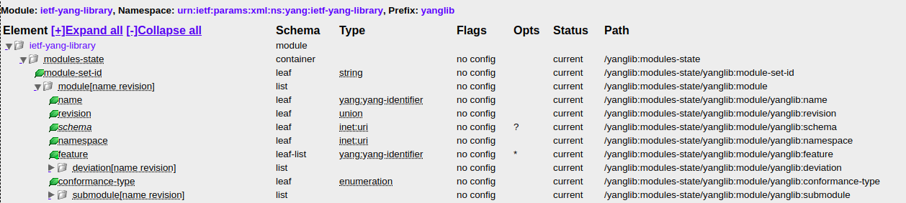

# RESTConf - 2017 - RFC 8040


> HTTP-based protocol that provides a programmatic interface for accessing data defined in YANG, using the datastore concepts defined in the Network Configuration Protocol (NETCONF).
>
> ​																			[RFC8040](https://tools.ietf.org/html/rfc8040)

Restconf es otro protocolo que permite ejecutar las mismas acciones que podemos hacer a través de Netconf sólo que mediante HTTP.

A priori, la ventaja que presenta frente a Netconf, es que la forma de comunicación programática entre dispositivos mediante HTTP, comunmente conocida como APIs REST, está ampliamente difundida y trasciende por mucho al mundo de las redes. Esto hace que el ecosistema de software que se ha desarrollado en torno a esta tecnología sea enorme y muy maduro, existiendo una amplia gama de librerías auxiliares muy bien documentadas (en todos los lenguajes), así como herramientas de debug y troubleshooting, donde POSTMAN es tan sólo un ejemplo.

Otra ventaja, es que RESTCONF, además de XML, soporta la codificación de los mensajes mediante JSON. 
Como vimos en la introducción del presente curso, JSON es un forma de codificar mucho mas sencilla de leer para los seres humanos y presenta además la ventaja que se mapea casi directamente con las estructuras de datos de los distintos lenguajes de programación.

Para que las respuestas de los dispositivos vuelvan en JSON en lugar de XML es necesario setear el HEADER HTTP `Accept: application/yang-data+json`. Para que los dispositivos entiendan nuestro contenido cuando enviamos el mismo codificado en JSON en lugar de XML, es necesario setear el HEADER HTTP `Content-Type: application/yang-data+json`

## Métodos

Al funcionar sobre HTTP, RESTCONF utiliza los métodos de este protocolo para ejecutar acciones sobre los dispositivos. La lista a continuación presenta un resumen de las distintas operaciones y su descripción.


La siguiente tabla muestra cómo se mapean los distintos métodos de RESTCONF con los RPC de Netconf


## Configuración para que los equipos soporten RESTCONF

### Habilitar el servidor HTTP

Para que RESTCONF funcione, primero es necesario disponer de un servidor HTTP que pueda recibir y responder los requests. 

``` cisco
! configurar según se quiera HTTP o HTTPs
ip http server
ip http secure-server
```

Para verficar:

``` cisco
router# show ip http server status 

HTTP server status: Enabled
HTTP server port: 80
HTTP server active supplementary listener ports: 
HTTP server authentication method: local

--> Salida omitida para mayor claridad <--

HTTP secure server capability: Present
HTTP secure server status: Enabled
HTTP secure server port: 443

--> Salida omitida para mayor claridad <--
```

### Configurar un usuario nivel 15

``` cisco
router(config)# username conatel privilege 15 secret conatel
```

### Habilitar RESTCONF

```cisco
router(config)# restconf
```

### Verificiar la configuración

En los equipos que corren IOS-XE, Cisco implementa el servidor HTTP mediante un servidor [nginx](https://www.nginx.com/). Para verficar que dicho servidor esté levantado y funcionado:

```cisco
show platform software yang-management process monitor
```

```
ip-172-31-93-76#show platform software yang-management process
confd            : Running 
nesd             : Running 
syncfd           : Running 
ncsshd           : Not Running  ! NETCONF-YANG is not configured, hence ncsshd process is in not running.
dmiauthd         : Running 
dmiauthd         : Running 
nginx            : Running ! nginx process is up due to the HTTP configuration, and it is restarted when RESTCONF is enabled.
ndbmand          : Running 
pubd             : Running
```


## Cómo construir la URL

Mientras que en Netconf indicábamos cuál era el modelo de YANG sobre el que queríamos impactar mediante un filtro XML, en RESTCONF brindamos esta información a través de al URL. El siguiente gráfico, muestra como construir la misma en base al módulo de YANG con el que queramos trabajar.


## Cómo identificar los módulos soportados por el equipo

En Netconf, podíamos identificar la lista de módulos soportados por el equipo a través del intercambio inicial de "capabilities". En RESTCONF vamos a utilizar el modelo de YANG llamado `ietf-yang-library` para determinar los módulos soportados.

Como se puede ver en el árbol generado a partir de `pyang`, este módulo nos brinda toda la información necesaria sobre el resto de los módulos en el "container"  llamado `modules-state`.



A continuación vamos a construir una función que nos permita listar todos los módulos soportados por el equipo.

``` python
# default values
HOST = 'https://hostname/'
USERNAME = 'conatel'
PASSWORD = 'conatel'

# Constants
BASE_DATA = HOST + 'restconf/data/'
ENDPOINT_YANG_MODULES = 'ietf-yang-library:modules-state'
HEADERS = {
    'Content-Type': "application/yang-data+json",
    'Accept': "application/yang-data+json",
}

def get_yang_modules(username=USERNAME, password=PASSWORD, show=False):
    
    url = BASE_DATA + ENDPOINT_YANG_MODULES
    response = requests.get(url, headers=HEADERS, auth=HTTPBasicAuth(username, password), verify=False, timeout=3)

    if response.status_code in range(200, 300):
        print('Successful request, status code:', response.status_code)
        if show:
            print(json.dumps(response.json(), indent=2))
        return response.json()
    else:
        print('Error in the request, status code:', response.status_code)        
```


---

### Ejercicio 16

Configurar su router para que responda requests de RESTCONF.
Utilizando la función mostrada en el ejemplo anterior listar todas los módulos de YANG soportados por el dispositivo.

---


---

### Ejercicio 17

Un  caso de uso muy común es el partir de la lista de módulos soportados y, dado que son muchos para poder buscar "a mano", filtrar en base a un texto específico. Esto nos permitirá responder preguntas del estilo: 

- ¿soportará este equipo el módulo de YANG `Cisco-IOS-XE-native`?
- ¿qué módulos desarrollados por `ietf` soporta?
- ¿qué módulos tengo disponibles para configurar `interfaces`?

Utilizando la función `get_yang_modules` del ejercicio anterior, escribir una funcion filtre la salida para mostrar solamente los módulos cuyo nombre (`name`) contenga el criterio de filtrado. Parta del script `17.py` donde hay un esqueleto básico sobre el cual trabajar.

---


### Para traer la running completa

`https://hostname/restconf/data/Cisco-IOS-XE-native:native`

`https://hostname/restconf/data/Cisco-IOS-XE-native:native/ip`


## Request methods supported

### GET

### POST

### PUT

Cualquier cosa que pongamos en el body del request va a ser exactamente como se va a ver el objeto después. Declarativo por naturaleza.

Esto es muy poderoso porque me evita todos los `no` en la configuración cuando quiero borrar lo que estaba antes. 

### PATCH

A diferencia del `PUT` el `PATCH` agrega lo que está en el body pero deja lo demás.

### DELETE

Cursos de RESTCONF

<https://learninglabs.cisco.com/lab/lab03-using-restconf-to-interface-with-networking-devices/step/1>

<https://learninglabs.cisco.com/lab/intro-restconf/step/1>