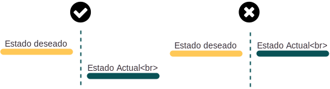
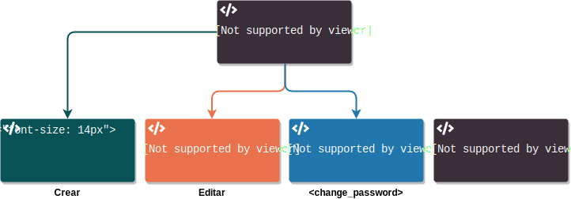
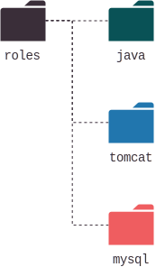

# Ansible

_Fecha: 2018-08-04_

## Notas

Durante los últimos años la forma con la que configuramos la infraestructura y las aplicaciones que conforman nuestro sistema han ido cambiando. Con el tiempo hemos ido automatizando los procesos de configuración, y simplificando la forma en la que interactuamos con los dispositivos. Pasamos de escribir la configuración de todos los componentes de forma manual, a automatizar las mismas tareas a través de scripts. Hoy, hay un nuevo paradigma de automatización se ha empezado a utilizar conocido como `Infrastructure as Code` o `IaaS`.


La idea es describir de forma declarativa mi sistema en funcionamiento, para que luego otro proceso independiente sigua esta especificación y aplique las modificaciones necesarias para que todos los elementos involucrados reflejen esta descripción.

Existen muchas herramientas en el mercado que han intentado implementar este concepto enfocadas en distintas áreas:

- Administación de configuraciones
  - Chef
  - Puppet
- Orquestación y puesta en producción
  - Fabric
  - Capistrano
- Aprovisionamiento
  - Terraform
  - Heat
  - AWS Cloudformation

Cualquiera de ellas son muy potentes en su área, pero pocio utiles en las demás. Ansible es una de las pocas herramientas que permite implementar estas mismas ideas pero en todas estas áreas de forma eficiente.

### Historia

Ansible fue concebido y desarrollado inicialmente por Michael Dehaan, product manager de Puppet Labs. El estaba conforme con las funcionalidades de Puppet, pero creía que podía desarrollar algo más interesante. En el 2012, pública la primera versión de Ansible, la cual cuenta con muchas de las propiedades que lo hicieron exitoso.

> **Ansible** - Maquina de ficción creada por Ursula K. Le Guin es el libro Rocanno's World, capaz de permitir comunicaciones a velocidades más rápidas que la velocidad de La Luz.

De a poco Ansible fue superando en popularidad a otras herramientas similares, llamando la atención de grandes empresas. En 2015 Red Hat adquirío Ansible y desde ahí el éxito de la plataforma se ha acelerado. Red Hat indico al momento de la adquisición que mantendría las propiedades Open Source del software, y que ofrecería servicios de soporte y consultoría como herramienta de monetización. Hasta ahora la empresa ha mantenido esta promesa.

### Propiedades

Ansible esta escrito en su totalidad en `python 2.7`  y esta realizando la transición a `python 3.6`. Las configuraciones de todas las entidades de Ansible se realizan a través de archivos de texto, escritos en formato `YAML`. 

A diferencia de otros sistemas, Ansible no necesita de un cliente instalado en los hosts que va a administrar. Realiza todas las tareas a través de `SSH`, `WinRM`, o algún otro método configurado por el usuario. Esta forma de interactuar con los dispositivos finales, permite a Ansible trabajar en base a un modelo `push` en vez de un modelo `pull`.


_OBS: El servidor de control tiene que poder llegar a todos los componentes que va a administrar. Esto no debería ser un problema si se cuenta con una red de management._

#### Módulos

Para interactuar con el sinfín de sistemas que existen en el mercado, Ansible define Módulos para cada uno de ellos. Un módulo no es más que un script/programa escrito en algún lenguaje (usualmente Python) que cumple con una determinada interfaz. Ansible cuenta con una grán cantidad de módulos que comprenden sistemas de:

- Cloud
- Herramientas de monitoreo
- Herramientas de colaboración
- Networking.
- Containers.
- Etc.

_OBS: [Link a módulos de `ansible`](https://docs.ansible.com/ansible/latest/modules/modules_by_category.html)._

Además, se pueden escribir módulos nuevos para utilizar contra sistemas que no estén en la lista, aunque vale la pena investigar si no existe al día de hoy un módulo en el repositorio de Ansible o en la comunidad que realice las mismas tareas (veremos `ansible-galaxy` más adelante que ayuda a encontrar estos módulos desarrollados por la comunidad).

**IaaC**

Como mencionamos anteriormente, bajo el paradigma de IaaC debemos dejar de pensar en **como** queremos hacer algo, y pasar a pensar en **que** es lo que queremos que suceda. Esto es conocido como el modelo declarativo.

Un ejemplo un poco burdo es el de la construcción de un edificio. El arquitecto diseña un plano (blueprint) del edificio, indicando como debería verse el resultado final. Luego se lo pasa al constructor, junto con una guía de lo **que** se debe realizar. A partir de ahí, es responsabilidad del constructor en tomar esta impronta y construir el edificio.


Una de las ventajas que nos brinda el trabajar bajo este paradigma es que podemos aprovechar las herramientas de control de versiones y metodologías de programación probadas en el mercado en los últimos años. Podemos contar con múltiples versiones de configuración de nuestros sistemas, mantener un historial de todos los cambios realizados, y volver atrás en el tiempo luego de ejecutar un cambio.

```yaml
Usuario:
  name: example
  uid: 123
  shell: /bin/bash
  pas: secret
```

**Separación del código de los datos**

Otra de las ideas importantes que plantea Ansible es el hecho de mantener los datos separados de las tareas a realizar. Las variables de datos pueden ser cargadas de diversas maneras a la hora de ejecutar una tarea.

Por ejemplo, podemos crear una tarea que levante un servidor de Apache publicado en un determinado puerto, bajo un determinado usuario, cuyos logs serán almacenados en una determinada ubicación. Luego, creamos tres perfiles con la información de configuración de tres servidores distintos, con valores independientes de `user`, `port`, y directorio de `logs`.  Podemos entonces re-utilizar la misma tarea de creación de servidor Apache con estos tres perfiles, para crear tres servidores distintos.


**Idempotente**

> "… propiedad de una operación matemática, que puede ser aplicada múltiples veces sin cambiar los resultados de la aplicación inicial."

Cada vez que ejecutemos una acción de Ansible, primero va a verificar el estado actual del sistema a modificar con el estado deseado. **Solamente si existen diferencias entre los estados se termina realizando una acción.**



Dependiendo del estado del sistema con que vamos a interactuar, es la acción que terminará realizando Ansible sobre el mismo para llevarlo al estado deseado.



_OBS: Puede ser necesario que tenga que realizar más de una acción para conseguir el resultado deseado. Además, **NO** todos los módulos cumplen con esta propiedad, en partícular los módulos de networking._

### Ejemplo de como interactuar con Ansible

Supongamos que estamos trabajando sobre una arquitectura tradicional de una aplicación web.


Ahora, necesitamos identifica que necesitamos para que esta infraestructura funcione.

- ¿Que necesito en un servidor de aplicación?
  - Un usuario.
  - Dependencias.
  - La aplicación.
  - Configuracion de la aplicación.
  - La aplicación en servicio.
- ¿Que módulos pueden realizar estas tareas?
  - `user`
  - `package`
  - `template`
  - `service`
- ¿Que propiedades debo configurar en cada tarea?


Cada uno de estos módulos consumira distintas variables para cumplir con la tarea indicada.

En general intentamos que cada archivo de tareas tenga un objetivo especifico que cumplir. Si una acción cuenta con múltiples objetivos, cada uno de ellos contará con un archivo de tareas independiente.

Siguiendo las mejores prácticas de Ansible, conviene que separemos las variables de configuración de las tareas en archivos distintos. También debemos separar todos los archivos de configuración que necesitemos insertar en nuestros servidores.

La combinación de las tareas, las variables, y los archivos los podemos englobar en una única estructura de orden superior conocido como un rol o `role`. El mismo presupone un cierto orden de carpetas para almacenar todos estos elementos.


Idealmente, cada acción contará con uno o más roles que se le aplicarán a cada host para configurarlo.

Por ejemplo, podríamos construir la siguiente estructura de carpetas para ejecutar las acciones identificadas anteriormente.



Ahora que tenemos la lista de roles que contienen todas las configuraciones de nuestros servicios, tenemos que construir la lista de hosts donde los implementaremos. En Ansible, creamos inventarios donde almacenamos la lista de nodos con los cuales queremos interactuar. El sistema de inventarios de Ansible es muy potente. Nos permite crear todo tipo de grupos de equipos, y configurar variables especifica para cada nodo o grupo de nodo. Hasta podemos utilizar inventarios dínamicos, que cumplan con una determinada interface para resolver la lista de nodos y sus variables.

Por ultimo, la union de hosts con las tareas o los roles los definimos en un `playbook`.  Los `playbooks` cuentan con múltiples `plays` que vinculan las tareas a realizar con los equipos correspondientes. Cada una de ellas cuenta con configuraciones adicionales que cambian el comportamiento del `play`.


Luego ejecutaremos esta `playbook` utilizando Ansible. El sistema comenzara recabando datos de los hosts sobre los que debe operar, y luego pasara a ejecutar todos los `plays` de forma secuencial. Ansible decidirá al momento de ejecutar cada rol, las tareas que debe realizar para conseguir el estado desado. En caso de que se le proveea una lista de hosts sobre los cuales Ansible deba trabajar, Ansible realizará las configuraciones de forma paralela en todos los hosts.

## Comentarios Adicionales

### Conexión remota

Ansible utiliza SSH para comunicarse con los host remotos. En particular utiliza la versión nativa de OpenSSH de la maquina de control. En caso de que la versión de OpenSSH a utilizar sea muy vieja, Ansible pasa a utilizar una implementación de OpenSSH programada en Python llamada `paramiko`

Se recomienda que la autenticación se realice a través de claves privadas, pero también se puede configurar Ansible para que pida credenciales de acceso al momento de ejecutar una tarea en el host remoto.

### Inventarios

La lista de hosts sobre los cuales Ansible trabajara se almacenan en inventarios. Estos son archivos de texto escritos en formato `yaml` o `ini` conteniendo las IP o las URL de los hosts a administrar. También pueden contar con variables adicionales especificas para cada host. 

Por defecto, Ansible buscara el archivo de inventario en `/etc/ansible/hosts`, pero también se puede especificar durante la invocación a través del parámetro`-i <host>`.

Ansible es capaz de tomar hosts de múltiples inventarios al mismo tiempo, y puede construirlos de forma dinámica previo a la realización de las tareas. Este tipo de inventarios se los conoce como "inventarios dinámicos".

### DEMO Lab #1 - Lanzar el laboratorio

El laboratorio consiste en un set contenedores que simularán una granja de servidores. Los mismos correrán en una maquina virtual en la nube de AWS. Las indicaciones para conectarse a su maquina virtual serán entregadas durante el workshop.


Una vez conectados a su VM, debemos levantar todos los contenedores, y luego debemos pasarnos al contenedor `master` desde donde correremos todos los comandos de Ansible. Los pasos a realizar son los siguientes:

```bash
# Dirijirse al directorio /home/ubuntu/ansible_lab/docker
cd /home/ubuntu/ansible_lab/docker

# Conectarnos con el nodo `master`
make attach
```

_OBS: En caso de que sea necesario reiniciar el lab, pueden utilizar el comando `make down && make up` para eliminar todos los contenedores, y luego repetir los pasos expresados anteriormente._

Verifiquen que tienen conexión con los siguientes hosts utilizando `ping`:

- `host01`
- `host02`
- `host03`

---

### DEMO Lab #2 - Crear un archivo de inventario

Vamos a definir un nuevo archivo de inventario. Dentro de la carpeta `/home/ubuntu/ansible_lab/volume` vamos a crear un nuevo archivo llamado `inventory.yml`.

Los inventarios de Ansible pueden contener múltiples grupos, y cada host puede pertenecer a uno o más grupos. En general, se comienza identificando un grupo llamado `all`  al cual pertenecerán todos los hosts, y todos los demás grupos. 

Los hosts se definen como llaves de un objeto llamado `hosts` dentro del grupo `all`.

```yaml
all:
  hosts:
    host01:
    host02:
    host03:
```

A su vez, cada grupo o host puede contar con variables especificas para definir su conexión. Como ejemplo, vamos a agregar una variable que aplique a todos los hosts para evitar que Ansible verifique si el host al que nos estamos conectando esta identificado como un host conocido.

```yaml
all:
  vars:
    ansible_ssh_common_args: '-o StrictHostKeyChecking=no'
  hosts:
    host01:
    host02:
    host03:
```

Ahora, cada vez que Ansible se quiera comunicar con cualquiera de estos hosts utilizará el argumento definido en la variable `ansible_ssh_common_args`.  La lista de variables que podemos configurar para modificar el comportamiento de Ansible se encuentran en el siguiente link:

https://docs.ansible.com/ansible/latest/user_guide/intro_inventory.html#list-of-behavioral-inventory-parameters

Las variables se pueden configurar a nivel global, por grupo, o por host. Siempre se terminara aplicando la más específica.

Una de las variables que es importante tener en cuenta es `ansible_connection`. La misma especifica que método de conexión utilizara Ansible para interactuar con el host. Por defecto, intentara comunicarse a través de SSH. Otros métodos de conexión interesantes son: `local` y `docker`.

---

#### Ejercicio #1

Para conseguir realizar la conexión por SSH, debemos configurar la llave privada que debemos utilizar. La misma se encuentra en la ubicación `/var/ans/master_key`.

Configure el inventario para que Ansible utilize el la llave privada almacenada en `./master_key`. 

<details>
<summary>Pista #1</summary>
El nombre de la variable a configurar es <code>ansible_ssh_private_key_file</code>.
</details>

<details>
    <summary>Solución</summary>
    <pre>
all:
  vars:
    ansible_ssh_common_args: '-o StrictHostKeyChecking=no'
    ansible_ssh_private_key_file: './master_key'
  hosts:
    host01:
    host02:
    host03:
    </pre>
</details>

---

Para probar que efectivamente tenemos acceso a los hosts definidos en el inventario vamos a utilizar comandos `ad-hoc`. Estos son comandos sencillos, de una sola línea, que no necesitan de un archivo individual para contenerlos, o que no tenemos intención de salvarlos para el futuro. Por ejemplo: `ping`, `echo`, etc.

---

### Comandos ad-hoc

Los comandos `ad-hoc` se llaman a través del flag `-m` seguidos del módulo que queremos utilizar, o a través del flag `-a` seguidos del comando que queremos lanzar en los hosts remotos.

```bash
ansible -i hosts.yml all -m ping
```

Utilizando el comando anterior podemos realizar un ping sobre todos los hosts detallados en el inventario.

```bash
ansible -i hosts.yml all -a 'echo "Hello, World!"'
```

Es importante identificar las comillas que envuelven el comando que ejecutara ansible a través del flag `-a`, especialmente si se quieren utilizar variables de entorno dentro del comando (las comillas simples `'` no resuelven variables, solo la hacen las comillas dobles `"`). Otro punto a tener en cuenta es que el flag `-a` no soporta comandos concatenados con un pipe (`|`). Para hacer esto tenemos que utilizar el módulo `shell`.

```bash
ansible -i inventory.yml all -m shell -a 'ifconfig eth0 | grep "inet addr" | cut -d: -f2 | awk "{print $1}"'
```

El comando anterior devuelve la dirección IP de la interfaz `eth0` de cada host.

---

### Ejercicio #2

Modifique el inventario actual de manera de que cuente con dos nuevos grupos: `app` y `db`. Dentro del grupo `app` se deben incluir los hosts `host01` y `host02`. En el grupo `db` se debe incluir solo el host `host03`.

_OBS: Verificar la configuración de inventario utilizando el módulo `ping`_.

[Documentación de Grupos en Inventarios](https://docs.ansible.com/ansible/latest/user_guide/intro_inventory.html#groups-of-groups-and-group-variables)

<details>
    <summary>Pista #1</summary>
    Utilice la llave <code>children</code> para definir subgrupos.
</details>

<details>
    <summary>Pista #2</summary>
    Para probar los hosts se puede utilizar el comando <code>ping</code> de la siguiente manera: <code>ansible -i inventory.yml db -m ping</code> o <code>ansible -i inventory.yml app -m ping</code>
</details>

<details>
    <summary>Solución</summary>
    <pre>
all:
  vars:
    ansible_ssh_common_args: '-o StrictHostKeyChecking=no'
    ansible_ssh_private_key_file: './docker/master_key'
  hosts:
    host01:
    host02:
    host03:
  children:
    app:
      hosts:
        host01:
        host02:
    db:
      hosts:
        host03:
   	</pre>
</details>

---

Utilizando los comandos `ad-hoc` podemos realizar una gran cantidad de tareas sobre múltiples hosts en simultáneo. Por ejemplo, utilizando el módulo `file` podemos compartir archivos, ó, podemos instalar aplicaciones utilizando los módulos `yum` o `apt` según la distribución que utilicemos.

```
# YUM - CentOS
ansible -i inventory.yml app -m yum -a "name=jq state=present"

# APT - Ubuntu
ansible -i inventory.yml app -m apt -a "name=jq state=present"
```

Si entramos por `ssh` a alguno de los hosts podemos verificar que `jq` ahora esta instalado.

```bash
(controller) ssh -i docker/master_key root@host01
(host01) echo '{"something": "awesome"}' | jq
{
  "something": "awesome"
}
```

Otros posible usos son:

- Creación de usuarios.
- Clonar repositorios utilizando `git`.
- Administrar servicios remotos.
- Lanzar operaciones.
- Recopilar información.

Este último es particularmente útil. Lo ejecutamos realizando el siguiente comando:

```bash
ansible -i inventory.yml all -m setup
```

_OBS: También podemos utilizar el host controlador como target de los comandos de ansible._

### Aplicaciones

Por ahora solo hemos utilizado la aplicación `ansible`. Sin embargo, no es la única aplicación que podemos utilizar tras instalar Ansible. En total tenemos:

- `ansible`
  - Herramienta simple para correr una tarea en múltiples hosts remotos.
- `ansible-config`.
  - Herramienta para configurar Ansible.
  - `ansible-config list`
- `ansible-console`.
  - Un REPL para ejecutar múltiples tareas sobre un grupo de hosts.
  - `ansible-console -i inventory.yml all`
- `ansible-doc`.
  - Muestra información sobre los módulos de ansible instalados.
  - `ansible-doc ping`
  - `ansible-doc ping -s`
- `ansible-galaxy`.
  - Maneja roles compartidos en repositorios de terceros. Por defecto buscara los repositorios en [https://galaxy.ansible.com](https://galaxy.ansible.com).
- `ansible-inventory`.
  - Util para validar el inventario con el que estamos trabajando.
  - `ansible-inventory -i inventory.yml --list`
  - `ansible-inventory -i inventory.yml --graph`
- `ansible-playbook`.
  - Aplicación capaz de ejecutar Ansible `playbooks`.
- `ansible-pull`.
  - Invierte el proceso de ejecución de `push` a `pull`.
- `ansible-vault`.
  - Aplicación capaz de encriptar cualquier estructura de datos a utilizar por ansible.
  - `ansible-vault create secret.yml`
  - `ansible-vault edit secret.yml`
  - `ansible-vault encrypt sin_encriptar.yml`

Durante el resto del curso nos enfocaremos en `ansible-playbook` y mencionaremos alguna de las otras aplicaciones cuando corresponda.

## Ansible `playbooks`

Los `playbooks` de son las herramientas con la cuales le indicaremos a Ansible lo que queremos hacer. Se pueden ver como manuales de instrucción que indican como trabajar la materia prima (infraestructura).

Además de declarar configuraciones, los `playbooks` se pueden utilizar para orquestar cambios masivos en múltiples equipos de forma ordenada. 

El objetivo del `playbook` es el de mapear un grupo de hosts con roles bien definidos o módulos,  a través de una lista de tareas. Cada una de estas uniones dentro de un `playbook` se denomina `play`. Un playbook puede contener múltiples `plays`.

Los `playbooks` se escriben en archivos `yaml` como una lista de `plays`. Cada `play` debe tener al menos una tarea y debe especificar el grupo o la lista de hosts sobre el cual Ansible deberá trabajar.

### Variables de cada `play`

Una de las variables que es usual configurar es el nombre del usuario remoto con el cual se deberán correr las tareas. En nuestro caso el nombre del usuario es `root`, que es además el valor que utilizara Ansible por defecto. Si las tareas que queremos realizar necesitan de permisos elevados podemos utilizar la opción `become`. Esta opción en conjunto con la opción `become_user`  permite cambiar de usuario durante la ejecución de la tarea. Para especificar el método con el cual necesitamos escalar los permisos lo hacemos con la opción `become_method`.

```yaml
- hosts: all
  become: yes
  become_method: su
  tasks:
    # ...
  roles:
    #...
# ...
```

## Tareas

Las tareas dentro del `playbook` son ejecutadas en el orden en que se definieron, de a una, contra todos los sistemas especificados por la opción `hosts`. Si alguno de los `plays` falla para un host, el mismo se elimina de la lista para las siguientes tareas. Una vez corregido el error, se puede lanzar el `playbook` de nuevo, y Ansible se encargará de realizar las modificaciones en aquellos hosts que fallaron.

Se sugiere que cada tarea tenga un nombre, especificado bajo la clave `name`. Estos nombre aparecerán en la consola durante la ejecución del `playbook` y ayudan a debuguear su funcionamiento. 

Si no nos importa que algún comando falle podemos configurar la opción `ignore_error`. 

En el caso de que queramos configurar múltiples tareas sobre un mismo `play`, podemos hacerlo a través del comando `tasks`, que consume una lista de tareas.

```yaml
- hosts: app
  name: Ping app hosts
  tasks:
    - ping:
```

Dentro de cada tarea se pueden configurar opciones adicionales que modifican su comportamiento como: condicionales, loops, registros de salida, etc. A continuación mencionaremos algunas de las más importantes.

**Se recomienda que durante esta demostración prueben los comandos en la consola.**

### Registros de salida

Todas las tareas emiten por defecto un valor de salida, en donde se incluye información general sobre la ejecución de la misma, más el mensaje generado por el módulo durante su ejecución. Sin embargo, el valor entregado por la tarea no puede ser utilizado a menos que se requiera mediante la inclusión de la opción `register` en la definición de la tarea.

```yaml
- name: Ejemplo de como utilizar la opción 'register'
  hosts: localhost
  connection: local
  gather_facts: no
  tasks:
    - shell: echo Hola
      register: result
    - debug:
        msg: '{{result}}'
```

### Condicionales

Como se comento anteriormente, Ansible esta desarrollado sobre Python pero las configuraciones se realizan a través de documentos escritos en YAML para simplificar su configuración. Sin embargo, el hecho de contar con Python trabajando detrás de escena, nos permite incorporar funcionalidades más avanzadas a nuestros `playbooks`. Los condicionales son uno de ellos.

Mediante la utilización de la opción `when` en la definición de una tarea, podemos hacer que solo se ejecute la misma cuando se cumpla una determinada condición. El contenido de la opción `when` es una sentencia condicional de Python valida, que puede referenciar variables definidas de forma dinámica o estática.

Por ejemplo, si queremos generalizar una tarea para que se ejecute tanto en servidores Ubuntu como en CentOS, podemos utilizar la variable `ansible_distribution` la cual se configura al momento de obtener los datos del servidor por Ansible:

```yaml
# OBS: La variable `ansible_distrubution` la resuelve Ansible previo
#      a la ejecución de las tareas.
# ---
- name: Ejemplo, instalar `jq` con `apt` en Ubuntu y `yum` en CentOS
  tasks:
    - name: Instalar `jq` en Ubuntu
      apt:
        name: jq
        update_cache: yes
      when: ansible_distribution = Ubuntu
    - name: Instalar `jq` en CentOS
      yum:
        name: jq
        state: latest
      when: ansible_distribution = CentOS
```

### Loops

También podemos incluir loops en el código utilizando las opciones `loop`.

La opción `loop` toma una lista de opciones y ejecuta la tarea para cada uno de los elementos de la lista. Podemos acceder a los elementos de la lista durante la ejecución a través de la variable `item`.

```yaml
# ---
# Ejemplo de como utilizar loop en un playbook de Ansible
# ...
- name: Imprimir todos los elementos de la lista de a uno
  hosts: localhost
  connection: local
  gather_facts: no
  tasks:
    - debug:
        msg: '{{item}}'
      loop:
        - uno
        - dos
        - tres
```

No es conveniente definir variables con el nombre `item` porque la misma será reemplazada dentro del los loops.

Los elementos de cada lista pueden ser valores más complejos como objetos u otras listas. Por ejemplo:

```yaml
- name: Ejemplo de como utilizar loop en un playbook de Ansible
  hosts: localhost
  connection: local
  gather_facts: no
  tasks:
    - debug:
        msg: '{{item["name"]}}'
      loop:
        - { name: 'testuser1', groups: 'wheel' }
        - { name: 'testuser2', groups: 'root' }
```

En el caso de que no se conozca de antemano la cantidad de iteraciones que se necesita se pueden realizar `do-until` loops.

```yaml
# OBS: La idea es que el comando utilizado en la tarea falle
#      para ver funcionar el loop.
# ...
- name: Ejemplo de como crear un do-until loop.
  hosts: localhost
  connection: local
  gather_facts: no
  tasks:
    - shell: /usr/bin/no-exite-este-comando
      register: result
      until: result.stdout.find('todo bien') != -1
      retries: 5
      delay: 1
    - debug:
        msg: '{{result}}'
```

_OBS: El comando anterior fallará. En la siguiente sección veremos como podemos remediar esta situación utilizando `blocks`._

**En el comando anterior se intento capturar la salida de una tarea que trabaja dentro de un loop. Lo que en realidad quedará registrado en la variable de salida es una lista con todas las salidas parciales.**

Para correr un `playbook` utilizamos la aplicación de linea de comandos `ansible-playbook`. Al momento de correr un playbook podemos indicar sobre que inventario queremos trabajar, y debemos pasarle una ruta al `playbook` que queremos ejecutar.

```bash
ansible-playbook -i inventory.yml tmp/playbook.yml
```

Si queremos comprobar que la sintaxis de nuestro `playbook` no tiene errores podemos utilizar el flag `syntax-check`. Y, si queremos ver con más detalles las acciones que esta realizando Ansible para detectar errores, podemos correr el comando con el flag `--verbose`  levantado.

### Ansible Config

Aunque podemos indicarle a Ansible donde buscar el inventario, este proceso se vuelve tedioso rapidamente. Además, existe un sinfin adicional de comportamientos de Ansible que podemos tener que modificar dependiendo del tipo de proyecto en el que estemos trabajando. 

Ansible expone un archivo de configuraciones donde podemos definir su comportamiento.

[Documentación de Archivo de Configuración](https://docs.ansible.com/ansible/latest/installation_guide/intro_configuration.html)

Por defecto, Ansible buscara el archivo de configuración de la siguiente manera:

1. En base a la configuración de la variable de entorno `ANSIBLE_CONFIG`.
2. Dentro del directorio donde se esta ejecutando Ansible en un archivo llamado `ansible.cfg`.
3. En el directorio del usuario que ejecuta Ansible bajo el nombre `~.ansible.cfg`.
4. En la ubicación `/etc/ansible/ansible.cfg`.

Nosotros recomendamos acompañar todos los proyectos de Ansible con un archivo de configuración `ansible.cfg` en la raiz del proyecto. De esta manera podemos saber exactamente que configuraciones estamos modificando.

<details>
	<summary>Reutilización de Playbooks</summary>
### Reutilización de `playbooks`

Dada la forma de configuración que provee Ansible, es útil poder reutilizar el codigo de cada tarea o `playbook`. En Ansible hay tres formas de reutilizar codigo: `includes`, `import`, y `roles`. A continuación, mencionaremos como funcionan las tres, pero nos concentraremos en al utilización de roles.

Ansible cuenta con dos modos de operación:

- `static`: Ansible pre-procesa todos los archivos y referencias antes de comenzar a trabajar.
- `dynamic`: Ansible procesa los archivos a medida que comienza a operar.

Esta distinción es fundamental para entender el funcionamiento de los comandos de `imports` y los comandos de `include`. Ambos son utilizados para separar `playbooks` complejos o largos en multiples archivos más pequeños, que pueden ser reutilizados con mayor facilidad.

Si queremos que Ansible funcione en modo `static` debemos referenciar los archivos  pertinentes utilizando comandos de `import*`. Y si queremos que se comporte de forma dinámica, utilizamos comandos de `include*`.

Existen algunas limitaciones en el uso de `imports` e `include` que es importante tener en cuenta:

- Loops solo pueden realizarse con comandos de `include`. 
- Las variables definidas a nivel de inventario no serán consumidas por un `import`.

```yaml
# webservers.yml
- hosts: app
  tasks:
    - name: Install apache2
      apt: 
        name: apache2
        state: latest
        update_cache: yes
        
# three_tier_app.yml
- import_playbook: webservers.yml
```
</details>
---

### Ejercicio #3

Cree un playbook para instalar SQLite3 y su paquete de desarrollo en los hosts identificados como `db`.   

<details>
    <summary>Solución</summary>
    <pre>
# db_playbook.yml
- hosts: db
  tasks:
    - name: Install SQLite
      apt: 
        name: sqlite3 
        state: latest
        update_cache: yes
    - name: Install SQLite dev package
      apt:
        name: libsqlite3-dev
        state: latest
        update_cache: yes
</pre>
</details>

---

### Roles

Los roles permiten importar de forma automática: archivos de variables, tareas, y handlers, basado en una estructura de directorios. Estos roles puede ser compartido en multiples `playbooks` .

La estructura de directorios que se debe utilizar es la siguiente:

```
roles/
  role01/
    tasks/
    handlers/
    files/
    templates/
    vars/
    defaults/
    meta/
  role02/
    ...
...
```

Al menos uno de estos directorios debe existir dentro de la carpeta del rol, sin embargo, no es necesario que existan todos. Dentro de cada carpeta en uso debe existir un archivo llamado `main.yml` en donde se encuentra la información útil correspondiente a esa carpeta.

Dentro de los archivos `main.yml` podemos referencias otros archivos para simplificar su lectura. Esto es usual, por ejemplo, cuando se quiere que un rol sea capaz de interactuar con multiples sistemas operativos, los cuales pueden requerir de la realización de distintas tareas para cumplir con el mismo objetivo. En la documentación de Ansible se presenta el siguiente ejemplo para demostrar esta práctica:

```yaml
# roles/example/tasks/main.yml
- name: added in 2.4, previously you used 'include'
  import_tasks: redhat.yml
  when: ansible_os_platform|lower == 'redhat'
- import_tasks: debian.yml
  when: ansible_os_platform|lower == 'debian'

# roles/example/tasks/redhat.yml
- yum:
    name: "httpd"
    state: present

# roles/example/tasks/debian.yml
- apt:
    name: "apache2"
    state: present
```

Una vez definido el rol, puede ser agregado a un `playbook` a través de la opción `roles` la consume una lista de `roles` a ejecutar.

---

### Ejercicio #4

Cree un rol capaz de instalar `apache2` y otro capaz de instalar `sqlite3`. Luego cree un nuevo `playbook` que instale `apache2` en los servidores identificados como `app` e instale `sqlite3` en los servidores identificados como `db` utilizando los roles previamente creados.

<details>
    <summary>Solución</summary>
    <pre>
- name: "Instalar los servidores web"
  hosts: app
  roles:
    - apache2
- name: "Instalar los servidores de bases de datos"
  hosts: db
  roles:
    - sqlite3    
</pre>
</details>
---

_OBS: También se puede correr un rol desde una tarea a través del comando `import_role`_

Por defecto, cuando indiquemos el rol solo por su nombre, Ansible buscara la carpeta del rol en la siguiente ubicación `./roles/<nombre_de_rol>`. En caso de que el rol al cual queramos hacer referencia se encuentre en otra ubicación, podemos utilizar una dirección al directorio en vez de su nombre. La única diferencia es que tenemos que utilizar la llave `role` dentro de la lista de roles.

```yaml
- hosts: webservers
  roles:
    - role: /home/root/ansible/roles/apache2
```

Los roles puedes consumir variables definidas dentro del `playbook` a través de la opción `vars`. Las variables definidas de esta manera sobreescribirán los valores por defecto que se hayan configurado dentro del rol.

### Ansible galaxy

[Ansibe galaxy](https://galaxy.ansible.com/) es un sitio gratuito mantenido por Red Hat que permite descargar roles desarrollados por la comunidad. Es una excelente forma de simplificar la configuración de nuestros `playbooks`. 

Utilizando la aplicación `ansible-galaxy` podemos:

- Descargar roles.
- Construir templates para armar nuestros propios roles.
- Buscar roles.

Aunque es posible buscar por roles desde la consola utilizando `ansible-galaxy`, es mucho más sencillo cuando lo realizamos la búsqueda a través de la aplicación web.

Una vez que encontremos el rol que queremos usar, lo podemos importar a la aplicación a través del comando `ansible-galaxy install`.

Por ejemplo, el siguiente comando instala un rol capaz de interactuar con dispositivos CISCO que utilicen IOS como sistema operativo:

```bash
ansible-galaxy install ansible-network.cisco_ios
```

Por defecto los roles descargados desde `ansible-galaxy` se instalarán en `~/.ansible/roles`. Sin embargo, podemos cambiar el directorio donde queremos que se instale el rol utilizando la opción `-p`.

---

### Ejercicio #5

Construya el mismo `playbook` que en el ejercicio 4 pero utilizando roles obtenidos de `ansible-galaxy`.

_OBS: para evitar problemas de permisos, configuren la opción `ansible_become` como `false` en las variables del inventario. Esto es necesario porque estamos accediendo a los servidores como `root` y muchos `roles` online presuponen que por defecto los usuarios con los cuales se van a ejecutar las tareas no tienen este rol._

<details>
    <summary>Solución</summary>
    <pre>
- name: "Instalar los servidores web"
  hosts: app
  roles:
    - role: asianchris.apache2
- name: "Instalar sqlite"
  hosts: db
  roles:
	- manala.sqlite    
  </pre>
</details>
---

## Networking con Ansible

Como mencionamos antes, Ansible puede utilizarse para configurar más que servidores. De aquí en más nos concentraremos en la configuración de equipos de red utilizando Ansible, específicamente, routers Cisco. Sin embargo, todo lo que veamos en las próximas secciones puede trasladarse a equipos de otros vendors.

### Módulos de Networking de Ansible

Dentro de la lista de modulos con los que cuenta Ansible para interactuar con otros sistemas, existe una categoría exclusiva para módulos de networking. Pueden encontrar la lista entera en [la siguiente ubicación](https://docs.ansible.com/ansible/devel/modules/list_of_network_modules.html).

La lista es muy extensa y contiene módulos para la mayoría de los vendors de Networking más importantes del mercado. Sin embargo, es posible que algún módulo en particular no exista y no este en la lista. En este caso, lo que podemos hacer es desarrollar nuestro proximo módulo, y si queremos, ofrecerlo luego al resto de la comunidad. Esta es una de las ventajas que tiene el software de código abierto.

Nosotros solamente nos concentraremos en los módulos para IOS.

---

### DEMO Lab #3 - Configurar el ambiente de desarrollo


Cada Pod cuenta con 3 routers configurados como Hub & Spoke. El Hub, se encuentra en la red de `management` y es el único que puede ser accedido a través de Internet, aunque se recomienda acceder a el desde la maquina de control a través de la IP privada `10.X.254.254`. Los demás se encuentran en redes privadas, y conseguiremos acceder a ellos a medida que avanzamos con el laboratorio. 

Recomendamos que para los siguientes ejercicios abran más de una consola para acceder al servidor de control y al router, o utilicen `tmux`. 

Desde el servidor de control podemos acceder a la consola del router principal por ssh:

```bash
ssh -i .ssh/key_pair_X ec2-user@hub-X.labs.conatest.click
```

_OBS: La `X` corresponde al número del pod que esta utilizando._

Si todo funcionan ok debería entrar en la consola de configuración en modo `EXEC`. El prompt de bienvenida debería verse algo así.

```bash
ip-10-X-254-254#
```

Podemos verificar que nos encontramos en un router de CISCO utilizando el comando `show version`.

La idea de este workshop es realizar las configuraciones de este equipo a través de Ansible, y no de la `cli`. Sin embargo, puede resultar util ver como se aplican los cambios en el equipo.

Para poder establecer la conexión a través de Ansible con el router, tenemos que realizar algunos pasos previos. Comenzaremos por crear un nuevo directorio en el servidor de control.

```bash
mkdir ~/net
```

Dentro de este directorio incluiremos todos los archivos necesarios para interactuar con los equipos de red. 

Empezamos configurando el inventario.

```yaml
# ---
# inventory.yml
#
# Lista de equipos de Networking
# ---
all:
  children:
    routers:
      hosts:
        10.X.254.254:
```

La mayoría de los equipos de red no cuentan con una interfaz programática para interactuar con ellos. En general, solamente podemos configurarlos a través de una consola. Además, tampoco permiten correr scripts de python dentro de la caja, ejecutados a través de ssh, que es lo que realizamos con Ansible en los ejemplos anteriores. Por lo tanto, tenemos que indicarle a Ansible como debe interactuar con estos equipos. Comenzaremos por configurar algunas variables a aplicar a todos los dispositivos del inventario.

```yaml
# inventory.yml
all:
  children:
    routers:
      vars:
        # Nombre de usuario
        ansible_user: ec2-user
        # Llave privada a utilizar
        ansible_ssh_private_key_file: /home/ubuntu/.ssh/key_pair_X
        # Sistema operativo a utilizar
        ansible_network_os: ios
        # Permitir elevación de permisos
        ansible_become: yes
        # Comando a utilizar para elevar permisos
        ansible_become_method: enable
        # Tipo de conexión
        ansible_connection: network_cli
      hosts:
        10.X.254.254:
```

Para simplificar la escritura de comandos en la consola, también vamos a crear un archivo de configuración en la raíz del directorio `net`  llamado `ansible.cfg`. Las opciones detalladas dentro de este archivo reemplazarán las opciones generales de Ansible

```Ini
[defaults]

inventory = /home/ubuntu/net/inventory.yml
host_key_checking = False
retry_files_enabled = False
```

Para verificar que este todo funcionando corremos el siguiente comando ad-hoc

```bash
ansible all -m ping
```

Deberíamos ver una salida satisfactoria.

También podemos verificar que el grupo `routers` que definimos también funciona correctamente.

```bash
ansible routers -m ping
```

Por ahora solamente tenemos un equipo en el inventario, pero potencialmente podríamos llegar a tener mucho más. Por lo tanto, vamos a realizar un pequeño cambio en el archivo de inventario, para tener más control sobre los equipos a los que aplicaremos nuestros `playbooks`.  El archivo de inventario completo es el siguiente:

```yaml
all:
  children:
    routers:
      children:
        hub:
          hosts:
            10.1.254.254:
        spokes:
          hosts:
            10.1.201.253:
            10.1.202.253:
  vars:
    ansible_user: ec2-user
    ansible_ssh_private_key_file: /home/ubuntu/.ssh/key_pair_1
    ansible_network_os: ios
    ansible_become: yes
    ansible_become_method: enable
    ansible_connection: network_cli
```

En producción idealmente contaríamos con alguna base de datos para almacenar los equipos y un inventario dinámico para consultarla.

### `ios_config`

Uno de los módulos más comunes para utilizar con equipos `ios` es `ìos_config`. La documentación de este módulo la encontramos en el siguiente link:

[https://docs.ansible.com/ansible/latest/modules/ios_config_module.html](https://docs.ansible.com/ansible/latest/modules/ios_config_module.html)

El primer `playbook` que vamos a crear permitira almacenar un respaldo de las configuraciones del dispositivo:

```yaml
# ---
# backup_config.yml
#
# Crea un respaldo de las configuraciones de los equipos
# ---

- name: Respaldo de configuraciones
  hosts: routers
  connection: local
  gather_facts: no
  tasks:
    - name: Comandos para respaldar las configuraciones
      ios_config:
        backup: yes
```

---

### Ejercicio #5

Cree un `playbook` que le permita modificar el `hostname` del `hub`, solo en el caso de que la variable `hostname` este definida para cada host.

<details>
    <summary>Pista #1</summary>
    El módulo <code>ios_config</code> permite ejecutar lineas de configuración definidas en la opción <code>lines.</code>
</details>

<details>
    <summary>Pista #2</summary>
    El comando para cambiar el <code>hostname</code> en <code>ios</code> es: <code>hostname nombre_del_host</code>
</details>
<details>
    <summary>Solución</summary>
    <pre class="language-yaml" lang="yaml"># ---
# update_hostnames.yml
#
# Modifica el hostname de los equipos de acuerdo al valor definido
# en la variable `hostname` del inventario.
# ---
- name: Modificar el hostname
  hosts: routers
  connection: local
  gather_facts: no
  tasks:
    - name: Modificar el hostname
      ios_config:
        lines: 'hostname {{hostname}}'
      when: hostname is defined</pre>
</details>
---

## Auditoría de configuraciones

Una de las tareas que se realizan comúnmente a nivel de red, es auditar las configuraciones de los dispositivos, de forma de garantizar de que todos ellos están configurados de la misma manera, o que cumplen con los estándares de la empresa. El módulo `ios_config` cuenta con algunas opciones para realizar esta tarea.

A través de la opción `diff_against` podemos indicarle al módulo `ios_config` contra que configuración buscar las diferencias. El comando acepta tres opciones:

- `running`
  - El sistema retornara la configuración antes y después de realizarle cambios.
- `startup`
  - Si se corre el `playbook` bajo el flag `—diff` retornara la diferencia entre la `startup` config y la `running`.
  - _OBS: El flag `—diff` le indica a Ansible, en terminos generales, que nos indique que acciones se ejecutarían en caso de correr el `playbook` sin este flag._
- `intended`
  - Verificara las diferencias entre la `running` config y aquella que se indique en la opción`intended_config`.

Por ejemplo, si corremos el siguiente `playbook`, veremos las diferencias entre las configuraciones, según los cambios que realizamos recientemente.

```yaml
# ---
# simple_running_vs_startup_diff.yml
#
# Muestra las diferencias entre la running y startup config.
# Obs: Este playbook debe ser ejecutado con el flag `--diff` levantado.
# ---

- name: Running Vs. Startup diff (simple)
  hosts: all
  connection: routers
  gather_facts: no
  tasks:
    - name: Comando para hallar las diferencias
      ios_config:
        diff_against: startup
```

Para la salida de uno de los routers deberíamos ver algo como esto:

```
changed: [10.1.254.254]
--- before
+++ after
@@ -4,7 +4,7 @@
 platform qfp utilization monitor load 80
 no platform punt-keepalive disable-kernel-core
 platform console virtual
-hostname ip-10-1-201-253
+hostname spoke_01
 boot-start-marker
 boot-end-marker
 vrf definition GS
```

---

Ansible además de permitirnos utilizar opciones especiales para expresar el comportamiento de las tareas (`loops`, `when`, etc.), ofrece otras estructuras que permiten la manipulación de variables y de salidas de otras tareas. Por ejemplo, nos permiten manipular documentos `JSON` directamente desde nuestro `playbook`, lo que agrega una gran potencia a nuestros `playbooks`.

Estas herramientas son: 

- Ansible Filters
- Ansible Plugins
- Templates de Jinja2
- El módulo `set_fact`.

El módulo `set_fact` es particularmente útil porque nos permite configurar variables durante la ejecución del `playbook` de forma dínamica. Explotaremos esta característica de este módulo para manipular nuestros documentos `JSON`. Las demás herramientas las veremos en la siguiente sección.

### Ansible Filters, Plugins, y Jinja2

Jinja2 es un lenguaje de templating desarrollado sobre python. El mismo se utiliza en varios frameworks importantes de Python como Django para crear páginas web por ejemplo. Sin embargo, se puede usar para crear todo tipo de documentos.

Ansible utiliza Jinja2 por debajo para la construcción de los scripts que se terminan ejecutando el los hosts remotos o localmente y además expone ciertas funcionalidades para ser utilizadas dentro de la definición de tareas. Por ejemplo, podemos utilizar Jinja2 para manipular variables declaradas en el inventario, en la configuración del rol, o al momento de correr el playbook. 

Cuando estamos configurando una tarea, y queremos configurar una determinada opción con una variable, utilizamos la sintaxis de Jinja2, e incluimos la variable que queremos referenciar

```yaml
- hosts: all
  vars:
    ejemplo: 'Hola Mundo!'
  tasks:
    - name: Imprimimos el valor de la variable 'ejemplo' en la consola
      debug:
      	msg: '{{ ejemplo }}'
```

En Jinja2, utilizamos los corchetes dobles `{{}}` para indicarle al sistema que dentro del mismos vamos a estar trabajando con variables y filtros. Además, tenemos que _escapar_ estas sentencias con comillas simples `''` o dobles `""` para que `YAML` no se las confunda con declaraciones de objetos de `JSON`.

Los filtros de Ansible se usan para manipular datos dentro de una expresión. Ansible expone una gran variedad de filtros para interactuar con nuestras variables. Un filtro no es más que un pequeño script de Python, que manipula valores almacenados en variables. Por lo tanto, podemos crear nuestros propios filtros para utilizarlos dentro de nuestros `playbooks`. Sin embargo, la creación de estos scripts escapa el alcance de este curso.

Dentro de los filtros más comunes tenemos:

- Filtros para formatear datos.
- Filtros para redefinir variables.
- Filtros para definir valores por defecto.
- Filtros para manipular listas
- Etc.

La lista completa de filtros se encuentra en el siguiente [link](https://docs.ansible.com/ansible/latest/user_guide/playbooks_filters.html).

Por último, Ansible nos brinda Plugins. Los Plugins, son también scripts de Python pero que exponen una función capaz de realizar tareas más complejas que no tienen porque trabajar necesariamente sobre variables. Ansible provee varios filtros, y también permite la creación de nuevos plugins. 

Tampoco indicaremos en este curso como desarrollar nuestros propios plugins, simplemente utilizaremos algunos de los que Ansible provee por defecto, en particular el plugin `lookup`. El mismo permite buscar dentro del `filesystem` del host por archivos, que podemos cargar luego en una variable para interactuar con sus contenidos.

Veamos como podemos manipular un documento JSON utilizando todos estos componentes.

Primero, copiemos el archivo `example.json` de la carpeta `/home/ubuntu/ansible_lab/net/json/example.json` al directorio donde estamos trabajando.

```bash
cp /home/ubuntu/ansible_lab/net/json/example.json example.json
```

Luego, creamos un nuevo `playbook` con la siguiente información:

```yaml
# ---
# reading_json.yml
# 
# Playbook capaz de leer un documento de texto que contenga JSON
# ---

- name: Ejemplos de manipulación de JSON con Ansible
  hosts: localhost
  connection: local
  gather_facts: no
  tasks:
  	- name: Cargamos el contenido de 'example.json' en una variable
  	  set_fact:
  	    json: "{{ lookup('file', 'example.json') | to_json }}"
  	- name: Imprimimos el JSON en la consola
  	  debug:
  	  	var: json
```

Utilizamos el módulo `set_fact` para cargar el contenido del archivo `example.json` en la variable `json`. Para leer el archivo, usamos el plugin `lookup`, el cual permite interactuar con archivos del filesystem local, como se comento anteriormente. Además de este `plugin` utilizamos un filtro llamado `to_json` que permite convertir un string en JSON.

Si queremos iterar sobre los elementos dentro de la variable `data` usamos la opción `loop`.

```yaml
# ---
# iterating_over_a_json_list.yml
#
# Playbook capaz de iterar sobre una lista almacenada en un documento
# JSON.
# OBS: La lista se encuentra definida en la llave 'data'.
# ---

- name: Ejemplos de manipulación de JSON con Ansible
  hosts: localhost
  connection: local
  gather_facts: no
  tasks:
    - name: Cargamos el contenido de 'example.json' en una variable
      set_fact:
        json: "{{ lookup('file', 'example.json') | from_json }}"
    - name: Imprimimos solo el email de las personas
      debug:
        msg: "{{ item['email'] }}"
      loop: "{{ json['data'] }}"
```

Podemos combinar este `loop` con un condicional para definir nuevas variables que requieran recorrer esta estructura.

```yaml
# ---
# json_filtering.yml
#
# Playbook capaz hallar un valor dentro de una lista de elementos
# almacenados en un documento de JSON.
# ---

- name: Ejemplos de manipulación de JSON con Ansible
  hosts: localhost
  connection: local
  gather_facts: no
  tasks:
    - name: Cargamos el contenido de 'example.json' en una variable
      set_fact:
        json: "{{ lookup('file', 'example.json') | from_json }}"
    - name: Registramos una variable con el mail de "Alston"
      set_fact:
        email: "{{ item['email'] }}"
      loop: "{{ json['data'] }}"
      when: item['name']['first'] == 'Alston'
    - name: Imprimimos el mail almacenado en la variable 'email'
      debug:
        var: email
```

Combinando condicionales y loops con distintos filtros podemos extraer cualquier información que necesitemos del JSON. Por ejemplo, podemos obtener una lista solo con los mails de las personas:

``` yaml
# ---
# json_list_filtering.yml
#
# Playbook capaz de filtrar una lista de elementos almacenados
# en un documento de JSON, obteniendo solo una lista de 'emails'.
# ---

- name: Ejemplos de manipulación de JSON con Ansible
  hosts: localhost
  connection: local
  gather_facts: no
  vars:
    email_list: []
  tasks:
    - name: Cargamos el contenido de 'example.json' en una variable
      set_fact:
        json: "{{ lookup('file', 'example.json') | from_json }}"
    - name: Iteramos sobre los datos y almacenamos el correo en la lista 'email_list'
      set_fact:
        email_list: "{{ email_list }} + [ '{{ item['email'] }}' ]"
      loop: "{{ json['data'] }}"
    - name: Imprimimos la lista 'email_list'
      debug:
        var: email_list
```

---

## Ejercicio #6

Escriba un `playbook` que permita almacenar la diferencia entre la `startup` y `running` config.

_OBS: Recuerde correr el `playbook` con la opción `—diff`._

<details>
    <summary>Pista #1</summary>
    Recuerde que puede acceder a llaves de segundo y tercer nivel utilizando la notación con parentesís rectos: <code>json["llave_1"]["llave_2"]</code> 
</details>

<details>
    <summary>Pista #2</summary>
    Utilce el módulo <code>set_fact</code> para definir variables de forma dínamica.
</details>

<details>
    <summary>Pista #3</summary>
    El módulo ios_config retorna un objeto una llave llamada <code>diff</code> la cual contiene dos llaves más: <code>after</code> y <code>before</code>. Ambas contienen la configuración en texto plano.
</details>

<details>
    <summary>Pista #4</summary>
    Puede convertir un string en una lista utilizando la función <code></code>split</code>. Por ejemplo: <code>output['diff']['after'].split('\n')</code>
</details>

<details>
    <summary>Pista #5</summary>
	Puede hallar la diferencia entre dos listas utilizando el filtro `difference`. Por ejemplo: <code>after | difference(before)</code>.
</details>

<details>
    <summary>Pista #6</summary>
    Puede crear nuevos archivos utilizando el módulo <code>lineinfile</code> pasandole las opciones <code>create: yes</code> y <code>state: present</code>.
</details>
---

## Cambios masivos

Utilizando Ansible es sencillo realizar configuraciones en múltiples equipo. Ya hemos visto un ejemplo de esto cuando configuramos el `hostname` en todos los routers de forma simultánea.

Los routers ya están configurados para poder comunicarse entre sí. Sin embargo, no podemos llegar a las redes `10.X.1.0/24` y `10.X.2.0/24` por que las interfaces de los routers dentro de estas redes no están configuradas. Vamos a ver como podemos realizar estas configuraciones de forma masiva, utilizando Ansible.

Primero, veamos como se vería un `playbook` para configurar una interfaz en **solo uno** de los routers spoke.

```yaml
# ---
# configure_interface_on_spoke_01.yml
#
# Configura la interface GigabitEthernet2 del router Spoke01
# ...
- name: Configuracion de interface GigabitEthernet2
  hosts: 10.X.201.253
  connection: local
  gather_facts: no
  tasks:
    - ios_config:
        lines:
          - description "Conexión con Red Spoke #1"
          - ip address 10.1.1.254 255.255.255.0
          - no shutdown
        parents: interface GigabitEthernet2
```

_OBS: Note como le indicamos al módulo `ios_config` cual es el `parent` sobre el cual debemos realizar los comandos._

Básicamente, escribe las líneas que le indicamos en el router, en la ubicación indicada. Esta claro que con este `playbook` no podríamos realizar cambios en múltiples equipos. Para poder generalizarlo tenemos que crear primero un `role`. 

---

### Ejercicio #6

Cree un nuevo rol llamado `config_interface` que configure una interfaz de un router consumiendo una lista de objetos llamada `interfaces` con las siguientes llaves:

- `interface`
- `ip_address`
- `net mask`
- `description`

El rol luego será llamado a través del siguiente `playbook`

```yaml
# ---
# configure_interfaces_with_role.yml
#
# Configura interfaces utilizando un rol
# 
# OBS:
# 	Dentro del inventario, se configurará una variable llamada
#	`interfaces` con una lista de interfaces. Por ejemplo:
#		interfaces:
# 	  	  - interface: GigabitEthernet2
# 	    	ip_address: '10.X.201.254'
# 	    	netmask: '255.255.255.0'
# 	    	description: Configurado desde el nuevo rol
# ...
- name: Configuración de interface
  hosts: spokes
  connection: local
  gather_facts: no
  roles:
  	- config_interfaces
```

<details>
    <summary>Pista #1</summary>
    Recuerde la estructura de carpetas que necesita un rol<pre>
roles
\ tasks
  \ main.yml
\ defaults
  \ main.yml
\ files
\ ...
    </pre>
</details>
<details>
    <summary>Pista #2</summary>
    Recuerde la estructura de carpetas que debe tener un <code>role</code> dentro del directorio <code>roles</code>.
    <pre>
    \config_interfaces
      \tasks
        main.yml
      \defaults
      	main.yml
      ...
    </pre>
</details>
<details>
    <summary>Solución</summary>
    <pre>
# ---
# ./config_interfaces/tasks/main.yml
#
# Tareas para configurar la interfaz de un equipo.
# ---
- name: Configuración de interfaces
  loop: '{{ interfaces }}'
  ios_config:
    lines:
      - 'description {{ item.description }}'
      - 'ip address {{ item.ip_address }} {{ item.netmask }}'
      - no shutdown
    parents: 'interface {{ item.interface }}'
</details>
---

Ahora que tenemos el rol, podemos configurar estas opciones dentro del archivo de inventario, o pasar las opciones directamente al momento de consumir el `role`.

```yaml
---
all:
  children:
    routers:
      vars:
        ansible_user: ec2-user
        ansible_network_os: ios
        ansible_become: yes
        ansible_become_method: enable
        ansible_connection: network_cli
      children:
        hub:
          hosts:
            10.X.254.254:
              hostname: hub
              interfacecs:
                - interface: GigabitEthernet1
                  ip_address: 10.X.254.254
                  netmask: 255.255.255.0
                  description: Conexion con red Hub
                - interface: GigabitEthernet2
                  ip_address: 10.X.201.254
                  netmask: 255.255.255.0
                  description: Conexión con red de tránsito 1
                - interface: GigabitEthernet3
                  ip_address: 10.X.202.254
                  netmask: 255.255.255.0
                  description: Conexión con red de tránsito 2
        spokes:
          hosts:
            10.X.201.253:
              hostname: spoke01
              interfaces:
                - interface: GigabitEthernet1
                  ip_address: 10.X.201.253
                  netmask: 255.255.255.0
                  description: Conexión con red de tránsito 1
                - interface: GigabitEthernet2
                  ip_address: 10.X.1.254
                  netmask: 255.255.255.0
                  description: Conexión con red Spoke 1
            10.X.202.253:
              hostname: spoke02
              interfaces:
                - interface: GigabitEthernet1
                  ip_address: 10.X.202.253
                  netmask: 255.255.255.0
                  description: Conexión con red de tránsito 2
                - interface: GigabitEthernet2
                  ip_address: 10.X.2.254
                  netmask: 255.255.255.0
                  description: Conexión con red Spoke 2
    servers:
      children:
        master:
          hosts:
            10.X.254.100:
        slaves:
          hosts:
            10.X.1.100:
            10.X.2.100:
      vars:
        ansible_user: ubuntu
        ansible_python_interpreter: /usr/bin/python3
  vars:
    ansible_ssh_private_key_file: /home/ubuntu/.ssh/key_pair_X

```

---

### `ios_user`

Como vimos anteriormente existen múltiples módulos adicionales para configurar equipos de red. Los mismos exponentes distintas opciones para interactuar con los los equipos. Por ejemplo, el módulo `ios_user` permite crear usuarios en dispositivos con sistema operativo `ios` de forma más sencilla que tirando los comandos individuales utilizando el comando  `ios_user`.

La documentación de este módulo se encuentra en la siguiente dirección:

```
https://docs.ansible.com/ansible/devel/modules/ios_user_module.html#ios-user-module
```

---

###Ejercicio #7

Construya un `playbook` que le permita crear un usuario en todos los routers con las siguientes credenciales:

- User: conatel
- Pass: conatel
- Privilege: 15

<details>
    <summary>Solución</summary>
    <pre># ---
# create_user.yml
#
# Crea un usuario conatel/conatel en todos los routers
# ---
- name: Modificar el hostname
  hosts: routers
  connection: local
  gather_facts: no
  tasks:
    - name: Create the conatel user
      ios_user:
        configured_password: conatel
        name: conatel
        privilege: 15
        state: present
        update_password: always
        nopassword: no
    </pre>
</details>

---

Podríamos continuar viendo como utilizar el módulo `ios_config` para interactuar con los equipos de Cisco, sin embargo, como vimos el día de ayer, hay mejores metodos para interactuar con los equipos de red de forma programatica. Específicamente: `NETCONF` y `RESTCONF`. 

Ansible cuenta con módulos para interactuar con dispositivos de red utilizando estos metodos, sin embargo nos vamos a concentrar en `RESTCONF` durante lo que queda del curso. Esto es porque utilizar `NETCONF` con Ansible, involucra escribir `XML` a mano dentro de los `playbooks` lo cual no es nada agradable. Vamos a ver que interactuar con `RESTCONF` en Ansible es mucho más elegante.

Para utilizar `RESTCONF` lo único que tenemos que hacer es comunicarnos con los equipos de red a través de `HTTP` intercambiando `JSON`. Ansible cuenta con un módulo muy potente para interactuar con servidores `HTTP` y la sintaxis de `YAML` de Ansible, nos permite manipular `JSON` con facilidad.

Nos desviaremos unos minutos de la configuración de equipos de Networking para entender como funcionan estos componentes en Ansible.

## Módulo `uri`

El módulo `uri` de Ansible permite interactuar con sistemas a través de `HTTP`. Sus opciones permiten la comunicación con todo tipo de servicios (no solo APIs REST) de forma sencilla e intuitiva. Utilizaremos este módulo para interactuar con los equipos de red con `RESTCONF`. Pero antes veremos como podemos hacer para ineractuar con una interface `REST` tradicional.

Crearemos un `playbook` que interactuara con la API de Webex Teams. Pueden encontrar la documentación de esta API en el siguiente link:

[https://developer.webex.com/](https://developer.webex.com/)

Lo primero que debemos obtener de esta pagina es nuestro token de desarrollador para interactuar con la API. Se encuentra haciendo click en el [link de la documentación](https://developer.webex.com/getting-started.html), y dentro de la sección de autenticación. Es un string alfanumérico similar a este:

```
ODRhNzJjMDgtZWFhNS00MmNlLWF0NGYtN2U5NzIwNGJmNDRmZDA2MTIzZGEtOGEy
```

En la pagina de la documentación, se nos presentara el siguiente ejemplo de como utilizar la API utilizando `curl`. La idea ahora será reescribir este comando utilizando Ansible:

```
curl https://api.ciscospark.com/v1/messages -X POST -H "Authorization:Bearer <SU_TOKEN>" --data "toPersonId=Y2lzY29zcGFyazovL3VzL1BFT1BMRS83MjJiYjI3MS1kN2NhLTRiY2UtYTllMy00NzFlNDQxMmZhNzc" --data "text=Hi%20Sparky"
```

El cual lo único que hace es enviarle un mensaje a un usuario ficticio de Webex Teams llamado Sparky.

```
Y2lzY29zcGFyazovL3VzL1BFT1BMRS83MjJiYjI3MS1kN2NhLTRiY2UtYTllMy00NzFlNDQxMmZhNzc
```

A su vez, aprovecharemos este momento para explicar como podemos encriptar nuestras credenciales de acceso dentro de los `playbooks` de Ansible utilizando `ansible-vault`. 

Para no dejar registrado en texto plano nuestro token, vamos a utilizar `ansible-vault` para encriptarlo.  Comenzamos editando la configuración de Ansible en nuestro entorno. En el archivo `ansible.cfg` le indicaremos a Ansible donde puede encontrar la contraseña utilizada para encriptar.

```ìni
[defaults]

inventory = ./inventory.yml
host_key_checking = False
retry_files_enabled = False
vault_password_file = ./secret/password
```

Esto indica que Ansible deberá buscar la contraseña de todos los archivos encriptados en el archivo `./secret/password`. Los datos en este archivo quedarán en text plano, por lo que tenemos que tener cuidado con los permisos del mismo.

```bash
mkdir secret
echo "conatel" > secret/password
chmod 600 secret/password
```

Ahora podemos crear un archivo a encriptar donde almacenaremos todas las variables secretas utilizando `ansible_vault`.

```bash
ansible-vault create secret/vars.yml
```

Ansible nos abrira el editor de text por defecto. Dentro de este archivo almacenaremos el token de desarrollador de Webex Teams. Por ejemplo:

```yaml
# ---
# secret/vars.yml
#
# Almacenamiento de variables con datos sensibles.
# ---
webex_teams_token: <SU TOKEN>
```

Si abrimos el archivo `secret/vars.yml` en un editor de texto veremos que su contenido este encriptado usando AES256. En caso de querer editarlo usamos el comando `ansible-vault edit secret/vars.yml`. Agregaremos el ID de Sparky en este mismo archivo por conveniencia.

Ahora escribiremos el comando de prueba ofrecido en la página de Webex Teams con Ansible, utilizando nuestro token encriptado.

```yaml
# ---
# hello_sparky.yml
#
# Envía un mensaje a Sparky utilizando la API de Webex Teams
# ---

- name: Ejemplo de uso del modulo `uri`.
  hosts: localhost
  connection: local
  gather_facts: no
  vars_files:
    - secret/vars.yml
  tasks:
    - name: Envío de mensaje a través del módulo uri
      uri:
        url: 'https://api.ciscospark.com/v1/messages'
        method: POST
        headers:
          Authorization: 'Bearer {{webex_teams_token}}'
        body:
          toPersonId: '{{ person_id }}'
          text: 'Hola Sparky!'
        body_format: json
        return_content: yes
      register: output
    - debug:
        msg: '{{output}}'
```

Tras correr el `playbook`  de forma exitosa, veremos como aparece nuestro mensaje en nuestra configuración con Sparky.

```bash
ansible-playbook hello_sparky.yml
```

---

## Ejercicio #7

Cree un `playbook` que consuma dos variables:

- `room_name` 
- `message`

El mismo debe ser capaz de resolver el `id` del `room` por su nombre, y luego le debe mandar el mensaje almacenado en la variable `message`.

_OBS: Cuando analice el resultado de la salida de un request en `json` utilice la notación con paréntesis rectos `[]` para recorrer estructuras complejas. Por ejemplo:_

```json
# Si el output resultante tiene la siguiente forma:
{
    "json": {
        "data": [{
            "something": "awesome"
        }]
    }
}
# Y queremos obtener el valor de `something` en el indice 0
# de la lista, lo hacemos de la siguiente manera:
# 
# json["data"][0]["something"]
```

<details>
    <summary>Pista #1</summary>
    Intente obtener la lista de todos los rooms a los cuales tiene acceso, y luego intente filtrarla para conseguir el objeto JSON que representa al room que estamos buscando.
</details>

<details>
    <summary>Pista #2</summary>
    Utilice el módulo <code>set_fact</code> para registrar nuevas variables en el contexto de la `play`.
</details>
---

### RESTCONF sobre Ansible

Como el protocolo de acceso de RESTCONF es HTTPS, podemos utilizar el módulo `uri` para interactuar con los equipos de red utilizando Ansible.

Previo a poder utilizar RESTCONF en los dispositivos, tenemos que activarlo. Para eso correremos el siguiente `playbook`:

```yaml
# ---
# enable_restconf.yml
#
# Activa RESTCONF en todos los routers
# ---

- name: Enable RESTCONF
  hosts: routers
  connection: local
  tasks:
    - name: Comandos necesarios para habilitar RESTCONF
      ios_config:
        lines:
          - restconf
          - ip http secure-server
```

Un aspecto importante de `RESTCONF` previamente mencionado, es que no existe una documentación de la API. Esto es, los propios modelos de `YANG` funcionan como una pseudo documentación, y no existen documentos adicionales que nos indiquen como interactuar con los equipos a través de RESTCONF. Por lo tanto, tenemos que entender como transformamos la información de los modelos YANG en URLs.

Básicamente, estructuraremos las URL de la siguiente manera:

```
https://<ADDRESS>/<ROOT>/data/<[YANG_MODULE:]CONTAINER>/<LEAF>[?<OPTIONS>]
```

- `ADDRESS` corresponde a la dirección del equipo con el cual nos queremos comunicar.
- `ROOT` es el punto de partida de los requests `RESTCONF`
  - Para determinar el root podemos consultar a la API por el endpoint `/.well-known/host-meta`
- `data` es el nombre del recurso que administra los datos.
  - Usualmente también se expone el recurso `operations` que sirve para interactuar con los servicios remotos disponibles.
- `[YANG MODULE:]CONTAINER` indica el modelo base a utilizar.
  - La inclusión del nombre del modelo es opcional.
- `LEAF` corresponde a un elemento dentro del contenedor.
- `[?\<OPTIONS>]`son parámetros adicionales que consumen algunos recursos que modifican los mensajes de respuesta.
  - Por ejemplo:
    - `depth=unbounded`: Permite seguir los modelos hasta el final, o hasta un nivel indicado por un número.
    - `content=[all, config, nonconfig]`: controla el tipo de datos retornado.
    - `fields=expr`: limita los `leafs` incluidos en la respuesta.

Por lo tanto, si consideramos el siguiente módulo de `YANG`:

```
module: ietf-interfaces
   +--rw interfaces
   |  +--rw interface* [name]
   |     +--rw name                        string
   |     +--rw description?                string
   |     +--rw type                        identityref
   |     +--rw enabled?                    boolean
   |     +--rw link-up-down-trap-enable?   enumeration {if-mib}?

```

Podemos construir una `url` de la siguiente manera:

`https://hub-x.labs.conatest.click/restconf/data/ietf-interface:interfaces`

Y si queremos ver una interface en particular:

`https://hub-x.labs.conatest.click/restconf/data/ietf-interface:interface=<INTERFACE_NAME>`

#### Prueba de funcionamiento

Verifiquemos que todos los equipos estén disponibles para responder a consultas de RESTCONF creando un `playbook` que intente obtener el `ROOT` de la interfaz.

```yaml
# ---
# host_meta.yml
#
# Obtiene metadatos de la interfaz RESTCONF
# ---
- hosts: routers
  connection: local
  gather_facts: yes
  tasks:
    - name: Obtenemos la información META de la interfaz RESTCONF
      uri:
        url: 'https://{{inventory_hostname}}/.well-known/host-meta'
        force_basic_auth: yes
        body_format: json
        headers:
          'Accept': 'application/yang-data+json,application/yang-data.errors+json'
          'Accept-Encoding': 'gzip,deflate'
          'Content-Type': 'application/yang-data+json'
        method: GET
        user: conatel
        password: conatel
        return_content: yes
        validate_certs: no
      register: output
      failed_when: false
    - name: Almacena los resultados en un archivo de json
      include_role:
        name: store_uri_output
      vars:
        output_filename: host-meta
```

_OBS: Les recomendamos que copien el `role` `store_uri_output` del directorio `/home/ubuntu/ansible_lab/net`. El mismo les simplificara las tareas de visualizar las salidas de los comandos realizados a la interfaz de RESTCONF de los equipos._

```bash
mkdir roles
cp -R /home/ubuntu/ansible_lab/net/roles/store_uri_output ./roles/store_uri_output
```

El resultado anterior debería ser similar al siguiente:

```xml
Host: 10.1.202.253
<XRD xmlns='http://docs.oasis-open.org/ns/xri/xrd-1.0'>
    <Link rel='restconf' href='/restconf'/>
</XRD>

Host: 10.1.254.254
<XRD xmlns='http://docs.oasis-open.org/ns/xri/xrd-1.0'>
    <Link rel='restconf' href='/restconf'/>
</XRD>

Host: 10.1.201.253
<XRD xmlns='http://docs.oasis-open.org/ns/xri/xrd-1.0'>
    <Link rel='restconf' href='/restconf'/>
</XRD>
```

Por lo tanto, el valor `ROOT` de las interfaces de todos los equipos es `/restconf`. 

Recordemos además, que los métodos de HTTP se mapean con diferentes acciones de NETCONF


#### Capabilities

Antes de poder construir la URL tenemos que identificar que `capabilities` publican los dispositivos con los que queremos interactuar. Para poder hacer esto consultamos la siguiente URL:

`https://<IP_ROUTER>/restconf/data/ietf-yang-library:modules-state`

---

### Ejercicio #8

Escriba un `playbook` que descargue todas las capabilities de cada equipo en un archivo distinto.

---

Cada equipo cuenta con una gran cantidad de `capabilities`. Podemos usar herramientas como `jq` (o el propio Ansible :D) para evaluar su resultado en la consola:

```bash
cat outputs/10.1.254.254_capabilities.json | jq '."ietf-yang-library:modules-state".module[].name'
```

_OBS: Si la aplicación `jq` no esta instalada en su servidor, pueden instalarla con el siguiente comando: `sudo apt-get intall jq`_

Si queremos encontrar que módulos están involucrados en la configuración de interfaces por ejemplo, podemos usar una combinación de `grep` y `jq`.

```bash
cat outputs/ietf_modules.json | jq '."ietf-yang-library:modules-state".module[].name' | grep interface

"Cisco-IOS-XE-interface-common"
"Cisco-IOS-XE-interfaces-oper"
"ietf-interfaces"
"ietf-interfaces-ext"
"openconfig-interfaces"
"cisco-xe-openconfig-interfaces-ext"
"cisco-xe-openconfig-interfaces-deviation"

# Para obtener el documento JSON de uno de ellos:
cat outputs/10.1.254.254_capabilities.json | jq '."ietf-yang-library:modules-state".module[] | select(.name=="Cisco-IOS-XE-interface-common")'

# Para obtener los documentos de todos:
# OBS: el filtro lo aplicamos mediante la variable $FILTER
export FILTER=interface && cat outputs/10.1.254.254_capabilities.json | jq '."ietf-yang-library:modules-state".module[].name' | grep $FILTER | while read line ; do cat outputs/10.1.254.254_capabilities.json | jq ".\"ietf-yang-library:modules-state\".module[] | select(.name==$line)" ; done
```

Esta claro que este último comando no es del todo agradable, por lo tanto, escribamos un `playbook` que nos entregue la misma información

---

### Ejercicio #9

Escribir un `playbook` capaz de obtener una lista **filtrada** de `capabilities` de acuerdo al valor pasado en la variable `filter`.

<details>
    <summary>Pista #1</summary>
    La lista de módulos se encuentra debajo de las llaves: <code>"ietf-yang-library:modules-state"</code> y <code>"module"</code>.
</details>

<details>
    <summary>Pista #2</summary>
    Puede iterar sobre la lista utilizando la opción <code>loop: '{{output.json["ietf-yang-library:modules-state"]["module"]}}'</code>. Luego puede filtrar los elementos utilizando el comando <code>when: filter in item.name</code>. Recuerde que dentro de los condicionales <code>when</code> se pueden utilizar todos los operadores condicionales de Python.
</details>

---

Por el momento vamos a trabajar con `Cisco-IOS-XE-interfaces-oper` e `ietf-interfaces` . Ambos módulos contienen información interesante sobre las interfaces de los equipos, sin embargo, presentan funcionalidades distintas. Por ejemplo, el primer módulo solo permite leer la información del equipo. Podemos identificar este comportamiento cuando analizamos la documentación del módulo y vemos que el único `container` que pública, cuenta con su opción `config` igual a `false`. El valor por defecto de esta opción es `true`. Aquellos `containers` que no cuenten con esta opción en ` false` permiten la edición de sus datos.

```javascript
container interfaces {
    config false;
    description
      "Operational state of interfaces";
    list interface {
      key "name";
      description
        "List of interfaces";
      uses interfaces-ios-xe-oper:interface-state;
    }
  }
```

---

### Ejercicio #10

Cree un `playbook` que extraiga la información de ambos módulos, y los almacene en un mismo archivo, o en uno para cada módulo.

_OBS: Recuerde como se construían las URL en RESTCONF._

---

Si comparamos ambas salidas vemos que la información es bien distinta. El módulo escrito por CISCO contiene información mucho más rica sobre el comportamiento de la interface, mientras que el módulo de la `ietf` contiene información básica de configuración. Esto el lógico dado que es muy difícil escribir un módulo estándar que contenga múltiples variables, y datos de medición. Es común tener que trabajar con múltiples módulos para poder conseguir la información que estamos buscando. Sin embargo, como en el fondo toda la información la tenemos en formato JSON, no resulta complejo combinarla.

Si vemos la salida del módulo `ietf` veremos algo así:

```json
{
    "ietf-interfaces:interfaces": {
        "interface": [
            {
                "enabled": true,
                "ietf-ip:ipv4": {},
                "ietf-ip:ipv6": {},
                "name": "GigabitEthernet1",
                "type": "iana-if-type:ethernetCsmacd"
            },
            {
                "description": "ConexiC3n con Red Spoke1",
                "enabled": true,
                "ietf-ip:ipv4": {
                    "address": [
                        {
                            "ip": "10.1.201.254",
                            "netmask": "255.255.255.0"
                        }
                    ]
                },
                "ietf-ip:ipv6": {},
                "name": "GigabitEthernet2",
                "type": "iana-if-type:ethernetCsmacd"
            },
            {
                "description": "ConexiC3n con Red Spoke1",
                "enabled": true,
                "ietf-ip:ipv4": {
                    "address": [
                        {
                            "ip": "10.1.202.254",
                            "netmask": "255.255.255.0"
                        }
                    ]
                },
                "ietf-ip:ipv6": {},
                "name": "GigabitEthernet3",
                "type": "iana-if-type:ethernetCsmacd"
            },
            {
                "enabled": true,
                "ietf-ip:ipv4": {
                    "address": [
                        {
                            "ip": "192.168.35.101",
                            "netmask": "255.255.255.0"
                        }
                    ]
                },
                "ietf-ip:ipv6": {},
                "name": "VirtualPortGroup0",
                "type": "iana-if-type:propVirtual"
            }
        ]
    }
}
```

Utilizando esta información como base podemos crear un `playbook` que actualice la descripción de la interface `GigabitEthernet2` del router `hub`, que corresponde a la interfaz de la red de tránsito con el `spoke01`. 

```yaml
# ---
# ietf_patch_interfaces.yml
#
# Configura una interfaz utilizando el módulo generíco de la ietf para
# configurar interfaces, "ietf-interfaces", con RESTCONF.
# ---
- hosts: hub
  connection: local
  gather_facts: no
  vars:
    filename: ietf_interfaces
  tasks:
    - name: PATCH method (running configuration)
      uri:
        url: 'https://{{inventory_hostname}}/restconf/data/ietf-interfaces:interfaces'
        force_basic_auth: yes
        body_format: json
        body: {
          "ietf-interfaces:interfaces": {
            "interface": [{
              "description": "Red de transito 1",
              "enabled": true,
              "ietf-ip:ipv4": {
                  "address": [
                      {
                          "ip": "10.1.201.254",
                          "netmask": "255.255.255.0"
                      }
                  ]
              },
              "ietf-ip:ipv6": {},
              "name": "GigabitEthernet2",
              "type": "iana-if-type:ethernetCsmacd"
            }]
          }
        }
        headers:
          'Accept': 'application/yang-data+json,application/yang-data.errors+json'
          'Accept-Encoding': 'gzip,deflate'
          'Content-Type': 'application/yang-data+json'
        method: PATCH
        user: conatel
        password: conatel
        return_content: yes
        validate_certs: no
        status_code: 200, 201, 204
      register: output
      failed_when: false
    - name: Almacena los resultados en un archivo de json
      include_role:
        name: ../roles/store_uri_output
      vars:
        output_filename: ietf_patch_interface
```

Es importante notar un par de cosas de este `playbook` 

1. En la opción `hosts` colocamos `hub`, para solo realizar la configuración sobre el router `hub`.
2. Agregamos los códigos de respuesta que podemos recibir por realizar esta acción:
3. `status_code: 200, 201, 204`.
4. En el `body` del request colocamos el elemento `JSON` que queremos modificar, tal como lo teníamos en el otro archivo. `YAML` permite colocar `JSON` interlineado.
5. Modificamos el valor de `description` de la interface.
6. Identificar que dentro del cuerpo estamos manteniendo la estructura requerida por el módulo: `["ietf-interfaces:interfaces"]["interface"]`

---

### Ejercicio #11

Construya un `role` capaz de configurar interfaces utilizando `RESTCONF` y el módulo `ietf-interfaces`. El `role` consumirá una variable llamada `interfaces` la cual contará con una lista de objetos con las siguientes claves:

```yaml
interfaces:  
  - interface: GigabitEthernet2
    ip_address: 10.X.1.254
    netmask: 255.255.255.0
    description: Conexión con red Spoke 1
```

_OBS: Recuerde que ya creamos un `role` similar utilizando el módulo `ios_config`._

---

El beneficio de utilizar los módulos de la `ietf` es que son genéricos, y podrían permitir la configuración de equipos de distintos fabricantes utilizando el mismo módulo. Sin embargo, siempre van a haber casos de borde en todos los equipos en donde no tendremos más remedio que utilizar sus módulos propietarios. En particular para CISCO, el módulo que permite realizar todas las configuraciones del sistema es: `Cisco-IOS-XE-native`. La documentación de este módulo se encuentra en la siguiente [ubicación](https://github.com/YangModels/yang/blob/master/vendor/cisco/xe/1681/Cisco-IOS-XE-native.yang). El único `container` que expone este módulo es `native`.

Creemos un `playbook` para ver que información retorna en la raíz del módulo.

```yaml
# ---
# native_root.yml
#
# Consulta al módulo Cisco-IOS-XE-native por su información principal.
# ---
- hosts: routers
  connection: local
  gather_facts: yes
  vars:
    filter: interface
  tasks:
    - name: Consulta RESTCONF
      uri:
        url: 'https://{{inventory_hostname}}/restconf/data/Cisco-IOS-XE-native:native'
        force_basic_auth: yes
        body_format: json
        headers:
          'Accept': 'application/yang-data+json,application/yang-data.errors+json'
          'Accept-Encoding': 'gzip,deflate'
          'Content-Type': 'application/yang-data+json'
        method: GET
        user: conatel
        password: conatel
        return_content: yes
        validate_certs: no
      register: output
      failed_when: False
    - name: Eliminar la version anterior del archivo
      file:
        path: 'outputs/{{inventory_hostname}}_native.json'
        state: absent
    - name: Guardar los datos en un archivo de texto
      lineinfile:
        dest: 'outputs/{{inventory_hostname}}_native.json'
        line: '{{output["json"] | to_nice_json}}'
        create: yes
```

El resultado de este comando es la configuración completa del equipo en formato `JSON`. A través de estemódulo podemos realizar todas las configuraciones del equipo que queramos.

Comencemos por algo fácil: modificar el hostname.

```yaml
# ---
# native_hostname.yml
#
# Consulta al módulo Cisco-IOS-XE-native por su información principal.
# ---
- hosts: routers
  connection: local
  gather_facts: yes
  vars:
    filter: interface
  tasks:
    - name: Consulta RESTCONF
      uri:
        url: 'https://{{inventory_hostname}}/restconf/data/Cisco-IOS-XE-native:native/hostname'
        force_basic_auth: yes
        body_format: json
        body:
          "Cisco-IOS-XE-native:hostname": "{{hostname}}-RC"
        headers:
          'Accept': 'application/yang-data+json,application/yang-data.errors+json'
          'Accept-Encoding': 'gzip,deflate'
          'Content-Type': 'application/yang-data+json'
        method: "{{method | default('GET')}}"
        user: conatel
        password: conatel
        return_content: yes
        validate_certs: no
      register: output
      failed_when: False
    - debug:
        var: output['json']
      when: output['json'] is defined
    - name: Eliminar la version anterior del archivo
      file:
        path: 'outputs/{{inventory_hostname}}_native.json'
        state: absent
      when: output["json"] is defined
    - name: Guardar los datos en un archivo de texto
      lineinfile:
        dest: 'outputs/{{inventory_hostname}}_hostname.json'
        line: '{{output["json"] | to_nice_json}}'
        create: yes
      when: output["json"] is defined
```

Pasemos a algo relativamente más complejo: configurar una ruta estatica.

Primero, busquemos en la documentación del módulo como esta compuesto la configuración de las rutas. El `leaf`  donde esta esta configuración es `native/ip`. La información de este `container` lo tenemos en otro archivo. 

¿Como podemos identificar esto?

Primero, en el módulo `Cisco-IOS-XE-native` encontramos el siguiente detalle.

```
/////////////////////////////////////////////////////////
// native / ip
/////////////////////////////////////////////////////////
uses config-ip-grouping;
```

Esto quiere decir que la configuración de este `container` esta definida dentro del `grouping` `config-ip-grouping`. Haciendo una búsqueda rápida dentro de este documento vemos que no esta definido dentro del mismo archivo. Podemos buscar el archivo donde esta definido este grupo realizando una búsqueda dentro del repositorio, o podemos investigar los archivos que este módulo importa:

```
include Cisco-IOS-XE-parser;
include Cisco-IOS-XE-license;
include Cisco-IOS-XE-line;
include Cisco-IOS-XE-logging;
include Cisco-IOS-XE-ip;
include Cisco-IOS-XE-ipv6;
include Cisco-IOS-XE-interfaces;
```

No siempre es tan intuitivo pero en este caso es claro que el archivo donde esta definido el `grouping` que buscamos es: `Cisco-IOS-XE-ip`.

Si abrimos el archivo correspondiente a este módulo y hacemos una búsqueda rápida, llegamos definición. En particular, a nosotros nos interesa la sección que describe como definir rutas estáticas. Analizando el documento, llegamos a la siguiente sección:

```
grouping ip-route-grouping {
  list ip-route-interface-forwarding-list {
    key "prefix mask";
    leaf prefix {
      type inet:ipv4-address;
    }
    leaf mask {
      type inet:ipv4-address;
    }
    uses ip-route-dhcp-only-options-grouping;
    list fwd-list {
      key fwd;
      leaf fwd {
          type union {
              type enumeration {
                enum "Null0" {
                }
              }
              type inet:ipv4-address;
              type string;
          }
      }
      list interface-next-hop {
        key ip-address;
        leaf ip-address {
            type inet:ipv4-address;
        }
        uses ip-route-options-grouping;
      }
      uses ip-route-options-grouping;
    }
  }
}
```

Con esta información, estamos en condiciones de crear un `playbook` capaz de modificar las rutas estáticas del equipo.

---

### Ejercicio #11

Cree un nuevo `playbook` capaz de configurar rutas estáticas utilizando el módulo `Cisco-IOS-XE-native`. El mismo consumiría una variable llamada `routes` que contendrá un objeto con una llave llamada `static`, la cual incluirá una lista de objetos representando una ruta estática. Las opciones de este objeto son:

```yaml
routes:
  static:
    - prefix: 0.0.0.0
      netmask: 0.0.0.0
      interface: GigabitEthernet1
      ip_address: 10.X.254.1
```

_OBS: Como desafío adicional, cree un nuevo `role` que contenga las tareas necesarias para realizar esta acción._

---


