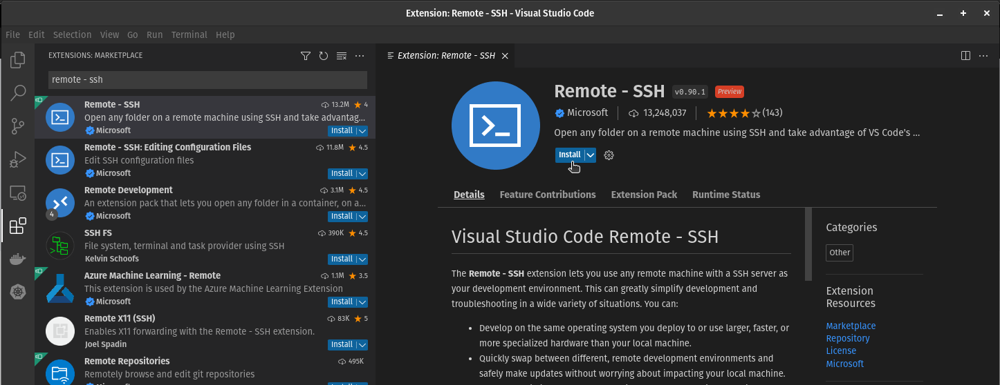
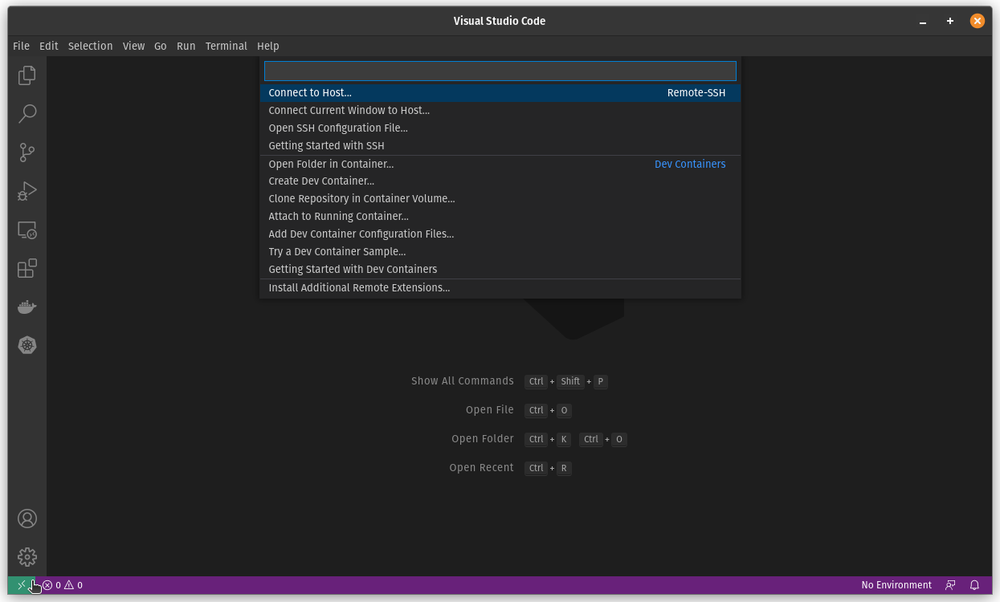
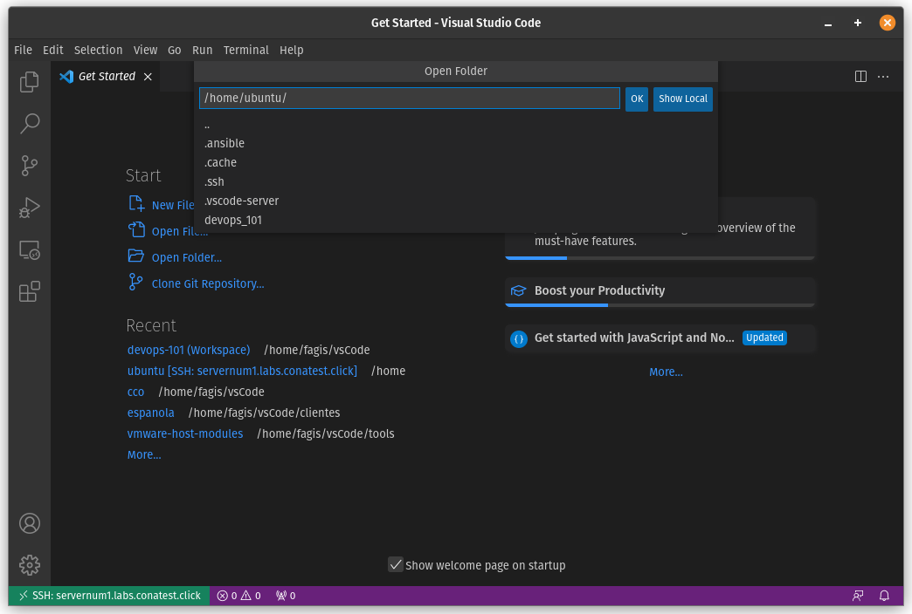

# Ansible

## Introducción

Durante los últimos años la forma con la que configuramos la infraestructura y las aplicaciones que conforman nuestro sistema han ido cambiando. Con el tiempo hemos ido automatizando los procesos de configuración y simplificando la forma en la que interactuamos con los dispositivos. Pasamos de escribir la configuración de todos los componentes de forma manual, a automatizar las mismas tareas a través de scripts. Hoy, hay un nuevo paradigma de automatización que se ha empezado a utilizar, conocido como `Infrastructure as Code` o `IaaS`.


La idea es describir de forma declarativa mi sistema en funcionamiento, para que luego otro proceso independiente siga esta especificación, y aplique las modificaciones necesarias para que todos los elementos involucrados reflejen esta descripción.

Existen muchas herramientas en el mercado que han intentado implementar este concepto, enfocadas en distintas áreas:

- Administación de configuraciones
  - Chef
  - Puppet
- Orquestación y puesta en producción
  - Fabric
  - Capistrano
- Aprovisionamiento
  - Terraform
  - Heat
  - AWS Cloudformation

Cualquiera de ellas son muy potentes en su área, pero poco útiles en las demás.
**Ansible** es una de las pocas herramientas que permite implementar estas mismas ideas pero en todas estas áreas de forma eficiente.

### Historia

Ansible fue concebido y desarrollado inicialmente por Michael Dehaan, product manager de Puppet Labs. El estaba conforme con las funcionalidades de Puppet, pero creía que podía desarrollar algo más interesante. En el 2012, pública la primera versión de Ansible, la cual cuenta con muchas de las propiedades que lo hicieron exitoso.

> **Ansible** - Maquina de ficción creada por Ursula K. Le Guin es el libro Rocanno's World, capaz de permitir comunicaciones a velocidades más rápidas que la velocidad de la luz.

De a poco Ansible fue superando en popularidad a otras herramientas similares, llamando la atención de grandes empresas. En 2015 Red Hat adquirió Ansible y desde ahí el éxito de la plataforma se ha acelerado. Red Hat indicó al momento de la adquisición que mantendría las propiedades Open Source del software, y que ofrecería servicios de soporte y consultoría como herramienta de monetización. Hasta ahora la empresa ha mantenido esta promesa.

### Propiedades

Ansible esta escrito en su totalidad en `python`. Las configuraciones de todas las entidades de Ansible se realizan a través de archivos de texto, escritos en formato [YAML](https://es.wikipedia.org/wiki/YAML).

A diferencia de otros sistemas, Ansible no necesita de un cliente instalado en los equipos (hosts) que va a administrar. Realiza todas las tareas a través de `SSH`, `WinRM`, o algún otro método configurado por el usuario. Esta forma de interactuar con los dispositivos finales permite a Ansible trabajar en base a un modelo `push` en vez de un modelo `pull`.


> _OBS: El servidor de control tiene que poder llegar a todos los componentes que va a administrar. Esto no debería ser un problema si se cuenta con una red de management._

#### Módulos

Para interactuar con el sinfín de sistemas que existen en el mercado, Ansible define `Módulos` para cada uno de ellos. Un módulo no es más que un script/programa escrito en algún lenguaje (usualmente Python) que cumple con una determinada interfaz. Ansible cuenta con una gran cantidad de módulos que comprenden sistemas de:

- Cloud
- Herramientas de monitoreo
- Herramientas de colaboración
- Sistemas
- Networking
- Containers
- Bases de Datos
- Etc, etc.

> _OBS: La lista de módulos oficiales se encuentra [aquí](https://docs.ansible.com/ansible/2.9/modules/modules_by_category.html)._

Además, de ser necesario se pueden escribir módulos nuevos, para utilizar contra sistemas que no estén en la lista. Aunque primero vale la pena investigar si no existe un módulo ya desarrollado, en el repositorio de Ansible o en la comunidad que realice la tarea requerida (veremos `ansible-galaxy` más adelante que ayuda a encontrar estos módulos desarrollados por la comunidad).

**IaaC**

Como mencionamos anteriormente, bajo el paradigma de IaaC debemos dejar de pensar en **como** queremos hacer algo, y pasar a pensar en **que** es lo que queremos que suceda. Esto es conocido como el modelo declarativo.

Un ejemplo un poco burdo es el de la construcción de un edificio. El arquitecto diseña un plano (blueprint) del edificio, indicando como debería verse el resultado final. Luego se lo pasa al constructor, junto con una guía de lo **que** se debe realizar. A partir de ahí, es responsabilidad del constructor en tomar esta impronta y construir el edificio.


Una de las ventajas que nos brinda el trabajar bajo este paradigma es que podemos aprovechar las herramientas de control de versiones y metodologías de programación probadas en el mercado en los últimos años. Podemos contar con múltiples versiones de configuración de nuestros sistemas, mantener un historial de todos los cambios realizados, y volver atrás en el tiempo luego de ejecutar un cambio.

```yaml
Usuario:
  name: example
  uid: 123
  shell: /bin/bash
  pas: secret
```

**Separación del código de los datos**

Otra de las ideas importantes que plantea Ansible es el hecho de **mantener los datos separados de las tareas** a realizar. Las variables de datos pueden ser cargadas de diversas maneras a la hora de ejecutar una tarea.

Por ejemplo, podemos crear una tarea que levante un servidor de Apache publicado en un determinado puerto, bajo un determinado usuario, cuyos logs serán almacenados en una determinada ubicación. Luego, creamos tres perfiles con la información de configuración de tres servidores distintos, con valores independientes de `user`, `port`, y directorio de `logs`.  De esta forma podemos reutilizar la misma tarea de creación del servidor Apache con estos tres perfiles, para crear tres servidores distintos, sin necesidad de reescribir nuestro código.


**Idempotente**

> "… propiedad de una operación matemática, que puede ser aplicada múltiples veces sin cambiar los resultados de la aplicación inicial."

Cada vez que ejecutemos una acción de Ansible, primero va a verificar el estado actual del sistema a modificar contra el estado deseado. **Solamente si existen diferencias entre los estados se termina realizando una acción.**


Dependiendo del estado del sistema con que vamos a interactuar, es la acción que terminará realizando Ansible sobre el mismo, para llevarlo al estado deseado.


> _OBS: **NO** todos los módulos cumplen con esta propiedad, en partícular los módulos de networking._

### Ejemplo de como interactuar con Ansible

Supongamos que estamos trabajando sobre una arquitectura tradicional de una aplicación web.


Identifiquemos que necesitamos para que esta infraestructura funcione:

- ¿Que necesito en un servidor de aplicación?
  - Un usuario
  - Dependencias
  - La aplicación
  - Configuracion de la aplicación
  - La aplicación en servicio
- ¿Que módulos pueden realizar estas tareas?
  - `user`
  - `package`
  - `template`
  - `service`
- ¿Que propiedades debo configurar en cada tarea?


Cada uno de estos módulos consumirá distintas variables para cumplir con la tarea indicada.

En general intentamos que cada archivo de tareas tenga **un objetivo especifico** que cumplir (uno solo). Si una acción cuenta con múltiples objetivos, cada uno de ellos contará con un archivo de tareas independiente.

Siguiendo las mejores prácticas de Ansible, conviene que separemos las variables de configuración de las tareas en archivos distintos. También debemos separar todos los archivos de configuración que necesitemos insertar en nuestros servidores.

La combinación de las tareas, las variables, y los archivos los podemos englobar en una única estructura de orden superior conocido como un [Role](https://docs.ansible.com/ansible/latest/user_guide/playbooks_reuse_roles.html). El mismo presupone un cierto orden de carpetas para almacenar todos estos elementos.


Idealmente, cada acción contará con uno o más roles que se le aplicarán a cada host para configurarlo.

Por ejemplo, podríamos construir la siguiente estructura de carpetas para ejecutar las acciones identificadas anteriormente:


Ahora que tenemos la lista de roles que contienen todas las configuraciones de nuestros servicios, tenemos que construir la lista de hosts donde los implementaremos. En Ansible, creamos inventarios donde almacenamos la lista de nodos con los cuales queremos interactuar.

El sistema de [inventarios](https://docs.ansible.com/ansible/latest/user_guide/intro_inventory.html) de Ansible es muy potente. Nos permite crear todo tipo de grupos de equipos, y configurar variables específicas para cada nodo o grupo de nodos. Hasta podemos utilizar [inventarios dinámicos](https://docs.ansible.com/ansible/latest/user_guide/intro_dynamic_inventory.html), que cumplan con una determinada interface para resolver la lista de nodos y sus variables, lo cuál es muy útil por ej. cuando trabajamos sobre la cloud.

Por último, la unión de los hosts con las tareas o los roles los definimos en un `playbook`.  Los [playbooks](https://docs.ansible.com/ansible/latest/user_guide/playbooks_intro.html) cuentan con múltiples `plays` que vinculan las tareas a realizar con los equipos correspondientes. Cada una de ellas cuenta con configuraciones adicionales que cambian el comportamiento del `play`.


Luego ejecutaremos esta `playbook` utilizando Ansible. El sistema comenzara recabando datos de los hosts sobre los que debe operar, y luego pasará a ejecutar todos los `plays` de forma secuencial. Ansible decidirá al momento de ejecutar cada rol, las tareas que debe realizar para conseguir el estado desado. En caso de que se le proveea una lista de hosts sobre los cuales trabajar, Ansible realizará las configuraciones de forma paralela en todos los hosts.

### Conexión remota

Ansible utiliza SSH para comunicarse con los host remotos. En particular utiliza la versión nativa de OpenSSH de la maquina de control (equipo desde donde ejecuto los playbooks). En caso de que la versión de OpenSSH a utilizar sea muy vieja, Ansible pasa a utilizar una implementación de OpenSSH programada en Python llamada `paramiko`. Esta es utilizada muchas veces cuando se trabaja contra equipos de Networking.

Se recomienda que la autenticación se realice a través de claves privadas, pero también se puede configurar Ansible para que pida credenciales de acceso al momento de ejecutar una tarea en el host remoto.

---

## Acceso al ambiente de trabajo

En esta capacitación no trabajaremos directamente sobre las notebooks, sino que cada estudiante tendrá acceso a un Pod de equipos en la nube, desde donde se realizarán los laboratorios.

Los servidores disponibles (del 1 al N depeniendo de la cantidad de estudiantes) siguen la siguiente convención de nombres:

```
pod-1.labs.conatest.click
pod-2.labs.conatest.click
...
pod-N.labs.conatest.click
```

Cada estudiante accederá únicamente al servidor (Pod) asignado.

Previo al inicio del curso, debe haber recibido por mail los certificados para conectarse al equipo. Estos son `devops101-labs.pem` el cuál se utiliza directamente con ssh, y `devops101-labs.ppk` el cuál se utiliza con el cliente Putty (en Windows). En caso de no haberlo recibido, consulte al instructor.

### Como acceder desde Linux/Mac

Para acceder al servidor de trabajo desde Linux o Mac, se debe descargar el certificado (.pem) y colocarle permisos de solo lectura únicamente para el usuario. Esto se hace de la siguiente manera:

```bash
$ chmod 400 devops101-labs.pem
```

Luego se utiliza el comando `ssh` para acceder al servidor, sustituyendo la X por el número de POD asignado, de acuerdo al mail recibido.

```bash
$ ssh -i devops101-labs.pem ubuntu@pod-X.labs.conatest.click
```

### Como acceder desde Windows

Desde Windows, se puede acceder de dos formas.

La primera es utilizando `Windows Power Shell`:

- Descargar a la notebook el certificado (.pem) recibido y coloclarlo en una carpeta de fácil acceso.
- Abrir la aplicación `Windows Power Shell`, y ubicarse en dicha carpeta.
- Utilizar el comando `ssh` tal como lo haríamos para Linux en el caso anterior:
  ```bash
  ssh -i devops101-labs.pem ubuntu@pod-X.labs.conatest.click
  ```

La segunda opción es utilizando la herramienta `Putty`:

- Descargar a la notebook el certificado (.ppk) recibido.
- Instalar [Putty](https://www.chiark.greenend.org.uk/~sgtatham/putty/) y abrirlo.
- Dentro del panel "Category" elegir "Session" y luego completar los siguientes campos:

  ```bash
  hostname: ubuntu@pod-X.labs.conatest.click
  connection-type: ssh
  port: 22
  ```
- Dentro de "Category" --> "Connection" --> "SSH" --> "Auth" seleccionar "Browse" y elegir el certificado `devops101-labs.ppk`
- Opcional: puede grabar la configuración de la sesión mediante "Save" para poder volver a utilizarla luego.
- Seleccionar "Open" para conectarse, y luego "Accept" para aceptar la Security Alert (la primera vez).

#### Opcional: configuración ssh file

En caso que utilice `ssh` para conectarse a su `POD`, puede agregar las siguientes entradas al archivo `config` de ssh, para facilitar la conexión:

```bash
Host master.labs.conatest.click
  HostName pod-X.labs.conatest.click
  IdentityFile ~/.ssh/devops101-labs.pem
  Port 22
  User ubuntu

Host controller.labs.conatest.click
  HostName pod-X.labs.conatest.click
  IdentityFile ~/.ssh/devops101-labs.pem
  Port 2222
  User root
```

- Recuerde sustituir la X por su número de POD asignado.
- En `IdentityFile` debe colocar la ubicación del certificado `.pem` donde lo descargó en su máquina.
- El archivo `config` se encuentra ubicado en el directorio  `~/.ssh/config` en linux, o en `~\.ssh\config` en Windows (si no existe, debe crearlo).
- Si utiliza windows puede utilizar el editor notepad para editar el archivo, pero asegurese de guardarlo sin la extensión .txt que notepad le agrega por defecto.

Una vez modificado el `ssh config file` podrá conectarse al POD, tanto desde Linux como desde Windows Power Shell, simplemente haciendo:

```bash
$ ssh master.labs.conatest.click
$ ssh controller.labs.conatest.click
```

Esto además resultará sumamente útil para conectarse por medio de Visual Studio Code al `POD`, como veremos a continuación.


#### Opcional: configuración de Visual Studio Code

Si bien no es requerido, recomendamos instalar en su máquina el editor de texto Visual Studio Code, que puede descargar desde [aquí.](https://code.visualstudio.com/)
Esto le permitirá conectarse a su `POD` remoto, directamente desde el editor que corre en su máquina local (por ssh) y así poder editar los archivos que se utilizan durante los laboratorios de forma mucho mas amigable que utilizando el editor `nano` o `vim` de linux. Esto será particularmente útil para la sección de `docker-compose` así como para el desafío final, que veremos en el segundo día de curso.

Este editor es particularmente potente, gracias a la integración de múltiples extensiones que amplían su funcionalidad.
Para poder utilizarlo en el curso, deberemos instalar al menos la extension [Remote - SSH](https://marketplace.visualstudio.com/items?itemName=ms-vscode-remote.remote-ssh), que permite acceder remotamente a un servidor y editar los archivos directamente en el mismo.

La instalación de la extensión es muy sencilla. Una vez instalado el editor, iniciarlo, y luego ir a  `File > Preferences > Extensions` o presionar directamente `<ctrl-shift-X>. `Esto abrirá el panel de configuración de las `EXTENSIONS` y arriba del todo tendrá un panel de búsqueda donde podrá buscar la extensión "Remote - SSH".

Aparecerán múltiples resultados, donde recomendamos instalar la provista por `Microsoft `, tal como muestra la siguiente imagen:



Una vez instalada, aparecerá un pequeño botón verde en la esquina inferior izquierda del editor (es posible que deba reiniciarlo).
Al seleccionarlo, nos dará la opción de conectarnos a un servidor remoto por `SSH Connect to Host...`



Si ya configuró el `ssh config file` del punto anterior, alcanzará con indicar el POD al cual conectarse, esto es: `controller-X.labs.conatest.click. `

De lo contrario, si no realizó el paso anterior, podemos configurar lo necesario en este momento (solo se hace una vez), mediante los siguientes pasos:

- seleccionar la opción `+ Add New SSH Host...`
- agregar el comando ssh completo, es decir: `ssh -i ~/.ssh/devops101-labs.pem root@pod-X.labs.conatest.click -p 2222`
- luego nos pedirá la ubicación del ssh config file a utilizar, por ejemplo: `~/.ssh/config` en linux o en `~\.ssh\config` Windows
- esto modificará la configuración del `ssh config` file agregando el acceso al pod, y ya podrá conectarse con el botón `Connect`

👉 recuerde sustituir la `X` por su número de `POD` asignado y colocar la ubicación correcta donde descargó el certificado `.pem`


Al conectarse al servidor remoto por primera vez, es posible que le solicite cuál es la plataforma a la cual conectarse, indique `Linux.`

Por último, una vez conectado con el editor a su pod (lo cual puede verlo en el botón verde abajo a la izquierda), puede abrir la carpeta remota en el servidor, para poder editar los archivos directamente en el mismo.
Para esto seleccion `File > Open Folder` e indique la carpeta `/home/root/ansible` tal como se muestra en la siguiente imagen, y presione `OK.`



La primera vez, le preguntará si confía en el autor de los archivos, indique que `SI` y seleccione el `checkbox` para que no vuelva a preguntarle.

Aguarde unos segundos, y sobre el panel de la izquierda tendrá acceso al contenido de ese directorio del servidor remoto, donde podrá crear nuevos archivos y/o directorios, así como seleccionar un archivo para editarlo en el panel derecho, guardando los cambios directo al servidor remoto.

### DEMO Lab #1 - Lanzar el laboratorio

El laboratorio consiste en un set de contenedores que simulan una granja de servidores.


El servidor `master` es el que corre los contenedores `controller`, `host1`, `host2` y `host3`. Este es el equipo al cual se accede cuando se hace `ssh` mediante al nombre: `pod-X.labs.conatest.click`.
En general no es necesario acceder al mismo, salvo que se desee reiniciar de cero el ambiente por algún motivo particular.

Para verificar si el ambiente se encuentra levantado correctamente, conéctese al mismo y haga:

```bash
# Pararse en el directorio /home/ubuntu/ansible_lab
$ cd ansible_lab

# Verificar el estado del ambiente
$ make status
    Name             Command        State                   Ports              
---------------------------------------------------------------------------------
controller      /usr/sbin/sshd -D   Up       0.0.0.0:2222->22/tcp,:::2222->22/tcp
docker_base_1   bash                Exit 0                                     
host01          /var/run.sh         Up                                         
host02          /var/run.sh         Up                                         
host03          /var/run.sh         Up      
```

En caso de requerirlo, puede reiniciar el ambiente haciendo:

```bash
# Pararse en el directorio /home/ubuntu/ansible_lab
$ cd ansible_lab

# Bajar el ambiente:
$ make down

# Subior el ambiente:
$ make up
```

Como explicamos antes, no debería ser necesario conectarse al equipo master.
Sino que todos los laboratorios se realizarán desde el equipo `controller`. Aquí es donde escribirá y ejecutará los playbooks/comandos de Ansible, los cuáles trabajarán contra los equipos `host01`, `host02` y `host03`.

Para conectarse al equipo `controller` debe hacer un `ssh` a su `pod-X.labs.conatest.click` pero esta vez debe indicar el puerto `2222` y el usuario `root`:

```bash
  ssh -i devops101-labs.pem -p 2222 root@pod-X.labs.conatest.click
```

Pruebe de conectarse y verificar la conectividad desde el `controller` hacia los equipos `host1`, `host2`y `host3` utilizando `ping`.

OBS: para facilitar la conexión a los equipos, puede agregar las siguientes entradas al archivo `config` de ssh, y luego simplemente hacer `ssh master.labs.conatest.click` o `ssh controller.labs.conatest.click` para acceder a cada uno de los equipos (debe cambiar el pod-X por el número de POD que le fué asignado, y referenciar en forma correcta el lugar donde se encuentra el archivo .pem).

```bash
Host master.labs.conatest.click
  HostName pod-X.labs.conatest.click
  IdentityFile ~/.ssh/devops101-labs.pem
  Port 22
  User ubuntu

Host controller.labs.conatest.click
  HostName pod-X.labs.conatest.click
  IdentityFile ~/.ssh/devops101-labs.pem
  Port 2222
  User root
```

Este archivo de configuración se encuentra ubicado en `~/.ssh/config` en linux o en `~\.ssh\config` en Windows (si no existe, puede crearlo).
Esto además resultará sumamente útil para conectarse por medio de Visual Studio Code al equipo `controller` y poder escribir los playbooks directamente en el servidor desde el editor, cosa que recomendamos fuertemente para poder realizar los laboratorios.

En caso de que utilice `putty` puede grabar los profiles con la configuración de conexión a ambos equipos.

---

[Siguiente--&gt;](02_ansible_basics.md)
