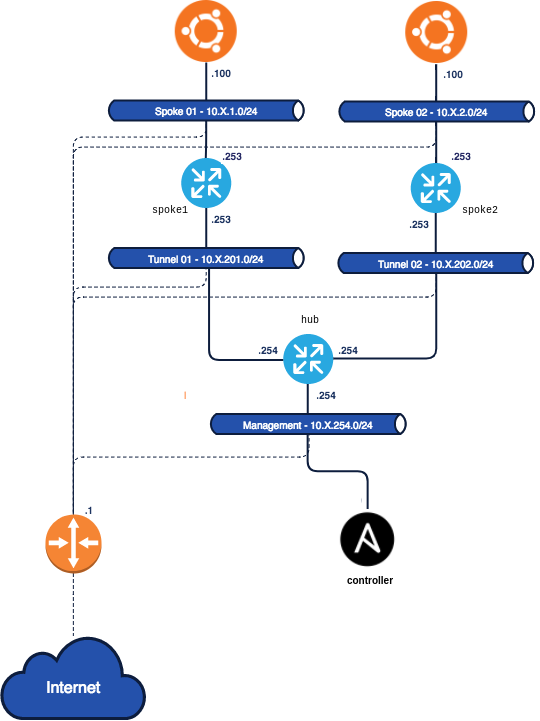

## Networking con Ansible

Como mencionamos antes, Ansible puede utilizarse para configurar más que servidores. En esta sección nos concentraremos en la configuración de equipos de red, específicamente, trabajando con routers Cisco. Sin embargo, todo lo que veamos puede trasladarse a equipos de otras marcas.

:point_right: Dentro de la lista de módulos que tiene Ansible para interactuar con otros sistemas, existe una categoría exclusiva para networking, que puede ver [aquí](https://docs.ansible.com/ansible/2.9/modules/list_of_network_modules.html).

La lista es extensa y contiene módulos para la mayoría de los vendors más importantes del mercado. Sin embargo, es posible que algún módulo en particular no exista. En este caso podemos desarrollar nostros nuestro propio módulo, y si queremos, ofrecerlo luego al resto de la comunidad. Esta es una de las ventajas que tiene el software de código abierto.

Nosotros nos concentraremos en los módulos para [Cisco IOS](https://www.cisco.com/c/en/us/products/ios-nx-os-software/index.html), que puede encontrar [aquí](https://docs.ansible.com/ansible/2.9/modules/list_of_network_modules.html#ios).


### Ambiente de Laboratorio de Networking
Para los laboratorios de esta parte del curso, utilizaremos los siguientes equipos:


Cada Pod cuenta con 3 routers configurados Hub & Spoke. El `hub` se encuentra en la red de `management` y es el único que puede ser accedido directamente a través de Internet. Aunque recomendamos conectarse al mismo desde nuestro equipo `controller`, que utilizamos para Ansible. Los dos equipos `spoke` se encuentran en redes privadas, y conseguiremos acceder a ellos a medida que avanzamos con el laboratorio. 

:point_right: La idea de esta parte del curso es realizar las configuraciones de los routers a través de `Ansible`, y no con la `cli` conectado a la consola. Sin embargo, puede resultar útil conectarse a la consola para ver como se aplican los cambios, verificar configuraciones, etc.

Para **conectarnos al router `hub` recomendamos hacerlo desde el equipo `controller`**, ya sea por nombre `hub-X.labs.conatest.click` o por IP `10.X.254.254`, dado que ya tenemos preconfigurado el ssh para que la conexión sea sencilla:
```bash
$ ssh hub-X.labs.conatest.click

ip-10-X-254-254#
```

Al conectarse al router queda parado en la consola de configuración en modo `EXEC`. Podemos verificar que nos encontramos en un router CISCO utilizando el comando `show version`:

```
ip-10-1-254-254# show version
Cisco IOS XE Software, Version 16.12.06
Cisco IOS Software [Gibraltar], Virtual XE Software (X86_64_LINUX_IOSD-UNIVERSALK9-M), Version 16.12.6, RELEASE SOFTWARE (fc3)
Technical Support: http://www.cisco.com/techsupport
Copyright (c) 1986-2021 by Cisco Systems, Inc.
Compiled Sun 05-Sep-21 00:37 by mcpre

(...)
```

Si queremos **conectarnos al router `hub` directamente por internet**, debemos hacer:
```bash
$ ssh -i devops101-labs.pem -o KexAlgorithms=diffie-hellman-group-exchange-sha1 ec2-user@hub-X.labs.conatest.click
```
> OBS: Si al intentar conectarnos nos tira para afuera sin nungún mensaje, puede deberse a que el router busca el certificado ssh en el primer lugar de la lista de hosts conocidos de nuestra máquina, la cuál puede ver con: `ssh-add -l`. Si este es el caso, intente agregar el certificado a la lista de host conocidos mediante `ssh-add devops101-lab.pem` y vuelva a probar. Si el problema persiste, recomendamos conectarse desde el equipo `controller` que ya se encuentra preconfigurado para facilitar la conexión.


Para poder **establecer la conexión a los routers a través de Ansible** tenemos que realizar algunos pasos previos, los cuales haremos en el siguiente **Demo Lab**.

>OBS: si lo prefiere, en lugar de modificar los archivos que venimos utilizando de los labs anteriores, puede crear un nuevo directorio para comenzar desde cero, y trabajar en el mismo creando un nuevo archivo de inventario, nuevos directorios según sean requeridos, etc. También puede reinicial el ambiente desde cero, borrando su contenido, como vimos [aqui](https://github.com/conapps/Devops-101/blob/master/Ansible-101/01_ansible.md#demo-lab-1---lanzar-el-laboratorio).


### Demo Lab #3 - Configurar el ambiente requerido para Ansible

Lo primero que debemos hacer es agregar nuestros equipos de Networking al inventario.

```yaml
# ./inventory/hosts.yml
all:
  children:
    routers:
      hosts:
        10.X.254.254:
```

La mayoría de los equipos de red no cuentan con una interfaz programática para interactuar con ellos. En general, solamente podemos configurarlos a través de una consola. Además, tampoco permiten correr scripts de python a través de ssh, que es lo que realizamos con Ansible en los ejemplos anteriores. Por lo tanto, tenemos que indicarle a Ansible como debe interactuar con estos equipos. Comenzaremos por configurar algunas variables a aplicar a todos los dispositivos `routers` del inventario:

```yaml
# ./inventory/hosts.yml
all:
  children:
    routers:
      vars:
        # Nombre de usuario
        ansible_user: ec2-user
        # Llave privada a utilizar
        ansible_ssh_private_key_file: ~/.ssh/devops101-labs.pem
        # Sistema operativo a utilizar
        ansible_network_os: ios
        # Permitir elevación de permisos
        ansible_become: yes
        # Comando a utilizar para elevar permisos
        ansible_become_method: enable
        # Tipo de conexión
        ansible_connection: network_cli
      hosts:
        10.X.254.254:
```

Además, en el `ansible.cfg` del proyecto, configuramos las siguientes opciones:

```yml
# ./ansible.cfg
[defaults]
inventory = ./inventory/hosts.yml      
#vault_password_file = /root/secret/vault-password   # estaba de antes, podemos comentarla por ahora
host_key_checking = False
retry_files_enabled = False
```

Para verificar que este todo funcionando correctamente, hacemos un `ansible ping` a grupo `routers`, siempre trabajando desde el `controller`:

```
# ansible routers -m ping
10.1.254.254 | SUCCESS => {
    "changed": false,
    "ping": "pong"
}
```

Ahora que sabemos que la conectividad funciona, agreguemos los routers `spoke` al inventario, separándolos en dos grupos:

```yaml
all:
  children:
    routers:
      vars:
        ansible_user: ec2-user
        ansible_ssh_private_key_file: ~/.ssh/devops101-labs.pem
        ansible_network_os: ios
        ansible_become: yes
        ansible_become_method: enable
        ansible_connection: network_cli
      children:
        hub:
          hosts:
            10.1.254.254:
        spokes:
          hosts:
            10.1.201.253:
            10.1.202.253:
```
---

### `ios_config`

Uno de los módulos más comunes para utilizar con equipos `ios` es `ios_config`, cuya documentación encontramos [aquí](https://docs.ansible.com/ansible/latest/modules/ios_config_module.html).

El primer `playbook` que vamos a crear permitira almacenar un respaldo de las configuraciones del equipo:

```yaml
# ---
# routers-backup-config.yml
#
# Crea un respaldo de las configuraciones de los equipos IOS
# ---
- name: Respaldo de configuraciones IOS
  hosts: routers
  connection: local
  gather_facts: no
  tasks:
    - name: Comandos para respaldar las configuraciones
      ios_config:
        backup: yes
```

---

### Ejercicio #6

Cree un `playbook` que le permita modificar el `hostname` del `hub`, solo en el caso de que la variable `hostname` este definida para cada host.

<details>
    <summary>Pista #1</summary>
    El módulo <code>ios_config</code> permite ejecutar lineas de configuración definidas en la opción <code>lines.</code>
</details>

<details>
    <summary>Pista #2</summary>
    El comando para cambiar el <code>hostname</code> en <code>ios</code> es: <code>hostname nombre_del_host</code>
</details>

<details>
    <summary>Pista #3</summary>
    Recuerde utilizar la opción `when` dentro de una `task` para ejecutarla solo cuando se cumpla una condición. Las condiciones aceptadas son aquellas validas en Python.
</details>

<details>
    <summary>Solución</summary>
    <pre class="language-yaml" lang="yaml"># ---
# update_hostnames.yml
#
# Modifica el hostname de los equipos de acuerdo al valor definido
# en la variable `hostname` del inventario.
# ---
- name: Modificar el hostname
  hosts: routers
  connection: local
  gather_facts: no
  tasks:
    - name: Modificar el hostname
      ios_config:
        lines: 'hostname {{hostname}}'
      when: hostname is defined
# ---
# inventory.yml
all:
  children:
    routers:
      children:
        hub:
          vars:
            hostname: nombre_host
          hosts:
            10.X.254.254:
        spokes:
          hosts:
            10.X.201.253:
            10.X.202.253:
  vars:
    ansible_user: ec2-user
    ansible_ssh_private_key_file: ~/.ssh/ansible101-podX-key.pem
    ansible_network_os: ios
    ansible_become: yes
    ansible_become_method: enable
    ansible_connection: network_cli
  </pre>
</details>

---

## Auditoría de configuraciones

Una de las tareas que se realizan comúnmente a nivel de red, es auditar las configuraciones de los dispositivos, de forma de garantizar de que todos ellos están configurados de la misma manera, o que cumplen con los estándares de la empresa. El módulo `ios_config` cuenta con algunas opciones para realizar esta tarea.

A través de la opción `diff_against` podemos indicarle al módulo `ios_config` contra que configuración buscar las diferencias. El comando acepta tres opciones:

- `running`
  - El sistema retornara la configuración antes y después de realizarle cambios.
- `startup`
  - Si se corre el `playbook` bajo el flag `—diff` retornara la diferencia entre la `startup` config y la `running`.
  - _OBS: El flag `—diff` le indica a Ansible, en terminos generales, que nos indique que acciones se ejecutarían en caso de correr el `playbook` sin este flag._
- `intended`
  - Verificara las diferencias entre la `running` config y aquella que se indique en la opción`intended_config`.

Por ejemplo, si corremos el siguiente `playbook`, veremos las diferencias entre las configuraciones, según los cambios que realizamos recientemente.

```yaml
# ---
# simple_running_vs_startup_diff.yml
#
# Muestra las diferencias entre la running y startup config.
# Obs: Este playbook debe ser ejecutado con el flag `--diff` levantado.
# ---

- name: Running Vs. Startup diff (simple)
  hosts: all
  connection: local
  gather_facts: no
  tasks:
    - name: Comando para hallar las diferencias
      ios_config:
        diff_against: startup
```

Para la salida de uno de los routers deberíamos ver algo como esto:

```
changed: [10.1.254.254]
--- before
+++ after
@@ -4,7 +4,7 @@
 platform qfp utilization monitor load 80
 no platform punt-keepalive disable-kernel-core
 platform console virtual
-hostname ip-10-1-201-253
+hostname spoke_01
 boot-start-marker
 boot-end-marker
 vrf definition GS
```

---

Ansible además de permitirnos utilizar opciones especiales para expresar el comportamiento de las tareas (`loops`, `when`, etc.), ofrece otras estructuras que permiten la manipulación de variables y de salidas de otras tareas. Por ejemplo, nos permiten manipular documentos `JSON` directamente desde nuestro `playbook`, lo que agrega una gran potencia a nuestros `playbooks`.

Estas herramientas son: 

- Ansible Filters
- Ansible Plugins
- Templates de Jinja2
- El módulo `set_fact`.

El módulo `set_fact` es particularmente útil porque nos permite configurar variables durante la ejecución del `playbook` de forma dínamica. Explotaremos esta característica de este módulo para manipular nuestros documentos `JSON`. Las demás herramientas las veremos en la siguiente sección.

### Ansible Filters, Plugins, y Jinja2

Jinja2 es un lenguaje de templating desarrollado sobre python. El mismo se utiliza en varios frameworks importantes de Python como Django para crear páginas web por ejemplo. Sin embargo, se puede usar para crear todo tipo de documentos.

Ansible utiliza Jinja2 por debajo para la construcción de los scripts que se terminan ejecutando el los hosts remotos o localmente y además expone ciertas funcionalidades para ser utilizadas dentro de la definición de tareas. Por ejemplo, podemos utilizar Jinja2 para manipular variables declaradas en el inventario, en la configuración del rol, o al momento de correr el playbook. 

Cuando estamos configurando una tarea, y queremos configurar una determinada opción con una variable, utilizamos la sintaxis de Jinja2, e incluimos la variable que queremos referenciar

```yaml
- hosts: all
  vars:
    ejemplo: 'Hola Mundo!'
  tasks:
    - name: Imprimimos el valor de la variable 'ejemplo' en la consola
      debug:
      	msg: '{{ ejemplo }}'
```

En Jinja2, utilizamos los corchetes dobles `{{}}` para indicarle al sistema que dentro del mismos vamos a estar trabajando con variables y filtros. Además, tenemos que _escapar_ estas sentencias con comillas simples `''` o dobles `""` para que `YAML` no se las confunda con declaraciones de objetos de `JSON`.

Los filtros de Ansible se usan para manipular datos dentro de una expresión. Ansible expone una gran variedad de filtros para interactuar con nuestras variables. Un filtro no es más que un pequeño script de Python, que manipula valores almacenados en variables. Por lo tanto, podemos crear nuestros propios filtros para utilizarlos dentro de nuestros `playbooks`. Sin embargo, la creación de estos scripts escapa el alcance de este curso.

Dentro de los filtros más comunes tenemos:

- Filtros para formatear datos.
- Filtros para redefinir variables.
- Filtros para definir valores por defecto.
- Filtros para manipular listas
- Etc.

La lista completa de filtros se encuentra en el siguiente [link](https://docs.ansible.com/ansible/latest/user_guide/playbooks_filters.html).

Por último, Ansible nos brinda Plugins. Los Plugins, son también scripts de Python pero que exponen una función capaz de realizar tareas más complejas que no tienen porque trabajar necesariamente sobre variables. Ansible provee varios filtros, y también permite la creación de nuevos plugins. 

Tampoco indicaremos en este curso como desarrollar nuestros propios plugins, simplemente utilizaremos algunos de los que Ansible provee por defecto, en particular el plugin `lookup`. El mismo permite buscar dentro del `filesystem` del host por archivos, que podemos cargar luego en una variable para interactuar con sus contenidos.

Veamos como podemos manipular un documento JSON utilizando todos estos componentes.

Primero, copiemos el archivo `example.json` de la carpeta `~/ansible_lab/net/json/example.json` al directorio donde estamos trabajando.

```bash
cp ~/ansible_lab/net/json/example.json example.json
```

Luego, creamos un nuevo `playbook` con la siguiente información:

```yaml
# ---
# reading_json.yml
# 
# Playbook capaz de leer un documento de texto que contenga JSON
# ---

- name: Ejemplos de manipulación de JSON con Ansible
  hosts: localhost
  connection: local
  gather_facts: no
  tasks:
  	- name: Cargamos el contenido de 'example.json' en una variable
  	  set_fact:
  	    json: "{{ lookup('file', 'example.json') | from_json }}"
  	- name: Imprimimos el JSON en la consola
  	  debug:
  	  	var: json
```

Utilizamos el módulo `set_fact` para cargar el contenido del archivo `example.json` en la variable `json`. Para leer el archivo, usamos el plugin `lookup`, el cual permite interactuar con archivos del filesystem local, como se comento anteriormente. Además de este `plugin` utilizamos un filtro llamado `to_json` que permite convertir un string en JSON.

Si queremos iterar sobre los elementos dentro de la variable `data` usamos la opción `loop`.

```yaml
# ---
# iterating_over_a_json_list.yml
#
# Playbook capaz de iterar sobre una lista almacenada en un documento
# JSON.
# OBS: La lista se encuentra definida en la llave 'data'.
# ---

- name: Ejemplos de manipulación de JSON con Ansible
  hosts: localhost
  connection: local
  gather_facts: no
  tasks:
    - name: Cargamos el contenido de 'example.json' en una variable
      set_fact:
        json: "{{ lookup('file', 'example.json') | from_json }}"
    - name: Imprimimos solo el email de las personas
      debug:
        msg: "{{ item['email'] }}"
      loop: "{{ json['data'] }}"
```

Podemos combinar este `loop` con un condicional para definir nuevas variables que requieran recorrer esta estructura.

```yaml
# ---
# json_filtering.yml
#
# Playbook capaz hallar un valor dentro de una lista de elementos
# almacenados en un documento de JSON.
# ---

- name: Ejemplos de manipulación de JSON con Ansible
  hosts: localhost
  connection: local
  gather_facts: no
  tasks:
    - name: Cargamos el contenido de 'example.json' en una variable
      set_fact:
        json: "{{ lookup('file', 'example.json') | from_json }}"
    - name: Registramos una variable con el mail de "Alston"
      set_fact:
        email: "{{ item['email'] }}"
      loop: "{{ json['data'] }}"
      when: item['name']['first'] == 'Alston'
    - name: Imprimimos el mail almacenado en la variable 'email'
      debug:
        var: email
```

Combinando condicionales y loops con distintos filtros podemos extraer cualquier información que necesitemos del JSON. Por ejemplo, podemos obtener una lista solo con los mails de las personas:

``` yaml
# ---
# json_list_filtering.yml
#
# Playbook capaz de filtrar una lista de elementos almacenados
# en un documento de JSON, obteniendo solo una lista de 'emails'.
# ---

- name: Ejemplos de manipulación de JSON con Ansible
  hosts: localhost
  connection: local
  gather_facts: no
  vars:
    email_list: []
  tasks:
    - name: Cargamos el contenido de 'example.json' en una variable
      set_fact:
        json: "{{ lookup('file', 'example.json') | from_json }}"
    - name: Iteramos sobre los datos y almacenamos el correo en la lista 'email_list'
      set_fact:
        email_list: "{{ email_list }} + [ '{{ item['email'] }}' ]"
      loop: "{{ json['data'] }}"
    - name: Imprimimos la lista 'email_list'
      debug:
        var: email_list
```

---

## Ejercicio #7

TODO: Evaluar quitar este ejercicio

Escriba un `playbook` que permita almacenar la diferencia entre la `startup` y `running` config.

_OBS: Recuerde correr el `playbook` con la opción `—diff`._

<details>
    <summary>Pista #1</summary>
    Recuerde que puede acceder a llaves de segundo y tercer nivel utilizando la notación con parentesís rectos: <code>json["llave_1"]["llave_2"]</code> 
</details>

<details>
    <summary>Pista #2</summary>
    Utilce el módulo <code>set_fact</code> para definir variables de forma dínamica.
</details>

<details>
    <summary>Pista #3</summary>
    El módulo ios_config retorna un objeto una llave llamada <code>diff</code> la cual contiene dos llaves más: <code>after</code> y <code>before</code>. Ambas contienen la configuración en <b>texto plano</b>.
</details>

<details>
    <summary>Pista #4</summary>
    Puede convertir un string en una lista utilizando la función <code>split</code>. Por ejemplo: <code>output['diff']['after'].split('\n')</code>
</details>

<details>
    <summary>Pista #5</summary>
	Puede hallar la diferencia entre dos listas utilizando el filtro `difference`. Por ejemplo: <code>after | difference(before)</code>.
</details>

<details>
    <summary>Pista #6</summary>
    Puede crear nuevos archivos utilizando el módulo <code>lineinfile</code> pasandole las opciones <code>create: yes</code> y <code>state: present</code>.
</details>

<details>
	<summary>Solución</summary>
  <pre class="language-yaml" lang="yaml">
# ---
# running_vs_startup_diff.yml
#
# Crea un archivo donde se almacenan las diferencias entre la Running config y
# la Startup config.
# ---
- name: Running VS. Startup Diff
  hosts: routers
  connection: local
  tasks:
  - name: Comando para hallar las diferencias
    ios_config:
      diff_against: startup
    register: output
  - debug:
      msg: "{{output}}"
  - name: 'Cargar el estado anterior en una variable llamada: `before`'
    set_fact:
      before: "{{ output['diff']['before'].split('\n') }}"
  - name: 'Cargar el estado posterior en una variable llamada: `after`'
    set_fact:
      after: "{{ output['diff']['after'].split('\n') }}"
  - name: 'Cargar una salida linea a linea de las diferencias en una variable llamada: `diference`'
    set_fact:
      difference: "{{ after | difference(before) }}"
  - name: Configuramos el nombre del reporte
    set_fact:
      report_name: "{{hostname | default(ansible_net_hostname)}} - Running Config VS. Startup Config Diff"
  - name: 'Guardamos la diferencia en un archivo'
    lineinfile:
      create: yes
      state: present
      path: "./diffs/{{hostname | default(ansible_net_hostname)}}_{{lookup('pipe','date +%Y_%m_%d_%H_%M_%S')}}_diff.md"
      line: "{{ difference }}"</pre>
</details>

---

## Cambios masivos

Utilizando Ansible es sencillo realizar configuraciones en múltiples equipo. Ya hemos visto un ejemplo de esto cuando configuramos el `hostname` en todos los routers de forma simultánea.

Los routers ya están configurados para poder comunicarse entre sí. Sin embargo, no podemos llegar a las redes `10.X.1.0/24` y `10.X.2.0/24` por que las interfaces de los routers dentro de estas redes no están configuradas. Vamos a ver como podemos realizar estas configuraciones de forma masiva, utilizando Ansible.

_OBS: La `X` corresponde al número de su POD._

Los routers ya están configurados para poder comunicarse entre sí. Sin embargo, no podemos llegar a las redes `10.X.1.0/24` y `10.X.2.0/24` por que las interfaces de los routers dentro de estas redes no están configuradas. Vamos a ver como podemos realizar estas configuraciones de forma masiva, utilizando Ansible.

Primero, veamos como se vería un `playbook` para configurar una interfaz **solo** en el router **hub**.

```yaml
# ---
# configure_interface_on_spoke_01.yml
#
# Configura la interface GigabitEthernet2 del router Spoke01
# ...
- name: Configuracion de interface GigabitEthernet2
  hosts: hub
  connection: local
  gather_facts: no
  tasks:
    - ios_config:
        lines:
          - description "Conexión con Red Spoke #1"
          - ip address 10.X.201.254 255.255.255.0
          - no shutdown
        parents: interface GigabitEthernet2
```

_OBS: Note como le indicamos al módulo `ios_config` cual es el `parent` sobre el cual debemos realizar los comandos._

Básicamente, escribe las líneas que le indicamos en el router, en la ubicación indicada. Esta claro que con este `playbook` no podríamos realizar cambios en múltiples equipos. Para poder generalizarlo tenemos que crear primero un `role`. 

---

### Ejercicio #8

Cree un nuevo rol llamado `configure_interfaces` que configure una interfaz de un router consumiendo una lista de objetos llamada `interfaces` con las siguientes llaves:

- `interface`
- `ip_address`
- `net mask`
- `description`

El rol luego será llamado a través del siguiente `playbook`

```yaml
# ---
# configure_interfaces_with_role.yml
#
# Configura interfaces utilizando un rol
# 
# OBS:
#   Dentro del inventario, se configurará una variable llamada
#    `interfaces` con una lista de interfaces. Por ejemplo:
#   interfaces:
#     - interface: GigabitEthernet2
#       ip_address: '10.X.201.254'
#       netmask: '255.255.255.0'
#       description: Configurado desde el nuevo rol
# ...
- name: Configuración de interface
  hosts: hub
  connection: local
  gather_facts: no
  roles:
    - role: ../roles/configure_interfaces
```

<details>
    <summary>Pista #1</summary>
    Recuerde la estructura de carpetas que necesita un rol<pre>
roles
\ tasks
  \ main.yml
\ defaults
  \ main.yml
\ files
\ ...
    </pre>
</details>

<details>
    <summary>Pista #2</summary>
    Recuerde la estructura de carpetas que debe tener un <code>role</code> dentro del directorio <code>roles</code>.
    <pre>
    \configure_interfaces
      \tasks
        main.yml
      \defaults
      	main.yml
      ...
    </pre>
</details>

<details>	
    <summary>Solución</summary>
    <pre>
# ---
# ./roles/configure_interfaces/tasks/main.yml
#
# Tareas para configurar la interfaz de un equipo.
# ---
- name: Configuración de interfaces
  loop: '{{ interfaces }}'
  ios_config:
    lines:
      - 'description {{ item.description }}'
      - 'ip address {{ item.ip_address }} {{ item.netmask }}'
      - no shutdown
    parents: 'interface {{ item.interface }}'
</details>

---

Ahora que tenemos el rol, podemos configurar estas opciones dentro del archivo de inventario. Carguemos esta información en nuestro inventario.

```yaml
---
all:
  children:
    routers:
      vars:
        ansible_user: ec2-user
        ansible_network_os: ios
        ansible_become: yes
        ansible_become_method: enable
        ansible_connection: network_cli
      children:
        hub:
          hosts:
            10.X.254.254:
              hostname: hub
              interfaces:
                - interface: GigabitEthernet1
                  ip_address: 10.X.254.254
                  netmask: 255.255.255.0
                  description: Conexion con red Hub
                - interface: GigabitEthernet2
                  ip_address: 10.X.201.254
                  netmask: 255.255.255.0
                  description: Conexión con red de tránsito 1
                - interface: GigabitEthernet3
                  ip_address: 10.X.202.254
                  netmask: 255.255.255.0
                  description: Conexión con red de tránsito 2
        spokes:
          hosts:
            10.X.201.253:
              hostname: spoke01
              interfaces:
                - interface: GigabitEthernet1
                  ip_address: 10.X.201.253
                  netmask: 255.255.255.0
                  description: Conexión con red de tránsito 1
                - interface: GigabitEthernet2
                  ip_address: 10.X.1.254
                  netmask: 255.255.255.0
                  description: Conexión con red Spoke 1
            10.X.202.253:
              hostname: spoke02
              interfaces:
                - interface: GigabitEthernet1
                  ip_address: 10.X.202.253
                  netmask: 255.255.255.0
                  description: Conexión con red de tránsito 2
                - interface: GigabitEthernet2
                  ip_address: 10.X.2.254
                  netmask: 255.255.255.0
                  description: Conexión con red Spoke 2
    servers:
      children:
        master:
          hosts:
            10.X.254.100:
        slaves:
          hosts:
            10.X.1.100:
            10.X.2.100:
      vars:
        ansible_user: ubuntu
        ansible_python_interpreter: /usr/bin/python3
  vars:
    ansible_ssh_private_key_file: ~/.ssh/ansible101-podX-key.pem


```

---

### `ios_user`

Como vimos anteriormente existen múltiples módulos adicionales para configurar equipos de red. Los mismos exponentes distintas opciones para interactuar con los los equipos. Por ejemplo, el módulo `ios_user` permite crear usuarios en dispositivos con sistema operativo `ios` de forma más sencilla que tirando los comandos individuales utilizando el comando  `ios_user`.

La documentación de este módulo se encuentra en la siguiente dirección:

```
https://docs.ansible.com/ansible/devel/modules/ios_user_module.html#ios-user-module
```

---

### Ejercicio #9

Construya un `playbook` que le permita crear un usuario en todos los routers con las siguientes credenciales:

- User: conatel
- Pass: conatel
- Privilege: 15

<details>
    <summary>Solución</summary>
      <pre class="language-yaml" lang="yaml">
# ---
# create_user.yml
#
# Crea un usuario conatel/conatel en todos los routers
# ---
- name: Modificar el hostname
  hosts: routers
  connection: local
  gather_facts: no
  tasks:
    - name: Create the conatel user
      ios_user:
        configured_password: conatel
        name: conatel
        privilege: 15
        state: present
        update_password: always
    </pre>
</details>

---

Podríamos continuar viendo como utilizar el módulo `ios_config` para interactuar con los equipos de Cisco, sin embargo, como vimos el día de ayer, hay mejores metodos para interactuar con los equipos de red de forma programatica. Específicamente: `NETCONF` y `RESTCONF`. 

Ansible cuenta con módulos para interactuar con dispositivos de red utilizando estos metodos, sin embargo nos vamos a concentrar en `RESTCONF` durante lo que queda del curso. Esto es porque utilizar `NETCONF` con Ansible, involucra escribir `XML` a mano dentro de los `playbooks` lo cual no es nada agradable. Vamos a ver que interactuar con `RESTCONF` en Ansible es mucho más elegante.

Para utilizar `RESTCONF` lo único que tenemos que hacer es comunicarnos con los equipos de red a través de `HTTP` intercambiando `JSON`. Ansible cuenta con un módulo muy potente para interactuar con servidores `HTTP` y la sintaxis de `YAML` de Ansible, nos permite manipular `JSON` con facilidad.

Nos desviaremos unos minutos de la configuración de equipos de Networking para entender como funcionan estos componentes en Ansible.

## Módulo `uri`

El módulo `uri` de Ansible permite interactuar con sistemas a través de `HTTP`. Sus opciones permiten la comunicación con todo tipo de servicios (no solo APIs REST) de forma sencilla e intuitiva. Utilizaremos este módulo para interactuar con los equipos de red con `RESTCONF`. Pero antes veremos como podemos hacer para ineractuar con una interface `REST` tradicional.

Crearemos un `playbook` que interactuara con la API de Webex Teams. Pueden encontrar la documentación de esta API en el siguiente link:

[https://developer.webex.com/](https://developer.webex.com/)

Lo primero que debemos obtener de esta pagina es nuestro token de desarrollador para interactuar con la API. Se encuentra haciendo click en el [link de la documentación](https://developer.webex.com/docs/getting-started), y dentro de la sección de autenticación. Es un string alfanumérico similar a este:

```
OGRjMWFlNDUtNjViYi00YTJkLWIxZDMtZDVmMTg0NTQ1MDE3YzczYjM2MjMtMWM3_P0A1_ca15b8c5-ef01-466c-97b6-f9a8331887e4
```

En la pagina de la documentación, se nos presentara el siguiente ejemplo de como utilizar la API utilizando `curl`. La idea ahora será reescribir este comando utilizando Ansible:

<!-- ```
curl https://api.ciscospark.com/v1/messages -X POST -H "Authorization:Bearer <SU_TOKEN>" --data "toPersonId=Y2lzY29zcGFyazovL3VzL1BFT1BMRS83MjJiYjI3MS1kN2NhLTRiY2UtYTllMy00NzFlNDQxMmZhNzc" --data "text=Hi%20Sparky"
``` -->
```

curl --location --request POST 'https://api.ciscospark.com/v1/messages' \
--header 'Authorization: Bearer <SU_TOKEN>' \
--header 'Content-Type: application/json' \
--data-raw '{
  "roomId" : "<ROOMID_CLASE>",
  "text" : "Prueba de Mesanje"
}'

```

El cual lo  que hace es enviarle un mensaje al grupo de Webex Teams.

A su vez, aprovecharemos este momento para explicar como podemos encriptar nuestras credenciales de acceso dentro de los `playbooks` de Ansible utilizando `ansible-vault`.

Para no dejar registrado en texto plano nuestro token, vamos a utilizar `ansible-vault` para encriptarlo.  Comenzamos editando la configuración de Ansible en nuestro entorno. En el archivo `ansible.cfg` le indicaremos a Ansible donde puede encontrar la contraseña utilizada para encriptar.

```ìni
[defaults]

inventory = ./inventory.yml
host_key_checking = False
retry_files_enabled = False
vault_password_file = ./secret/password
```

Esto indica que Ansible deberá buscar la contraseña de todos los archivos encriptados en el archivo `./secret/password`. Los datos en este archivo quedarán en text plano, por lo que tenemos que tener cuidado con los permisos del mismo.

```bash
mkdir secret
echo "conatel" > secret/password
chmod 600 secret/password
```

Ahora podemos crear un archivo a encriptar donde almacenaremos todas las variables secretas utilizando `ansible_vault`.

```bash
ansible-vault create secret/vars.yml
```

Ansible nos abrira el editor de text por defecto. Dentro de este archivo almacenaremos el token de desarrollador de Webex Teams. Por ejemplo:

```yaml
# ---
# secret/vars.yml
#
# Almacenamiento de variables con datos sensibles.
# ---
webex_teams_token: <SU TOKEN>
```

Si abrimos el archivo `secret/vars.yml` en un editor de texto veremos que su contenido este encriptado usando AES256. En caso de querer editarlo usamos el comando `ansible-vault edit secret/vars.yml`. Agregaremos el ID de Sparky en este mismo archivo por conveniencia.

---

Ahora escribiremos el comando de prueba ofrecido en la página de Webex Teams con Ansible, utilizando nuestro token. Las variables las configuraremos en un archivo llamado `secret/vars.yml`.

```yaml
# ---
# secret/vars.yml
#
# Archivo que almacena las variables para comunicarse con
# Webex Teams.
# ---
webex_teams_token: <SU_TOKEN>
roomId: <ROOMID_CLASE>
```

El `playbook` puede implementarse de la siguiente manera.

```yaml
# ---
# hello_api.yml
#
# Envía un mensaje utilizando la API de Webex Teams
# ---

- name: Ejemplo de uso del modulo `uri`.
  hosts: localhost
  connection: local
  gather_facts: no
  vars_files:
    - secret/vars.yml
  tasks:
    - name: Envío de mensaje a través del módulo uri
      uri:
        url: 'https://api.ciscospark.com/v1/messages'
        method: POST
        headers:
          Authorization: 'Bearer {{webex_teams_token}}'
        body:
          roomId: '{{ roomId }}'
          text: 'Hola api!'
        body_format: json
        return_content: yes
      register: output
    - debug:
        msg: '{{output}}'
```

Tras correr el `playbook`  de forma exitosa, veremos como aparece nuestro mensaje en nuestra configuración con Sparky.

```bash
ansible-playbook hello_api.yml
```

---

## Ejercicio #10
TODO: Evaluar quitar este ejercicio
Cree un `playbook` que consuma dos variables:

- `room_name` 
- `message`

El mismo debe ser capaz de resolver el `id` del `room` por su nombre, y luego le debe mandar el mensaje almacenado en la variable `message`.

_OBS: Cuando analice el resultado de la salida de un request en `json` utilice la notación con paréntesis rectos `[]` para recorrer estructuras complejas. Por ejemplo:_

```json
# Si el output resultante tiene la siguiente forma:
{
    "json": {
        "data": [{
            "something": "awesome"
        }]
    }
}
# Y queremos obtener el valor de `something` en el indice 0
# de la lista, lo hacemos de la siguiente manera:
# 
# json["data"][0]["something"]
```

<details>
    <summary>Pista #1</summary>
    Intente obtener la lista de todos los rooms a los cuales tiene acceso, y luego intente filtrarla para conseguir el objeto JSON que representa al room que estamos buscando. Recuerde que para iterar sobre una lista deben utilizar la opción <code>loop</code> sobre el nivel de la <code>task</code>, y para aplicar condicionales la opción <code>when</code>.
</details>

<details>
    <summary>Pista #2</summary>
    Utilice el módulo <code>set_fact</code> para registrar nuevas variables en el contexto de la `play`.
</details>
---


[Siguiente >](https://github.com/conapps/Devops-101/blob/master/Ansible-101/02_awx.md)
