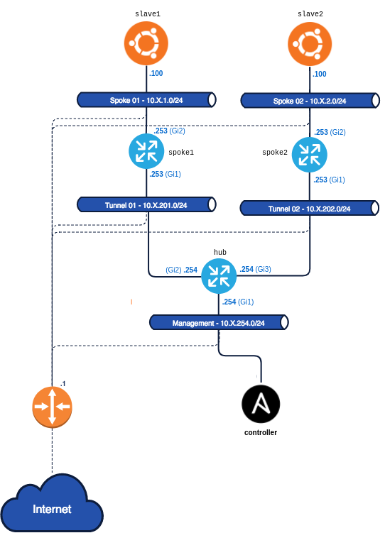

## Networking con Ansible

Como mencionamos antes, Ansible puede utilizarse para configurar más que servidores. En esta sección nos concentraremos en la configuración de equipos de red, específicamente, trabajando con routers Cisco. Sin embargo, todo lo que veamos puede trasladarse a equipos de otras marcas.

:point_right: Dentro de la lista de módulos que tiene Ansible para interactuar con otros sistemas, existe una categoría exclusiva para networking, que puede ver [aquí](https://docs.ansible.com/ansible/2.9/modules/list_of_network_modules.html).

La lista es extensa y contiene módulos para la mayoría de los vendors más importantes del mercado. Sin embargo, es posible que algún módulo en particular no exista. En este caso podemos desarrollar nostros nuestro propio módulo, y si queremos, ofrecerlo luego al resto de la comunidad. Esta es una de las ventajas que tiene el software de código abierto.

Nosotros nos concentraremos en los módulos para [Cisco IOS](https://www.cisco.com/c/en/us/products/ios-nx-os-software/index.html), que puede encontrar [aquí](https://docs.ansible.com/ansible/2.9/modules/list_of_network_modules.html#ios).


### Ambiente de Laboratorio de Networking
Para los laboratorios de esta parte del curso, utilizaremos los siguientes equipos:


Cada Pod cuenta con 3 routers configurados Hub & Spoke. El `hub` se encuentra en la red de `management` y es el único que puede ser accedido directamente a través de Internet. Aunque recomendamos conectarse al mismo desde nuestro equipo `controller`, que utilizamos para Ansible. Los dos equipos `spoke` se encuentran en redes privadas, y conseguiremos acceder a ellos a medida que avanzamos con el laboratorio. 

:point_right: La idea de esta parte del curso es realizar las configuraciones de los routers a través de `Ansible`, y no con la `cli` conectado a la consola. Sin embargo, puede resultar útil conectarse a la consola para ver como se aplican los cambios, verificar configuraciones, etc.

Para **conectarnos al router `hub` recomendamos hacerlo desde el equipo `controller`**, ya sea por nombre `hub-X.labs.conatest.click` o por IP `10.X.254.254`, dado que ya tenemos preconfigurado el ambiente para que la conexión sea sencilla:
```bash
$ ssh hub-X.labs.conatest.click

ip-10-X-254-254#
```

Al conectarse al router queda parado en la consola de configuración en modo `EXEC`. Podemos verificar que nos encontramos en un router CISCO utilizando el comando `show version`:

```
ip-10-1-254-254# show version
Cisco IOS XE Software, Version 16.12.06
Cisco IOS Software [Gibraltar], Virtual XE Software (X86_64_LINUX_IOSD-UNIVERSALK9-M), Version 16.12.6, RELEASE SOFTWARE (fc3)
Technical Support: http://www.cisco.com/techsupport
Copyright (c) 1986-2021 by Cisco Systems, Inc.
Compiled Sun 05-Sep-21 00:37 by mcpre

(...)
```

Si queremos **conectarnos al router `hub` directamente por internet**, debemos hacer:
```bash
$ ssh -i devops101-labs.pem -o KexAlgorithms=diffie-hellman-group-exchange-sha1 ec2-user@hub-X.labs.conatest.click
```
> OBS: Si al intentar conectarnos nos tira para afuera sin nungún mensaje, puede deberse a que el router busca el certificado ssh en el primer lugar de la lista de hosts conocidos de nuestra máquina, la cuál puede ver con: `ssh-add -l`. Si este es el caso, intente agregar el certificado a la lista de host conocidos mediante `ssh-add devops101-lab.pem` y vuelva a probar. Si el problema persiste, recomendamos conectarse desde el equipo `controller` que ya se encuentra preconfigurado para facilitar la conexión.


Para poder **establecer la conexión a los routers a través de Ansible** tenemos que realizar algunos pasos previos, los cuales haremos en el siguiente **Demo Lab**.

>OBS: si lo prefiere, en lugar de modificar los archivos que venimos utilizando de los labs anteriores, puede crear un nuevo directorio para comenzar desde cero, y trabajar en el mismo creando un nuevo archivo de inventario, nuevos directorios según sean requeridos, etc. También puede reinicial el ambiente desde cero, borrando su contenido, como vimos [aqui](https://github.com/conapps/Devops-101/blob/master/Ansible-101/01_ansible.md#demo-lab-1---lanzar-el-laboratorio).


### Demo Lab #3 - Configurar el ambiente requerido para Ansible

Lo primero que debemos hacer es agregar nuestros equipos de Networking al inventario.

```yaml
# ./inventory/hosts.yml
all:
  children:
    routers:
      hosts:
        10.X.254.254:
```

La mayoría de los equipos de red no cuentan con una interfaz programática para interactuar con ellos. En general, solamente podemos configurarlos a través de una consola. Además, tampoco permiten correr scripts de python a través de ssh, que es lo que realizamos con Ansible en los ejemplos anteriores. Por lo tanto, tenemos que indicarle a Ansible como debe interactuar con estos equipos. Comenzaremos por configurar algunas variables a aplicar a todos los dispositivos `routers` del inventario:

```yaml
# ./inventory/hosts.yml
all:
  children:
    routers:
      vars:
        # Nombre de usuario
        ansible_user: ec2-user
        # Llave privada a utilizar
        ansible_ssh_private_key_file: ~/.ssh/devops101-labs.pem
        # Sistema operativo a utilizar
        ansible_network_os: ios
        # Permitir elevación de permisos
        ansible_become: yes
        # Comando a utilizar para elevar permisos
        ansible_become_method: enable
        # Tipo de conexión
        ansible_connection: network_cli
      hosts:
        10.X.254.254:
```

Además, en el `ansible.cfg` del proyecto, configuramos las siguientes opciones:

```yml
# ./ansible.cfg
[defaults]
inventory = ./inventory/hosts.yml      
#vault_password_file = /root/secret/vault-password   # estaba de antes, podemos comentarla por ahora
host_key_checking = False
retry_files_enabled = False
```

Para verificar que este todo funcionando correctamente, hacemos un `ansible ping` a grupo `routers`, siempre trabajando desde el `controller`:

```
# ansible routers -m ping
10.1.254.254 | SUCCESS => {
    "changed": false,
    "ping": "pong"
}
```

Ahora que sabemos que la conectividad funciona, agreguemos los routers `spoke` al inventario, separándolos en dos grupos `hub` y `spokes`. En caso que estemos usando el mismo inventario que habíamos definido antes, movamos los servidores linux a otro grupo `servers` con sus propias variables definidas dentro.

```yaml
all:
  children:
    routers:
      vars:
        ansible_user: ec2-user
        ansible_ssh_private_key_file: ~/.ssh/devops101-labs.pem
        ansible_network_os: ios
        ansible_become: yes
        ansible_become_method: enable
        ansible_connection: network_cli
      children:
        hub:
          hosts:
            10.1.254.254:
        spokes:
          hosts:
            10.1.201.253:
            10.1.202.253:
    servers:
      vars:
        ansible_ssh_common_args: '-o StrictHostKeyChecking=no'
        ansible_ssh_private_key_file: '~/ansible/master_key'
      hosts:
        host01:
        host02:
        host03:
      children:
        app:
          vars:
            application_name: prod_app
          hosts:
            host01:
            host02:
        db:
          hosts:
            host03:
```
---

### `ios_config`

Uno de los módulos más comunes para utilizar con equipos `ios` es `ios_config`, cuya documentación encontramos [aquí](https://docs.ansible.com/ansible/latest/modules/ios_config_module.html).

El primer `playbook` que vamos a crear permitira almacenar un respaldo de las configuraciones de los `routers` en el directorio indicado:

```yaml
# ---
# routers-backup-config.yml
#
# Crea un respaldo de las configuraciones de los equipos IOS
# ---
- name: Respaldo de configuraciones IOS
  hosts: routers
  connection: local
  gather_facts: no
  tasks:
    - name: Comandos para respaldar las configuraciones
      ios_config:
        backup: yes
        backup_options:
          dir_path: ./respaldo-routers
```
Pruebe de correr el `playbook` y verificar que se realizó el respaldo.

---

### Ejercicio #8

Cree un `playbook` que le permita modificar el `hostname` de los `routers`, solo en el caso de que la variable `hostname` este definida para cada host.

<details>
    <summary>Pista #1</summary>
    El módulo <code>ios_config</code> permite ejecutar lineas de configuración definidas en la opción <code>lines</code>. Revise la documentación del módulo y los ejemplos allí incluidos.
</details>

<details>
    <summary>Pista #2</summary>
    El comando para cambiar el <code>hostname</code> en <code>ios</code> es: <code>hostname nombre_del_host</code>
</details>

<details>
    <summary>Pista #3</summary>
    Recuerde utilizar la opción <code>when</code> dentro de una <code>task</code> para ejecutarla sólo cuando se cumpla determinada condición. La condición deberá evaluar si la variable <code>hostname</code> existe.
</details>

<details>
    <summary>Pista #4</summary>
    Recuerde definir la variable <code>hostname</code> con el nombre que quiere asignarle al <code>router</code>. Pero pruebe definirla solo para el <code>hub</code>, de esta forma el playbook debería hacer el cambio solo en ese equipo y no en los <code>spokes</code>. Recuerde que hay varios lugares donde puede definir dicha variable.
</details>

<details>
    <summary>Verificación</summary>
    Conectese al <code>hub</code> y verifique que el <code>prompt</code> se modificó con el valor establecido.
<pre class="language-yaml" lang="yaml">
(controller) # ssh hub-X.labs.conatest.click
hub-X#
</pre>
</details>

<details>
    <summary>Solución</summary>
<pre class="language-yaml" lang="yaml">
# ./inventory/group_vars/hub.yml
hostname: hub-X
</pre>

<pre class="language-yaml" lang="yaml">
# routers-update-hostnames.yml
#
# Modifica el hostname de los routers de acuerdo al valor definido
# en la variable `hostname`, solo si la misma se encuentra definida.
# ---

- name: Ejercicio 8 - Modificar hostname de los routers
  hosts: routers
  connection: local
  gather_facts: no
  tasks:
    - name: Modificar el hostname
      ios_config:
        lines: 'hostname {{hostname}}'
      when: hostname is defined
</pre>

</details>

---

## Auditoría de configuraciones
Una de las tareas que se realizan comúnmente a nivel de red es auditar las configuraciones de los dispositivos, de forma de garantizar de que todos ellos están configurados de la misma manera, o que cumplen con los estándares de la organización. El módulo `ios_config` cuenta con algunas opciones para realizar esta tarea.

A través de la opción `diff_against` podemos indicarle al módulo `ios_config` contra que configuración buscar las diferencias. El comando acepta tres opciones:

- `running`: el sistema retornará la configuración antes y después de realizarle cambios.
- `startup`: si se corre el `playbook` bajo el flag `—diff` retornará la diferencia entre la `startup` config y la `running` config.
- `intended`: verificará las diferencias entre la `running` config y aquella que se indique en la opción `intended_config`.


> OBS: el flag `—diff` le indica a Ansible, en terminos generales, que nos indique que acciones se ejecutarían en caso de correr el `playbook` sin este flag.

Por ejemplo, si corremos el siguiente `playbook` veremos las diferencias entre la configuración de `startup` del router y el cambio que realizamos al `hostname`.
:warning: Debe correrlo con la opción `--diff`.

```yaml
# ---
# routers-running-vs-startup-config.yml
#
# Muestra las diferencias entre la running y startup config.
# Obs: Este playbook debe ser ejecutado con el flag `--diff`.
# ---

- name: Running vs. Startup configuration diff (simple)
  hosts: hub
  connection: local
  gather_facts: no
  tasks:
    - name: Comando para hallar las diferencias
      ios_config:
        diff_against: startup
```

Para la salida del router `hub` deberíamos ver algo similar a:
```
# ansible-playbook --diff routers-running-vs-startup-config.yml

PLAY [Running vs. Startup configuration diff (simple)] *****************************************************************************************

TASK [Comando para hallar las diferencias] *****************************************************************************************************
--- before
+++ after
@@ -2,10 +2,11 @@
 service timestamps debug datetime msec
 service timestamps log datetime msec
 service password-encryption
+service call-home
 platform qfp utilization monitor load 80
 platform punt-keepalive disable-kernel-core
 platform console virtual
-hostname ip-10-1-254-254
+hostname hub-1
(...)
(...)
```
---

## Cambios masivos
Como ya vimos, es sencillo realizar configuraciones en múltiples equipos utilizando Ansible.

Los routers ya están configurados para poder comunicarse entre sí. Sin embargo, no podemos llegar a las redes `10.X.1.0/24` y `10.X.2.0/24` por que las interfaces de los routers dentro de estas redes no están configuradas. Vamos a ver como podemos realizar estas configuraciones de forma masiva, utilizando Ansible.

_OBS: La `X` corresponde al número de su POD._

Los routers ya están configurados para poder comunicarse entre sí. Sin embargo, no podemos llegar a las redes `10.X.1.0/24` y `10.X.2.0/24` por que las interfaces de los routers dentro de estas redes no están configuradas. Vamos a ver como podemos realizar estas configuraciones de forma masiva, utilizando Ansible.

Primero, veamos como se vería un `playbook` para configurar una interfaz **solo** en el router **hub**.

```yaml
# ---
# configure_interface_on_spoke_01.yml
#
# Configura la interface GigabitEthernet2 del router Spoke01
# ...
- name: Configuracion de interface GigabitEthernet2
  hosts: hub
  connection: local
  gather_facts: no
  tasks:
    - ios_config:
        lines:
          - description "Conexión con Red Spoke #1"
          - ip address 10.X.201.254 255.255.255.0
          - no shutdown
        parents: interface GigabitEthernet2
```

_OBS: Note como le indicamos al módulo `ios_config` cual es el `parent` sobre el cual debemos realizar los comandos._

Básicamente, escribe las líneas que le indicamos en el router, en la ubicación indicada. Esta claro que con este `playbook` no podríamos realizar cambios en múltiples equipos. Para poder generalizarlo tenemos que crear primero un `role`. 

---

### Ejercicio #8

Cree un nuevo rol llamado `configure_interfaces` que configure una interfaz de un router consumiendo una lista de objetos llamada `interfaces` con las siguientes llaves:

- `interface`
- `ip_address`
- `net mask`
- `description`

El rol luego será llamado a través del siguiente `playbook`

```yaml
# ---
# configure_interfaces_with_role.yml
#
# Configura interfaces utilizando un rol
# 
# OBS:
#   Dentro del inventario, se configurará una variable llamada
#    `interfaces` con una lista de interfaces. Por ejemplo:
#   interfaces:
#     - interface: GigabitEthernet2
#       ip_address: '10.X.201.254'
#       netmask: '255.255.255.0'
#       description: Configurado desde el nuevo rol
# ...
- name: Configuración de interface
  hosts: hub
  connection: local
  gather_facts: no
  roles:
    - role: ../roles/configure_interfaces
```

<details>
    <summary>Pista #1</summary>
    Recuerde la estructura de carpetas que necesita un rol<pre>
roles
\ tasks
  \ main.yml
\ defaults
  \ main.yml
\ files
\ ...
    </pre>
</details>

<details>
    <summary>Pista #2</summary>
    Recuerde la estructura de carpetas que debe tener un <code>role</code> dentro del directorio <code>roles</code>.
    <pre>
    \configure_interfaces
      \tasks
        main.yml
      \defaults
      	main.yml
      ...
    </pre>
</details>

<details>	
    <summary>Solución</summary>
    <pre>
# ---
# ./roles/configure_interfaces/tasks/main.yml
#
# Tareas para configurar la interfaz de un equipo.
# ---
- name: Configuración de interfaces
  loop: '{{ interfaces }}'
  ios_config:
    lines:
      - 'description {{ item.description }}'
      - 'ip address {{ item.ip_address }} {{ item.netmask }}'
      - no shutdown
    parents: 'interface {{ item.interface }}'
</details>

---

Ahora que tenemos el rol, podemos configurar estas opciones dentro del archivo de inventario. Carguemos esta información en nuestro inventario.

```yaml
---
all:
  children:
    routers:
      vars:
        ansible_user: ec2-user
        ansible_network_os: ios
        ansible_become: yes
        ansible_become_method: enable
        ansible_connection: network_cli
      children:
        hub:
          hosts:
            10.X.254.254:
              hostname: hub
              interfaces:
                - interface: GigabitEthernet1
                  ip_address: 10.X.254.254
                  netmask: 255.255.255.0
                  description: Conexion con red Hub
                - interface: GigabitEthernet2
                  ip_address: 10.X.201.254
                  netmask: 255.255.255.0
                  description: Conexión con red de tránsito 1
                - interface: GigabitEthernet3
                  ip_address: 10.X.202.254
                  netmask: 255.255.255.0
                  description: Conexión con red de tránsito 2
        spokes:
          hosts:
            10.X.201.253:
              hostname: spoke01
              interfaces:
                - interface: GigabitEthernet1
                  ip_address: 10.X.201.253
                  netmask: 255.255.255.0
                  description: Conexión con red de tránsito 1
                - interface: GigabitEthernet2
                  ip_address: 10.X.1.254
                  netmask: 255.255.255.0
                  description: Conexión con red Spoke 1
            10.X.202.253:
              hostname: spoke02
              interfaces:
                - interface: GigabitEthernet1
                  ip_address: 10.X.202.253
                  netmask: 255.255.255.0
                  description: Conexión con red de tránsito 2
                - interface: GigabitEthernet2
                  ip_address: 10.X.2.254
                  netmask: 255.255.255.0
                  description: Conexión con red Spoke 2
    servers:
      children:
        master:
          hosts:
            10.X.254.100:
        slaves:
          hosts:
            10.X.1.100:
            10.X.2.100:
      vars:
        ansible_user: ubuntu
        ansible_python_interpreter: /usr/bin/python3
  vars:
    ansible_ssh_private_key_file: ~/.ssh/ansible101-podX-key.pem


```

---

### `ios_user`

Como vimos anteriormente existen múltiples módulos adicionales para configurar equipos de red. Los mismos exponentes distintas opciones para interactuar con los los equipos. Por ejemplo, el módulo `ios_user` permite crear usuarios en dispositivos con sistema operativo `ios` de forma más sencilla que tirando los comandos individuales utilizando el comando  `ios_user`.

La documentación de este módulo se encuentra en la siguiente dirección:

```
https://docs.ansible.com/ansible/devel/modules/ios_user_module.html#ios-user-module
```

---

### Ejercicio #9

Construya un `playbook` que le permita crear un usuario en todos los routers con las siguientes credenciales:

- User: conatel
- Pass: conatel
- Privilege: 15

<details>
    <summary>Solución</summary>
      <pre class="language-yaml" lang="yaml">
# ---
# create_user.yml
#
# Crea un usuario conatel/conatel en todos los routers
# ---
- name: Modificar el hostname
  hosts: routers
  connection: local
  gather_facts: no
  tasks:
    - name: Create the conatel user
      ios_user:
        configured_password: conatel
        name: conatel
        privilege: 15
        state: present
        update_password: always
    </pre>
</details>

---


