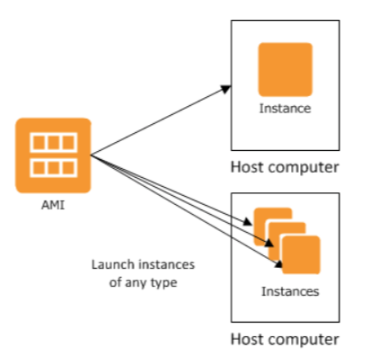
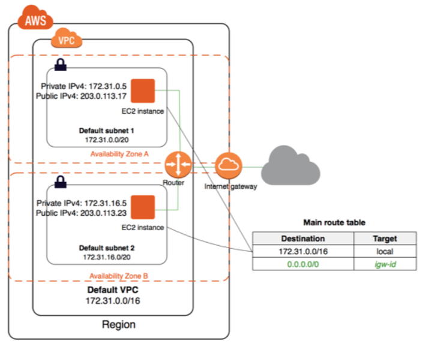
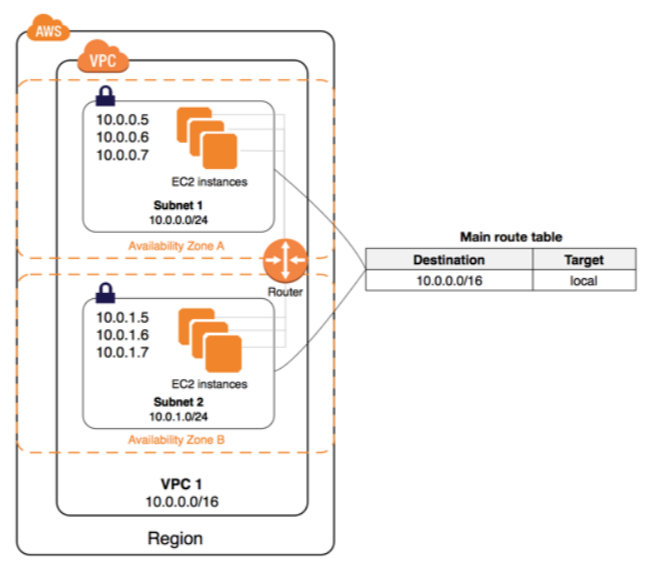
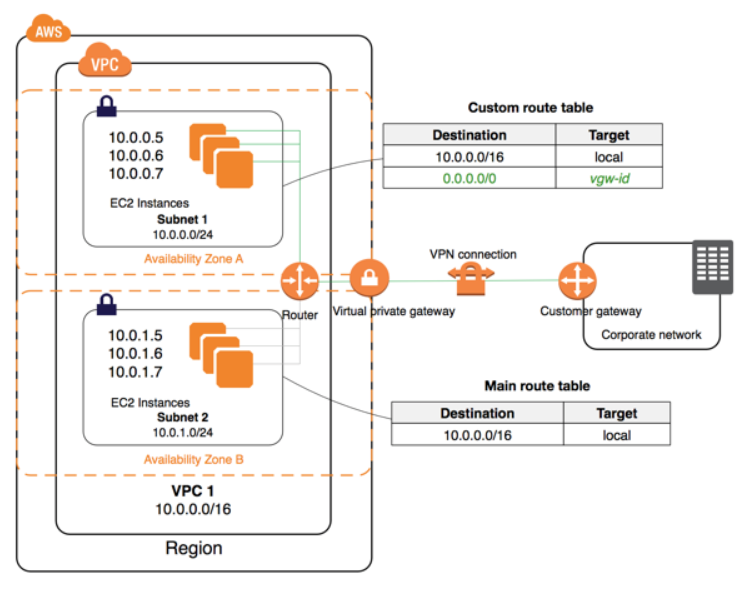
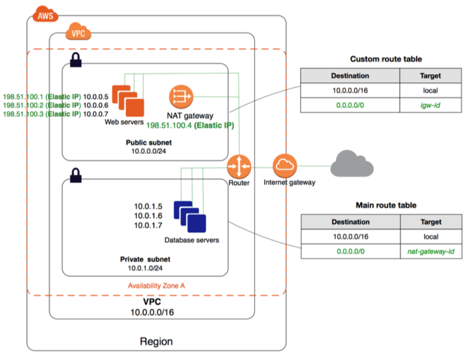

## AWS EC2

EC2 o "Elastic Compute Cloud" es el servicio de AWS que permite la creación de maquinas virtuales Linux o Windows. Desde el mismo también se configuran las opciones de seguridad, networking, y almacenamiento de todas las maquinas virtuales levantadas. Es uno de los servicios más antiguos de la plataforma, y uno de los más potentes. Muchos otros servicios de AWS utilizan este servicio por debajo.

---

### 💻 DEMO #1 ~ Levantar una instancia de Amazon Linux 2 en la nube

#### Procedimiento

1. Acceder al dashboard de EC2.
2. Hacer click en `Launch Instance`.
3. Seleccionar la AMI `Amazon Linux 2 AMI (HVM)`.
4. Seleccionar el tipo de instancia `t2.micro` (seleccionada por defecto).
5. Hacer click en `Review and Launch`.
6. Hacer click en `Launch`.
7. 🚨 Seleccionar la opción `Create a new key pair`.
8. 🚨 Escribir el nombre de la nueva llave.
9. 🚨 Hacer click en `Download Key Pair`.
10. 🚨 Hacer click en `Launch Instances`.
11. Hacer click en `View Instances`.

#### FAQ

**¿Que es una AMI?**

Es un `template` que contiene una configuración de software: un sistema operativo, más aplicaciones, más configuración.

**¿Que es una instancia?**

Una copia de una `AMI` que se encuentra ejecutando como una maquina virtual en la nube.

**¿A que se refiere por el tipo de instancia?**

AWS permite crear instancias con distinto hardware (CPU, RAM, GPU, ancho de banda, etc). Dependiendo del rol que deba cumplir la instancia, es el timpo que tenemos que seleccionar.

---



Por defecto, AWS nos provee una gran lista de `AMI` basicas que podemos usar para levantar nuestras maquinas virtuales. Las mismas cuentan con distintos distros de Linux o versiones de Windows, con determinado software pre-instalado.

También existe un `Marketplace` en donde terceros públican sus propias `AMI` configuradas con determinadas aplicaciones. Es importante tener presente que algunas de estas `AMI` pueden incurrir costos adicionales por el uso de licencias. Vendors como `CISCO` publican ahí sus productos para que sean utilizados dentro de la nube de AWS.

Además de seleccionar la instancia, debemos seleccionar que "tipo" de instancia queremos utilizar. Esto es, que configuración de hardware necesitamos asignarle a esta instancia para que cumpla con nuestros propositos. AWS nos ofrece una gran variedad de familias de tipos de instancias, pensadas para un proposito en particular. Por ejemplo, la familia `c` corresponde a maquina pensadas para tareas de computo intensivas, mientras que las familias `t` y `m` son para tareas generales.

Para poder acceder a nuestra instancia tenemos que indicarle a AWS que llave SSH queremos utilizar. Este es el metodo que AWS nos brinda para conectarnos a nuestras instancias. Es nuestra responsabilidad mantener de forma segura las llaves privadas necesarias para acceder a las instancias. Si no contamos con una llave privada al momento de levantar la instancia, AWS nos da la opción de crear una. El resultado será la generación de una llave privada que se descargara en nuestra maquina. AWS indica que no almacena de ninguna manera esta llave, por lo que si la perdemos no tenemos forma de recuperarla. En el caso de que queramos subir una llave privada existente, existen mecanismos para utilizarla.

---

### 💻 DEMO #2 ~ Conexión SSH a nueva instancia

#### 🚨 Atención 🚨
Para poder utilizar la llave privada descargada desde Putty en Windows, es necesario convertirla. El procedimiento para realizarlo se encuentra en [el siguiente link](https://aws.amazon.com/premiumsupport/knowledge-center/convert-pem-file-into-ppk/).

Para poder utilizar la llave privada descargada con `ssh` es necesario modificarle sus permisos para que solo pueda ser leída por el usuario.

```bash
chmod 400 <llave_privada>.pem
```

#### Procedimiento

1. Obtenemos la `IP` pública asignada a nuestra recién creada instancia.
2. Utilizando `ssh` desde la consola o `Putty` nos conectamos a la instancia.

#### FAQ

**¿Que usuario utilizo para la conexión?**

Cada `AMI` tiene configurado un usuario distinto por defecto. Para el caso de `Amazon Linux 2` el usuario es `ec2_user`. Sin embargo, para la `AMI` de Ubuntu el usuario es `ubuntu`.

---

Si investigamos los detalles de la instancia creada vamos a ver que la misma tiene asociada una gran cantidad de recursos adicionales. En las siguiente secciones explicaremos algunos de ellos, y como su configuración afecta el comportamiento de la instancia.

---

### 💻 DEMO #3 ~ Terminar una instancia

#### Procedimiento

1. Seleccionamos la instancia que queremos elminar.
2. Vamos a `Actions > Instance State > Terminate`.
3. Hacemos click en `Yes, Terminante`.

#### FAQ

**¿Existe alguna forma de proteger la terminación de una instancia?**

Si. Se puede proteger mediante funcionalidades de EC2, o mediante una asignación apropiada de permisos de usuario.

**¿Que pasa con los datos almacenados en la instancia?**

Por defecto, los volumenes cargados a la instancia son eliminados a menos que se haya determinado lo contrario al momento de configurarlos. A continuación hablaremos un poco más sobre los volumenes de las instancias.

---

## AWS VPC

VPC o "Virtual Private Cloud" es el servicio de AWS que permite lanzar redes virtuales en donde se ejecutarán nuestros servicios. Estas redes virtuales se comportan de forma similar a las redes tradicionales, con algunas escepciones que es importante tener en cuenta.

Cada VPC esta aislada de las demás. Ya sea dentro de la misma cuenta, o de otra. Dentro de la VPC se configurarán otros recursos necesarios para garantizar el comportamiento deseado de la red. Por defecto, todas las cuenta de AWS cuentan con un VPC por defecto creado en todas las regiones. Si no especificamos el VPC al momento de lanzar un servicio, el mismo será levantado en este VPC por defecto.



Los VPC tienen asociado un bloque de IPs, usualmente un `/16`, subdividio en múltiples `subnets` configurados con una subred dentro de este rango. Es sobre las `subnets` que se levantan los servicios.

Cada `subnet` puede ser pública o privada. Por defecto, todas las subredes creadas dentro del VPC por defecto son públicas. Se considera a una `subnet` como pública cuando cuenta con un `Internet Gateway` asociado a la `subnet`. Un `IG` es un recurso dentro del VPC que permite la conexión de las instancias de la `subnet` con Internet. Las instancias levantadas en una `subnet` públicas contarán con una `IP` privada dentro del rango asignado, y una `IP` pública.



Las instancias levantadas dentro de una `subnet` privada no serán creadas con una `IP` pública, por lo tanto, no podrán llegar a Internet. Si necesitamos que estas instancias salgan a Internet, tenemos que agregar una ruta por defecto a su `route table` apuntando a su `IG`, y asignandole una `Elastic IP`.

Una `Elastic IP` corresponde a una `IP` pública que puede asignarse a cualquier instancia, sin importar en que región se encuentre. Es usualmente utilizada para mantener la rutas vivas en caso de una caída de una zona de disponibilidad, dado que puede ser trasladada facilmente a otra instancia en otra zona de disponibilidad.

Por otro lado, una `route table` es otro elemento de los `VPC` que funciona como el default gateway de todas las instancias levantadas dentro de una `subnet`. Cada `subnet` puede estar asociada a una `route table` diferente.

Otra forma de conectar una instancia dentro de una `subnet` privada a Internet es mediante un `NAT Gateway`. Este recurso permite a las instancias la salida a Internet, pero no permite pasar conexiones desde Internet.

Además de estos recursos de conectividad, existen dos recursos más para garantizar la seguridad de red de las instancias:

- `Network Access Control Lists`.
- `Security Groups`.

Todas las instancias se ven afectados por ambos recursos, con la diferencia de donde se aplican. Las `Network ACLs` se aplican a nivel de `subnet` mientras que los `Security Group` se aplican a nivel de instancia.

---

### 💻 DEMO #4 ~ Crear un nuevo VPC

#### Procedimiento

1. Ir al Dashboard de VPC.
2. Hacer click en `Your VPCs`.
3. Hacer click en `Create VPC`.
4. Asignarle un nombre, una subred `/16`, y dejar las demás opciones como están.
5. Hacer click en `Create`.
6. Hacer click en `Close`.

#### FAQ

**¿Crear un nuevo VPC eliminara la VPC por defecto?**

No. La VPC por defecto no se eliminará por la creación de otras VPC.

**¿Que otros recursos se crean junto con la VPC?**

Al crear una nueva `VPC` se crean los siguiente recursos asociados:

- `DHCP options set`: Permite configur opciones `DHCP` que consumirán las instancias.
- `Main Route table`: Tabla de rutas por defecto al que se le asociarán todas las `subnets` de la `VPC`.
- `Network ACL`: Lista de control de acceso a aplicar a todas las `subnets` de la `VPC`.
  
---

No podemos todavía utilizar la VPC porque no creamos ninguna `subnet` dentro de la misma.

---

### 💻 DEMO #5 ~ Crear subnets

#### Procedimiento

1. Ir al Dashboard de VPC.
2. Hacer click en `Subnets`.

En total crearemos dos nuevas `subnets`. Para eso repetiremos las siguientes instrucciones dos veces, teniendo precaución en aquellos pasos que requieran de una configuración distinta en cada iteración.

1. Hacer click en `Create subnet`.
2. Asignarle un nombre, la VPC recién creada, una zona de disponibilidad, y una subred. **🚨 Seleccionar un nombre, una zona de disponibilidad y una subred distinta en cada iteración. 🚨**
3. Hacer click en `Create`.
4. Hacer click en `Close`.

#### FAQ

**¿Tengo que conectar la `subnet` con una `route table`?**

No. La nueva `subnet` quedará asociada a la `route table` por defecto creada junto con la `VPC`.

**¿Tengo que configurar una `Network ACL` para esta `subnet`?**

No es necesario. Las `subnets` son conectadas a la `Network ACL` por defecto creada junto con la `VPC`.
  
---

Con la configuración que tenemos ahora dentro de nuestro `VPC` las instancias que creemos no podrán acceder a Internet, y nosotros no podremos acceder a ellas a través de Internet. Este comportamiento es deseado cuando yo tengo una conexión VPN desde mi red privada local contra AWS. 



Este tipo de conexión requiere de la configuración de otro recurso de los VPC llamado `Virtual Private Gateway` que permite establecer VPN site-to-site. Para poder llegar desde nuestras instancias a nuestra red privada a través de la VPN tendremos que configurar la `route table` con las rutas correspondientes.

Para poder conectarnos con nuestras instancias vamos a:

1. Crear un `Internet Gateway` en alguna de nuestras redes para transformarla de una `subnet` privada a una `subnet` pública.
2. Compartir la llave privada dentro de una instancia levantada en la `subnet` pública, para poder acceder por `SSH` a aquellas instancias dentro de la `subnet` privada que nos queda.

---

### 💻 DEMO #6 ~ Crear Internet Gateway

#### Procedimiento

1. Ir al Dashboard de VPC.
2. Hacer click en `Internet Gateways`.
3. Hacer click en `Create Internet Gateway`.
4. Asignarle un nombre.
5. Hacer click en `Create`.
6. Hacer click en `Close`.
7. Seleccionar el nuevo `Internet Gateway`. 🚨 Verificar que sea aquel cuyo `State` se encuentre en `detached`.
8. Hacer click en `Actions > Attach to VPC`.
9. Seleccionar el `VPC` creado previamente de la lista.
10. Hacer click en `Attach`.
11. Hacer click en `Route Tables`.
12. Hacer click en `Create route table`.
13. Asignarle un nombre, y seleccionar el `VPC` recien creado en la lista.
14. Hacer click en `Create`.
15. Hacer click en `Close`.
16. Seleccionar la `route table` recien creada.
17. Hacer click en la pestaña `Subnet Associations`.
18. Hacer click en `Edit subnet associations`.
19. Seleccionar una de las dos redes.
20. Hacer click en `Save`.
21. Hacer click en la pestaña `Routes`.
22. Hacer click en `Edit routes`.
23. Hacer click en `Add route`.
24. Crear una ruta por defecto apuntando al `IG` previamente creado.
25. Hacer click en `Save routes`.

#### FAQ

**¿Que paso si solamente creo el `IG` y no lo asigno al `VPC`?**

Nada. El `IG` quedara en desuso hasta que se lo vincule con algún `VPC`.

**¿Es suficiente solo con vincular el `IG` al `VPC`?**

No. Vincular el `IG` al `VPC` no hace más que disponibilizarlo para su uso en otras configuraciones pero no lo activa.

**¿Que pasa si no creo una nueva `route table` y aplico las configuraciones mencionadas en la `route table` por defecto?**

Si no creamos una nueva `route table` ambas `subnets` quedarán configuradas como `subnets` públicas, ya que por defecto ambas están asignadas a la `route table` por defecto. La creación de la nueva `route table` y las configuraciones sobre la misma es lo que nos permite diferenciar el comportamiento de cada `subnet`.

**¿Tener múltiples `route tables` no hace que las instancias en distintas `subnets` pierdan conexión?**

No porque todas las `route tables` que estamos utilizando cuentan con una ruta que indica como llegar a otras `subnets` por defecto. Mientras no eliminemos esta ruta no hay problema.
  
---

Ahora que tenemos una `subnet` privada y una `pública` vamos a levantar una instancia dentro de cada una de ellas para probar su funcionamiento.

---

### 💻 DEMO #7 ~ Levantar instancias en `subnets` privadas y públicas

#### Procedimiento

1. Ir al Dashboard de EC2.
2. Hacer click en `Instances`.
3. Hacer click en `Launch Instance`.
4. Seleccionar la `AMI` "Amazon Linux 2 AMI (HVM)".
5. Seleccionar el tipo de `AMI` `t2.micro` (seleccionado por defecto).
6. Hacer click en `Next: Configure Instance Details`.
7. Modificar las siguientes opciones.
   1. `Network`: Seleccionar el `VPC` previamente creado.
   2. `Subnet`: Seleccionar la `subnet` pública.
   3. `Auto-assign Public IP`: Seleccionar `Enable`.
8. Hacer click en `Review and Launch`.
9. Hacer click en `Launch`.
10. Seleccionar el par de llaves `SSH` previamente creado y seleccionar la opción que dice: "I acknowledge that I have access to the selected private key file (<el_nombre_de_su_llave>), and that without this file, I won't be able to log into my instance."
11. Hacer click en `Launch Instances`.
12. Hacer click en `View Instances`.

Luego repetimos el mismo procedimiento que el anterior pero seleccionamos la `subnet` privada en vez de la pública al llegar al paso `7.2`, y la opción `Disable` en `Auto-assign Public IP`.

#### FAQ

**¿Que paso si selecciono `Enable` en el paso `7.3` al levantar la instancia en la red privada?**

AWS le asignará a esa instancia una `IP` pública. Sin embargo, nunca nos podremos conectar a esta instancia porque no sabe como llegar a un `Internet Gateway`. Para poder hacer esto debería tener configurada una ruta en su `route table` que apuntara al `IG` asociado al `VPC` de la `subnet`.

**¿Que pasa si selecciono `Disable` en el paso `7.3` al levantar la instancia en la red pública?**

AWS no le asignará una `IP` pública a esta maquina por lo que no podrémos acceder a ella desde Internet. Además, desde esta instancia tampoco podrémos llegar a Internet mientras no tengamos una `IP` pública asignada.

**¿Como le asigno una `IP` pública a una instanca en una `subnet` pública si me olvide de asignarle una al momento de crearla?**

La única forma es asignandole una `Elastic IP`. Estas `IP` públicas se crean de forma independiente y se asignan manualmente a una instancia. Esta forma de víncular ambos recursos permite re-asignar de forma dínamica la `IP` a distintas instancias sin tener que modificar reglas de ruteo.

---

Finalmente obtendremos dos instancias una en cada `subnet`. Si veríficamos las direcciones `IP` de cada instancia veremos que ambas tienen una `IP` privada que corresponde a su `subnet` y la instancia que se encuentra en la `subnet` pública cuenta con una `IP` pública.

Ahora nos conectarémos a la instancia en la `subnet` pública para ver como podemos llegar de ahí a las instancias en la `subnet` privada.

---

### 💻 DEMO #8 ~ Conexión por SSH a ambas instancias

#### Procedimiento

1. Ir al Dashboard de EC2.
2. Hacer click en `Instances`.
3. Seleccionar la instancia de la `subnet` pública.
4. Identificar la dirección `IP` pública de dicha instancia.
5. Seleccionar la instancia de la `subnet` privada.
6. Identificar la dirección `IP` privada de dicha instancia
7. Iniciar una sesión `SSH` desde nuestra maquina local con la instancia en la `subnet` pública.
  ```
  ssh -i <llave_privada>.pem ec2-user@<ip_publica_de_la_instancia_publica>
  ```
6. Copiar la llave privada de nuestra maquina local a la instancia pública.
7. Iniciar una sesión `SSH` desde la instancia pública con la instancia en la `subnet` privada.
   ```
   ssh -i <llave_privada>.pem ec2-user@<ip_privada_de_la_instancia_privada>
   ```
 
#### FAQ

**¿Porque puedo conectarme por `SSH` desde la instancia pública hacia la privada pero no puedo hacer un `ping`?**

Porque la instancia privada esta protegida por un `Security Group` que es un recurso que limita los puertos por los cuales esta permitida la comunicación. Por defecto, AWS le asigna a las instancias un `Security Group` por defecto que solamente permite tráfico entrante por el puerto `22` desde cualquier `IP` (`0.0.0.0`).

---

Podemos comprobar que desde la instancia privada no tenemos acceso a Internet utilizando `curl` o `ping`.

```
[ec2-user@ip-10-0-0-218 ~]$ curl www.google.com
curl: (7) Failed to connect to www.google.com port 80: Connection timed out

[ec2-user@ip-10-0-1-245 ~]$ ping 8.8.8.8
PING 8.8.8.8 (8.8.8.8) 56(84) bytes of data.
--- 8.8.8.8 ping statistics ---
380 packets transmitted, 0 received, 100% packet loss, time 388098ms
```

Para que estas instancias puedan acceder a Internet tenemos que configurar un `NAT Gateway` dentro de nuestro `VPC` y agregar una ruta por defecto hacia el `NAT Gateway` de la `route table` vinculada a la  `subnet` privada.

---

### 💻 DEMO #9 ~ Creación de un NAT Gateway

#### Procedimiento

1. Ir al Dashboard de VPC.
2. Hacer click en `NAT Gateways`.
3. Hacer click en `Create NAT Gateway`.
4. Seleccionar la `subnet` pública.
5. Hacer click en `Create New EIP`.
6. Hacer click en `Create a NAT Gateway`.
7. Hacer click en `Edit route tables`.
8. Seleccionar la `route table` por defecto de nuestro `VPC`, en donde esta asignada la `subnet` privada.
9. Seleccionar la pestaña `Routes`.
10. Hacer click en `Edit routes`.
11. Hacer click en `Add route`.
12. Colocar `0.0.0.0/0` como `Destination` y seleccionar el `NAT Gateway` previamente creado.
13. Hacer click en `Save routes`.
14. Hacer click en `Close`.
 
#### FAQ

**¿Que pasa si selecciono la `subnet` privada en vez de la pública al momento de crear el `NAT Gateway`?**

El `NAT Gateway` no funcionara porque la `subnet` donde fue configurado no tiene forma de llegar hasta el `Internet Gateway`.

---



Si realizamos las mismas pruebas que antes desde la instancia privada podemos comprobar que contamos con acceso a Internet. Sin embargo, todavía no podemos hacer `ping` entre ambas instancias. Veamos como podemos solucionar esto.

---

### 💻 DEMO #10 ~ Configuración de un Security Group

#### Procedimiento

Para veríficar el funcinamiento de las proximas modificaciones es recomendable dejar corriendo un `ping` entre las instancias.

1. Ir al Dashboard de EC2.
2. Hacer click en `Instances`.
3. Seleccionar la instancia pública.
4. Hacer click en el `Security group` asignado a la instancia dentro de la pestaña `Description`.
5. Hacer click en la pestaña `Inbound`.
6. Hacer click en `Edit`.
7. Hacer click en `Add Rule`.
8. Seleccionar:
   1. `Type`: `Custom ICMP`.
   2. `Protocol`: `All`.
   3. `Source`: La subred asignada al `VPC`, p ej. `10.0.0.0/16`.
9. Hacer click en `Save`.
10. Si la configuración funciono correctamente el `ping` debería estar funcionando ahora.

---

Los `Security Groups` funcionan como firewalls virtuales sobre las instancias. Hasta 5 `Security Groups` se pueden asociar a una instancia en paralelo. La ventaja de estos recursos es que actuan sobre las instancias y no las `subnets`. De manera que cada instancia puede contar con reglas distintas de seguridad. 

Como medida adicional de seguridad, AWS provee `Network ACLs`, o `Network access control list`. Estas si actuan sobre todas las instancias de la `subnet` y por defecto están configuradas para permitir todo el tráfico saliente y entrante. 

Configuraremos una nueva `Network ACL` para permitir el acceso por `SSH` a las instancias de la `subnet` privada solamente de la instancia pública.

---

### 💻 DEMO #10 ~ Creación de una Network ACL

#### Procedimiento

1. Ir al Dashboard de VPC.
2. Hacer click en `Network ACLs`.
3. Hacer click en `Create network ACL`.
4. Asignar un nombew a la `Network ACL` y seleccionar el `VPC` sobre el que estamos trabajando.
5. Hacer click en `Create`.
6. Seleccionar la `Network ACL` recien creada.
7. Hacer click en la pestaña `Subnet associations`.
8. Hacer click en `Edit subnet associations`.
9. Seleccionar la `subnet` privada.
10. Hacer click en `Edit`.
11. Hacer click en `Inbound Rules`.
12. Hacer click en `Edit Inbound rules`.
13. Hacer click en `Add Rule`.
14. Configurar la nueva regla de la siguiente manera:
    1.  `Rule #`: `100`
    2.  `Type`: `Custom TCP Rule`.
    3.  `Protocol`: `TCP`.
    4.  `Port Range`: `22`.
    5.  `Source`: `<ip_de_la_instancia_pública>/32`.
    6.  `Allow/Deny`: `ALLOW`.
15. Hacer click en `Add Rule`.
16. Configurar la nueva regla de la siguiente manera:
    1.  `Rule #`: `200`
    2.  `Type`: `Custom TCP Rule`.
    3.  `Protocol`: `TCP`.
    4.  `Port Range`: `22`.
    5.  `Source`: `0.0.0.0/0`.
    6.  `Allow / Deny`: `DENY`.
17. Hacer click en `Add Rule`.
18. Configurar la nueva regla de la siguiente manera:
    1.  `Rule #`: `300`
    2.  `Type`: `ALL Traffic`.
    3.  `Protocol`: `ALL`.
    4.  `Port Range`: `ALL`.
    5.  `Source`: `0.0.0.0/0`.
    6.  `Allow / Deny`: `ALLOW`.
19. Hacer click en `Save`.
20. Hacer click en `Outbound Rules`.
21. Hacer click en `Edit outbound rules`.
22. Hacer click en `Add Rule`.
23. Configurar la nueva regla de la siguiente manera:
    1.  `Rule #`: `100`
    2.  `Type`: `ALL Traffic`.
    3.  `Protocol`: `ALL`.
    4.  `Port Range`: `ALL`.
    5.  `Source`: `0.0.0.0/0`.
    6.  `Allow / Deny`: `ALLOW`.
 
#### FAQ

**¿Que pasa si no configuro mi `Network ACL` despues de crearla?**

Por defecto las nuevas `Network ACL` tienen una regla al final para bloquear todo el tráfico entrante y saliente. Si no modificamos las reglas para permitir el tráfico deseado, nuestras instancias quedarán incomunicadas.

**¿En que orden se aplican las reglas?**

Las reglas se aplican en órden creciente. Inmediatamente que el tráfico corresponda a una regla, se dejarán de evaluar las siguiente. Por lo tanto, es recomendable que las reglas más específicas sean definidas primero.

---
