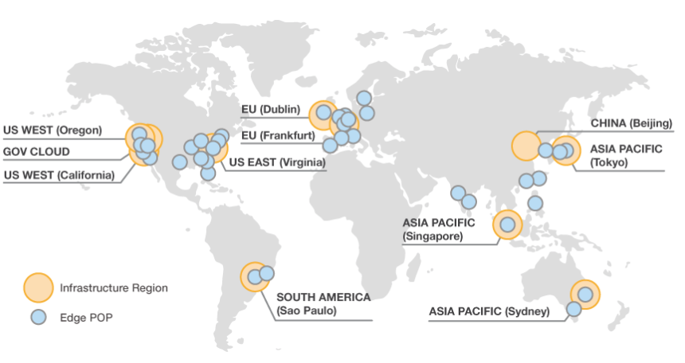
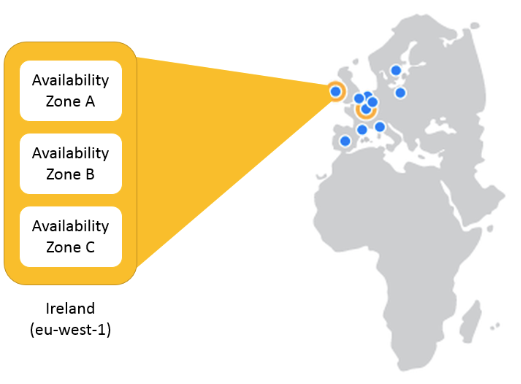
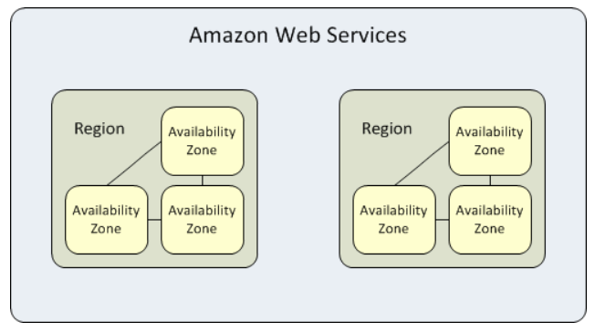
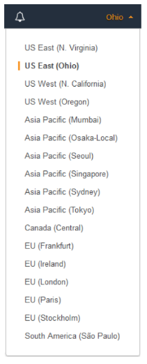

# Cloud 101 - AWS

## Regiones y Zonas de disponibilidad

Una región en AWS corresponde a una agrupación de zonas de dispnibilidad dentro de un área geografica en particular. Una zona de disponibilidad corresponde a una ubicación donde se encuantran los recursos que consumen los servicios de AWS. Dentro de una región, sus zonas de disponibilidad están conectadas por enlaces de baja latencia.

Las regiones de AWS están completamente aisladas unas de las otras. Recursos creados dentro de una región no estarán disponibles en otras. A su vez, no todas las regiones cuentan con los mismos servicios, ni con la misma cantidad de zonas de disponibilidad. La lista de precios de los servicios de AWS también varía de región en región.

Cada recurso que creemos dentro de AWS deberá estar asociado a una región, y en algunos casos, a alguna zona de disponibilidad. Cada región esta identificada por un string (`us-east-1`, `us-east-2`, `sa-east-1`, etc.). Estos string seguidos por un carácter `a`, `b`, `c`, `d`, `e`, etc. corresponden a una zona de disponibilidad. Por ejemplo, el string `us-east-1a` corresponde a la región `us-east-1` y zona de disponibilidad `a`. 

**OBS: AWS rota para cada cuenta la asignación de las zonas de disponibilidad con sus carácteres, en pos de balancear los servicios en cada zona. Esto es, la zona de disponibilidad `us-east-1a` puede tener asociada una ubicación distinta para cada cuenta.**

Lanzar nuestros servicios en múltiples zonas de disponibilidad garantiza que nuestra aplicación siga funcionando ante fallas del sistema. Usualmente los servicios `PaaS` y `SaaS` son aprovisionados automaticamente en múltiples zonas de disponibilidad, o cuentan con configuraciones para hacerlos redundantes facilmente.

Siempre que utilizemos alguna herramienta para interactuar con los servicios de AWS vamos a tener que indicarle que región utilizar. En la consola por ejemplo, contamos con una sección arriba a la derecha con la lista desplegable de regiones.

Cada mesa tendrá asociada una región. De esta manera, disminuiremos la superficie de error en cada mesa. 

**Por favor, verifique con el instructor la región en la que debe trabajar, y verifique en todo momento que esta trabajando con dicha región con todas las herramientas.**
