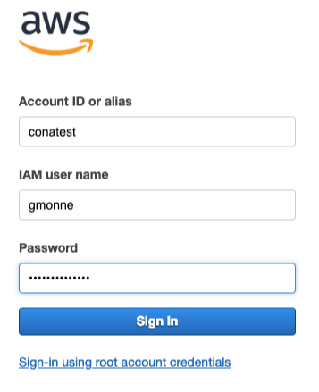
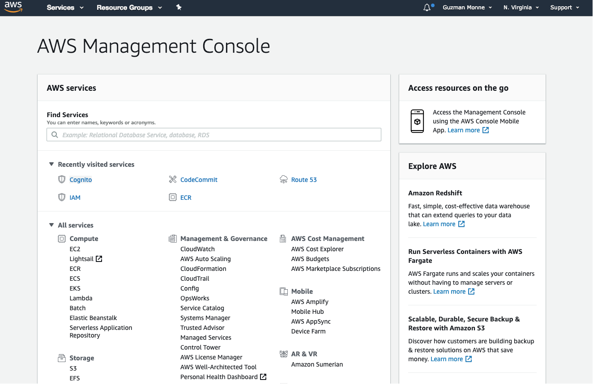
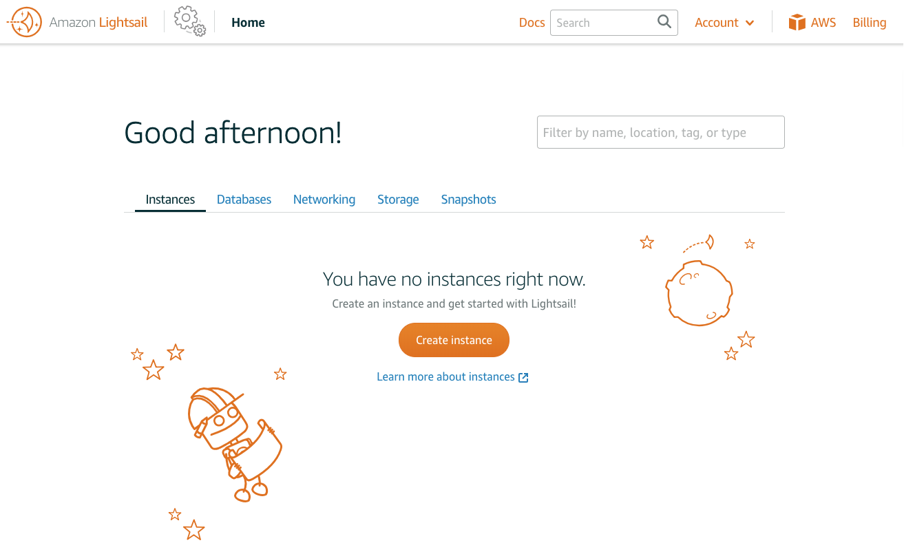
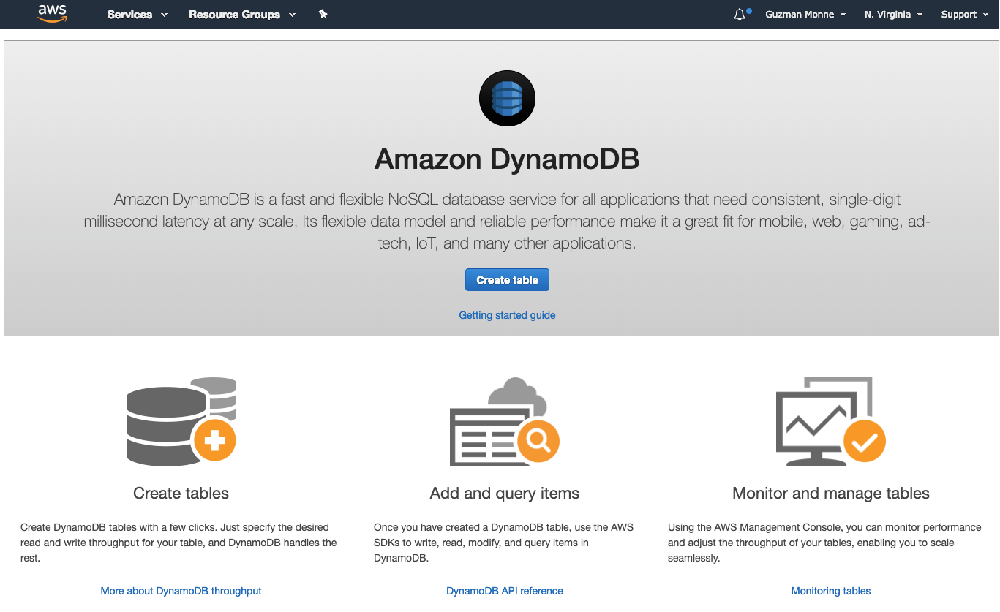
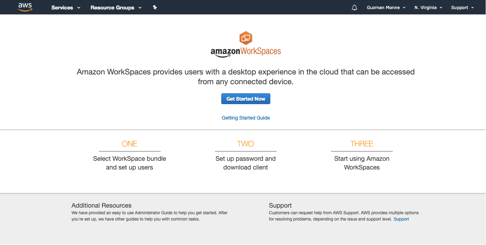
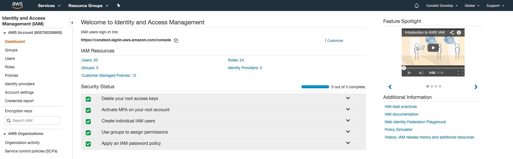

# DEMO

## Iniciar sesión en la consola

## Ejemplos

### IaaS

[Lightsail](https://lightsail.aws.amazon.com/ls/webapp/home).

### PaaS

[DynamoDB](https://console.aws.amazon.com/dynamodb/home?region=us-east-1#gettingStarted:).

### SaaS

[Amazon WorkSpaces](https://console.aws.amazon.com/workspaces/home?region=us-east-1#home:home).

## Autenticación y seguridad

---

  
<a href="../guias/02_aws.md">⬅️02 - AWS</a>

  
<a href="../guias/04_ec2.md">04 - EC2 ➡️</a>

