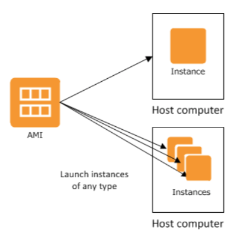

# EC2

EC2 o "Elastic Compute Cloud" es un servicio de AWS que permite la creación de maquinas virtuales Linux o Windows. Es uno de los servicios más antiguos de la plataforma, y uno de los más potentes. 

Muchos otros servicios de AWS utilizan este servicio por debajo.

---

## 💻 DEMO #1 ~ Levantar una instancia de Amazon Linux 2 en la nube

### Procedimiento

1. Acceder al dashboard de EC2.
2. Hacer click en `Launch Instance`.
3. Seleccionar la AMI `Amazon Linux 2 AMI (HVM)`.
4. Seleccionar el tipo de instancia `t2.micro` (seleccionada por defecto).
5. Hacer click en `Review and Launch`.
6. Hacer click en `Launch`.
7. ❗️Seleccionar la opción `Create a new key pair`.
8. ❗️Escribir el nombre de la nueva llave.
9. ❗️Hacer click en `Download Key Pair`.
10. ❗️Hacer click en `Launch Instances`.
11. Hacer click en `View Instances`.

### ❗️Atención

Tenga especial precaución al momento de crear la llave. Solamente se le permitirá descargarla una sola vez. Debe almacenarla en un lugar seguro al que tenga acceso. Si pierde esta llave no podrá conectarse a su instancia.

### FAQ

**¿Que es una AMI?**

Es un `template` que contiene una configuración de software: un sistema operativo, más aplicaciones, más configuración.

**¿Que es una instancia?**

Una copia de una `AMI` que se encuentra ejecutando como una maquina virtual en la nube.

**¿A que se refiere por el tipo de instancia?**

AWS permite crear instancias con distinto hardware (CPU, RAM, GPU, ancho de banda, etc). Dependiendo del rol que deba cumplir la instancia, es el timpo que tenemos que seleccionar.

---



Por defecto, AWS nos provee una gran lista de `AMI` basicas que podemos usar para levantar nuestras maquinas virtuales. Las mismas cuentan con distintos distros de Linux o versiones de Windows, con determinado software pre-instalado.

También existe un `Marketplace` en donde terceros públican sus propias `AMI` configuradas con determinadas aplicaciones. Es importante tener presente que algunas de estas `AMI` pueden incurrir costos adicionales por el uso de licencias. Vendors como `CISCO` publican ahí sus productos para que sean utilizados dentro de la nube de AWS.

Además de seleccionar la instancia, debemos seleccionar que "tipo" de instancia queremos utilizar. Esto es, que configuración de hardware necesitamos asignarle a esta instancia para que cumpla con nuestros propositos. AWS nos ofrece una gran variedad de familias de tipos de instancias, pensadas para un proposito en particular. Por ejemplo, la familia `c` corresponde a maquina pensadas para tareas de computo intensivas, mientras que las familias `t` y `m` son para tareas generales.

Para poder acceder a nuestra instancia tenemos que indicarle a AWS que llave SSH queremos utilizar. Este es el metodo que AWS nos brinda para conectarnos a nuestras instancias. Es nuestra responsabilidad mantener de forma segura las llaves privadas necesarias para acceder a las instancias. Si no contamos con una llave privada al momento de levantar la instancia, AWS nos da la opción de crear una. El resultado será la generación de una llave privada que se descargara en nuestra maquina. AWS indica que no almacena de ninguna manera esta llave, por lo que si la perdemos no tenemos forma de recuperarla. En el caso de que queramos subir una llave privada existente, existen mecanismos para utilizarla.

---

## 💻 DEMO #2 ~ Conexión SSH a nueva instancia

#### 🚨 Atención 🚨
Para poder utilizar la llave privada descargada desde Putty en Windows, es necesario convertirla. El procedimiento para realizarlo se encuentra en [el siguiente link](https://aws.amazon.com/premiumsupport/knowledge-center/convert-pem-file-into-ppk/).

Para poder utilizar la llave privada descargada con `ssh` es necesario modificarle sus permisos para que solo pueda ser leída por el usuario.

```bash
chmod 400 <llave_privada>.pem
```

### Procedimiento

1. Obtenemos la `IP` pública asignada a nuestra recién creada instancia.
2. Utilizando `ssh` desde la consola o `Putty` nos conectamos a la instancia.

### FAQ

**¿Que usuario utilizo para la conexión?**

Cada `AMI` tiene configurado un usuario distinto por defecto. Para el caso de `Amazon Linux 2` el usuario es `ec2_user`. Sin embargo, para la `AMI` de Ubuntu el usuario es `ubuntu`.

---

Si investigamos los detalles de la instancia creada vamos a ver que la misma tiene asociada una gran cantidad de recursos adicionales. En las siguiente secciones explicaremos algunos de ellos, y como su configuración afecta el comportamiento de la instancia.

---

## 💻 DEMO #3 ~ Terminar una instancia <a name="demo003"></a>

### Procedimiento

1. Seleccionamos la instancia que queremos elminar.
2. Vamos a `Actions > Instance State > Terminate`.
3. Hacemos click en `Yes, Terminante`.

### FAQ

**¿Existe alguna forma de proteger la terminación de una instancia?**

Si. Se puede proteger mediante funcionalidades de EC2, o mediante una asignación apropiada de permisos de usuario.

**¿Que pasa con los datos almacenados en la instancia?**

Por defecto, los volumenes cargados a la instancia son eliminados a menos que se haya determinado lo contrario al momento de configurarlos. A continuación hablaremos un poco más sobre los volumenes de las instancias.

---
<div style="width: 100%">
  <div style="float: left"><a href="../guias/03_demo.md">⬅️03 - DEMO</a></div>
  <div style="float: right"><a href="../guias/05_vpc.md">05 - VPC ➡️</a></div>
</div>