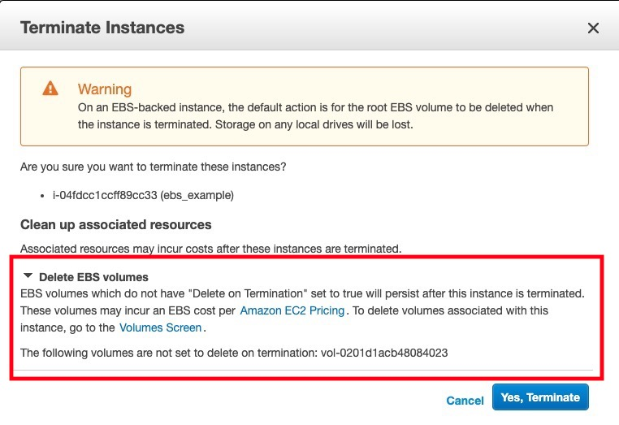

# EBS

Amazon Elastic Block Store o Amazon EBS es un servicio de volumenes de almacenamiento para trabajar en conjunto con EC2. Los volumenes de AWS pueden vincularse a instancias de EC2, o persistir desacoplados de los mismos.

El almacenamiento en EBS es recomendado para almacenar información persistente que deba ser accedida rápidamente. Los volumenes creados pueden ser utilizados para cualquier tipo de aplicación, especialmente aquellas que requieran diversos recursos de `Input/Output`. 

Cuenta con la funcionalidad de realizar `snapshots` de los volumenes para su respaldo, y es capaz de encriptar los volumenes. 

Cada instancia de EC2 puede contar con múltiples volumenes que pueden víncularse durante la creación de instancias, o más adelante con las instancias en funcionamiento. 

Los volumenes pueden correr sobre distintos tipos de discos (HDD, SSD, NVM-e, etc.), se pueden configurar en modo RAID, de manera de conseguir los IOPS necesarios para cumplir con los requerimientos de la aplicación.

La lista de volumenes creados la podemos ver en `EC2 Dashboard > Volumes`. Actualmente deberíamos tener dos volumenes creado, uno para cada una de nuestras instancias. Estos volumenes fueron creados automaticamente, y están atadas a las mismas. Si eliminamos las instancias, estos volumenes también serán eliminados.

---

## 💻 DEMO #1 ~ Creación de un volumen a través del Wizard de instancias <a name="demo011"></a>

### Procedimiento

Seguiremos los pasos necesarios para crear una nuvea instancia con un vólumen adicional.

1. Ir al Dashboard de EC2.
2. Hacer click en `Launch Instance`.
3. Seleccionar `Amazon Linux 2 AMI (HVM)`.
4. Seleccionar el tipo de instancia `t2.micro`.
5. Hacer click en `Next: Configure Instance Details`.
6. Seleccionar el `VPC` con la que estamos trabajando.
7. Seleccionar la `subnet` privada.
8. Hacer click en `Next: Add Storage`.
9. Hacer click en `Add New Volume`.
10. Tomar nota de la ubicación donde será montado el volumen (`/dev/sdb` por ejemplo).
11. Hacer click en `Next: Add Tags`.
12. Hacer click en `Next: Configure Security Group`.
13. Seleccionar el `Security Group` creado en seciones anteriores.
14. Hacer click en `Review and Launch`.
15. Hacer click en `Launch`.
16. Seleccionar la llave privada que creamos previamente.
17. Hacer click en `Launch Instance`.
18. Hacer click en `View Instances`.

### FAQ

**¿Que pasa con los volumenes extra que monto a la instancia al momento de eliminar la instancia?**

El único volumen que se elimina junto con la instancia, es aquel creado por defecto junto con ella.

---

Si accedemos por `SSH` a la instancia creada podemos ver la lista de volumenes que tiene asociado.

```
[ec2-user@ip-10-0-1-28 ~]$ lsblk
NAME    MAJ:MIN RM  SIZE RO TYPE MOUNTPOINT
xvda    202:0    0    8G  0 disk
└─xvda1 202:1    0    8G  0 part /
xvdb    202:16   0    8G  0 disk
xvdf    202:80   0  100G  0 disk
```

Todos los volumenes son visibles, pero solo uno de ellos esta montado en el directorio raiz. 

Para montar un volumen realizamos los siguientes pasos:

```
# Creamos un filesystem dentro del volumen
sudo mkfs -t xfs /dev/xvdb

# Creamos carpetas donde montaremos los volumenes
sudo mkdir /xvdb

# Montamos el volumen en los nuevos directorios
sudo mount /dev/xvdb /xvdb
```

[Referencia](https://docs.aws.amazon.com/AWSEC2/latest/UserGuide/ebs-using-volumes.html)

Si ejecutamos el `lsblk` veremos nuestro volumen montado correctamente. Que, por supuesto, esta vacío.

Para ver la potencia de los volumenes vamos a crear un nuevo archivo dentro de uno de ellos; borraremos la instancia; y luego montaremos el volumen en otra instancia, donde tendremos disponible la información previamente almacenada.

```
# Creamos un nuevo directorio
sudo mkdir -p /xvdb/ec2-user

# Cambiamos el usuario del nuevo directorio
sudo chown -R ec2-user /xvdb/ec2-user

# Creamos un nuevo archivo
nano /xvdb/ec2-user/something.txt

# Leemos su contenido para verificar que se hayan grabado los cambios
cat /xvdb/ec2-user/something.txt
```

Ahora eliminemos la instancia. Si no recuerda como, refierase a la guía [`04_ec2.md`](./04_ec2.md), y repase los pasos de la "DEMO #3".



Presten atención a la sección remarcada en rojo de la imagen anterior. AWS nos avisa que tenemos volumenes que no se eliminarán junto con la instancia.

Si ahora volvemos a la lista de volumenes, vamos a ver que que el volumen adicional que creamos persiste. Por lo tanto, lo podemos montar en otra instancia. Desde esta ventana también podemos crear volumenes adicionales. En la siguiente demo, crearemos un nuevo volumen, y luego montaremos ambos en la instancia privada.

---

### 💻 DEMO #2 ~ Creación y montado de un volumen en una instancia existente <a name="demo012"></a>

### Procedimiento

1. Ir al Dashboard de EC2.
2. Hacer click en `Volumes`.
3. Hacer click en `Create Volume`.
4. ️❗️Seleccionar la zona de disponibilidad en la que se encuentra la instancia a la que queremos agregarle el volumen (ej. `us-east-1b`).
5. Hacer click en `Create Volume`.
6. Hacer click en `Close`.

Los siguientes pasos los repetiremos para los dos volumenes disponibles. Puede identificarlos por su estado: `available`.

1. Seleccionar el volumen.
2. Hacer click en `Actions > Attach Volume`.
3. Seleccionar la instancia a la que queremos víncularle el volumen.
4. Observar la ubicación donde será montado el volumen.
5. Hacer click en `Attach`.

### ❗️Atención

Seleccionen la zona de disponibilidad correspondiente a la `subnet` privada. Si no recuerda cual es, veríque la zona de disponibilidad en la que se encuentra el volumen creado a través del wizard de EC2.

### FAQ

**¿Que pasa si no selecciono la zona de disponibilidad correctamente al momento de crear el volumen?**

Solo puedo víncular instancias y volumenes que se encuentren en la misma zona de disponibilidad.

--- 

Si accedemos a nuestra instancia privada veremos los volumenes montados (`lsblk`). Debemos montarlos antes de poder utilizarlos. Los comandos son los mismos que antes, con la diferencia de que uno de nuestros volumenes ya tiene creado un `fs`, y no tenemos por que recrearlo.


> **️Antes de realizar estos pasos verífque que volumen tiene disponible en cada ubicación. Su situación puede diferir del ejemplo a continuación.**

```
# Creamos un filesystem dentro del volumen de 100G
sudo mkfs -t xfs /dev/xvdf

# Creamos carpetas donde montaremos los volumenes
sudo mkdir /xvdf
sudo mkdir /xvdg

# Montamos el volumen en los nuevos directorios
sudo mount /dev/xvdf /xvdf
sudo mount /dev/xvdg /xvdg
```

Ahora tenemos montados ambos volumenes. Analizemos que tienen disponible:

```
# Listado de volumen de 100G
ll /xvdf

> total 0

# Listado de volumen de 8G
ll /xvdg

> total 0
> drwxr-xr-x 2 ec2-user root 27 Jul 24 14:37 ec2-user
```

Dentro del volumen de 8G tendremos disponibles todos los archivos creados por la instancia anterior.

```
tree /xvdg
/xvdg
└── ec2-user
    └── something.txt
```

---

### 💻 DEMO #3 ~ Terminación de un volumen <a name="demo012"></a>

### Procedimiento

Para poder eliminar los volumenes primero tenemos que desvincularlos de las instancias. Los siguientes pasos deben realizarse para cada volumen.

1. Ir al Dashboard de EC2.
3. Hacer click en `Volumes`.
4. Seleccionar uno de los volumenes a terminar.
4. Hacer click en `Actions > Force Detach Volume`.
5. Hacer click en `Yes, Detach`.
6. Esperar a que esta acción termine. El estado del voluemn deber pasar de `in-use` a `available`.
7. Hacer click en `Actions > Delete Volume`.
8. Hacer click en `Yes, Delete`. 

### FAQ

**¿Que pasa si me olvido de eliminar el volumen al momento de terminar la instancia donde estaba corriendo?**

El volumen seguira "vivo" y AWS seguira cargando la cuenta por la existencia del volumen (aún si no se esta utilizando) en base a su tamaño.

---
<div style="width: 100%">
  <div style="float: left"><a href="../guias/05_vpc.md">⬅️05 - VPC</a></div>
  <div style="float: right"><a href="../guias/07_iam.md">07 - IAM ➡️</a></div>
</div>