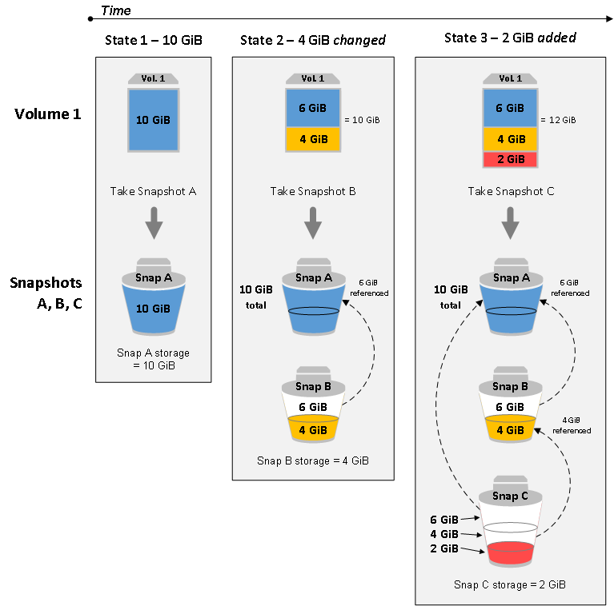
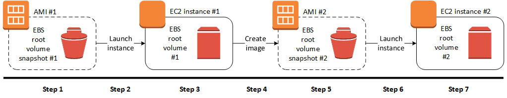
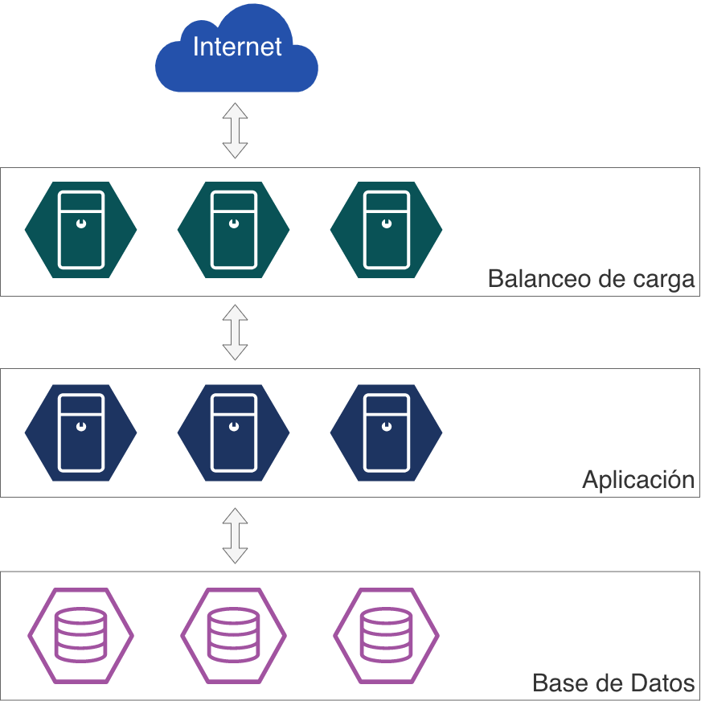

# Snapshots

Un `Snapshot` es un respaldo de un vólumen EBS en S3. Estos `snapshots` son incrementales y representan el estado del vólumen hasta ese punto. `Snapshots` adicionales del mismo volumen solamente contarán con los delta entre el `snapshot` anterior y el actual. La eliminación de un `snapshot` solo eliminará esta diferencia de datos.

Los `snapshots` pueden ser utilizados para recuperar un volumen `EBS` o para crear nuevos volumenes. Inicializados identicos al `snapshot`. Esta es la forma en la que AWS levanta las instancias. Si vemos la lista de volumenes actuales, veremos que los mismos tienen asociados el id de un `snapshot`.

Cada `snapshot` puede ser encriptado por seguridad y compartido con otras cuentas de AWS.

---

## 💻 DEMO #16 ~ Creación de un `snapshot` <a name="demo013"></a>

Mostraremos como realizar una `snapshot` desde la consola web y la `cli`.

### Procedimiento (Web)

1. Ir al Dashboard de EC2.
2. Hacer click en `Instances`
3. Tomar nota del `id` de la instancia privada.
4. Hacer click en `Snapshots`.
5. Hacer click en `Create Snapshot`.
6. Seleccionar `Instance` como el tipo de recurso.
7. Introducir el `Id` en el campo `Instance Id`.
7. Agregar una descripción (no es mandatorio pero altamente recomendable).
8. Hacer click en `Create Snapshots`.
9. Hacer click en `Close`.

### Procedimiento (`cli`)

```
# Obtenemos la lista de instancias
aws ec2 describe-instances \
  --query "Reservations[*].Instances[*].{Id:InstanceId,Name:PrivateDnsName}"

# Obtenemos la lista de volumenes
aws ec2 describe-volumes

# Creamos la snapshot
aws ec2 create-snapshot \
--volume-id <volume-id> \
--description "<descripción>"
```

### FAQ

**¿Como funciona el sistema incremental de almacenamiento de `snapshots`?**

Ver la siguiente imagen basada en un volumen de 10GB.



---

## Creación de AMI a través de Snapshots

Otra ventaja de la creación de `Snapshots` es que podemos crear `AMI` basadas en ellas, y de estas `AMI` crear nuevas instancias.

El proceso de creación de imagenes no requiere de la creación previa de una `Snapshot`. Se pueden crear instancias de las imagenes que están en producción sin necesidad de apagarlas o sacar un `Snapshot` previo. Sin embargo, es más rápido y seguro construirlas de esta manera.



---

## 💻 DEMO #17 ~ Creación de una `AMI` a partir de un `snapshot` <a name="demo002"></a>

Mostraremos el procedimiento para realizar en la consola web o la `cli`.

### Procedimiento (Web)

1. Ir al Dashboard de EC2.
2. Hacer click en `Snapshots`.
3. Seleccionar la `Snapshot` sobre la cual se quiere crear una `AMI`.
4. Hacer click en `Actions > Create Image`.
6. Colocar un nombre y una descripción de la `AMI`.
7. Hacer click en `Create`.
8. Hacer click en `Close`.
9. Hacer click en `AMIs`.
10. Vera su nueva imagen creada.

### Procedimiento (`cli`)

> ❗❗️❗️<br/>Desde la `cli` solo se pueden crear imagenes desde una instancia, y no de una `snapshot`. Por lo tanto, no es el metodo más recomendado para realizarla.<br/>❗❗️❗️

```
# Obtenemos la lista de instancias
aws ec2 describe-instances \
  --query "Reservations[*].Instances[*].{Id:InstanceId,Name:PrivateDnsName}"

# Creamos la imagen a partir de la imagen
aws ec2 create-image \
--instance-id <instance-id> \
--name "<nombre>" \
--description "<descripción>"

# Obtenemos la lista de imagenes
# ❗❗️❗️ COPIE Y PEGUE ESTE COMANDO PARA EVITAR ERRORES ❗❗️❗️
aws ec2 describe-images --owner self
```

>❗❗️❗️<br/>Si no configuramos la opción `--owner self` al momento de ejecutar el comando `aws ec2 describe-images`, la `cli` nos devolvera la lista de _todas_ las imagenes disponibles en nuestra cuenta, incluyendo las de AWS y las del marketplace.<br/>❗❗️❗️

### FAQ

**¿Como elimino una imágen desde la `cli`?**

Utilizando el comando `aws ec2 deregister-image --image-id <image_id>`.

**¿Como obtengo la lista de mis `Snapshots` desde la `cli`?**

Utilizando el comando `aws ec2 describe-snapshots --owner self`.

**¿Como elimino una snapshot desde la `cli`?**

Utilizando el comando `aws ec2 delete-snapshot --snapshot-id <snapshot_id>`.

---

La combinacion de `Snapshots` y `AMI` simplifica la instalación de nuestras aplicaciones, y nos garantiza la integridad de las mismas.

**¿Que otras funcionalidades son necesarias para correr mis aplicaciones?**

1. Balanceo de carga.
2. Almacenamiento de datos persistentes.



Podemos resolver ambos simplemente instalando aplicaciones específicas  para cada caso (`nginx` y `mysql` por ejemplo), con sus configuraciones correspondientes de aplicación y red. Esta sería una forma de resolverlo utilizando solo los servicios `IaaS` de AWS. Sin embargo, hay otro grupo de servicio que nos puede ayudar a simplificar la resolución de estos problemas. Veremos a continuación algunos ejemplos.