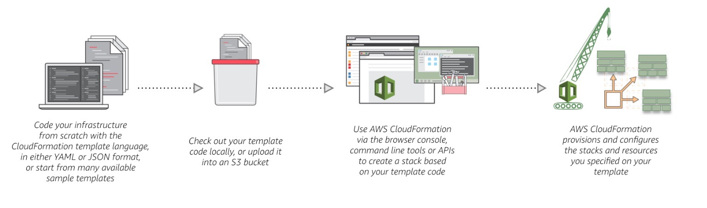

# CloudFormation

`CloudFormation` provee un lenguaje común para describir y aprovisionar todos los recursos de AWS. A través de documentos de texto, y de forma programatica, se puede indicar a `CloudFormation` el estado final de nuestra infraestructura. Luego, `CloudFormation` se encargara de configurar y aprovisionar todos estos recursos por nosotros.



`CloudFormation` no tiene costos adicionale por su utilización. Solo se pagan los recursos aprovisionados. La ventaja, es que con `CloudFormation` es más facil llevar el ciclo de vida de los servicios, de manera de evitar servicios "zombies".

## Conceptos

Trabajamos con `CloudFormation` a través de `templates` y `stacks`. Un `template` describe los recursos de AWS y sus propiedades. Con el, podemos crear un `stack` que aprovisiona dichos recursos. Un `template` puede crear múltiples `stack`, en múltiples regiones.

### `Templates`

Los `templates` de `CloudFormation` son archivos de texto que contienen un documento `JSON` o `YAML`, que funcionan como un `blueprint` de nuestra arquitectura. Dentro de estos documentos describimos los recursos que queremos utilizar y sus propiedades. Por ejemplo, si queremos levantar una instancia de EC2 con la imagen `ami-0ff8a91507f77f867` y de tipo `t2.micro`, accesible con la llave `testkey`, y que cuente con un volumen mapeado de `20 GB` y `200 IOPS`, debemos escribir el siguiente `template`:

En `JSON`:

```json
{
  "AWSTemplateFormatVersion" : "2010-09-09",
  "Description" : "A sample template",
  "Resources" : {
    "MyEC2Instance" : {
      "Type" : "AWS::EC2::Instance",
      "Properties" : {
        "ImageId" : "ami-0ff8a91507f77f867",
        "InstanceType" : "t2.micro",
        "KeyName" : "testkey",
        "BlockDeviceMappings" : [
          {
            "DeviceName" : "/dev/sdm",
            "Ebs" : {
              "VolumeType" : "io1",
              "Iops" : "200",
              "DeleteOnTermination" : "false",
              "VolumeSize" : "20"
            }
          }
        ]
      }
    }
  }
}
```

O, en `YAML`:

```yaml
AWSTemplateFormatVersion: "2010-09-09"
Description: A sample template
Resources:
  MyEC2Instance:
    Type: "AWS::EC2::Instance"
    Properties: 
      ImageId: "ami-0ff8a91507f77f867"
      InstanceType: t2.micro
      KeyName: testkey
      BlockDeviceMappings:
        - DeviceName: /dev/sdm
          Ebs:
            VolumeType: io1
            Iops: 200
            DeleteOnTermination: false
            VolumeSize: 20
```

Durante el resto del curso crearemos `templates` en formato `YAML`.

Por `template` podemos incluir más de un recurso, los cuales podemos relacionar entre sí:

```yaml
AWSTemplateFormatVersion: "2010-09-09"
Description: A sample template
Resources:
  MyEC2Instance:
    Type: "AWS::EC2::Instance"
    Properties: 
      ImageId: "ami-0ff8a91507f77f867"
      InstanceType: t2.micro
      KeyName: testkey
      BlockDeviceMappings:
        -
          DeviceName: /dev/sdm
          Ebs:
            VolumeType: io1
            Iops: 200
            DeleteOnTermination: false
            VolumeSize: 20
  MyEIP:
    Type: AWS::EC2::EIP
    Properties:
      InstanceId: !Ref MyEC2Instance
```

### `Stacks`

Cuando manejamos recursos con `CloudFormation` lo hacemos a través de un `stack`. Al crear, eliminar, o actualizar un `stack`, modificamos el estado de los recursos definidos. Contar con un `stack` nos permite interactuar con todos nuestros recursos desde una única ventana. Además, podemos crear múltiples `stacks` por cada `template`.

La actualización de un `stack` puede provocar el agregado, eliminación, modificación, o sustitución de los mismos. Para saber exactamente que va a pasar con nuestros recursos al momento de correr las modificaciones, podemos utilizar un `Change Set` previo a actualizar un `stack` que contendrá un resumen de los cambios necesarios para aplicar los cambios. De esta manera, podemos visualizar los cambios que se van a ejecutar antes de realizarlo. Por ejemplo, supongamos que contamos con un `stack` con una base de datos de RDS, a la cual le queremos cambiar el nombre. Esto provocara el reemplazo de la misma si la corremos con `CloudFormation`. Un `Change Set` nos permite identificar esta acción.

---

## 💻 DEMO #22 ~ Primer template de `CloudFormation` <a name="demo020"></a>

Podemos desarrollar un template de `CloudFormation` de dos maneras:

1. Con cualquier editor de texto.
2. A traves de una herramienta de AWS llamada `CloudFormation Designer`.

En el curso mostraremos como podemos escribir los templates con un editor de texto convencional desde la `cli`.

### Procedimiento (`cli`)

1. Crear un archivo llamado `ec2_template.yaml`.
2. Escribir el siguiente código dentro del mismo:
  ```yaml
  AWSTemplateFormatVersion: '2010-09-09'
  Description: Instancia de EC2
  Resources:
    MyEC2Instance:
      Type: AWS::EC2::Instance
      Properties:
        ImageId: ami-0b898040803850657
        InstanceType: t1.micro
  ```
3. Creamos el `stack` utilizando nuestro `template`
  ```bash
  aws cloudformation create-stack \
    --stack-name ec2-stack \
    --template-body file://ec2_template.yaml
  ```
4. Podemos ver el estado de nuestro `stack` con el siguiente comando
  ```bash
  aws cloudformation describe-stack-events \
    --stack-name ec2-stack --output json \
    | jq
  ```

---

En la consola de `CloudFormation` podemos ver el estado de nuestro `stack`, los recursos creados, la salida del comando, y el `template` utilizado.

Ahora, vamos a actualizar este `stack` utilizando un `Change Set`.

---

## 💻 DEMO #23 ~ Actualizar un `stack` de `CloudFormation` <a name="demo020"></a>

Vamos a mostrar el procedimiento desde la `cli`

### Procedimiento (`cli`)

1. Actualizamos el archivo `ec2_template.yaml`, modificando los siguiente:
  ```diff
    AWSTemplateFormatVersion: '2010-09-09'
    Description: Instancia de EC2
    Resources:
      MyEC2Instance:
        Type: AWS::EC2::Instance
        Properties:
          ImageId: ami-0b898040803850657
  -       InstanceType: t1.micro
  +       InstanceType: t2.small
  ```
2. Creamos el `Change Set` a partir de nuestro `stack` y nuestro `template` actualizado
  ```bash
  aws cloudformation create-change-set \
    --stack-name ec2-stack \
    --template-body file://ec2_template.yaml \
    --change-set-name ec2-stack-change-set
  ```
3. Vemos los resultados del `Change Set`
  ```bash
  aws cloudformation describe-change-set \
    --change-set-name ec2-stack-change-set \
    --stack-name ec2-stack \
    --output json \
    | jq
  ```
4. Aplicamos los cambios
  ```bash
  aws cloudformation update-stack \
    --stack-name ec2-stack \
    --template-body file://ec2_template.yaml
  ```
5. Seguimos los cambios de nuestro stack
  ```bash
  watch -n 1 'aws cloudformation describe-stack-events --stack-name ec2-stack --output json'
  ```

---

Por último, vamos a eliminar el `stack`.

---

## 💻 DEMO #24 ~ Eliminar un `stack` de `CloudFormation` <a name="demo020"></a>

Vamos a mostrar el procedimiento desde la `cli`

### Procedimiento (`cli`)

1. Eliminamos el `stack`.
  ```bash
  aws cloudformation delete-stack \
    --stack-name ec2-stack
  ```
2. Seguimos los cambios de nuestro stack
  ```bash
  watch -n 1 'aws cloudformation describe-stack-events --stack-name ec2-stack --output json'
  ```

---

El resultado es que todos los recursos asociados al `stack` se eliminaron junto con el.

## Estuctura de un `template` de CloudFormation

Un `template` de CloudFormation cuenta con las siguientes fragmentos importantes:

- `AWSTemplateFormatVersion`: Versión del `template` de CloudFormation.
- `Parameters`: Lista de parámetros configurados por el administrador que pueden o deben ser incluidos al momento de generar un `stack` a partir del `template`.
- `Resources`: Lista de recursos que conforman nuestra arquitectura.
- `Outputs`: Lista de parámetros disponibles como salida al ejecutar un `stack`.

```yaml
---
AWSTemplateFormatVersion: "version date"
Description:
  String
Parameters:
  set of parameters
Resources:
  set of resources
Outputs:
  set of outputs
```

Existen otras opciones que se pueden configurar pero no nos vamos a centrar en ellas.

## Estructura de un `Resource`

La definición de cualquier recurso tiene como mínimo 2 opciones que configurar:

1. El tipo de Recurso. Ej: `AWS::AutoScaling::AutoScalingGroup`
2. Las propiedades del recurso. Son un diccionario con propiedades específicas del recurso. Cada uno tiene su propia configuración. Para obtener los detalles de cada recurso tenemos que dirigirnos a la siguiente página.

[AWS Resource and Property Types Reference](https://docs.aws.amazon.com/AWSCloudFormation/latest/UserGuide/aws-template-resource-type-ref.html)

---

Veamos como podemos aplicar estos conceptos para la creación de un balanceador de carga que nos permita llegar a nuestra aplicación.

---
<div style="width: 100%">
  <div style="float: left"><a href="../guias/13_auto_scaling_groups.md">⬅️13 - Auto Scaling Groups</a></div>
  <div style="float: right"><a href="../guias/15_alb.md">15 - ALB ➡️</a></div>
</div>