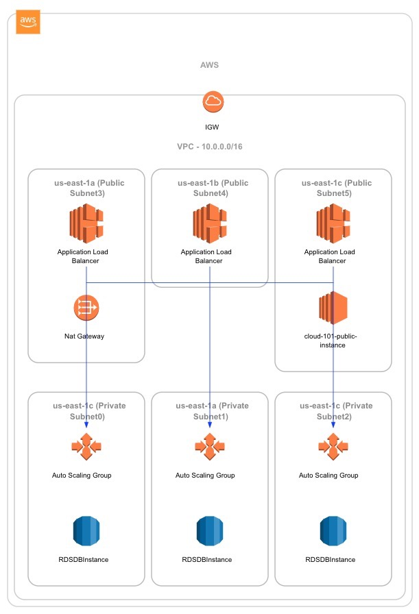

# Desafío Final

Una empresa esta en proceso de desplegar su nuevo Blog. El mismo es crítico para la estrategia de marketing de la empresa, por lo que debe estar siempre disponible, y debe adaptarse a las demandas de visitas de foma dínamica cada vez que se realiza una nueva publicación.

El administrador de sistemas de la empresa sugirio implementarlo en la nube de AWS, en órden de cumplir con las demandas del negocio. Sin embargo, tras la implementación de todos los recursos necesarios para su operación, no se puede acceder al Blog por Internet.

Consultó con el especialista en bases de datos de la empresa, quien le indico que la base de datos de la aplicación estaba correctamente configurada, y que las aplicaciones estaban conectandose correctamente a la misma. Por lo tanto, la aplicación y la base de datos están funcionando correctamente.

Para poder resolver estos problemas te contratan a ti como consultor externo. Tu objetivo es simple: **analizar el ambiente de la empresa, y realizar los cambios necesarios para ponerla en producción.**

> Una vez resuelto todos los errores, se podrá acceder al Blog a través de Internet. Una vez disponible, deberá enviar la URL en la cual se encuentra públicado el Blog. Para ganar el premio, deberá ser el primero en mandar un link funcionando, y deberá explicar los errores que tuvo que corregir al resto de los participantes en forma oral o escrita como un `post` dentro de su blog.

El diagrama de la arquitectura es el siguiente:

---

  
<a href="../guias/15_alb.md">⬅️15 - ALB</a>

  
<a href="../guias/16_cloudformation.md">16 - CloudFormation ➡️</a>

