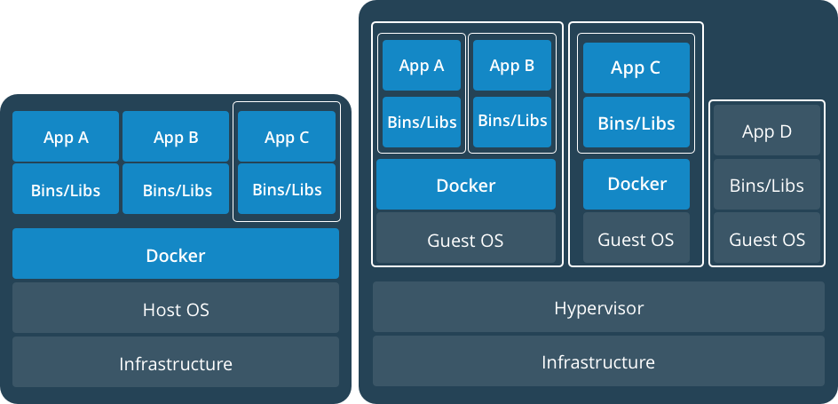

Docker
===

*Fuentes:*
- [Documentación oficial](https://docs.docker.com/)
- [Página de Docker](https://www.docker.com/)

## Indice.
---
  - [Introducción](#introduccion)
  - [Imágenes y contenedores](20170803-Imagenes.md)
  - [Storage](20170815-Storage.md)
  - [Networking](20170807-Networking.md)

## Introduccion
---
¿Qué es Docker?
---
Docker es la implementación líder de una tecnología llamada Linux containers. Los desarrolladores utilizan contenedores para eliminar los conflictos que se originan al trabajar en la máquina propia mientras colaboran con otros desarrolladores.
Los contenedores también facilitan la puesta en producción y la operación de las aplicaciones.

Mas específicamente, los contenedores son una tecnología, similar a las máquinas virtuales, que permiten automatizar el seteo de un ambiente de desarrollo para el programador. De esta forma, el programador ya no tiene que pasar horas customizando el sistema operativo e instalando dependencias, sino que puede utilizar uno o varios contenedores que ya tienen toda la customización necesaria. Una ventaja adicional es que los contenedores nos permiten experimentar libremente sin preocuparnos por "romper" nuestra máquina.

Los contenedores se han vuelto extremadamente populares porque son ideales para implementar aplicaciones con una arquitectura de microservicios. A diferencia de la arquitectura monolítica tradicional donde hay una base única de código para toda la aplicación, la arquitectura de microservicios implementa varios servicios diferentes, que resuelven pequeños problemas y que cada uno tiene base de código distinta. Una aplicación hoy en día puede estar compuesta por decenas de microservicios que se comunican entre sí.

Terminología.
---
**imagen:** una imagen es un archivo (técnicamente son varios) que contiene todo lo necesario para correr un contenedor. Para quien esté familiarizado con la tecnología de máquinas virtuales esto es similar a un .ova/.ovf

**contenedor** un contenedor es una instancia viva de una imagen. Haciendo una analogía con la tecnología de máquinas virtuales esto sería algo similar a una máquina virtual propiamente dicha. Un contenedor corre un comando o un script nativamente sobre el Kernel del sistema operativo (compartido para todos los contenedores del host), a diferencia de la tecnología de máquinas virtules donde se implementa un sistema operativo completo para cada una. Por tal motivo los contenedores son mucho mas "livianos" que las máquinas virtuales.

Contenedores vs Máquinas virtuales
---

### Arquitectura de máquinas virtuales.


### Arquitectura de contenedores.


La diferencia principal entre los contenedores y las máquinas virtuales es que las máquinas virtuales corren un sistema operativo completo cada una, mientras que los contenedores comparten el kernel del host. La única información necesaria en una imagen de Docker es la aplicación misma y sus dependencias. Por este motivo, las imagenes de docker son órdenes de magnitud mas pequeñas que un archivo ovf/ova.

### Ventajas principales

  - Uso mas eficiente de recursos (CPU, Memoria).
  - Menor consumo de disco.
  - Levantan mucho mas rápido.
  - Fácilmente automatizables.
  - Ideales para arquitectura de microservicios.
  - Se puede tratar la infraestructura como código.

## Contenedores y Máquinas virtuales

Cómo vimos anteriormente y como veremos también mas adelante, los contenedores presentan muchas ventajas respecto de las máquinas virtuales pero también algunas limitantes (aunque cada vez menos).

Por otro lado, ¿que sucede si quiero utilizar contenedores pero toda mi infraestructura se encuentra virtualizada mediante virtualización tradicional?





Como se ve en el diagrama mas arriba, no existe ningún inconveniente en que co-existan la virtualización mediante contenedores y la virtualización tradicional, de hecho es posible que en algunos escenarios esto sea lo recomendado.

## Docker engine

El motor de Docker, tal como se instala típicamente, consiste de tres componentes:

* Server (`dockerd`)
* REST API
* Client o "docker cli" (`docker`)


El **Server** es el demonio de Docker propiamente dicho, podremos verlo como un proceso llamado `dockerd` dentro del sistema. Este es quien se encarga de crear y gestionar "objetos" de Docker como ser **imágenes, contenedores, redes y volúmenes**.

El **server** dispone de una API REST para recibir instrucciones y brindar información a otras piezas de software.

El **client** o **docker cli**, es una línea de comandos disponible para el usuario. Esta recibe las instrucciones del usuario a través de comandos y las traduce a mensajes HTTP a ser enviados a la API REST. En otras palabras, oculta al usuario la complejidad (del servidor y su API) presentando un conjunto de comandos a través de los cuales gestionar Docker.

Instalación
---

En caso de querer instalar Docker, (`dockerd`, API y `docker`), en la máquina local se pueden seguir estas [instrucciones](https://docs.docker.com/install/). Para este curso no utilizaremos Docker localmente sino que accederemos a un ambiente en la nube donde tendremos Docker pre-instalado.

DockerHub
---

[DockerHub](http://dockerhub.com) es un repositorio, típicamente público, aunque también puede ser privado, de imágenes de contenedores Docker. En DockerHub hay mas de 100.000 imágenes públicas, desarrolladas por la comunidad que están disponibles para bajar. Dentro de estas imagenes se encuentran las aplicaciones mas comunes que utilizaremos cuando estemos desarrollando como ser: NGINX, MySQL, PostgreSQL, Ubuntu, Python, Node.js, haproxy, etc.

DockerHub está integrado de forma nativa dentro de Docker, por lo que al instalar este último ya tendremos acceso de forma automática a las imágenes públicas de DockerHub, aún sin tener una cuenta registrada.

## Acceso al ambiente de trabajo

Aquí van las instrucciones de acceso al ambiente de trabajo.


## Docker cli

Comencemos por repasar los comandos mas comunes disponibilizados por Docker a través de su **cli**.

### docker run

> Genera un contenedor a partir de una imagen y lo pone a correr. 

Aquí hay que tener cuidado en no dejarse engañar por el nombre del comando, si bien el mismo se llama `run`,  no se utiliza para poner a correr un contenedor sino que se utiliza para crearlo. 

> Nota: al ejecutar `docker run`, por defecto, además de ser creado el contenedor se pone a correr.

El comando ```docker run``` primero busca la imagen localmente y en caso de no encontrarla va a buscarla a DockerHub.

#### Ejemplo:

```$ docker run hello-world```


```bash
$ docker run --name primer-prueba -p 8080:2368 -d ghost
```

El comando anterior toma la ultima versión (:latest) de la imagen ```ghost``` y genera un contenedor a partir de ella.
Como la imagen no está disponible en nuesta máquina local, la misma se descarga desde DockerHub. Esta imagen contiene un servidor web con una aplicación para la publicación de contenido (BLOG), para verla podemos usar un navegador y acceder a http://localhost:8080
Por el momento no nos preocupemos por las opciones -d y -p 8080:2368, veremos cada una de ellas en detalle mas adelante.

### docker ps

El comando

```bash
$ docker ps
```
lista los contenedores que están corriendo en este momento, por lo tanto si lo ejecutamos deberíamos ver algo así:

```bash
$ docker ps
CONTAINER ID        IMAGE               COMMAND                  CREATED             STATUS              PORTS                    NAMES
4f4f350a9f2e        ghost               "docker-entrypoint.sh"   5 minutes ago       Up 5 minutes        0.0.0.0:8080->2368/tcp   primer-prueba
```

Como puede verse en el text-box anterior, cada contenedor tiene un ID autogenerado así como un nombre; este último puede especificarse al momento de generar el container con ```docker run``` y la opción ```--name```, pero en caso de no hacerlo Docker auto-genera uno. Estos campos son fundamentales dado que los utilizaremos en la línea de comandos cada vez que nos quieramos referir a un contenedor determinado para ejecutar alguna acción.

### docker start/stop

El comando ```docker stop <id-del-contenedor/nombre-del-contenedor>``` detiene el contenedor, por lo que si ejecutamos:

```bash
$ docker stop primer-prueba
```
y luego ejecutamos ```$ docker ps``` veremos que no hay ningún contenedor corriendo; en caso de que quieramos inlcuír en el listado a los contenedores que están apagados debemos ejecutar ```$ docker ps -a```. El text-box a continuación muestra como debería verse el resultado de estos comandos con el contenedor del ejemplo:

```bash
$ docker ps
CONTAINER ID        IMAGE               COMMAND             CREATED             STATUS              PORTS               NAMES

$ docker ps -a
CONTAINER ID        IMAGE                     COMMAND                   CREATED             STATUS                     PORTS               NAMES
4f4f350a9f2e        ghost                     "docker-entrypoint.sh"    8 minutes ago       Exited (0) 3 seconds ago                       primer-prueba
```
El comando ```docker start <id-del-contenedor/nombre-del-contenedor>``` enciende el contenedor, por lo que si ejecutamos:

```bash
$ docker start 4f4f350a9f2e
```
y luego ejecutamos ```$ docker ps``` veremos que ahora volvemos a ver listado el contenedor:

```bash
CONTAINER ID        IMAGE               COMMAND                  CREATED             STATUS              PORTS                    NAMES
4f4f350a9f2e        ghost               "docker-entrypoint.sh"   10 minutes ago      Up 2 seconds        0.0.0.0:8080->2368/tcp   primer-prueba
```

### docker rm

Ya vimos como prender y apagar un contenedor, pero ¿qué sucede cuando ya no lo necesitamos mas?. Los contenedores pueden eliminarse del sistema con el comando ```$ docker rm <nombre-del-contenedor/id-del-contenedor>```. Esto elimina el container por completo por lo que al ejecutar ```$ docker ps -a``` tampoco lo veremos:

```bash
$ docker ps
CONTAINER ID        IMAGE               COMMAND             CREATED             STATUS              PORTS               NAMES

$ docker ps -a
CONTAINER ID        IMAGE               COMMAND             CREATED             STATUS              PORTS               NAMES
```

Es importante notar que este comando elimina el contenedor pero no la imagen de la cual el contenedor proviene. Por lo que si ejecutamos el comando ```docker images``` veremos la imagen ```ghost``` listada en la salida del comando:

```bash
$ docker images
REPOSITORY                TAG                 IMAGE ID            CREATED             SIZE
ghost                     latest              b8fb2fac700b        45 hours ago        646.1 MB
```

Esto quiere decir que si nosotros quisieramos volver a correr el contenedor, en este punto la imagen se encuentra almacenada localmente y por tanto no es necesario descargarla nuevamente. A modo de ejemplo, podemos ejecutar el siguiente comando y comprobar que, a diferencia de lo que sucedió la vez anterior que lo ejecutamos, esta vez el contenedor se genera y levanta de forma casi instantánea:

```bash
$ docker run --name primer-prueba -p 8080:2368 -d ghost
```

Notemos al ejecutar ```$ docker ps``` que el ID ahora es diferente dado que se trata de otro contenedor.

```bash
$ docker ps
CONTAINER ID        IMAGE               COMMAND                  CREATED             STATUS              PORTS                    NAMES
7a950a434a1c        ghost               "docker-entrypoint.sh"   7 seconds ago       Up 6 seconds        0.0.0.0:8080->2368/tcp   primer-prueba
```

### docker images

```bash
$ docker images
```

Muestra las imagenes que hay en la máquina local:

```bash
$ docker images
REPOSITORY                TAG                 IMAGE ID            CREATED             SIZE
nginx                     latest              c246cd3dd41d        5 weeks ago         107.5 MB
hello-world               latest              1815c82652c0        6 weeks ago         1.84 kB
ismaa10/devnetcontainer   latest              d00246b829df        7 weeks ago         488.9 MB
conatel/config-backup     latest              32dde64fc2ca        12 weeks ago        706.8 MB
conatel/config-backup     <none>              fc4791bcc292        3 months ago        706.8 MB
conatel/config-backup     <none>              a2186fa14acc        3 months ago        706.8 MB

```

### docker rmi

En el caso anterior vimos como puede eliminarse un contenedor, pero ¿que sucede si además del contenedor quiero eliminar la copia local de la imagen de la cual proviene?
El comando ```docker rmi <id-de-la-imagen/nombre-de-la-imagen>``` cumple precisamente esta función. Es importante notar que esta operación no puede realizarse mientras haya un contenedor que esté usando esta imagen, aún cuando el mismo esté apagado:

```bash
$ docker ps
CONTAINER ID        IMAGE               COMMAND                  CREATED             STATUS              PORTS                    NAMES
7a950a434a1c        ghost               "docker-entrypoint.sh"   4 minutes ago       Up 4 minutes        0.0.0.0:8080->2368/tcp   primer-prueba

$ docker stop primer-prueba
primer-prueba

$ docker rmi ghost
Error response from daemon: conflict: unable to remove repository reference "ghost" (must force) - container 7a950a434a1c is using its referenced image b8fb2fac700b
```

Si queremos borrar una imagen lo correcto es primero eliminar el contenedor y luego la imagen.
En caso de que se quiera borrar la imagen pero mantener el contenedor se puede "forzar" el borrado de la siguiente manera:

```bash
$ docker ps
CONTAINER ID        IMAGE               COMMAND                  CREATED             STATUS              PORTS                    NAMES
7a950a434a1c        ghost               "docker-entrypoint.sh"   4 minutes ago       Up 4 minutes        0.0.0.0:8080->2368/tcp   primer-prueba

$ docker stop primer-prueba
primer-prueba

$ docker rmi ghost --force
b8fb2fac700b
```

[Siguiente -->](20170803-Imagenes.md)
