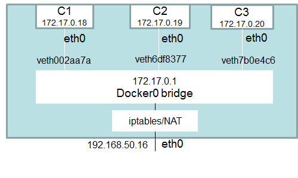

| [<-- Volver](20170815-Storage.md) |

## Networking

### Introducción

Cuando instalamos Docker, se crean por defecto 3 redes:

```bash
$ docker network ls
NETWORK ID          NAME                DRIVER
7fca4eb8c647        bridge              bridge
9f904ee27bf5        none                null
cf03ee007fb4        host                host
```

Los contenedores pueden conectarse a estas redes al momento de su creación con la opción ```--network```.
Si no especificamos ninguna opción, Docker conecta los contenedores a la red ```bridge``` por defecto.
Estas tres redes utilizan drivers dinsintos y por tanto tienen comportamientos también distintos, a continuación veremos una breve explicación de cada una de ellas:

#### bridge
La red ```bridge``` representa a la interface ```docker0``` en el host. Básicamente, al instalar Docker, se crea en el host una interface ```docker0``` que "mira" hacia el motor de Docker, se le asigna una dirección IP, y se la deja lista para que los containers que no definan ninguna red específica al momento de su creación se conecten a ella.

```bash
$ ifconfig
--> SALIDA OMITIDA PARA MAYOR CLARIDAD <--
docker0: flags=4163<UP,BROADCAST,RUNNING,MULTICAST>  mtu 1500
        inet 172.17.0.1  netmask 255.255.0.0  broadcast 0.0.0.0
        inet6 fe80::42:acff:fecb:1c79  prefixlen 64  scopeid 0x20<link>
        ether 02:42:ac:cb:1c:79  txqueuelen 0  (Ethernet)
        RX packets 8574  bytes 472977 (472.9 KB)
        RX errors 0  dropped 0  overruns 0  frame 0
        TX packets 17876  bytes 25736022 (25.7 MB)
        TX errors 0  dropped 0 overruns 0  carrier 0  collisions 0
--> SALIDA OMITIDA PARA MAYOR CLARIDAD <--
```

La red se llama ```bridge``` debido a que técnicamente es eso, un bridge, que interconecta en capa 2 a todos los contenedores que la utilizan, (y a la interface ```docker0``` del host). La interface ```docker0``` existe para que los contenedores conectados a la red ```bridge``` tengan conectividad con el exterior; esto se hace con un PAT utilizando la IP de dicha interface.

#### none
La red tipo ```none``` básicamente deja al contenedor aislado del mundo.
Veamos esto con un ejemplo, pero antes un breve ejercicio para preparar el ambiente de pruebas:

> **Ejercicio:**
>
> Crear una imagen llamada ```netubuntu``` basada en la imagen ubuntu, que tenga instalado el paquete ```net-tools```.

Ahora que contamos con la imagen ```netubuntu``` podemos verificar el funcionamiento de la red ```none``` con driver ```null```.


```bash
$ docker run -it --name my-none-container --rm --network=none netubuntu bash
root@68965d657e5d:/# ifconfig
lo        Link encap:Local Loopback  
          inet addr:127.0.0.1  Mask:255.0.0.0
          UP LOOPBACK RUNNING  MTU:65536  Metric:1
          RX packets:0 errors:0 dropped:0 overruns:0 frame:0
          TX packets:0 errors:0 dropped:0 overruns:0 carrier:0
          collisions:0 txqueuelen:1
          RX bytes:0 (0.0 B)  TX bytes:0 (0.0 B)
```


#### host
La red tipo ```host``` lo que hace es que el contenedor utiliza directamente el stack TCP/IP de la máquina host. Por lo que en lo que a red se refiere, el contenedor y el host son la misma cosa. Verfiquemos el funcionamiento de esta red:

```bash
$ docker run -it --name my-host-container --rm --network=host netubuntu bash
root@68965d657e5d:/# ifconfig
---> AQUÍ DEBERÍA VERSE EXACTAMENTE LO MISMO QUE EN EL HOST <---
```

Las redes ```none``` y ```host``` son bastante simples de comprender, no tanto así la red tipo ```bridge``` por lo que a continuación profundizaremos sobre esta última.

### Red tipo ```bridge```

La figura a continuación muestra gráficamente como sería la conexión de varios containers a la red ```bridge```.



Veamos como se vería la figura anterior en la consola, pero antes un breve ejercicio para preparar el ambiente de pruebas:

> **Ejercicio:**
>
> Actualizar la imagen ```netubuntu``` creada en el ejercicio anterior para que además incluya el paquete ```iputils-ping```.

Ahora que tenemos la imagen necesaria, armemos una topología y aprendamos como obtener la información de la misma en formato JSON.

```bash
$ docker run -d -it --name c1 --rm netubuntu bash
0c31832e576a9e082768eb0fbdb6271ffdbda8538a4894775b28f3c54540e00a
$ docker run -d -it --name c2 --rm netubuntu bash
4d723cf46218c94895bb87eb3097055869357fd56b1c8a0df4c863b4b4903129
$ docker run -d -it --name c3 --rm netubuntu bash
4d61c3f6b98b163680ac19c701778b4b7d2749898deef432bf13c30b404ef15e

$ docker network inspect bridge
[
    {
        "Name": "bridge",
        "Id": "64468e306e67651ad837ef871138ead91b79f33dd0cb7d4a6388ef8691002f1a",
        "Created": "2017-08-21T10:09:26.640394965-03:00",
        "Scope": "local",
        "Driver": "bridge",
        "EnableIPv6": false,
        "IPAM": {
            "Driver": "default",
            "Options": null,
            "Config": [
                {
                    "Subnet": "172.17.0.0/16",
                    "Gateway": "172.17.0.1"
                }
            ]
        },
        "Internal": false,
        "Attachable": false,
        "Ingress": false,
        "ConfigFrom": {
            "Network": ""
        },
        "ConfigOnly": false,
        "Containers": {
            "0c31832e576a9e082768eb0fbdb6271ffdbda8538a4894775b28f3c54540e00a": {
                "Name": "c1",
                "EndpointID": "f7b75d3e4988944deb3ed200348630b6f00da747096e25c89a1e6d1e80dc4090",
                "MacAddress": "02:42:ac:11:00:02",
                "IPv4Address": "172.17.0.2/16",
                "IPv6Address": ""
            },
            "4d61c3f6b98b163680ac19c701778b4b7d2749898deef432bf13c30b404ef15e": {
                "Name": "c3",
                "EndpointID": "537515aa3ae82b82e2c63b8b353c7b6dce3aa42ea84c62c96f3618f02720f1f4",
                "MacAddress": "02:42:ac:11:00:04",
                "IPv4Address": "172.17.0.4/16",
                "IPv6Address": ""
            },
            "4d723cf46218c94895bb87eb3097055869357fd56b1c8a0df4c863b4b4903129": {
                "Name": "c2",
                "EndpointID": "509d4210e10a4a57bd32690b5a3f00c48b83daca14a658f3481611641a20aa27",
                "MacAddress": "02:42:ac:11:00:03",
                "IPv4Address": "172.17.0.3/16",
                "IPv6Address": ""
            }
        },
        "Options": {
            "com.docker.network.bridge.default_bridge": "true",
            "com.docker.network.bridge.enable_icc": "true",
            "com.docker.network.bridge.enable_ip_masquerade": "true",
            "com.docker.network.bridge.host_binding_ipv4": "0.0.0.0",
            "com.docker.network.bridge.name": "docker0",
            "com.docker.network.driver.mtu": "1500"
        },
        "Labels": {}
    }
]
```

Notemos dentro de los campos del JSON retornado por el comando ```docker network inspect bridge``` la dirección de red ```172.17.0.0/16```, la dirección IP (```172.17.0.1```) correspondiente a la interface ```docker0``` y las direcciones MAC y direcciones IP de cada uno de los contenedores.

Comprobaremos ahora que los contenedores tienen conectividad IP entre si, con la interface ```docker0``` del host y con el mundo exterior.

> **Nota-1:** se puede salir de la consola de un contenedor sin apagarlo con la secuencia de comandos ```ctl+p,ctl+q```
> **Nota-2:** verficar además que no se puede resolver mediante DNS el nombre de los contenedores, en este caso ```c1```, ```c2``` y ```c3```


```bash
$ docker attach c1
root@0d1697247d1d:/#
root@0d1697247d1d:/# ping 172.17.0.3
PING 172.17.0.3 (172.17.0.3) 56(84) bytes of data.
64 bytes from 172.17.0.3: icmp_seq=1 ttl=64 time=0.145 ms
64 bytes from 172.17.0.3: icmp_seq=2 ttl=64 time=0.134 ms
64 bytes from 172.17.0.3: icmp_seq=3 ttl=64 time=0.138 ms
^C
--- 172.17.0.3 ping statistics ---
3 packets transmitted, 3 received, 0% packet loss, time 2048ms
rtt min/avg/max/mdev = 0.134/0.139/0.145/0.004 ms
root@0d1697247d1d:/# ping 172.17.0.4
PING 172.17.0.4 (172.17.0.4) 56(84) bytes of data.
64 bytes from 172.17.0.4: icmp_seq=1 ttl=64 time=0.285 ms
64 bytes from 172.17.0.4: icmp_seq=2 ttl=64 time=0.144 ms
64 bytes from 172.17.0.4: icmp_seq=3 ttl=64 time=0.207 ms
^C
--- 172.17.0.4 ping statistics ---
3 packets transmitted, 3 received, 0% packet loss, time 2055ms
rtt min/avg/max/mdev = 0.144/0.212/0.285/0.057 ms
root@0d1697247d1d:/# ping 172.17.0.1
PING 172.17.0.1 (172.17.0.1) 56(84) bytes of data.
64 bytes from 172.17.0.1: icmp_seq=1 ttl=64 time=0.257 ms
64 bytes from 172.17.0.1: icmp_seq=2 ttl=64 time=0.134 ms
64 bytes from 172.17.0.1: icmp_seq=3 ttl=64 time=0.116 ms
^C
--- 172.17.0.1 ping statistics ---
3 packets transmitted, 3 received, 0% packet loss, time 2052ms
rtt min/avg/max/mdev = 0.116/0.169/0.257/0.062 ms
root@0d1697247d1d:/# ping 8.8.8.8
PING 8.8.8.8 (8.8.8.8) 56(84) bytes of data.
64 bytes from 8.8.8.8: icmp_seq=1 ttl=51 time=36.6 ms
64 bytes from 8.8.8.8: icmp_seq=2 ttl=51 time=32.9 ms
64 bytes from 8.8.8.8: icmp_seq=3 ttl=51 time=33.5 ms
^C
--- 8.8.8.8 ping statistics ---
3 packets transmitted, 3 received, 0% packet loss, time 2003ms
rtt min/avg/max/mdev = 32.989/34.370/36.613/1.600 ms
```

```bash
$ docker attach c2
root@3fd032d1d648:/#
root@3fd032d1d648:/# ping 172.17.0.2
PING 172.17.0.2 (172.17.0.2) 56(84) bytes of data.
64 bytes from 172.17.0.2: icmp_seq=1 ttl=64 time=0.195 ms
64 bytes from 172.17.0.2: icmp_seq=2 ttl=64 time=0.144 ms
64 bytes from 172.17.0.2: icmp_seq=3 ttl=64 time=0.138 ms
^C
--- 172.17.0.2 ping statistics ---
3 packets transmitted, 3 received, 0% packet loss, time 2045ms
rtt min/avg/max/mdev = 0.138/0.159/0.195/0.025 ms
root@3fd032d1d648:/# ping 172.17.0.4
PING 172.17.0.4 (172.17.0.4) 56(84) bytes of data.
64 bytes from 172.17.0.4: icmp_seq=1 ttl=64 time=0.254 ms
64 bytes from 172.17.0.4: icmp_seq=2 ttl=64 time=0.048 ms
64 bytes from 172.17.0.4: icmp_seq=3 ttl=64 time=0.134 ms
^C
--- 172.17.0.4 ping statistics ---
3 packets transmitted, 3 received, 0% packet loss, time 2039ms
rtt min/avg/max/mdev = 0.048/0.145/0.254/0.085 ms
root@3fd032d1d648:/# ping 172.17.0.1
PING 172.17.0.1 (172.17.0.1) 56(84) bytes of data.
64 bytes from 172.17.0.1: icmp_seq=1 ttl=64 time=0.220 ms
64 bytes from 172.17.0.1: icmp_seq=2 ttl=64 time=0.132 ms
^C
--- 172.17.0.1 ping statistics ---
2 packets transmitted, 2 received, 0% packet loss, time 1031ms
rtt min/avg/max/mdev = 0.132/0.176/0.220/0.044 ms
root@3fd032d1d648:/# ping 8.8.8.8
PING 8.8.8.8 (8.8.8.8) 56(84) bytes of data.
64 bytes from 8.8.8.8: icmp_seq=1 ttl=51 time=36.6 ms
64 bytes from 8.8.8.8: icmp_seq=2 ttl=51 time=32.9 ms
64 bytes from 8.8.8.8: icmp_seq=3 ttl=51 time=33.5 ms
^C
--- 8.8.8.8 ping statistics ---
3 packets transmitted, 3 received, 0% packet loss, time 2003ms
rtt min/avg/max/mdev = 32.989/34.370/36.613/1.600 ms
```

```bash
$ docker attach c3
root@75cfce7d09c6:/#
root@75cfce7d09c6:/# ping 172.17.0.2
PING 172.17.0.2 (172.17.0.2) 56(84) bytes of data.
64 bytes from 172.17.0.2: icmp_seq=1 ttl=64 time=0.188 ms
64 bytes from 172.17.0.2: icmp_seq=2 ttl=64 time=0.134 ms
64 bytes from 172.17.0.2: icmp_seq=3 ttl=64 time=0.130 ms
^C
--- 172.17.0.2 ping statistics ---
3 packets transmitted, 3 received, 0% packet loss, time 2025ms
rtt min/avg/max/mdev = 0.130/0.150/0.188/0.030 ms
root@75cfce7d09c6:/# ping 172.17.0.3
PING 172.17.0.3 (172.17.0.3) 56(84) bytes of data.
64 bytes from 172.17.0.3: icmp_seq=1 ttl=64 time=0.186 ms
64 bytes from 172.17.0.3: icmp_seq=2 ttl=64 time=0.137 ms
^C
--- 172.17.0.3 ping statistics ---
2 packets transmitted, 2 received, 0% packet loss, time 1006ms
rtt min/avg/max/mdev = 0.137/0.161/0.186/0.027 ms
root@75cfce7d09c6:/# ping 172.17.0.1
PING 172.17.0.1 (172.17.0.1) 56(84) bytes of data.
64 bytes from 172.17.0.1: icmp_seq=1 ttl=64 time=0.251 ms
64 bytes from 172.17.0.1: icmp_seq=2 ttl=64 time=0.120 ms
64 bytes from 172.17.0.1: icmp_seq=3 ttl=64 time=0.118 ms
^C
--- 172.17.0.1 ping statistics ---
3 packets transmitted, 3 received, 0% packet loss, time 2030ms
rtt min/avg/max/mdev = 0.118/0.163/0.251/0.062 ms
root@75cfce7d09c6:/# ping 8.8.8.8
PING 8.8.8.8 (8.8.8.8) 56(84) bytes of data.
64 bytes from 8.8.8.8: icmp_seq=1 ttl=51 time=36.6 ms
64 bytes from 8.8.8.8: icmp_seq=2 ttl=51 time=32.9 ms
64 bytes from 8.8.8.8: icmp_seq=3 ttl=51 time=33.5 ms
^C
--- 8.8.8.8 ping statistics ---
3 packets transmitted, 3 received, 0% packet loss, time 2003ms
rtt min/avg/max/mdev = 32.989/34.370/36.613/1.600 ms
```

### Redes definidas por el usuario.

Adicional a las redes por defecto, ```bridge```, ```none``` y ```host```, que utilizan los drivers ```bridge```, ```null``` y ```host``` respectivamente, el usuario puede definir redes personalizadas utilizando no solo estos drivers sino otros que también están disponibles.
Con esta funcionalidad se pueden armar topologías de red complejas y controlar de forma granular la conectividad entre containers.
Veamos por ejemplo como podemos crear una un par de redes del tipo ```bridge``` y aislar los containers.


```bash
$ docker network create --driver bridge red1
9daf91cc58503d6b2f0594cacbb90691a8ac420593491f28940154bf1d703542
~
$ docker network create --driver bridge red2
4d37ca443e8a7e5d56d0410f65b8b6222f93555ddd8c4ec5e7df7c63b5f1711b
~
$ docker run -it -d --rm --name c1 --network red1 netubuntu bash
af8e9429257fb816009c8cc13d9f6b785b28c520999a970def24bcd90564de35
~
$ docker run -it -d --rm --name c2 --network red1 netubuntu bash
eb8df73513feb229e8c083e09773ed0329a98a7f362e8b1d46cca07348362a48
~
$ docker run -it -d --rm --name c3 --network red2 netubuntu bash
0677541e82a77736f3722a30703e934c6ee766fb0f4a576340fb316ac8511d52
~
$ docker run -it -d --rm --name c4 --network red2 netubuntu bash
7bdcda94ebf8284e855b2a150900721ac97c7dc54ec0c72f14a0d4a9b32a7014


$ docker network inspect red1
[
    {
        "Name": "red1",
        "Id": "9daf91cc58503d6b2f0594cacbb90691a8ac420593491f28940154bf1d703542",
        "Created": "2017-08-22T18:23:32.295424787-03:00",
        "Scope": "local",
        "Driver": "bridge",
        "EnableIPv6": false,
        "IPAM": {
            "Driver": "default",
            "Options": {},
            "Config": [
                {
                    "Subnet": "172.19.0.0/16",
                    "Gateway": "172.19.0.1"
                }
            ]
        },
        "Internal": false,
        "Attachable": false,
        "Ingress": false,
        "ConfigFrom": {
            "Network": ""
        },
        "ConfigOnly": false,
        "Containers": {
            "af8e9429257fb816009c8cc13d9f6b785b28c520999a970def24bcd90564de35": {
                "Name": "c1",
                "EndpointID": "a79b8ed77ccb2d5b0547b38f0dffd29fb2d831f2d29548ee444ae4a6b358b2a3",
                "MacAddress": "02:42:ac:13:00:02",
                "IPv4Address": "172.19.0.2/16",
                "IPv6Address": ""
            },
            "eb8df73513feb229e8c083e09773ed0329a98a7f362e8b1d46cca07348362a48": {
                "Name": "c2",
                "EndpointID": "5ff04fbc75e093eaddf49857e3d4e563d9026e1aa067f7e934b7ceb23189b641",
                "MacAddress": "02:42:ac:13:00:03",
                "IPv4Address": "172.19.0.3/16",
                "IPv6Address": ""
            }
        },
        "Options": {},
        "Labels": {}
    }
]
~
$ docker network inspect red2
[
    {
        "Name": "red2",
        "Id": "4d37ca443e8a7e5d56d0410f65b8b6222f93555ddd8c4ec5e7df7c63b5f1711b",
        "Created": "2017-08-22T18:23:36.539037996-03:00",
        "Scope": "local",
        "Driver": "bridge",
        "EnableIPv6": false,
        "IPAM": {
            "Driver": "default",
            "Options": {},
            "Config": [
                {
                    "Subnet": "172.20.0.0/16",
                    "Gateway": "172.20.0.1"
                }
            ]
        },
        "Internal": false,
        "Attachable": false,
        "Ingress": false,
        "ConfigFrom": {
            "Network": ""
        },
        "ConfigOnly": false,
        "Containers": {
            "0677541e82a77736f3722a30703e934c6ee766fb0f4a576340fb316ac8511d52": {
                "Name": "c3",
                "EndpointID": "77c16d0fff05951a2a6ce9d15f088e0535a21b30552cb9a15dcaeb0c245e972f",
                "MacAddress": "02:42:ac:14:00:02",
                "IPv4Address": "172.20.0.2/16",
                "IPv6Address": ""
            },
            "7bdcda94ebf8284e855b2a150900721ac97c7dc54ec0c72f14a0d4a9b32a7014": {
                "Name": "c4",
                "EndpointID": "ee5745061ff21e420c6805621372bc49b92576021fed8b928bcb22e7472097e4",
                "MacAddress": "02:42:ac:14:00:03",
                "IPv4Address": "172.20.0.3/16",
                "IPv6Address": ""
            }
        },
        "Options": {},
        "Labels": {}
    }
]

```

Probemos ahora la conectividad entre containers.

> **Nota:** verificar nuevamente si funciona la resolución DNS de los nombres de los containers.

```bash
$ docker attach c1
root@af8e9429257f:/#
root@af8e9429257f:/# ping c2
PING c2 (172.19.0.3) 56(84) bytes of data.
64 bytes from c2.red1 (172.19.0.3): icmp_seq=1 ttl=64 time=0.264 ms
64 bytes from c2.red1 (172.19.0.3): icmp_seq=2 ttl=64 time=0.190 ms
^C
--- c2 ping statistics ---
2 packets transmitted, 2 received, 0% packet loss, time 1001ms
rtt min/avg/max/mdev = 0.190/0.227/0.264/0.037 ms
root@af8e9429257f:/# ping c3
ping: unknown host c3
root@af8e9429257f:/# ping 172.20.0.3
PING 172.20.0.3 (172.20.0.3) 56(84) bytes of data.
^C
--- 172.20.0.3 ping statistics ---
3 packets transmitted, 0 received, 100% packet loss, time 2030ms
root@af8e9429257f:/# ping 8.8.8.8
PING 8.8.8.8 (8.8.8.8) 56(84) bytes of data.
64 bytes from 8.8.8.8: icmp_seq=1 ttl=51 time=258 ms
64 bytes from 8.8.8.8: icmp_seq=2 ttl=51 time=32.6 ms
64 bytes from 8.8.8.8: icmp_seq=3 ttl=51 time=37.6 ms
^C
--- 8.8.8.8 ping statistics ---
3 packets transmitted, 3 received, 0% packet loss, time 2002ms
rtt min/avg/max/mdev = 32.603/109.604/258.530/105.326 ms
```

```bash
$ docker attach c3
root@0677541e82a7:/#
root@0677541e82a7:/# ping c4
PING c4 (172.20.0.3) 56(84) bytes of data.
64 bytes from c4.red2 (172.20.0.3): icmp_seq=1 ttl=64 time=0.183 ms
64 bytes from c4.red2 (172.20.0.3): icmp_seq=2 ttl=64 time=0.142 ms
^C
--- c4 ping statistics ---
2 packets transmitted, 2 received, 0% packet loss, time 1005ms
rtt min/avg/max/mdev = 0.142/0.162/0.183/0.024 ms
root@0677541e82a7:/# ping c1
ping: unknown host c1
root@0677541e82a7:/# ping 172.19.0.2
PING 172.19.0.2 (172.19.0.2) 56(84) bytes of data.
^C
--- 172.19.0.2 ping statistics ---
6 packets transmitted, 0 received, 100% packet loss, time 5114ms
root@0677541e82a7:/# ping 8.8.8.8
PING 8.8.8.8 (8.8.8.8) 56(84) bytes of data.
64 bytes from 8.8.8.8: icmp_seq=1 ttl=51 time=59.4 ms
64 bytes from 8.8.8.8: icmp_seq=2 ttl=51 time=841 ms
64 bytes from 8.8.8.8: icmp_seq=3 ttl=51 time=50.3 ms
^C
--- 8.8.8.8 ping statistics ---
3 packets transmitted, 3 received, 0% packet loss, time 2000ms
rtt min/avg/max/mdev = 50.395/317.235/841.885/371.001 ms
```

### Publicación de puertos

Si bien por defecto los contenedores tienen conectividad con el mundo exterior, cuando las conexiones se inician desde afuera, estas son filtradas por la máquina host utilizando ```iptables```. Por otro lado, en general se busca que las redes generadas por el usuario no sean visibles directamente desde afuera de la máquina host; por tal motivo, los contenedores que publican servicios, lo hacen utilizando la IP exterior de dicho host.
Dicho esto, si nuestro contenedor corriera por ejemplo un Web server, por defecto este no sería accesible desde el exterior. Para comprobarlo hagamos lo siguiente:

```bash
$ docker run -d --rm --name prueba-web-server ghost
$ docker ps
CONTAINER ID        IMAGE               COMMAND                  CREATED             STATUS              PORTS               NAMES
bf393d45a5b3        ghost               "docker-entrypoint..."   29 seconds ago      Up 28 seconds       2368/tcp            prueba-web-server
```
Como podemos ver en la salida del comando ```docker ps```, el servidor Web está escuchando en el puerto 2368. Obtengamos ahora la IP del contenedor en la red ```bridge```:

```bash
$ docker inspect prueba-web-server
---> SALIDA OMITIDA PARA MAYOR CLARIDAD <---
  "Networks": {
      "bridge": {
          "IPAMConfig": null,
          "Links": null,
          "Aliases": null,
          "NetworkID": "feabe1d9ddd3a49d483dda5faf70ad4fe6e56fa225a47426e8363f32e08b6e53",
          "EndpointID": "cb27d16da1a9aa0064ed88869dcd0847056811dc3997713f40d7e7387032b36d",
          "Gateway": "172.17.0.1",
          "IPAddress": "172.17.0.2",
          "IPPrefixLen": 16,
          "IPv6Gateway": "",
          "GlobalIPv6Address": "",
          "GlobalIPv6PrefixLen": 0,
          "MacAddress": "02:42:ac:11:00:02",
          "DriverOpts": null
      }
  }
---> SALIDA OMITIDA PARA MAYOR CLARIDAD <---
````
Si ahora abrimos un explorador y navegamos a la url ```http://172.17.0.2:2368``` podemos comprobar que accedemos sin problemas. ¿Pero que sucede si utilizando el mismo navegador intentamos acceder a la url ```http://localhost:2368```?. Esto no funciona debido a que ```localhost``` está mapeado a una IP "exterior" del host y por defecto los contenedores no son accesibles dede afuera.
Para hacer que un contenedor pueda ser accesible desde afuera es necesario publicar dicho puerto al momento de la creación del contenedor; esto se hace utilizando la opción ```-p```. De esta forma, si ahora ejecutamos el siguiete comando:

```bash
$ docker run -d --rm --name prueba-web-server -p 2368 ghost
```

Docker publicará el puerto ```2368``` en un puerto alto (>30.000) **en todas las IPs** de la máquina host. Entre otros, se pueden utilizar estos comandos para identificar dicho puerto:

```bash
$ docker ps
CONTAINER ID        IMAGE               COMMAND                  CREATED             STATUS              PORTS                     NAMES
a1238d6842fa        ghost               "docker-entrypoint..."   2 minutes ago       Up 2 minutes        0.0.0.0:32768->2368/tcp   prueba-web-server
```

```bash
$ docker inspect prueba-web-server
---> SALIDA OMITIDA PARA MAYOR CLARIDAD <---
    "Ports": {
            "2368/tcp": [
                {
                    "HostIp": "0.0.0.0",
                    "HostPort": "32768"
                }
            ]
        },
---> SALIDA OMITIDA PARA MAYOR CLARIDAD <---
```

Para comprobar que esto funciona intente nuevamente navegar a la url ```http://localhost:2368```.
Si quisieramos tener mas control sobre el puerto elegido para publicar servicios en la máquina host podríamos correr:

```bash
$ docker run -d --rm --name prueba-web-server -p 80:2368 ghost
```
Para comprobar que esto funciona intente navegar a la url ```http://localhost```.
Si quisieramos además del puerto, poder controlar sobre que IP de la máquina host publicamos el servicio podríamos ejecutar:

```bash
$ docker run -d --rm --name prueba-web-server -p <ip-a-publicar>:80:2368 ghost
```

Para comprobar que funciona puede intentar navegar a ```http://<ip-a-publicar>``` y luego ver que si intenta acceder a ```http://localhost``` dicha url no responde.


| [<-- Volver](20170815-Storage.md) |
