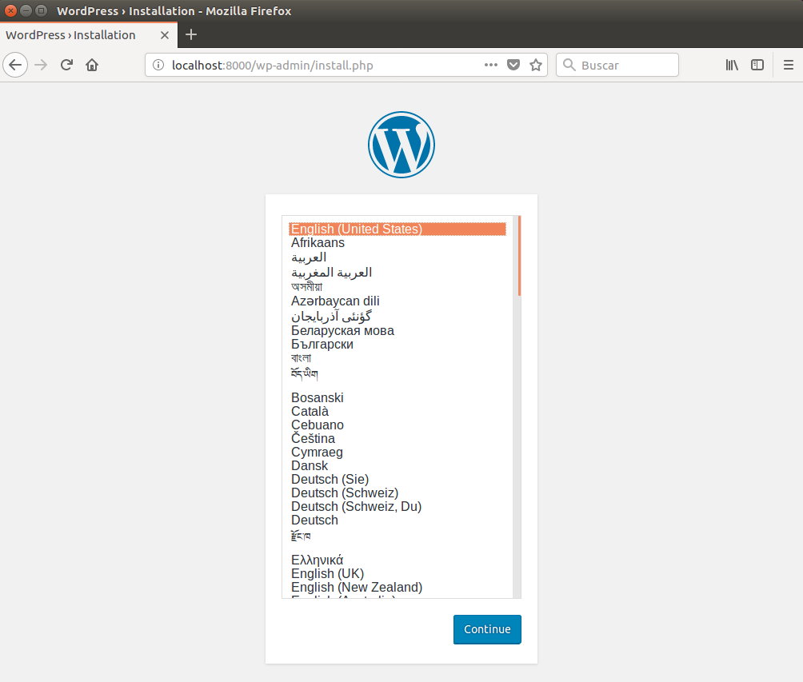

Docker Compose
===

Referencias:

* [Documentación oficial Docker Compose](https://docs.docker.com/compose/)

* [Compose file version 3 reference](https://docs.docker.com/compose/compose-file/)


Introducción
---
*Docker Compose* es una herramienta que permite definir y correr aplicaciones Docker multi-contentedor.

A medida que las aplicaciones son mas complejas, es razonable distribuirlas en múltiples contenedores. Por ej. aplicaciones basadas en microservicios son apropiadas para usar múltiples contenedores, un contenedor con una base de datos, otro con un servidor web, un sistema de mensajería en otro, etc., etc.
Crear estos contenedores en forma manual (*docker run*) resultará poco práctico y no es la mejor opción.

Con Docker Compose podemos definir nuestra aplicación multicontenedor utilizando un archivo de configuración, que contiene las definiciones de todos los contenedores que necesitamos, y con **un único comando podemos iniciar todos los contenedores**, con las relaciones entre ellos y en el orden indicado.

Este archivo de configuración, en formato *yaml*, no solo nos sirve para poder iniciar los contenedores, sino que también es útil como documentación de la aplicación, dado que incluye toda la información sobre sus contenedores, imágenes, volúmenes, networking, y el resto de las características.


## Instalando Docker Compose

Docker Compose se puede instalar de varias formas, recomendamos realizar la instalación mediante una de estas dos alternativas.

Nota: Al momento de escribir este tutorial, instalar Docker Compose mediante *apt-get* nos ha dado problemas, dado que la versión instalada no soporta el archivo de configuración *version 3* que es el que utilizamos en este tutorial. Por tanto no recomendamos por el momento instalar de esta forma.


#### Alternativa 1: Instalación mediante *curl*

```bash
$ sudo curl -L https://github.com/docker/compose/releases/download/1.22.0/docker-compose-$(uname -s)-$(uname -m) -o /usr/local/bin/docker-compose
```

Para instalar la última versión, en el comando anterior debemos indicar el último release disponible, el cual lo podemos ver aquí: [Compose repository release page on GitHub](https://github.com/docker/compose/releases).

Luego de finalizada la instalación debemos aplicar permiso de ejecución al binario:

```bash
$ sudo chmod +x /usr/local/bin/docker-compose
```


#### Alternativa 2: Instlación mediante *pip*

Si tenemos instalado `pip` (o lo instalamos), podemos usar esta alternativa:

```bash
$ sudo pip install docker-compose
```


#### Verificación de la instalación:

```bash
$ sudo docker-compose --version
docker-compose version 1.21.2, build 1719ceb
```


## Como funciona Docker Compose

Docker Compose se basa en la utilización de un archivo de configuración en formato *yml*, donde vamos a indicar los servicios que queremos desplegar. Esto incluye, entre otras cosas, que imagen de contenedor vamos a utilizar, su configuración, las dependencias entre contenedores, los volúmenes de disco, la configuración de las redes, etc.

Las dependencias permiten no solo crear los contenedores en determinado orden, sino que además, si un contenedor depende de otro, el *contendor hijo* no será creado hasta que el *contenendor padre* exista y esté corriendo.

Este archivo también podemos usarlo para eliminar (bajar) nuestro ambiente una vez que ya no lo necesitamos, y es una fuenta de documentación muy precisa sobre el mismo.


## Desplegando los servicios

Para entender el contenido del archivo *docker-compose.yml* y como realizar el despliegue del mismo, realizaremos algunos ejercicios.


#### Ejercicio 20:

En este ejercicio vamos a crear dos servicios simples, llamados *db-server* y *web-server*.

1. Crear un directorio para nuestro proyecto.

   Este directorio debería contar únicamente con los elementos necesarios para el ambiente que vamos a crear. Si bien en este caso tendrá unicamente el archivo *docker-compse.yml* podríamos incluir aquí dentro cualquier otro recurso necesario (ej. Dockerfiles). Esto nos permite mantener ordenada y actualizada toda la documentación específica de nuestro proyecto.

   ```bash
   $ mkdir compose01
   $ cd compose01
   ```


2. Crear el archivo *docker-compose.yml* con el siguiente contenido:

   ```bash
   version: '3'

   services:
     db-server:
       image: ubuntu
       container_name: "dbserver01"
       command: /bin/bash
       stdin_open: true
       tty: true

     web-server:
       image: ubuntu
       container_name: "webserver01"
       command: /bin/bash
       depends_on:
         - db-server
       stdin_open: true
       tty: true
   ```

   En este caso para hacer un ejemplo sencillo, simplemente estamos utilizando una imagen de *ubuntu* para nuestros dos servicios.

   Las opciones `stdin_open: true` y `tty: true` permiten dejar abierta la stdin y la terminal conectada, de forma que el comando `/bin/bash` quede ejecutando. Si no hacemos esto, el `bash` se ejecuta, termina inmediatamente, y el contenedor se apaga. Esto es análogo a correr a mano el comando `docker run -it` que vimos anteriormente.

3. Realizar el despliegue de los servicios, mediante el comando  `docker-compose up -d` desde el directorio que contiene el archivo *docker-compose.yml*.

   ```bash
   $ docker-compose up -d
   Creating network "compose01_default" with the default driver
   Creating dbserver01 ... done
   Creating webserver01 ... done
   $
   ```

   La opción `-d` hace que el deploy corra en segundo plano (*detached*), ejcutando como servicio. 

   Si no ponemos esta opción el comando quedará en primer plano, y de veremos los logs de todos los contenedores. Esto puede ser útil para diagnosticar algún problema, como contra, si lo cortamos (ctrl-c) detendrá la ejecución de todos los contenedores generados.

   En este caso el despliegue es muy rapido, dado que utilizamos la imagen de *ubuntu* que se encuentra almacenada localmente. Si la imagen no estuviera local la descargará del repositorio de [dockerhub](https://hub.docker.com/).


4. Una vez finalizado el despliegue, podemos verificar si los dos contenedores están corriendo:

   ```bash
   $ docker ps
   CONTAINER ID        IMAGE               COMMAND             CREATED             STATUS              PORTS               NAMES
   ffce08dd859c        ubuntu              "/bin/bash"         7 seconds ago       Up 6 seconds                            webserver01
   c7743be062e6        ubuntu              "/bin/bash"         8 seconds ago       Up 7 seconds                            dbserver01
   ```


5. Para detener todos los servicios, lo hacemos mediante el comando  `docker-compose down`:

   ```bash
   $ docker-compose down
   Stopping webserver01 ... done
   Stopping dbserver01  ... done
   Removing webserver01 ... done
   Removing dbserver01  ... done
   Removing network compose01_default
   
   $ docker ps
   CONTAINER ID        IMAGE               COMMAND             CREATED             STATUS              PORTS               NAMES
   
   ```


## Contenido del archivo *docker-compose.yml*

Como vimos , el nombre por defecto para el archivo de configuración es *docker-compose.yml*.

Si bien podemos utilizar otro nombre, tendremos que pasarselo a cada uno de los comandos que ejecutemos, por lo cual recomendamos utilizar siempre el nombre por defecto, y crear directorios particulares para cada proyecto (como hicimos en el ejemplo anterior).

Este archivo contiene 3 secciones principales, las cuales son:

- **services:** contiene la configuración de cada uno de los servicios que vamos a levantar, esto es, cada contenedor y sus opciones.
- **volumes:** contiene la configuración de los volumenes de disco que vamos a utilizar. Si bien es posible declarar los volumenes de cada contenedor dentro de la sección de *services:*, hacerlo en esta sección nos permite crear volumenes con nombres, que puedan ser reutilizados y facilmente referenciados desde múltiples servicios.  
- **networks:** contiene la configuración de las redes que vamos a utilizar para los servivios. Si no definimos esta sección, se utilizará una red por defecto para todos los servicios.

Veamos las opciones principales dentro de cada una de estas secciones.


### Definición de *services:*

En la sección **services:** es donde definimos todos los servicios que vamos a levantar en nuestro ambiente.

***service-name***: es un nombre que permite identificar el el servicio que estamos creando. Es un nombre arbitrario que seleccionamos nosotros, que nos permite diferenciar cada uno de los contenedores que vamos a levantar en nuestro ambiente, por ejemplo: *web-server*, *db-server*.

**container_name:** es el nombre que le va a dar al contenedor cuando levante el servicio. Es opcional, si no lo indicamos va a utilizar un nombre generado por defecto.

**image:** es la imagen que vamos a utilizar para crear el contenedor. En caso de no encontrarla localmente la itentará bajar del repositorio de github.

**build:** si en lugar de utilizar una imagen existente queremos crear nuestra propia imagen a partir de un *Dockerfile*, es aquí donde le indicamos el directorio donde se encuentra el mismo.

**command:** comando que le pasamos al contenedor para que corra al momento de ejecución.

**ports:** permite mapear puertos al contenedor en formato `host_port:container_port `

**environment:** perminte pasarle variables de entorno al contenedor en formato `VARIABLE=valor `

**depends_on:** indica dependencia con otro(s) contenedor(es). El contenedor no va a levanta si los contenedores de los cuales depende no se encuentran corriendo. Los contenedores son iniciados/bajados siguiendo el orden necesario de acuerdo a las dependencias establecidas.

**network**: indica las redes va a utilizar el servicio.

**volumes:** indica los volumenes de disco que vamos a acceder desde el servicio.

Veamos con un ejemplo, como acceder con docker compose a un directorio local del host (*bind mount*):

1. Iniciemos nuevamente nuestros servicios:

   ```bash
   $ docker-compose up -d
   Creating network "compose01_default" with the default driver
   Creating dbserver01 ... done
   Creating webserver01 ... done
   
   $ docker ps
      CONTAINER ID        IMAGE               COMMAND             CREATED             STATUS              PORTS               NAMES
      51b6c6d19029        ubuntu              "/bin/bash"         5 seconds ago       Up 4 seconds                            webserver01
      5c8c67e6ebc4        ubuntu              "/bin/bash"         5 seconds ago       Up 4 seconds                            dbserver01
   ```

2. En el mismo directorio de nuestro proyecto, crear un directorio `./data`, el cual montaremos dentro de uno de los servicios:

   ```bash
   $ mkdir data
   $ touch data/test.txt
   ```


3. Editemos el archivo *docker-compose.yml*, agregando el directorio que queremos montar desde el host (bind mount) al servicio *web-server*:

   ```bash
   version: '3'

   services:
     db-server:
       image: ubuntu
       container_name: "dbserver01"
       command: /bin/bash
       stdin_open: true
       tty: true

     web-server:
       image: ubuntu
       container_name: "webserver01"
       command: /bin/bash
       depends_on:
         - db-server
       stdin_open: true
       tty: true
       volumes:
         - ./data:/mnt/data

   ```

   Esto monta el directorio local `./data` del host, en el direcotrio `/mnt/data` dentro del contenedor creado para el servicio `web-server`.


4. Para reflejar los cambios realizados hacemos:

   ```bash
   $ docker-compose up -d
   dbserver01 is up-to-date
   Recreating webserver01 ... done
   ```


   Si nos conectamos al contenedor, podemos ver que el directorio local fue montado:

   ```bash
   $ docker attach webserver01
   root@e4be32bbc206:/#
   root@e4be32bbc206:/# ls -l /mnt/data
   total 0
   -rw-rw-r-- 1 1000 1000 0 Aug 21 23:17 test.txt
   ```

**nota:** recuerde que para salir del contenedor luego de hacer el `attach` debe hacer <ctrl-p-q>, de lo contrario terminará el proceso bash que estaba ejecutando, y por tanto el contenedor finalizará su ejecución.

Podemos hacer las definiciones de esta forma, dentro de la sección **services:** para cada uno de los servicios que requieran acceso a disco. Pero si quisieramos utilizar volumenes de docker, y además poder accederlos desde múltiples servicios de forma mas clara y ordenada, es preferible definirlos utilizando la sección **volumes:** como veremos a continuación.


### Definición de *volumes:*

Editemos nuevamente el archivo *docker-compose.yml*, realizando los siguientes cambios:

```bash
version: '3'

services:
  db-server:
    image: ubuntu
    container_name: "dbserver01"
    command: /bin/bash
    stdin_open: true
    tty: true
    volumes:
      - db-volume:/base

  web-server:
    image: ubuntu
    container_name: "webserver01"
    command: /bin/bash
    depends_on:
      - db-server
    stdin_open: true
    tty: true
    volumes:
      - ./data:/mnt/data

  backup-server:
    image: ubuntu
    container_name: "backupserver"
    command: /bin/bash
    stdin_open: true
    tty: true
    volumes:
      - db-volume:/backup/base

volumes:
  db-volume:
```


En este ejemplo, creamos un volumen `db-volume` que es utilizado por el servicio *db-server*  y es compartido con un nuevo servicio *backup-server* que agregamos. Ambos servicios utilizan el mismo volumen, que esta vez lo definimos en la sección **volumes:** , y lo montan en diferentes ubicaciones:

Volvemos a refrescar nuestros servicios:

```bash
$ docker-compose up -d
Creating volume "compose01_db-volume" with default driver
Recreating dbserver01 ... done
Creating backupserver  ... done
Recreating webserver01 ... done


$ docker ps
CONTAINER ID        IMAGE               COMMAND             CREATED             STATUS              PORTS               NAMES
cfa28d9f11bd        ubuntu              "/bin/bash"         11 seconds ago      Up 10 seconds                           webserver01
6dae219d5ac6        ubuntu              "/bin/bash"         12 seconds ago      Up 10 seconds                           dbserver01
94f5d5cb6abb        ubuntu              "/bin/bash"         12 seconds ago      Up 9 seconds                            backupserver
```


Podemos ver que además de crear el nuevo servicio *backupserver*, se crea también un volumen:

```bash
$ docker volume ls
DRIVER              VOLUME NAME
...
local               compose01_db-volume
...
```


Nuevamente, podemos conectarnos a ambos contenedores y acceder al volumen en el punto de montaje correspondiente: 

```bash
$ sudo docker attach dbserver01
root@6dae219d5ac6:/# 
root@6dae219d5ac6:/# cd /base
root@6dae219d5ac6:/base# touch archivo1.txt
root@6dae219d5ac6:/base# ls -l
total 0
-rw-r--r-- 1 root root 0 Aug 22 01:06 archivo1.txt
root@6dae219d5ac6:/base#
<ctrl-pq>


$ sudo docker attach backupserver
root@94f5d5cb6abb:/# 
root@94f5d5cb6abb:/# ls -l /backup/base/
total 0
-rw-r--r-- 1 root root 0 Aug 22 01:06 archivo1.txt
root@94f5d5cb6abb:/# 
<ctrl-pq>

```


##### Accediendo a volumenes mediante driver específico

Si vemos nuevamente nuestro *docker-compose.yml*, dentro de la sección `volumes:` lo que agregamos es el volumen que será creado al correr el comando `docker-compose up`.

En nuesto caso esta entrada  `db-volume:` se encuentra vacía, por lo cual para acceder a dicho volumen se va a utilizar el driver por defecto del Docker Engine (generalmente es el driver `local`).  

```bash
volumes:
  db-volume:
```


Si quisieramos, podemos indicar que driver utilizar, así como pasarle opciones al mismo. Por ejemplo:

```
volumes:
  db-volume:
    driver: vieux/sshfs:latest
    driver_opts:
      sshcmd: "conatel@sshserver.labs.conatest.click:/home/conatel"
      password: "docker101"
```

En este caso utilizamos el driver *sshfs* que ya vimos anteriormente, que permite montar un volumen desde un servidor ssh. 


##### Accediendo a volumenes externos

En todos los casos anteriores, el comando `docker-compose up`se encarga de crear el volumen que estamos definiendo dentro de la sección `volumes:` del archivo *docker-compose.yml*. Esto lo verificamos al hacer un `docker volume ls`. Pero si ya tuvieramos creardo un volumen, definido previamente, e intentamos accederlo de esta misma forma, vamos a obtener un error.

Para esto, podemos acceder a **volumenes externos** que hayan sido definidos previamente. En este caso, el comando `docker-compose up` no intentará crear el volumen, sino que buscará el volumen ya creado. Claro que, en caso de que el volumen no exista, el comando terminará con error.

Veamos esto con el siguiente ejercicio. Primero creamos un volumen:

```bash
$ docker volume create mi-volumen-externo
mi-volumen-externo

$ docker volume ls
DRIVER              VOLUME NAME
local               mi-volumen-externo
```


Y en el archivo *docker-compose.yml* agregamos este volumen como externo, al servicio *db-server*:

```bash
version: '3'

services:
  db-server:
    image: ubuntu
    container_name: "dbserver01"
    command: /bin/bash
    stdin_open: true
    tty: true
    volumes:
      - db-volume:/base
      
  web-server:
    image: ubuntu
    container_name: "webserver01"
    command: /bin/bash
    depends_on:
      - db-server
    stdin_open: true
    tty: true
    volumes:
      - ./data:/mnt/data

  backup-server:
    image: ubuntu
    container_name: "backupserver"
    command: /bin/bash
    stdin_open: true
    tty: true
    restart: always
    volumes:
      - db-volume:/backup/base
      - mi-volumen-externo:/mi-volumen
  
volumes:
  db-volume:
  mi-volumen-externo: 
    external: true
```

Nuevamente, podemos conectarnos al *backupserver* y ver que el puedo acceder al volumen montado en `/mi_volumen`. 


##### Eliminación de volumenes

Si bajamos nuestro ambiente, los volumenes creados en la sección *volumes:* por defecto no son eliminados:

```bash
$ docker-compose down
Stopping webserver01  ... done
Stopping backupserver ... done
Stopping dbserver01   ... done
Removing webserver01  ... done
Removing backupserver ... done
Removing dbserver01   ... done
Removing network compose01_default

$ docker volume ls
DRIVER              VOLUME NAME
...
local               compose01_db-volume
...
local               mi-volumen-externo
...
```


Para eliminar los volumenes definidos en *volumes:* debemos agregarle `-v` o `--volumes` (para probarlo, iniciemos los servicios antes):

```bash
$ docker-compose up -d
...

$ docker-compose down -v
Stopping webserver01  ... done
Stopping backupserver ... done
Stopping dbserver01   ... done
Removing webserver01  ... done
Removing backupserver ... done
Removing dbserver01   ... done
Removing network compose01_default
Removing volume compose01_db-volume
Volume mi-volumen-externo is external, skipping

$ docker volume ls
DRIVER              VOLUME NAME
...
local               mi-volumen-externo
...
```

Como se puede ver los volumenes definidos como externos no son eliminados desde docker compose.


#### Definición de Networks:

xxx

```bash
$ volumes:
      - ./data:/mnt/data
```

xxx


#### Ejercicio 20:

1. Crear un directorio para nuestro proyecto.

   Este directorio debería contar únicamente con los elementos necesarios para el ambiente que vamos a crear. Si bien en este caso tendría unicamente el archivo *docker-compse.yml* podríamos incluir aquí dentro cualquier otro recurso necesario (ej. Dockerfiles). Esto nos permite mantener ordenada y actualizada toda la documentación específica de nuestro proyecto.

   ```bash
   $ mkdir my_wordpress
   $ cd my_wordpress
   ```


2. Crear el archivo *docker-compose.yml* con el siguiente contenido:

   ```bash
   version: '3.3'
   
   services:
      db:
        image: mysql
        container_name: "db"
        volumes:
          - db_data:/var/lib/mysql
        environment:
          MYSQL_ROOT_PASSWORD: somewordpress
          MYSQL_DATABASE: wordpress
          MYSQL_USER: wordpress
          MYSQL_PASSWORD: wordpress
   
      wordpress:
        image: wordpress
        container_name: "wordpress"
        depends_on: [db]
        ports:
          - "8000:80"
        environment:
          WORDPRESS_DB_HOST: db:3306
          WORDPRESS_DB_USER: wordpress
          WORDPRESS_DB_PASSWORD: wordpress
   volumes:
       db_data:
   
   ```


3. Realizar el despliegue, mediante el comando  `docker-compose up -d` desde el directorio que creamos, que contiene el archivo *docker-compose.yml*.

   La opción `-d` hace que el deploy corra en segundo plano (*detached*), ejcutando como servicio. Si no ponemos esta opción el comando quedará en primer plano, y de veremos los logs de todos los contenedores. Esto puede ser útil para diagnosticar algún problema, como contra, si lo cortamos (ctrl-c) detendrá la ejecución de todos los contenedores generados.

   Por otro lado, y como ya hemos visto, si no tenemos las imagenes almacenadas localmente, las descargará del repositorio desde [dockerhub](https://hub.docker.com/).


   ```bash
   $ sudo docker-compose up -d
   Creating volume "my_wordpress_db_data" with default driver
   Pulling db (mysql:latest)...
   latest: Pulling from library/mysql
   be8881be8156: Already exists
   c3995dabd1d7: Pull complete
   9931fdda3586: Downloading [================>                                  ]  1.522MB/4.499MB
   bb1b6b6eff6a: Download complete
   a65f125fa718: Download complete
   2d9f8dd09be2: Downloading [=====>                                             ]  1.293MB/12.09MB
   37b912cb2afe: Waiting
   faf9da46e0cf: Waiting
   ...
   ...
   ...
   02243b284270: Pull complete
   Digest: sha256:e25e2768e910223db3095c1560aa2255371986b24fbebf4b015bae3cc60b9b34
   Status: Downloaded newer image for mysql:latest
   Pulling wordpress (wordpress:latest)...
   latest: Pulling from library/wordpress
   be8881be8156: Already exists
   69a25f7e4930: Pull complete
   ...
   ...
   ...
   61b17faecc30: Pull complete
   c85ae8a39ff7: Pull complete
   Digest: sha256:d92a0d4e9aae885789af8538bb8afe8624c23cb5d763dcc1d3a2e4ac57531d21
   Status: Downloaded newer image for wordpress:latest
   Creating my_wordpress_db_1 ... done
   Creating my_wordpress_wordpress_1 ... done
   ```


4. Una vez finalizado el despliegue, podemos verificar si los dos contenedores están corriendo:

   ```bash
   $ sudo docker ps
   CONTAINER ID        IMAGE               COMMAND                  CREATED             STATUS              PORTS                  NAMES
   8e8771bccefe        wordpress:latest    "docker-entrypoint..."   5 minutes ago       Up 5 minutes        0.0.0.0:8000->80/tcp   my_wordpress_wordpress_1
   8724f78e61a0        mysql:latest        "docker-entrypoint..."   5 minutes ago       Up 5 minutes        3306/tcp, 33060/tcp    my_wordpress_db_1
   ```


## **ABRIR EL PUERTO 8080 EN AWS PARA QUE ESTO FUNCIONE**


Y además podemos acceder al servicio wordpress desde un navegador:




Y también podemos ver que tenemos las nuevas imagenes que fueron descargadas en forma local:

```bash
$ sudo docker images
REPOSITORY            TAG                 IMAGE ID            CREATED             SIZE
wordpress             latest              e2c4085bbc2b        2 days ago          408MB
mysql                 latest              29e0ae3b69b9        2 days ago          372MB
...
...
```


5. Para detener los contenedores en forma ordenada, lo hacemos mediante el comando  `docker-compose down` desde el directorio que creamos, que contiene el archivo *docker-compose.yml*.

   ```bash
   $ sudo docker-compose down
   Stopping my_wordpress_wordpress_1 ... done
   Stopping my_wordpress_db_1        ... done
   Removing my_wordpress_wordpress_1 ... done
   Removing my_wordpress_db_1        ... done
   Removing network my_wordpress_default
   ```


   Podemos ver que los contenedores ya no se encuentra corriendo:

   ```bash
   $ sudo docker ps
   CONTAINER ID        IMAGE               COMMAND             CREATED             STATUS              PORTS               NAMES

   ```


   Y las imágenes que fueron descargadas durante el proceso de despliegue, siguen estando almacenadas localmente:

   ```bash
   $ sudo docker images
   REPOSITORY            TAG                 IMAGE ID            CREATED             SIZE
   wordpress             latest              e2c4085bbc2b        2 days ago          408MB
   mysql                 latest              29e0ae3b69b9        2 days ago          372MB
   ...
   ```


   Por lo tanto si realizáramos el despliegue nuevamente con  `docker-compose up -d` , el proceso será muy rápido:

   ```bash
   $ sudo docker-compose up -d
   Creating network "my_wordpress_default" with the default driver
   Creating my_wordpress_db_1 ... done
   Creating my_wordpress_wordpress_1 ... done


   $ sudo docker ps -a
   CONTAINER ID        IMAGE               COMMAND                  CREATED             STATUS              PORTS                  NAMES
   a4e556375891        wordpress:latest    "docker-entrypoint..."   3 seconds ago       Up 2 seconds        0.0.0.0:8000->80/tcp   my_wordpress_wordpress_1
   83fb7904980c        mysql:5.7           "docker-entrypoint..."   4 seconds ago       Up 3 seconds        3306/tcp, 33060/tcp    my_wordpress_db_1


   $ sudo docker-compose down
   Stopping my_wordpress_wordpress_1 ... done
   Stopping my_wordpress_db_1        ... done
   Removing my_wordpress_wordpress_1 ... done
   Removing my_wordpress_db_1        ... done
   Removing network my_wordpress_default
   ```


xxxxxx


```bash
$ docker-compose --version
docker-compose version 1.21.2, build 1719ceb
```


```
version: "3"
services:
  appserver1:
    image: "conatel/appserver1"
    container_name: "appserver1"
    depends_on: [dbserver1]
    environment:
      - MYSQL_DATABASE=grupo1
      - DMZ_IP=172.18.0.3
      - BACKEND_IP=172.18.1.3
    networks:
      dmz:
        ipv4_address: ${DMZ_IP}
      backend:
        ipv4_address: ${BACKEND_IP}
  appserver2:
    image: "conatel/appserver2"
    container_name: "appserver2"
    networks:
      dmz:
        ipv4_address: 172.18.0.4
  webserver1:
    image: "conatel/webserver1"
    container_name: "webserver1"
    environment:
      - DMZ_IP=172.18.0.2
    ports:
      - "80:80"
    networks:
      dmz:
        ipv4_address: ${DMZ_IP}
  webserver2:
    image: "conatel/webserver2"
    container_name: "webserver2"
    ports:
      - "8080:8080"
    networks:
      dmz:
        ipv4_address: 172.18.0.5
      backend:
        ipv4_address: 172.18.1.5
  dbserver1:
    image: "mysql"
    container_name: "dbserver1"
    environment:
      - MYSQL_DATABASE=grupo1
      - MYSQL_ROOT_PASSWORD=password
      - BACKEND_IP=172.18.1.2
    networks:
      backend:
        ipv4_address: ${BACKEND_IP}

networks:
  dmz:
    driver: bridge
    ipam:
      driver: default
      config:
        - subnet: 172.18.0.0/24
  backend:
    driver: bridge
    ipam:
      driver: default
      config:
        - subnet: 172.18.1.0/24

```
