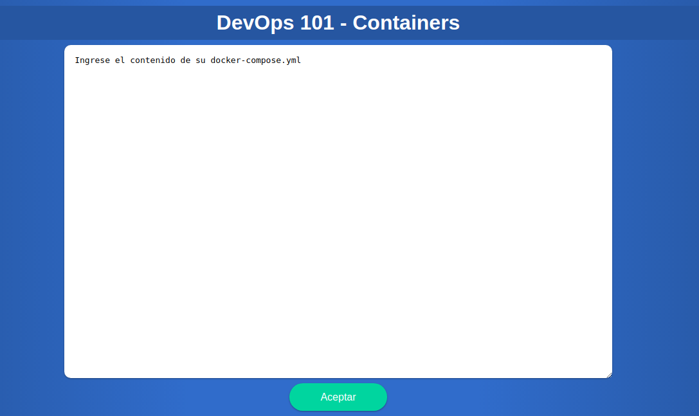

# Desafío final

## Objetivo

El objetivo del desafío final es elaborar la topología que se muestra en a figura mas arriba utilizando `docker-compose` y ponerla a correr en el servidor utilizado para los laboratorios.

Una vez que esta topología esté corriendo, se debe acceder mediante un navegador web a la url del servidor: http://servernumx.labs.conatest.click. Esto desplegará una página como sigue:

Dentro del cuadro de texto, se debe pegar el contenido del archivo `docker-compose.yml` que se utilizó para levantar la aplicación y hacer click en "Aceptar". Esto enviará el el contenido del cuadro de texto al grupo de `Webex Teams` que se está utilizando identificando el mensaje como proveniente del "grupox" tomando el dato de la variable de entorno `GRUPO` configurada en `appserver2`.

Si todo sale bien, además de recibirse el mensaje en el grupo de `Webex Teams` se debería desplegar la siguiente página:

