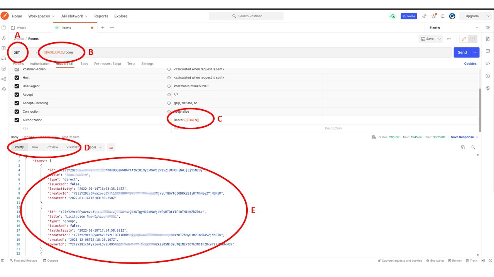
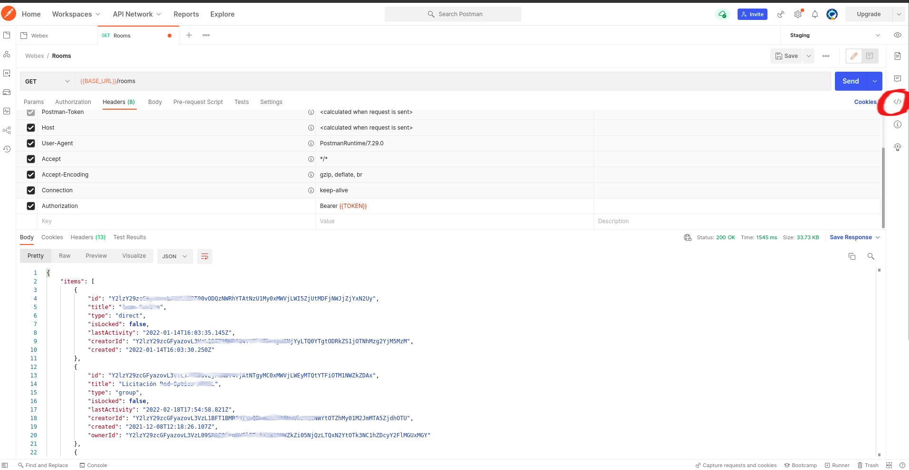
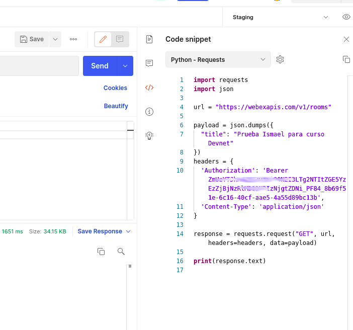

# REST

## Vista general de APIs

Comenzaremos nuestra discusión de `network programmability` analizando qué es una API y por que este tipo de interfaces son tan importantes. Empecemos por asegurarnos que tenemos una buena base comenzando con algunas definiciones.

Una API (Application Programming Interface) es una forma para que dos piezas de software intercambien información. Se puede hacer un paralelismo con las interfaces Web que los usuarios utilizamos para interactuar con las aplicaciones; estas interfaces nos presentan un flujo de trabajo determinado que nos permite visualizar información o ejecutar acciones. Del mismo modo, la API de una pieza de software presenta un flujo de trabajo determinado que hace posible que otra pieza de software pueda intercambiar información o ejecutar acciones.

Una API es similar en concepto. En lugar de que los humanos interactúen con el software, el software interactúa con el software. En lugar de tener un punto humano y hacer clic en un flujo de trabajo, una API expone la funcionalidad a otra aplicación.

Para qué hacer esto? Una de las razones es que esto permite el desarrollo de aplicaciones ricas con una amplia variedad de funciones. Veamos un ejemplo.

Supongamos que es el creador de una aplicación de recomendación de restaurantes y desea integrar fácilmente la capacidad de devolver una lista de restaurantes relevantes en el área con una aplicación de mapa que muestra dónde están los restaurantes en relación con su ubicación. ¿Crearías esta funcionalidad desde cero? Probablemente no.

Hacerlo probablemente lo alejaría de su experiencia principal. Además, piense en todo el riesgo y la curva de aprendizaje necesarios para construir algo así desde cero. En su lugar, sería mejor aprovechar un tercero que ya ofrece esa funcionalidad e integrar la funcionalidad en sus aplicaciones.

Un buen ejemplo es un servidor de mapas. En lugar de crear la funcionalidad de mapas desde cero, puede utilizar una API proporcionada por el servidor de mapas para integrar la funcionalidad de mapas rápidamente en su aplicación.


## Obtener acceso a la API REST de Webex Teams

Durante el resto del curso estaremos utilizando la API REST de Webex, una herramienta de colaboración de Cisco, para interactuar con ella de forma programática.
Para poder explorar e interactuar con la API es necesario tener una cuenta de desarrollador y un access Token. Los access Tokens son credenciales para autenticar a programas de computadoras que interactúan con otros a través de APIs. En este curso cada quien tendrá su propio access token individual y lo utilizará para autenticar sus scripts contra la API de Webex.

Para obtener nuestro access token:

1.  Ir al sitio de desarrollador de Webex, [Webex developer site](https://developer.webex.com/).
2.  Click en `Signup` para crear una cuenta (en caso de no contar con una).
3.  Login con las credenciales generadas en el punto anterior.
4.  Click en 'Go to Docs'
5.  En el menú de la izquierda seleccionar 'APIs --> Getting Started'
6.  Copiar y guardar su Token personal.


> Nota: se puede llegar al mismo sitio a través de https://developer.webex.com/docs/getting-started

Ahora que ya tenemos nuestro Access Token, comencemos!

## ¿Qué es servicio web (Web service) REST?

En general, un servicio web es un mecanismo para que dos sistemas informáticos se comuniquen. En los últimos 20 años se han utilizado dos tipos principales de servicios web - REST y SOAP. Sin embargo, en los últimos 10 años, el enfoque planteado por REST se ha vuelto cada vez mas popular.

Entonces ¿Qué es REST?. REST (Representational State Transfer) es una arquitectura para desarrollar aplicaciones en red. Los servicios Web REST son sencillos de utilizar a través de requests HTTP.

En el siguiente diagrama puede verse como cuando un navegador solicita mediante un request HTTP una página Web al servidor, este devuelve el código HTML para mostrar en el navegador.


Detrás de escena, HTTP(S) utiliza un mecanismo conocido como CRUD por sus siglas en inglés (Create, Read, Update, Delete). En particular, en el ejemplo anterior, el navegador está utilizando una operación GET para leer la página Web en cuestión.


Las interfaces REST ofrecen las mismas operaciones CRUD (Create, Read, Update, Delete) sobre HTTP(S). Solo que en lugar de intercambiar código HTML que se utiliza luego para construir la visualización de la página que será vista por un ser humano, en REST se intercambia información, típicamente en formato JSON, que será utilizada por el programa cliente o servidor para ejecutar alguna acción. El diagrama a continuación ilustra lo mencionado anteriormente.


[Cool REST tutorial](http://rest.elkstein.org/)

## ¿Cuales son las ventajas de REST?

¡REST es simple de utilizar en cualquier plataforma!

Los conceptos de REST son universales, una vez que nos familiaricemos con este tipo de interfaces, podremos utilizarlas para recibir o enviar información desde o hacia cualquier plataforma. En este curso utilizaremos la API REST de Webex, que es una plataforma de colaboración, para introducirnos a los diferentes conceptos, pero lo aprendido servirá luego para interactuar con otras plataformas que cumplen propósitos diferentes.


## Entonces ¿Cómo funciona REST?

Comencemos a analizar como funcionan las APIs REST.
REST está funciona utilizando el modelo de Request/Response de HTTP como protocolo de comunicación.
Interactuar con una API, es tan simple como ejecutra un request HTTP.


Cuando ejecutamos un request contra una API, esta ejecuta la acción prevista para este tipo de request y luego envía de vuelta el resultado de dicha acción como una respuesta HTTP con los datos codificados en JSON o XML.

(JSON -- JavaScript Object Notation, is a lightweight text-based open standard designed for human-readable data interchange.)

## Anatomía de una query a una API REST

Para poder construir un request, se necesita previamente conocer la siguiente información de la API a consultar. Esta información se puede encontrar en la documentación de la propia API.

- Método
  - GET - Consultar datos
  - POST - Crear algo nuevo
  - PUT - Actualizar datos
  - DELETE - Borrar datos
- URL
  - La URL completa del "endpoint" al que se quiere llamar
  - Ejemplo: https://webexapis.com/v1/people
- Parámetros de URL
  - Los parámetros que se pueden pasar a la API como parte de la URL.
- Autenticación
  - Es necesario conocer el tipo de autenticación a utilizar. Basica HTTP, basada en token, y OAuth son tipos comunes.
  - Credenciales
- Encabezados personalizados
  - ¿Requiere la API que se envíe algún encabezado específico?
  - Ejemplo: Content-Type: application/json
- Cuerpo del request (body)
  - JSON o XML conteniendo los datos a ser enviados


> La documentación es parte integral de la API. Una API sin su documentación completa no tiene ninguna utilidad.

## Autenticación en las APIs

Hay diferentes tipos de autenticación en las APIs REST.
La autenticación es utilizada para identificar a quien realiza la consulta y posteriormente controlar cuales acciones puede ejecutar y cuales no.
Por ejemplo, algunos usuarios pueden tener acceso de solo lectura a algunos recursos, por lo que solo podrán ejecutar GETs, mientras que otros pueden tener permisos de escritura, lo que les permite ejecturar POST, PUT y DELETE.
Estos permisos son típicamente gestionados por el administrador de la API.

## Tipos de autenticación

- None: la API es pública, cualquiera puede ejecutar un request. Generalmente GETs, rara vez se permiten POST, PUT o DELETE en una API pública.
- Basic HTTP: El usuario y password se envian al servidor en un string codificado, generalmente en Base64.
  - Authorization: Basic ENCODEDSTRING
- Token: una llave secreta que se obtiene de diferentes maneras, típicamente del portal de desarrollador de la API.
  - La forma de enviar el token puede cambiar de una API a otra: Bearer, token..
  - Los tokens se envían con cada llamada a la API.
- OAuth: El token se obtiene desde un proveedor de identidad. El token se utiliza luego en cada llamada a la API.
  - Es un estándar abierto. Los privilegios de usuario se asocian al token (OAuth scope).
  - Los tokens expiran y pueden también ser revocados por el administrador. Al expirar se pueden obtener nuevos tokens de acceso mediante el uso de refresh tokens.

## Documentación de la API

La documentación de la API contiene información sobre todas las consultas posibles que se pueden realizar y explica en detalle como se debe hacer cada una. Entre otras cosas, contiene información sobre las URLs correspondientes a cada endpoint, la autenticación a utilizar, los parámetros permitidos, qué formato debe tener el cuerpo del mensaje, cual será el formato de la respuesta, etc.
En general, todas las documentaciones siguen patrones de diseño similares por lo que una vez que aprendemos a leer la documentación de una API en particular, es generalmente sencillo comenzar a trabajar con otra. Aprender a leer la documentación de la API es una de las habilidades escenciales que debemos desarrollar para trabajar con este tipo de tecnología.

[Aquí está la documentación de la API de Webex](https://developer.webex.com/docs).

## ¿Qué hay en la respuesta?

En la sección "Response" la documentación de la API incluye información sobre el formato de la respuesta. En particular, identifica los "status codes" esperables así como el formato del cuerpo de la respuesta con sus correspondientes atributos.

- HTTP Status Codes
- Los HTTP status codes son utilizados para indicar éxito, o error en diferentes circunstancias. http://www.w3.org/Protocols/HTTP/HTRESP.html
- Algunos ejemplos comunes son:
  - 200 OK
  - 202 Accepted/Processing
  - 401 Not Authorized
- Contenido
  - Puede venir en diferentes formatos según lo soportado por la API y lo solicitado en el request: JSON, XML y Texto.
    - JSON es el formato mas comunmente utilizado

```json
{
  "data": [
    {
      "company": "Cisco Systems",
      "event": "DevNet Express",
      "location": "Las Vegas, NV, USA"
    },
    {
      "company": "Cisco Systems",
      "event": "Cisco Live America",
      "location": "San Jose, CA, USA"
    }
  ]
}
```

Aquí hay un ejemplo que muestra un request y una respuesta, todo en la misma ventana de POSTMAN (veremos Postman mas adelante):


## Usando Postman para interactuar con la API de Webex

### What is Postman?

Postman es un cliente WEB que permite al desarrollador realizar requests HTTP de forma muy amigable. En el resto del curso utilizaremos Postman para interactuar las diferntes APIs.

Postman permite realzar un request y visualizar la respuesta de forma clara e inmediata en la misma ventana. Al mismo tiempo, permite autogenerar código en diferentes lenguajes de programación para implementar el request en cuestión de forma programática. Estas particularidades lo hacen la herramienta ideal para quienes están aprendiendo a interactuar con APIs así como una herramienta indispensable para desarrolladores experimentados a la hora de hacer troubleshooting.

### La ventana de Postman

Postman tiene tres areas de trabajo. A la izquierda de la ventana se encuentra el historial de llamadas y las colecciones. El historial de llamadas muestra muestra todas las llamadas que se han realizado en el pasado y permite volver a utilizarlas si fuera necesario.
Si se quiere guardar una llamada particular para ser utilizada luego con facilidad, esto se puede hacer utilizando el botón `Save`. Las llamadas guardadas se pueden organizar en colecciones.


En el centro de la ventana es donde se realiza todo el trabajo. Aquí es donde se pueden hacer las llamadas a las APIs una vez configurados el método correspondiente y la URL a consultar. Dentro de la pestaña `Headers` se deben definir todos los pares llave-valor necesarios para que la llamada sea exitosa de acuerdo a la documentación. Cuando todos los parámetros están configurados correctamente, para hacer la llamada a la API, se hace click en `Send`.


Si la llamada a la API fue configurada correctamente, luego de hacer click en `Send`, la respuesta aparecerá en la parte inferior de la ventana. El panel de respuesta brinda información como el `status code` de la respuesta, como está formateada la misma (JSON, XML, etc.), así como el cuerpo del mensaje.


### Postman - Llamada de prueba a la API de Webex

Hagamos una llamada de prueba a la API de Webex. Las letras a continuación muestran cada paso y las configuraciones e información a tener en cuenta:

A. Muestra el método a utilizar en la llamada. El mismo se puede seleccionar de una lista desplegable. Como se mencionó anteriormente, los métodos mas comunes son: `GET`, `POST`, `PUT` y `DELETE`. En este caso lo que queremos es listar las salas que el usuario tiene disponibles; utilizaremos por tanto el método `GET`.

B. La `URL` a donde dirigir el llamado se especifica aquí. En la imagen se puede ver `{{BASE_URL}}`, esto es una variable configurada en el POSTMAN que se utilizó en este ejemplo, la misma contiene el valor de la URL base de la API de Webex: `https://webexapis.com/v1`. Lo que sigue a la URL base es el `endpoint` que indica el recurso de la API a consultar, en este caso `/rooms`.

C. Webex requiere utilizar un `access-token` para autenticar al usuario que hace la consulta. Para ello se debe de utilizar el encabezado `Authorization` con el valor `Bearer <the access token>`. En el ejemplo de la imagen se está utilizando una variable para el `access-token`; dicha variable contiene el token correspondiente al usuario

> En este punto, el request está listo para ser enviado a la API. Esto se hace haciendo click en el botón `Send`.

D. En este caso la respuesta de la API vino en formato JSON. Para esto, Postman tiene una serie de filtros que permiten al usuario visualizar los datos de acuerdo a sus necesidades. En el ejemplo se está utilizando el filtro `Pretty` que hace que el contenido del cuerpo del mensaje se visualice en un formato fácil de leer.

E. El cuerpo del mensaje formateado `Pretty`.



### Ejercicio de Postman #1

La idea de este ejercicio es replicar lo que se hizo en el ejemplo anterior y conseguir una lista de todos los `rooms` a los cuales estamos asociados.

#### Instrucciones

1.  Crear una cuenta con Cisco Webex.
2.  Acceder a https://developer.webex.com/docs/getting-started y conseguir su token de desarrollador:

>    <a name="rememberthetoken">

     Es muy importante que documente este token dado que lo necesitará mas adelante.

   </a>


3.  Ir a Postman.
4.  Seleccionar `GET` del dropdown.
5.  Escribir la siguiente URL: `https://webexapis.com/v1/rooms`
6.  Agregar un encabezado `Authorization` con el token de desarrollador precedido por `Bearer`.
7.  Agregar un encabezado `Content-Type` con el valor `application/json; charset=utf-8`.
    
8.  Presionar `Send` y verificar el resultado.

### Ejercicio de Postman #2

Ahora vamos a interactuar directamente con Webex utilizando su API. Vamos a crear un nuevo `room`.

#### Instrucciones

1.  Ir a Postman.
1.  Seleccionar `POST` del dropdown.
1.  Agregar un encabezado `Authorization` con el token de desarrollador precedido por `Bearer`.
1.  Agregar un encabezado `Content-Type` con el valor `application/json; charset=utf-8`.
1.  En la tab de `Body` seleccionar `raw` y `JSON`.
1.  En el área de texto a continuación, ingrese algo similar al siguiente texto:

```json
{
  "title": "Mi primer sala Webex creada con Postman"
}
```

7.  Verifique en la documentación de la API (https://developer.webex.com/docs/api/v1/rooms/create-a-room) para incluir todos los parámetros necesarios.
8.  Confirme que el nuevo `room` se haya creado en su cuenta de Webex.

## Generar código utilizando Postman

En las secciones anteriores hicimos algunas llamadas a la API a través de Postman. Ahora mostraremos como Postman nos permite generar código escrito en diferentes lenguajes de programación para realizar exactamente la misma llamada a la API que se configuró en Postman.

1.  Volver a configurar Postman para listar todas las salas. (Idéntico al `Ejercicio de Postman #1`).

2.  Hacer click en el símbolo de código `</>` que se encuentra arriba a la derecha.



3. Seleccionar `Python-Requests` de la lista desplegable.



4.  Pegar el contenido en un editor de texto y salvarlo como un script de Python.


7.  ¡Probémoslo para ver como funciona!. Abrir una terminal, navegar hasta el directorio donde se encuentra el script y ejecutar `py -3 <FILE-NAME.py>`. Se debería ver la respuesta proveniente de la API de Webex.

## Escribiendo scripts de Python

Ahora escribiremos el código nosotros mismos. Lo haremos paso a paso y eventualmente el código hará una llamada a la API de Webex para traer el nombre y apellido del usuario basado en el correo electrónico. En el código utilizaremos la llamada a /people.

Antes de continuar, necesitamos el "access-token" que obtuvimos [aquí](#rememberthetoken).

1.  Para hacer llamadas a la API utilizando Python, necesitamos importar dos librerías: `requests` y `json`.

```python
import json
import requests
```

2.  En este punto deberíamos poder llamar a todas las funciones incluidas en ambas librerías. Opcionalmente podemos apagar las advertencias relacionadas con certificados SSL; esto puede hacerse con el código a continuación:

```python
#Disable warnings
requests.packages.urllib3.disable_warnings()
```

3.  A continuación definiremos variables que serán utilizadas luego:

```python
# Variables

URL = "https://webexapis.com/v1"
ENDPOINT ="/people"
#Replace the {access-token} with your personal access token.
MY_TOKEN = "Bearer {access-token}"
```

4.  Es hora de definir nuestro encabezado y los parámetros:

```python
# Header information
HEADERS = {
  "content-type": "application/json; charset=utf-8",
  "authorization": MY_TOKEN
}
# Parameter variable
PARAM = "?email=tunombre@tudominio"
```

5.  Asignaremos la respuesta a la llamada a una variable:

```python
# Combine URL, API call and parameters variables
URL += ENDPOINT + PARAM

RESPONSE = requests.get(URL, headers=HEADERS, verify=False)

# Print the respond body
print(RESPONSE.text)
```

6.  Para ver como funciona, abra una consola bash, navegue al directorio donde está el script y ejecute el comando `python3 our_code.py`. Si todo funciona correctamente, debería ver una salida similiar a la imagen a continuación:


Como puede ver, la salida del script no es muy legible. Cambiemos el código para que imprima únicamente información relevante. Para hacer esto, agregue `.json()` al final de `RESPONSE = requests.get(URL, headers=HEADERS, verify=False)`. Luego agregue un loop `for` para iterar sobre los items guardados en el diccionario de respuesta e imprima unicamente nombres y direcciones de correo electrónico. El código adicional deberia lucir de la siguiente manera:

```python
for item in RESPONSE["items"]:
    print('Name: ' + item['displayName'])
    print('Email: ' + item['emails'][0])
```

7.  Los resultados deberían verse así:


Felicitaciones! Has escrito un script de Python que puede hacer una llamada a una API REST para obtener información de Webex. Si aún no entiendes completamente el código utilizado, no te preocupes, el próximo laboratorio se encargará de ver en detalle todos los conceptos que hemos aplicado.

### Script #11 - `11-fist-python-spark-api-call.py`

Este script inicialmente no hace nada. Solamente cuenta con la incorporación de los módulos necesarios así como un metodo para crear el diccionario de encabezados que necesitamos para construir nuestro request. La idea es agregar las instrucciones necesarias para recuperar todos los `rooms` a los cuales estamos asociados.

#### Instrucciones

1.  Ir al archivo `code/11-fist-python-spark-api-call.py`.
2.  Verificar que su contenido este alineado con lo mencionado anteriormente.
3.  Ingrese en la variable `TOKEN` su clave de Spark.
4.  Escriba las instrucciones necesarias para obtener todos los `rooms` a los cuales esta actualmente registrado su usuario. La URL del endpoint que deben acceder es: `https://webexapis.com/v1/rooms`.

#### Notas

- Para hacer un request HTTP tipo `get` con el módulo `requests` se puede utilizar el metodo `requests.get`.
- Para poder imprimir un documento de JSON en la consola de modo más amigable, podemos utilizar el metodo `json.dumps(<json_document>, indent=4, separators=(',', ':'))`, donde es necesario modificar `<json_document>` por el documento de JSON que queremos imprimir.

### Script #12 - `12-spark-misson.py`

La idea de este script es lograr escribir un mensaje en un grupo determinado utilizando la API. En el caso de que el `room` no este creado, lo crearemos. Luego agregaremos al `room` un nuevo usuario, enviaremos el mensaje, e imprimieremos en la consola los detalles del mismo.

#### Instrucciones.

1.  Ir al archivo `code/12-spark-mission.py`
2.  Leer el script e identificar los comandos que hay que modificar (esán numerados con comentarios.)
3.  Realizar las modificaciones necesarias para:
4.  Crear o encontrar un `room`.
5.  Agregar un usuario de prueba.
6.  Postear un mensaje.
7.  Imprimir los detalles del room.
8.  Correr el script y verificar que la información impresa en la consola sea correcta, y que el mensaje se ha escrito en el grupo de Webex correspondiente.

#### Notas

- Puede encontrar información de referencia sobre la API de Spark desde el siguiente link:

[https://developer.webex.com/docs/getting-started](https://developer.webex.com/docs/getting-started)
