# REST

## Vista general de APIs

Comenzaremos nuestra discusión de `network programmability` analizando qué es una API y por que este tipo de interfaces son tan importantes. Empecemos por asegurarnos que tenemos una buena base comenzando con algunas definiciones.

Una API (Application Programming Interface) es una forma para que dos piezas de software intercambien información. Se puede hacer un paralelismo con las interfaces Web que los usuarios utilizamos para interactuar con las aplicaciones; estas interfaces nos presentan un flujo de trabajo determinado que nos permite visualizar información o ejecutar acciones. Del mismo modo, la API de una pieza de software presenta un flujo de trabajo determinado que hace posible que otra pieza de software pueda intercambiar información o ejecutar acciones.

Una API es similar en concepto. En lugar de que los humanos interactúen con el software, el software interactúa con el software. En lugar de tener un punto humano y hacer clic en un flujo de trabajo, una API expone la funcionalidad a otra aplicación.

Para qué hacer esto? Una de las razones es que esto permite el desarrollo de aplicaciones ricas con una amplia variedad de funciones. Veamos un ejemplo.

Supongamos que es el creador de una aplicación de recomendación de restaurantes y desea integrar fácilmente la capacidad de devolver una lista de restaurantes relevantes en el área con una aplicación de mapa que muestra dónde están los restaurantes en relación con su ubicación. ¿Crearías esta funcionalidad desde cero? Probablemente no.

Hacerlo probablemente lo alejaría de su experiencia principal. Además, piense en todo el riesgo y la curva de aprendizaje necesarios para construir algo así desde cero. En su lugar, sería mejor aprovechar un tercero que ya ofrece esa funcionalidad e integrar la funcionalidad en sus aplicaciones.

Un buen ejemplo es un servidor de mapas. En lugar de crear la funcionalidad de mapas desde cero, puede utilizar una API proporcionada por el servidor de mapas para integrar la funcionalidad de mapas rápidamente en su aplicación.

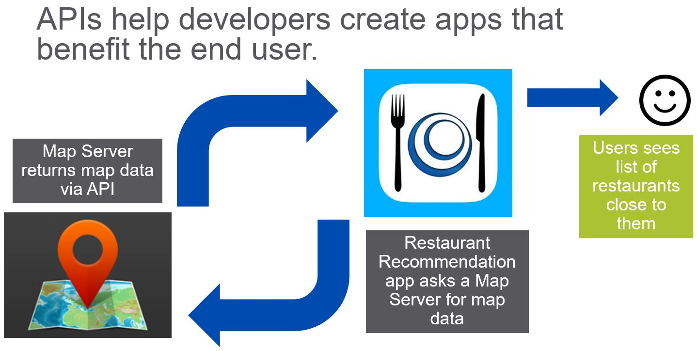

## Obtener acceso a la API REST de Webex Teams

Durante el resto del curso estaremos utilizando la API REST de Webex, una herramienta de colaboración de Cisco, para interactuar con ella de forma programática.
Para poder explorar e interactuar con la API es necesario tener una cuenta de desarrollador y un access Token. Los access Tokens son credenciales para autenticar a programas de computadoras que interactúan con otros a través de APIs. En este curso cada quien tendrá su propio access token individual y lo utilizará para autenticar sus scripts contra la API de Webex.

Para obtener nuestro access token:

1.  Ir al sitio de desarrollador de Webex, [Webex developer site](https://developer.webex.com/).
2.  Click en `Signup` para crear una cuenta (en caso de no contar con una).
3.  Login con las credenciales generadas en el punto anterior.
4.  Click en 'Go to Docs'
5.  En el menú de la izquierda seleccionar 'APIs --> Getting Started'
6.  Copiar y guardar su Token personal.

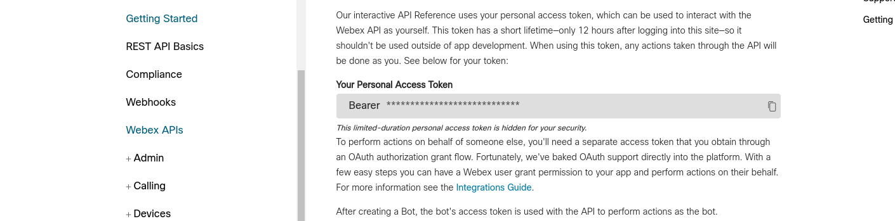

| Nota: se puede llegar al mismo sitio a través de https://developer.webex.com/docs/getting-started

The token allows you to make Spark API calls.

Great! Now that we have the basics of APIs down, let's dive into REST APIs to see how they work.

## What is a REST web service?

In general, a web service is a way for two systems to communicate through a defined interface. In the past 20 years, there have been two major types of Web Services – REST or SOAP. In the last 10 years, the REST approach has become increasingly popular.

What is REST? REST (Representational State Transfer) is an architecture style for designing networked applications. A REST web service is a web service that is as easy to call as making an HTTP request.

Look at the diagram below. It shows how a browser retrieves web pages. Normally, after a user requests a particular resource in a browser, the appropriate web server responds with the proper HTML to display the page to your client browser.

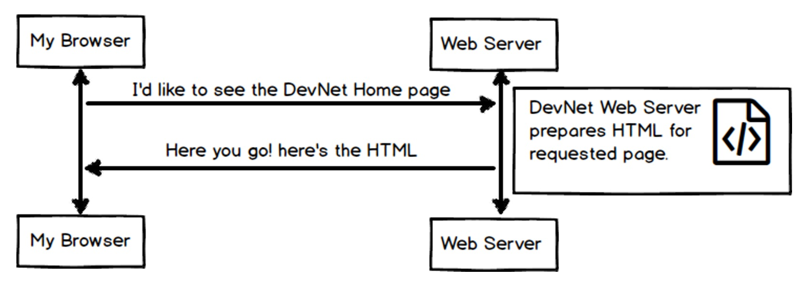

Behind the scenes, HTTP(S) uses CRUD (Create, Read, Update, Delete) operations on the wire to request data. In the example below, our browser is issuing a GET operation to read the associated web page. The web server returns the associated data and an HTTP response to the client browser.

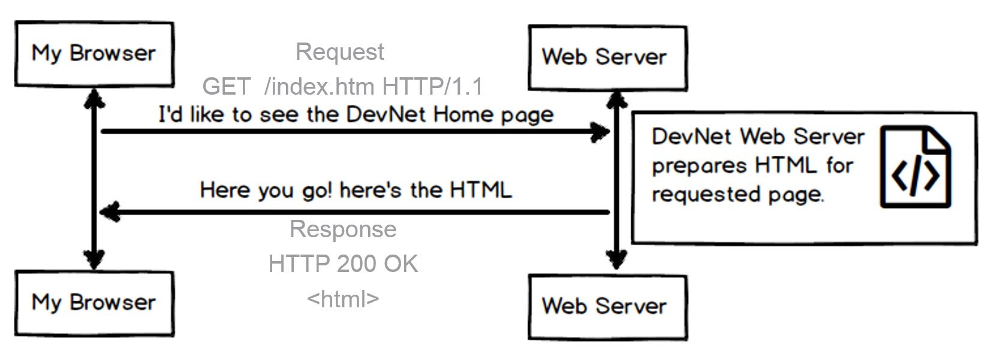

RESTful interfaces offer these same CRUD (Create, Read, Update, Delete) operations using HTTP(S). Browsers are replaced by software to interface with the RESTful service. The diagram below illustrates the same concept; however, browsers are replaced by software leveraging the REST API.

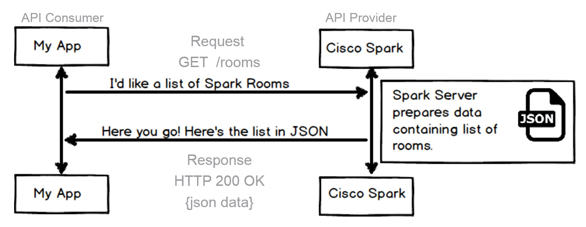

[Cool REST tutorial](http://rest.elkstein.org/)

## What is so great about REST?

REST is easy to use on any platform!

Let's talk about what makes REST APIs so great. First off, the concepts are transferable across a number of platforms. This lab shall focus on the Spark REST API as a tool to learn REST APIs. Spark is a communication platform for collaboration.

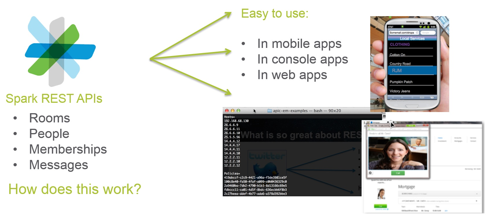

However, REST is also used by a number of networking platforms such as Cisco's APIC-EM controller. While the API and data model of APIC-EM differs, the underlying tools are the same.

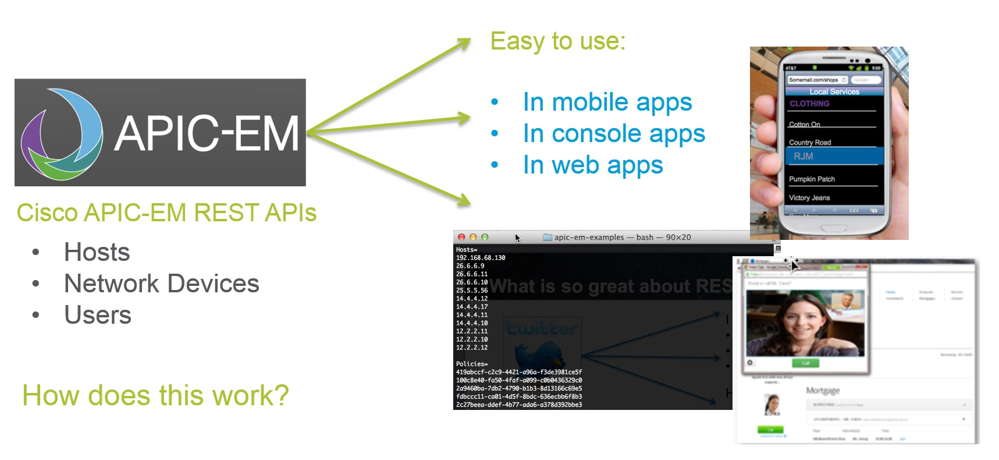

## How does this work?

Now let's cover how REST APIs work. REST is centered around the HTTP request and response model. Consuming an API is just as simple as making an HTTP request.

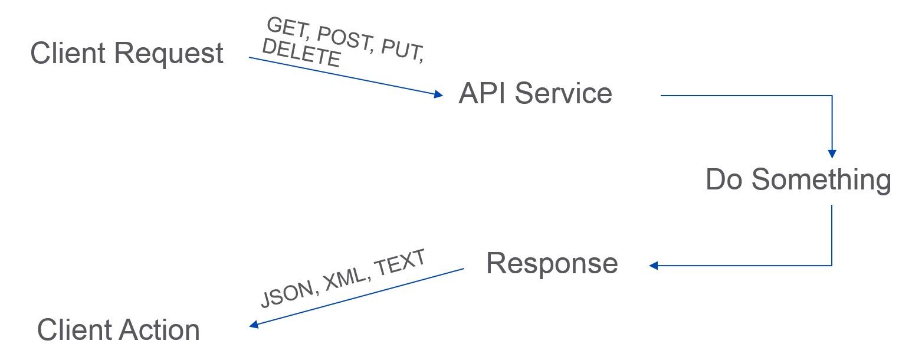

For example, if we make a request to an API Service, then result of the request will be returned to us in the response. The data returned in the response is usually JSON or XML.

(JSON -- JavaScript Object Notation, is a lightweight text-based open standard designed for human-readable data interchange.)

## Examine the Anatomy of a REST API Query

To construct a request, you need to know the following information for the API that you are calling. You can find this information in the API reference documentation.

- Method
  - GET - Retrieve data
  - POST - Create something new
  - PUT - Update data
  - DELETE - Delete data
- URL
  - The URL for the endpoint you want to call
  - Example: http://api.ciscospark.com/v1/rooms
- URL Parameters
  - The parameters that you can pass as part of the URL.
- Authentication
  - You need to know the authentication type to use. Basic HTTP, token based, and OAuth are common types.
  - Authentication credentials
- Custom Headers
  - Does the API require you to send any HTTP Headers?
  - Example: Content-Type: application/json
- Request Body
  - JSON or XML containing data that is needed to complete request can be sent in the body of the request

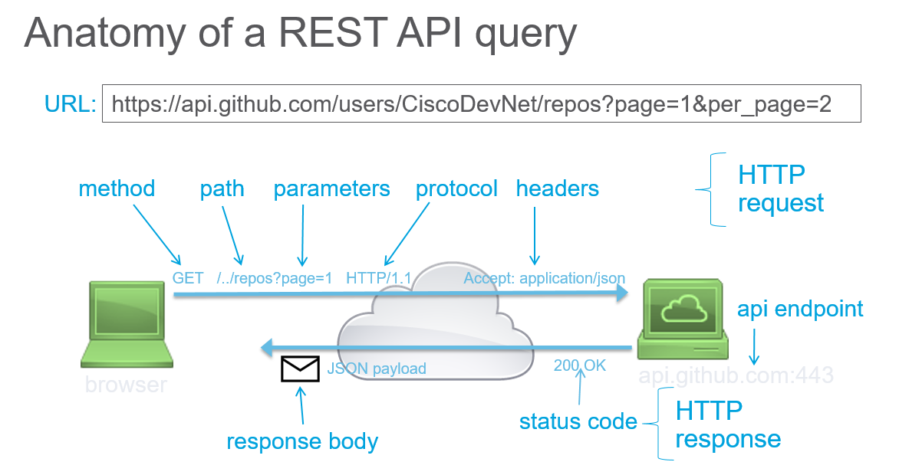

## A Little About Authentication

There are different types of authentication for REST APIs. Authentication is used to control access and access rights to the REST APIs. For example, some users might have read-only access which means that they can use only the parts of the API that read data. Other users might have both read and write access. This means they can use the API to perform operations that not only read data but also add, edit, and delete data. These access rights are typically based on user assigned roles such as Administrator where a user would have full rights to change the data. For example, a plain User role might have read-only access rights.

## Types of Authentication Controls

- None: the Web API resource is public, anybody can place call. Generally the case for GET methods, rarely for POST, PUT, DELETE.
- Basic HTTP: The username and password are passed to the server in an encoded string.
  - Authorization: Basic ENCODEDSTRING
  - See Basic Authentication for more information.
- Token: A secret key generally retrieved from the Web API developer portal.
  - The keyword may change from one Web API to another: Bearer, token..
  - Passed with each API call.
  - See Token Based Authentication for more information.
- OAuth: A sequence flow is initiated to retrieve an access token from an Identity Provider. The token is then passed with each API call.
  - Open standard. User rights are associated with the token (OAuth scope).
  - The token expires. It can be revoked. It can also be re-issued via a refresh token.
  - See OAuth for more information.

## API Reference Documentation

The API Reference Documentation lists all of the publicly available API methods and provides the details on how to make each request. When you start to work with a new API, the API Reference is one of the most important sources of information. [Here's the API Reference Guide for Spark](https://developer.ciscospark.com/resource-people.html).

## What is in the Response?

The API Reference Guide includes information about the attributes to be sent and returned. The returned data is defined in the Response portion which includes the HTTP status codes along with the data format and attributes.

- HTTP Status Codes
- HTTP status codes are used to return success, error, or other statuses. http://www.w3.org/Protocols/HTTP/HTRESP.html
- Some common examples are:
  - 200 OK
  - 202 Accepted/Processing
  - 401 Not Authorized
- Content
  - Often returned in different formats based upon the request. Common formats are: JSON, XML and Text.
    - JSON (most commonly used)

```json
{
  "data": [
    {
      "company": "Cisco Systems",
      "event": "DevNet Express",
      "location": "Las Vegas, NV, USA"
    },
    {
      "company": "Cisco Systems",
      "event": "Cisco Live America",
      "location": "San Jose, CA, USA"
    }
  ]
}
```

Here is an example that shows a REST API request and response all in the same window:

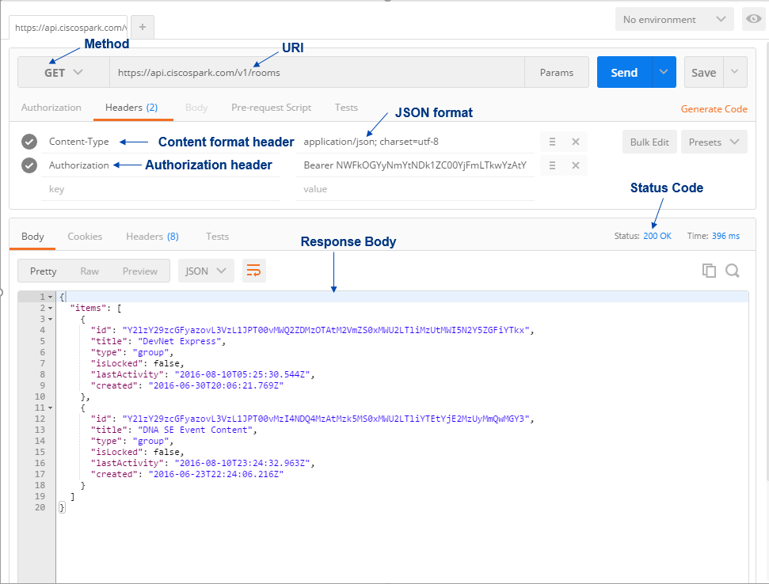

## Use Postman to Call the Spark API

As briefly mentioned earlier Postman is an HTTP web user interface (Web UI) client that allows you to make HTTP calls. There are many Web UI clients that have similar functionality, but for our purposes we'll focus on Postman.

## What is Postman?

Postman is a Google Chrome application. It provides an easy-to-use interface for learning and interacting with REST APIs.

Users can send API calls and receive responses in the same window. This application can also be used to generate codes for different languages such as python. Postman is useful for entry-level users. To download and run Postman follow this link. We'll use Postman throughout this and following modules. Take a minute to make sure it is installed on your workstation.

## The Postman Window

Postman has three main working areas. On the left side of the window you can see History and Collections tabs. The History tab shows a list of your previous calls. If you want to save a particular API call from your History tab, you can click on the call to highlight it and then click the Save to collection link to specify where you want to save it.

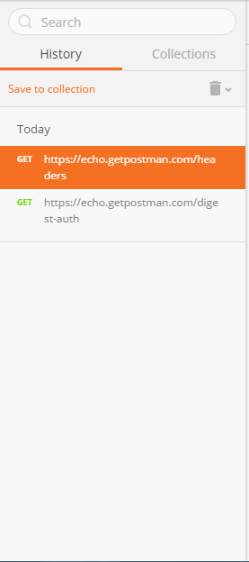

In the middle of the screen is where all the magic happens. This is where you make the API calls by setting the call method and providing URL information. Under the Headers tab you should define all of the necessary key-value pairs to make a successful call. When all of the parameters are set, click the Send button.

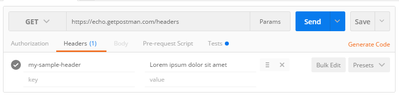

If the request is correctly formed, after you click Send you should see a response on the bottom section of the window. The Response pane gives you information such as the Status code of the response, how it is formatted (JSON, XML, etc.), as well as the body of the response message.

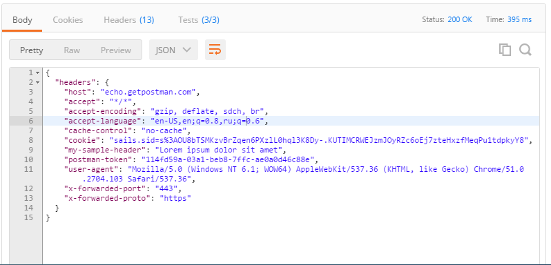

## Postman Test Run: Call the Spark API

Let's make a call to the Spark API. Look at the screenshot below, it depicts an API call to Spark server. The letters show each step and explain the areas of the Postman window.

A. Shows the REST method to use to send the request. You can select the method from a drop down list. As previously discussed the most common methods are: `GET`, `POST`, `PUT` and `DELETE`. In this case we want to read in a list of messages posted by a particular user to a particular room. That means for this example we want to use the `GET` method.

B. The `URL` to be called is specified here. The base `URL` for SPARK is `https://api.ciscospark.com/v1/` . What follows next is the function to be called which is messages. Next is the `roomId` follow by the `ID` itself in the format of `?roomid=<the room ID>`

C. Spark requires an Access Token in order to make function calls. For that reason, we have added the key named Authorization to the header. We entered the value `Bearer <the access token>`. The `Content-Type` key specifies what type of formatted content is being sent to the HTTP Server which is designated in the URL by `api.ciscospark.com`. In this case no content is being sent so this header, though commonly used, is unnecessary. At this point the request is ready to be sent and the user would press the Send button.

D and E. The Body contains the data returned from the request. Because the returned format has been selected to be JSON, there's various types of ways to format this output. Raw output displays the data in the format received. Pretty output which is selected here, reformats the data to make it much easier to read.

F. The returned JSON content in Pretty format.

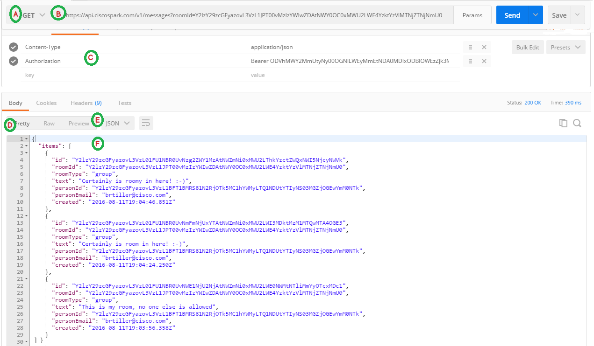

### Ejercicio de Postman #1

La idea de este ejercicio es conseguir una lista de todos los `rooms` a los cuales estamos asociados.

#### Instrucciones

1.  Crear una cuenta con Cisco Webex.
2.  Acceder a https://developer.webex.com/getting-started.html y conseguir su token de desarrollador:

>    <a name="rememberthetoken">

     Es muy importante que documente este token dado que lo necesitará mas adelante.

   </a>

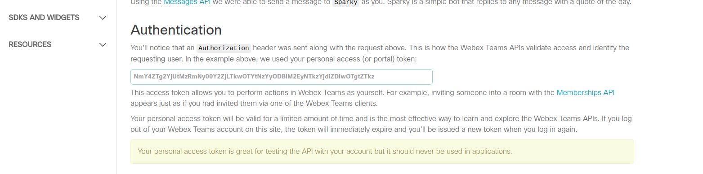

3.  Ir a Postman.
4.  Seleccionar `GET` del dropdown.
5.  Escribir la siguiente URL: `https://api.ciscospark.com/v1/rooms`
6.  Agregar un encabezado `Authorization` con el token de desarrollador precedido por `Bearer`.
7.  Agregar un encabezado `Content-Type` con el valor `application/json; charset=utf-8`.
    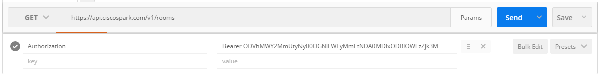
8.  Presionar `Send` y verificar el resultado.
    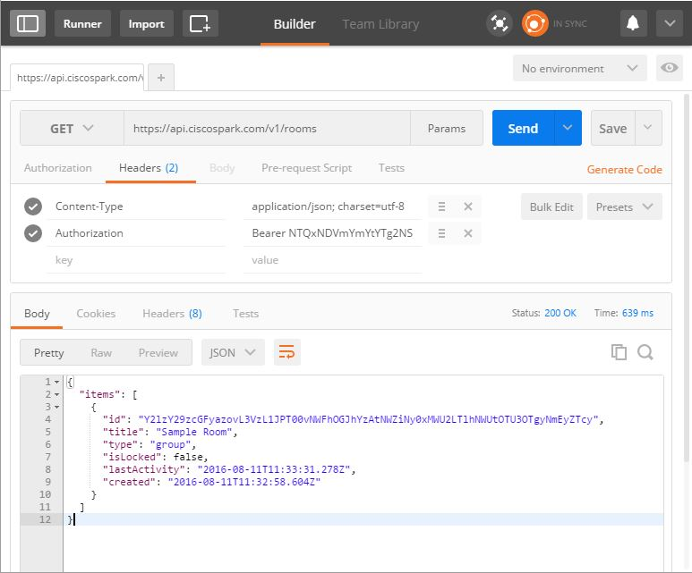

### Ejercicio de Postman #2

Ahora vamos a interactuar directamente con CISCO Spark utilizando su API. Vamos a crear un nuevo `room`.

#### Instrucciones

1.  Ir a Postman.
1.  Seleccionar `POST` del dropdown.
1.  Agregar un encabezado `Authorization` con el token de desarrollador precedido por `Bearer`.
1.  Agregar un encabezado `Content-Type` con el valor `application/json; charset=utf-8`.
1.  En la tab de `Body` seleccionar `raw` y `JSON`.
1.  En el área de texto a continuación, ingrese algo similar al siguiente texto:

```json
{
  "title": "Spark API via Postman"
}
```

7.  Verifique en la documentación de Spark (https://developer.webex.com) para incluir todos los parámetros necesarios.
8.  Confirme que el nuevo `room` se haya creado en su cuenta de Spark.

## Generating Code Using Postman

In the previous lab, we showed you how to make API requests using the Postman application. Also, we mentioned that it is possible to generate code for different coding languages using Postman. In this step we will show you how to do exactly that.

We assume that you already have the Postman application installed on your workstation and you know how to use it. If not, please take a minute and review previous lab since it covers that topic.

To generate code, we need to populate all fields in Postman. Lets begin.

1.  From your workstation open Postman application.

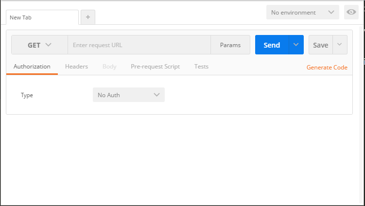

2.  Our plan is to get a list of the rooms associated with the user making the inquiry. To do that we need to set the method to GET and URL to https://api.ciscospark.com/v1/rooms

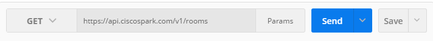

3.  Now, we need to define request headers information. Click on the headers tab and provide two key value pairs. For this step you need to have access token obtained from Spark Developer website

- `Content-Type` and `application/json; charset=utf-8`.
- `Authorization` and `Bearer {access token}`.

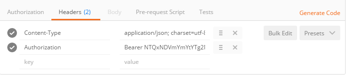

4.  Good! We are ready to generate the code using Postman. Under the Save button you should find Generate Code link. Click on it. In the Generate Code Snippets window select Python -> requests language.

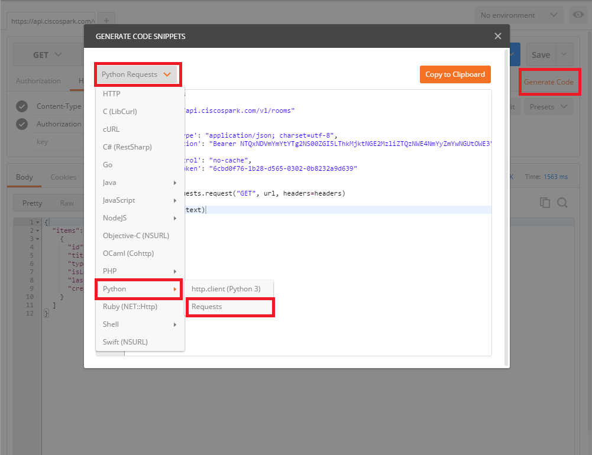

5.  Now the entries are converted to Python code using request module to make the API call. Click Copy to Clipboard button to copy the code.

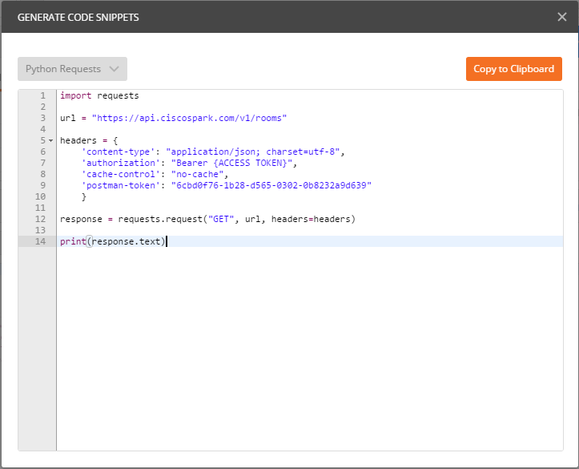

6.  Paste the contents of the clipboard to your favorite text editor and save it as a Python file in your working directory.

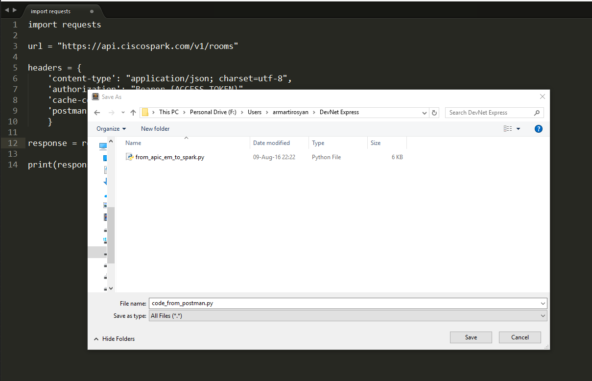

7.  Lets give it a try and see if it works. Open the command line terminal and navigate to your working directory. Issue py -3 <FILE-NAME.py> command. You should see a response from the Spark server.

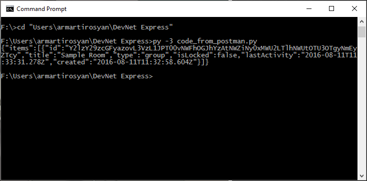

Terrific! You just learned how to generate code using Postman. In the next section of this lab we will show you how to write the code yourself.

## Writing Python Script

Ahora escribiremos el código nosotros mismos. Lo haremos paso a paso y eventualmente el código hará una llamada a la API de Spark para traer el nombre y apellido del usuario basado en el correo electrónico. En el código utilizaremos la llamada a /people.

Antes de continuar, necesitamos el "access-token" que obtuvimos [aquí](#rememberthetoken).

1.  Para hacer llamadas a la API utilizando Python, necesitamos importar dos librerías: `requests` y `json`.

```python
import json
import requests
```

2.  En este punto deberíamos poder llamar a todas las funciones incluidas en ambas librerías. Opcionalmente podemos apagar las advertencias relacionadas con certificados SSL; esto puede hacerse con el código a continuación:

```python
#Disable warnings
requests.packages.urllib3.disable_warnings()
```

3.  A continuación definiremos variables que serán utilizadas luego:

```python
# Variables

URL = "https://api.ciscospark.com/v1"
ENDPOINT ="/people"
#Replace the {access-token} with your personal access token.
TOKEN = "Bearer {access-token}"
```

4.  Es hora de definir nuestro encabezado y los parámetros:

```python
# Header information
HEADERS = {
  "content-type": "application/json; charset=utf-8",
  "authorization": access_token
}
# Parameter variable
PARAM = "?email=sqtest-ciscospark-travisuser@squared.example.com"
```

5.  Asignaremos la respuesta a la llamada a una variable:

```python
# Combine URL, API call and parameters variables
URL += ENDPOINT + PARAM

RESPONSE = requests.get(URL, headers=HEADERS, verify=False)

# Print the respond body
print(RESPONSE.text)
```

6.  Para ver como funciona, abra una consola bash, navegue al directorio donde está el script y ejecute el comando `python3 our_code.py`. Si todo funciona correctamente, debería ver una salida similiar a la imagen a continuación:

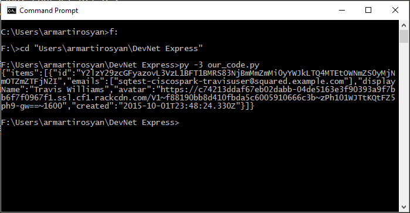

Como puede ver, la salida del script no es muy legible. Cambiemos el código para que imprima únicamente información relevante. Para hacer esto, agregue `.json()` al final de `RESPONSE = requests.get(URL, headers=HEADERS, verify=False)`. Luego agregue un loop `for` para iterar sobre los items guardados en el diccionario de respuesta e imprima unicamente nombres y direcciones de correo electrónico. El código adicional deberia lucir de la siguiente manera:

```python
for item in RESPONSE["items"]:
    print('Name: ' + item['displayName'])
    print('Email: ' + item['emails'][0])
```

7.  Los resultados deberían verse así:

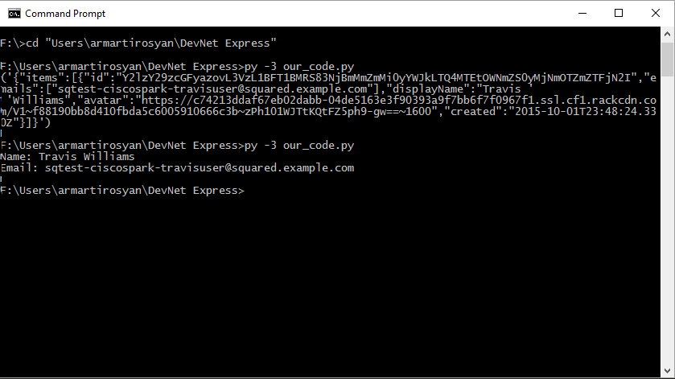

Felicitaciones! Has escrito un script de Python que puede hacer una llamada a una API REST para obtener información de Spark. Si aún no entiendes completamente el código utilizado, no te preocupes, el próximo laboratorio se encargará de ver en detalle todos los conceptos que hemos aplicado.

### Script #11 - `11-fist-python-spark-api-call.py`

Este script inicialmente no hace nada. Solamente cuenta con la imporación de los módulos necesarios así como un metodo para crear el diccionario de encabezados que necesitamos para construir nuestro request. La idea es agregar las instrucciones necesarias para recuperar todos los `rooms` a los cuales estamos asociados.

#### Instrucciones

1.  Ir al archivo `code/11-fist-python-spark-api-call.py`.
2.  Verificar que su contenido este alineado con lo mencionado anteriormente.
3.  Ingrese en la variable `TOKEN` su clave de Spark.
4.  Escriba las instrucciones necesarias para obtener todos los `rooms` a los cuales esta actualmente registrado su usuario. La URL del endpoint que deben acceder es: `htts://api.ciscospark.com/v1/rooms`.

#### Notas

- Para hacer un request HTTP tipo `get` con el módulo `requests` se puede utilizar el metodo `requests.get`.
- Para poder imprimir un documento de JSON en la consola de modo más amigable, podemos utilizar el metodo `json.dumps(<json_document>, indent=4, separators=(',', ':'))`, donde es necesario modificar `<json_document>` por el documento de JSON que queremos imprimir.

### Script #12 - `12-spark-misson.py`

La idea de este script es lograr escribir un mensaje en un grupo determinado utilizando la API. En el caso de que el `room` no este creado, lo crearemos. Luego agregaremos al `room` un nuevo usuario, enviaremos el mensaje, e imprimieremos en la consola los detalles del mismo.

#### Instrucciones.

1.  Ir al archivo `code/12-spark-mission.py`
2.  Leer el script e identificar los comandos que hay que modificar (esán numerados con comentarios.)
3.  Realizar las modificaciones necesarias para:
4.  Crear o encontrar un `room`.
5.  Agregar un usuario de prueba.
6.  Postear un mensaje.
7.  Imprimir los detalles del room.
8.  Correr el script y verificar que la información impresa en la consola sea correcta, y que el mensaje se ha escrito en el grupo de Spark correspondiente.

#### Notas

- Puede encontrar información de referencia sobre la API de Spark desde el siguiente link:

[https://developer.webex.com/getting-started.html](https://developer.webex.com/getting-started.html)
