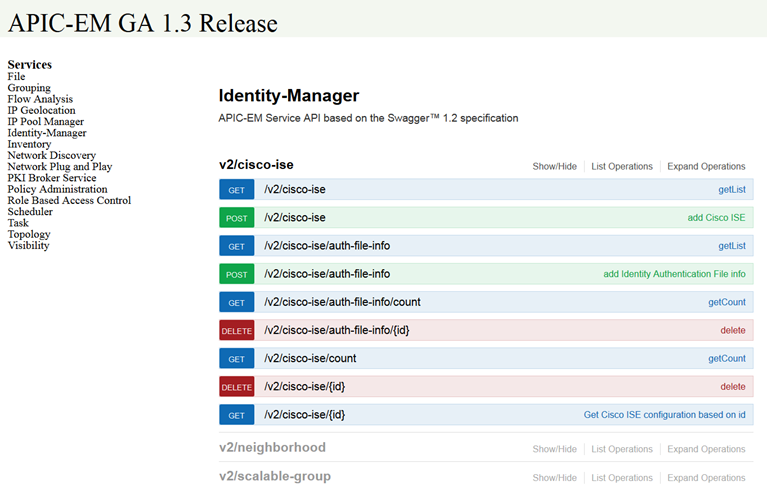

APIC-EM
===

Controller Basics
---

When Software Defined Networking (SDN) was introduced it became possible for the intelligence of network devices to be offloaded to remote applications. The advantage of this change is that these remote applications can be modified/updated without having to make any change to the switch or router or buying new equipment which dramatically lowers cost. A controller is a server-based application that monitors the network and can make decisions for the networking devices about how to handle each packet. The controller uses different protocols such as Openflow, NETCONF/RESTCONF and other communication protocols to control network devices.

Where does the controller get its intelligence? Controllers provide an Application Programming Interface (API) which is typically a large set of functions engineers can use to interface with the controller. These functions can be used to retrieve network information, change the network configuration on devices, set up new network devices with zero touch and much more. The idea of SDN is to make network management, deployment, configuration and troubleshooting tasks much easier and cheaper. Cisco's APIC-EM controller does exactly that and has many features to help network engineers manage and operate the network.

Get to Know APIC-EM
---

The APIC-EM controller delivers SDN to the Enterprise, to the WAN, Campus and Access networks. APIC-EM provides centralized automation of policy-based application profiles. Through programmability, automated network control helps IT rapidly respond to new business opportunities.

The APIC-EM controller and its applications are part of the Cisco Digital Network Architecture. The controller provides a low-risk, incremental approach to adopting software-defined networking (SDN) technologies in branch and campus environments. Using a policy-based approach, the controller automates provisioning of the end-to-end infrastructure to rapidly deploy applications and services.

### Features

- Software that runs on any x86 server, offered as a virtual machine or an appliance.
- Built-in applications that automate advanced configuration tasks via a guided workflow and user-friendly GUI with no programming skills required.
- Integrated analytics, policy, and network abstraction.
- REST API.

### Benefits

Massively simplified configuration and provisioning The controller automates the deployment and compliance checking of network policies across the entire network.

### Investment protection

The controller works with existing network infrastructure. There is no need to do an infrastructure replacement. No new network hardware is needed.

### Openness, programmability, and customization

The APIC-EM controller is highly programmable through REST (Representational State Transfer) APIs. These APIs enable independent software developers to create innovative network services and applications to fuel business growth.

### Business policy to network configuration

The controller auto-translates business policy into network device-level policy and enables policy enforcement across an end-to-end network.

APIC-EM Applications
---

The following are optional applications that can be installed on the controller.

- Easy QoS
  - The APIC-EM Controller's Easy Quality of Service application provides a simple way to classify and assign application priority.
- Intelligent WAN (IWAN) Application
  - The APIC-EM controller's Intelligent WAN (IWAN) application automates the configuration of advanced IWAN features on Cisco 4000 Series Integrated Service Routers.
- PnP
  - The APIC-EM controller's PnP (Plug and Play) application delivers on ZTD (Zero Touch Deployment) for Cisco Enterprise Network routers, switches and wireless controllers.
- Path Trace
  - The APIC-EM controller's Path Visualization application greatly eases and accelerates the task of connection troubleshooting.

The APIC-EM Architecture
---


Through either the APIC-EM web user interface or its REST APIs, APIC-EM can both monitor and manage the network. Applications as well as the Web User Interface reside above the APIC-EM Controller core and interface with the core and APIs. The exposed APIs allow for dynamic management of the network via policy administration and network monitoring via a host of other APIs.

Northbound Interface and APIs
---

All capabilities of the controller are exposed through the northbound API. The APIC-EM API is REST based and thus you will discover and control your network using HTTPS protocol with REST actions (i.e., GET, POST, PUT, and DELETE) with JSON syntax. The APIC-EM API Reference Guide provides software developer level of detail of the features, functions and implementation of these APIs. From a high level point of view the APIs provide functionality such as:

- Network Plug and Play - Dynamically add new network devices via zero touch provisioning.
- Network Discovery - Discover, manage and monitor network devices.
- Flow Analysis - Troubleshoot packet flow and loss.
- IP Geolocation - Mark and classify network device location.
- Inventory - Capture network device status and detail.
- Policy Administration - Administer policy to control, filter and prioritize network packets and - applications.
- Role Based Access Control - Manage users access and control.
- Topology - Read and analyze the network topology.
- PKI Broker Service - Secure the network with PKI.
- And Much More!



Southbound Interface
---

APIC-EM has a southbound interface that speaks directly to the network. The Southbound Interfaces are not exposed directly, abstracting the underlying complexity of the traditional network and delivering on simplification. Currently supported protocols include CLI/SNMP and in the future will include NETCONF/YANG. This is hidden from the API consumer.

APIC-EM REST API
---

APIC-EM's Northbound (NB) REST-based API allows Network Engineers and Operators to communicate with the controller using custom built applications to respond more rapidly to changing network conditions and related business opportunities.

The APIC-EM southbound interface speaks to the network's control plane and is not directly accessible. It is used to execute commands on the underlying networking devices that were specified via the Northbound (NB) REST API. Thus, applications can be written to communicate with APIC-EM and add dynamic SDN functionality directly into the network.

This lab demonstrates usage of the Cisco APIC-EM Northbound REST API via the Python programming language.

**If you are using Postman on a Mac computer, then also check that SSL verification is turned off.**

Generating Code Using Postman
---

Previously in Learning Lab module REST APIs and Python we explained how to make API requests using the Postman application. Now we will show how to generate code for different software programming languages using Postman. For this step, we will use the Python language option offered by the application.

We assume that you already have the Postman application and Python installed on your workstation and know how to use each. If you system is not set up, please follow the steps in the How to Set up Your Own Computer section at the top of this page.

To generate code, we need to populate the relevant fields in Postman. Lets begin.

1. From your workstation open Postman application.


2. First, we need to obtain authentication token from APIC-EM in order to make future API calls. To do that we need to set the method to POST and URL to `https://devnetapi.cisco.com/sandbox/apic_em/api/v1/ticket`.
3. Next, we need to define request headers information. Click on the headers tab and provide one key value pairs. `Content-Type: application/json`.
4. Finally, to get the authentication token we need to provide a username and a password information. Click on the body tab and select the raw option. In the window below paste the following information (this will be sent as the data of the POST):

```json
{
  "username": "devnetuser",
  "password": "Cisco123!"
}
```

5. Make sure that everything works and the provided information is correct by clicking the 'Send' button. You should receive a valid token and 200/OK as the result.

### Script #13 - 13-first-apic-em-api-call.py

Ahora que ya sabemos como interactuar con una API utilizando python vamos a hacer un script para ineractuar con la API del APIC-EM.

El script en cuestión se encuentra vació, salvo por algunos comentarios. La idea es que escriba todo el codigo necesario para obtener un `ticket` del APIC-EM.

#### Instrucciones

1. Ir al archivo `code/13-first-apic-em-api-call.py`
2. Leer los comentarios dentro del script.
3. Agregar las instrucciones necesarias para obtener el `ticket` del APIC-EM.
4. Probar que el script funciona correctamente al imprimir el `ticket` en la consola.

The Python Application
---

In this step, we will build an application which will obtain the running configuration from a networking device and save it to a file. The device will be chosen from APIC-EM's inventory list.

We are ready to build our application, so let's begin!

We will start by copying code from the previous step and making it into a function. The first function will take one argument which will be the APIC-EM's URL address and should return an authentication token obtained from the APIC-EM Controller. The returned token will be used by other functions to make the necessary API calls.

```python
def get_token():
    """ Gets an APIC-EM ticket. """
    endpoint = "/ticket"
    headers = {"content-type" : "application/json"}
    response = requests.post(URL + endpoint, data=PAYLOAD, headers=headers, verify=False).json()
    return response["response"]["serviceTicket"]
```

Next, we will create a new function which will take two arguments, the authentication token and APIC-EM's URL address, and will retrieve (GET) inventory information from APIC-EM. The obtained information will be filtered by a provided criteria which we will define. The first match will return the matching device's ID.

```python
def get_device_id():
    """ Get a device id. """
    endpoint = "/network-device"
    headers = {"X-AUTH-TOKEN": get_token()}
    response = requests.get(URL + endpoint, headers=headers, verify=False).json()
    # Iterate over the response and find device with access role.
    # Return ID number of the first device matching the `if` statement.
    for item in response["response"]:
        if item["role"] == "ACCESS":
            return item["id"]
```

Finally, we will use the values returned from the two previous functions to get the running configuration from a specific device and write it to a file. To achieve the goal, we will need to create a new function which will take three arguments (authentication token, APIC-EM's URL address, and the networking device's ID) and will query APIC-EM to obtain running configuration from the device.

```python
def get_config(device_id):
    """ Get device configuration """
    endpoint = "/network-device/" + device_id + "/config"
    headers = {"X-AUTH-TOKEN": get_token()}
    response = requests.get(URL + endpoint, headers=headers, verify=False).json()
    # Creates the file in the current working directory.
    configuration_file = open('device_' + device_id + ".txt", "w")
    # Write the response body to the file.
    configuration_file.write(response["response"])
    # Close the file when writing is complete.
    configuration_file.close()
```

Terrific! All our functions are created and it is time to put everything together. Our code should look like the following below.

```python
import requests
import json

# Disable requests
requests.packages.urllib3.disable_warnings()

# Constants
URL = "https://devnetapi.cisco.com/sandbox/apic_em/api/v1"

def get_token():
    # ...

def get_device_id():
    # ...

def get_config(id):
    # ...

# Script body
# ===========

# Assign obtained ID to a variable. Provide authentication token and APIC-EM's URL address
DEVICE_ID = get_device_id()

# Call `get_config()` function to obtain and write device's configuration to a file.
# Provide authentication token, APIC-EM's URL address and device's ID

get_config(DEVICE_ID)
```

Open a terminal window and navigate to your directory where the Python code is saved. Start the application by issuing `python apic-em.py` command. If everything was done correctly you should see a new prompt in the terminal screen. It means there were no errors while executing the code.

Now, in the terminal window check the folder contents again. You should see a new file titled `device_' + DEVICE_ID + ".txt`. This file was created by our application.

To check the file contents open the text file using your favorite text editor or print the contents of the file in the terminal window. We will use a text editor to check the contents of the file.

Wonderful! Our application is working!

Improving the Application
---

Instead of naming the output file `device_' + DEVICE_ID + ".txt`, a better practice would be to give the name of our file the hostname of the device from which the configuration was obtained, and append date and time to the filename to show when the configuration was saved. This way backup files containing the configurations of the entire network can be created within seconds and used as a change control mechanism to see what was changed on a particular device at a given time.

To implement this idea we need to slightly modify our code.

We need to import two new modules called `datetime` and `re`. The `re` module will help us to capture the hostname of the device and the `datetime` module will provide the current date and time, so we can append a timestamp to the filename.

```python
#Import necessary modules
import requests
import json
import datetime
import re
```

We need to modify the `get_config()` function, so it will capture the hostname of the device and change the filename to our desired format. Capturing the hostname of the device can done in multiple ways, but creating a regular expression is the fastest and most convenient way. The modified function should look like this:

```python
def get_config(device_id):
    """ Get device configuration """
    endpoint = "/network-device/" + device_id + "/config"
    headers = {"X-AUTH-TOKEN": get_token()}
    response = requests.get(URL + endpoint, headers=headers, verify=False).json()
    # Find the hostname in the response body and save it to a hostname variable.
    hostname = re.findall('hostname\s(.+?)\s', response["response"])[0]
    # Create a date_time variable which will hold the current time.
    date_time = datetime.datetime.now()
    # Create a variable which will hold the hostname combined with the date and
    # time. The format will be hostname_year_month_day_hour.minute.second.
    file_name = (
        hostname
        + "_"
        + str(date_time.year)
        + "_"
        + str(date_time.month)
        + "_"
        + str(date_time.day)
        + "_"
        + str(date_time.hour)
        + "."
        + str(date_time.minute)
        + "."
        + str(date_time.second)
        + ".txt"
    )
    # Creates the file in the current working directory.
    configuration_file = open(file_name, "w")
    # Write the response body to the file.
    configuration_file.write(response["response"])
    # Close the file when writing is complete.
    configuration_file.close()
```

### Script #14 - `14-apic-em-and-spark-mission.py`

Para la realización de este script, vamos a tener que utilizar todos los conocimientos que hemos adquiridos hast el día de hoy. La idea es poder tomar información desde el APIC-EM, la cual luego postearemos en un grupo de Spark.

#### Instrucciones

1. Ir al archivo `code/14-apic-em-and-spark-mission.py`
2. Leer los comentarios dentro del script.
3. Agregar las instrucciones necesarias para obtener la topología física del APIC-EM y postear esta información en un `room` de Spark.
4. Correr el script y verificar que la información obtenida es posteada en el `room` correcto.
