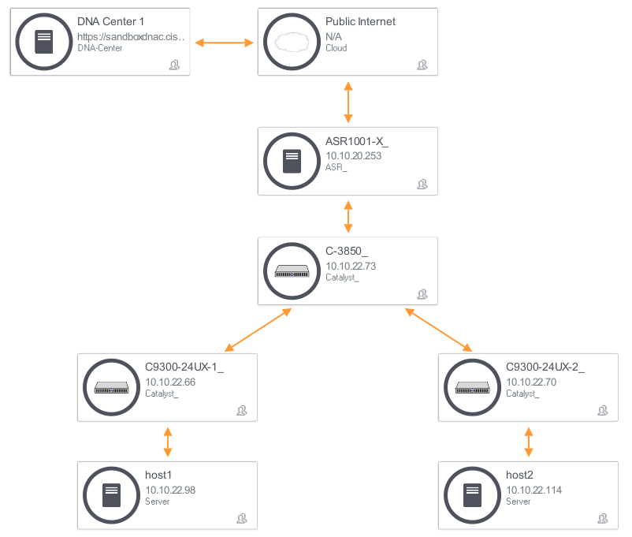

# DNA Center

## Documentación de la API

[https://developer.cisco.com/site/dna-center-rest-api/](https://developer.cisco.com/site/dna-center-rest-api/)

## Introducción

El controlador DNA Center expone una API REST "Norte" que permite a los ingenieros y a las aplicaciones interactuar con el mismo de forma programática.

El controlador DNA Center también cuenta con interfaces "Sur" hacia el plano de control de la red; utiliza las mismas para gestionar e interactuar con los dispositivos de red.

De esta forma podemos utilizar la API Rest (Norte) para configurar el controlador y agregar funcionalidades de SDN a los equipos de red de forma dinámica.

## RBAC & service tokens

El mecanismo de Role-Based Access Control (RBAC) en el Cisco DNAC asigna a cada usuario un rol de seguridad. Este rol es lo que determina que recursos y operaciones estarán disponibles para este usuario.

Por defecto, se encuentran definidos los siguientes roles y privilegios:

- **Administrator (SUPER_ADMIN-ROLE)** provee al usuario permisos totales sobre los recursos del DNA Center, incluyendo la capacidad para agregar o eliminar usuarios y cuentas.
- **Network Administrator (NETWORK_ADMIN-ROLE)** permite al usuario aprovisionar, hace upgrades y cambiar la configuración de los equipos de red.
- **Observer (OBSERVER-ROLE)** otorga al usuario permisos de solo lectura al Cisco DNA Center.
- **Telemetry (TELEMETRY-ADMIN-ROLE)** permite al usuario administrar la configuración de telemetría (Assurance).

Un token de seguridad, comunmente llamado "service token", encapsula el rol y la identidad del usuario en una única entidad.

La API del DNAC, o cualquier API que funcione con RBAC, utiliza los service tokens para tomar decisiones de control de acceso. Por tal motivo, para comenzar a interactuar con la misma, necesitamos obtener nuestro token. Para ello debemos enviar un POST a la url `/token` indicando en un encabezado nuestro usuario y password. En caso de que la autenticación resulte exitosa, el DNAC nos devolvera un service token que podremos utilizar luego para acceder a recursos y ejecutar acciones.

Es importante tener el cuenta que el service token se debe incluir **en cada una** de las interacciones que tengamos con la API.

### Script #15 - Obtener el service token.

Leer la documentación [API documentation](https://developer.cisco.com/docs/dna-center/#!cisco-dna-1-3-3-x-api-overview/how-to-send-dna-center-api-requests-to-a-devnet-always-on-sandbox) para entender en detalle cual es el procedimiento para obtener un service token. Tener en cuenta que estaremos utilizando `Token based authentication`.

Siga los pasos a continaución para obtener un token utilizando POSTMAN:

1.  Conigurar el método como "POST"
2.  Configurar la URL como: https://sandboxdnac2.cisco.com/dna/system/api/v1/auth/token
3.  Agregar un Header `{"Content-Type":"application/json"}`
4.  Agregar un Header `{"Authorization":"Basic <username:password>"}`
    Prestar atención al espacio luego de "Basic".
    <username:password> deben ser "devnetuser:Cisco123!" codificados en Base64 (ZGV2bmV0dXNlcjpDaXNjbzEyMyE=)
5.  Enviar y copiar la respuesta del DNAC al portapapeles de nuestra máquina.
6.  Navegar al servicio online [JWT.IO](https://jwt.io/) y pegar el token dentro del campo de texto identificado como "Encoded" (borrar el texto presente en dicho campo); observar los resultados dentro del área denominada "Decoded".

Ahora veamos como obtener un token de forma programática utilizando Python:

1.  Ubicar el script 15-DNAC-get-token.py.
2.  Correr el script utilizando el intérprete de Python. Por ejemplo:
    - En Linux o Mac OS: `python3 15-DNAC-get-token.py`
    - En Windows: `py -3 15-DNAC-get-token.py or python 14a-DNAC-get-token.py`
3.  Copiar al portapapeles el service token que se imprime en la consola.
4.  Navegar al servicio online [JWT.IO](https://jwt.io/) y pegar el token dentro del campo de texto identificado como "Encoded" (borrar el texto presente en dicho campo); observar los resultados dentro del área denominada "Decoded".

> Observe que la función `HTTPBasicAuth` se encarga de codificar el usuario y password en Base64 y de incluir dicho campo "encodeado" dentro del encabezado correspondiente en el request HTTP.

**Bonus:**

Leer la sección **token-based-authnz-api-eft** de la [API documentation](https://developer.cisco.com/site/dna-center-rest-api/). Modificar el script anterior de la siguiente manera:

1.  `import base64`
2.  utilizar la función `base64.b64encode(bytes(username + ':' + password, 'utf-8')).decode('utf-8')` para codificar `username:password` en base64 y obtener el token **sin** utilizar `HTTPBasicAuth`.

### Script DNAC.py - Generación de service tokens re-utilizable.

Ahora vamos a crear un **módulo de Python** llamado `DNAC.py`. Dicho módulo tendrá dentro una función `get_token(username, password)` que retorna el service token como un `String`.

1.  Completar el scritp `DNAC.py` para obtener una función re-utilizable.

### Como utilizar el service token

Casi cualquier llamada que se haga a la API del DNAC debe contener un service token para ser procesada; no es relevante si la llamada es un POST, GET, PUT o DELETE, el módulo REST del DNAC verificará la presencia del token antes de procesar el request.

Para incluir el service token en la llamada se debe utilizar el encabezado HTTP `X-Auth-Token`. El valor de dicho header debe ser el service token:

`{"X-Auth-Token": "service_token_value" }`

Mientras no hayan expirado, los tokens pueden re-utilizarse en tantas llamadas como sea necesario. En este laboratorio, por simplicidad, obtendremos un nuevo token por cada request que vayamos a hacer.

A continuación haremos una llamada simple a la API para ver la autenticación mediante token en funcionamiento.
En concreto, enviaremos un request HTTP del tipo `GET` al endpoint `/host`. Esto debería devolvernos la lista de **hosts** presentes en la topología que se muesrta a continuación de acuerdo a los permisos del usuario (reflejados en el service token).



La llamada `GET` a `/host` no requiere ningún argumento adicional, únicamente se debe agregar el encabezado `X-Auth-Token` con el service token para autenticar.

### Script #16.

Partir desde el archivo `16-DNAC-get-hosts.py` y modificarlo donde se indica en los comentarios para que obtener una lista de hosts del DNAC.

## API endopoints referentes dispositivos de red.

### Objetivos

El controlador Cisco DNAC asigna un ID único a cada dispositivo de red. Se puede utilizar este ID para obtener información específica de un dispositivo determinado, como ser su configuración o una lista de sus interfaces.

En el próximo laboratorio, trabajaremos con un script que hace las siguiente llamadas a la API del DNAC:

- `GET /network-device`
- `GET /network-device/{networkDeviceId}/config`
- `GET /interface/network-device/{deviceId}`

**Nota:** El Cisco DNAC tiene la capacidad de escanear y descubrir dispositivos conectados a la red. Para iniciar este proceso de descubrimiento, se puede enviar un `POST` al endpoint `/discovery`, o se puede hacer click en el ícono "Discovery" de la interface gráfica de usuario. El DNAC que estamos utilizando en este laboratorio ya tiene pre-cargados dispositivos descubiertos con anterioridad, por lo que no efectuaremos un proceso de descubrimiento.

### Cómo mostrar la configuración de un dispositivo

En esta sección, crearemos una aplicación simple para:

- Solicitar al usuario que seleccione un dispsitivo de red.
- Mostrar la configuración del dispositivo generado por el usuario.

Pseudo-código:

1.  Usar `GET /network-device` para mostrar una lista con los dispositivos y sus correspondientes IPs
2.  Solicitar al usuario que seleccione un equipo y guardar su selección..
3.  Utilizar `GET /network-device/{deviceId}/config` para obtener la configuración del dispositivo y mostrarla en pantalla.

### Script #17 - Tarea 1: Presentar una lista de dispositivos con sus direcciones IP

Para mostrar una lista de dispositivos con sus direcciones IP al usuario, realizaremos una llamada del tipo `GET` al endpoint `/network-device`. Los datos, contenidos en el `BODY` de la respuesta, serán una lista de dispositivos. Cada elemento de dicha lista contiene información del dispositivo en cuestión, en particular:

- **instanceUuid** o **id**, este es el identificador que el DNAC asigna a cada dispositivo que descubre.
- **hostname**, este es el nombre del dispositivo de red.
- **managementIpAddress**, esta es la dirección IP de gestión del dispositivo de red.
- **type**, tipo de dispositivo como ser: switch, router, access-point, etc.

Lo que nos interesa en particular es el ID, dado que es el identificador que utilizaremos para seleccionar el dispositivo al hacer requests a otros endpoints. Por ejemplo, para traer la configuración del dispositivo seleccionado haremos una llamada del tipo `GET` al endpoint `/network-device/{deviceId}/config`.

La tarea concreta es la siguiente:

1.  Ubicar el script `17-DNAC-get-network-device-list.py`
2.  Modificarlo para que ejecute un request del tipo `GET /network-device` y muestre una lista de dispositivos en el siguiente formato:

```
=== Equipo 1  ===
	Hostname:  asr1001-x.abc.inc
	Type:  Cisco ASR 1001-X Router
	Device id:  d5bbb4a9-a14d-4347-9546-89286e9f30d4
	Management IP Address:  10.10.22.74
=== Equipo 2  ===
	Hostname:  cat_9k_1.abc.inc
	Type:  Cisco Catalyst 9300 Switch
	Device id:  6d3eaa5d-bb39-4cc4-8881-4a2b2668d2dc
	Management IP Address:  10.10.22.66
=== Equipo 3  ===
	Hostname:  cat_9k_2.abc.inc
	Type:  Cisco Catalyst 9300 Switch
	Device id:  74b69532-5dc3-45a1-a0dd-6d1d10051f27
	Management IP Address:  10.10.22.70
=== Equipo 4  ===
	Hostname:  cs3850.abc.inc
	Type:  Cisco Catalyst38xx stack-able ethernet switch
	Device id:  8be78ab1-d684-49c1-8529-2b08e9c5a6d4
	Management IP Address:  10.10.22.69
```

### Script #17 - Tarea 2: solicitar al usuario que seleccione un equipo

Agregar el siguiente código a `17-DNAC-get-network-device-list.py` para que solicite al usuario que seleccione un equipo:

```python
device_list = response['response']

while True:
    user_input = input('=> Selecciona uno de los siguientes equipos: ')
    # ignore space
    user_input = user_input.replace(" ", "")
    if user_input.lower() == 'exit':
        sys.exit()
    if user_input.isdigit():
        if int(user_input) in range(1, len(device_list) + 1):
            device_id = device_list[int(user_input)-1]['id']
            break
        else:
            print("Uups! el numero esta fuera de rango. Intenta de nuevo o escribe 'exit'\n")
    else:
        print("Uups debes seleccionar un numero o escribir 'exit'\n")

# End of while loop
print('El equipo seleccionado es el: ', device_id)
```

### Script #18: Obtener la configuración IOS del dispositivo seleccionado y mostrarla en pantalla

Ahora utilizaremos el script `18-DNAC-get-network-config.py` (el mismo retoma donde se quedó el script `17-DNAC-get-network-device-list.py`). La tarea consiste en completar el script para que obtenga la configuración IOS del dispositivo seleccionado y la muestre en pantalla.

> Pista: Se le puede pedir al DNAC la configuración de un dispositivo de red enviando un request `GET /network-device/{device-id}/config`.
