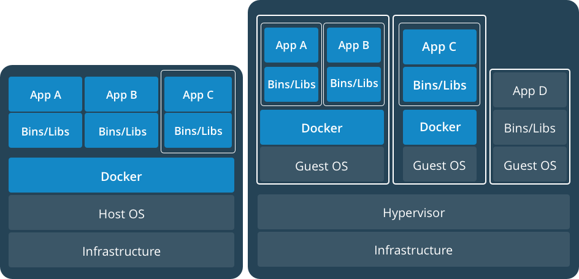
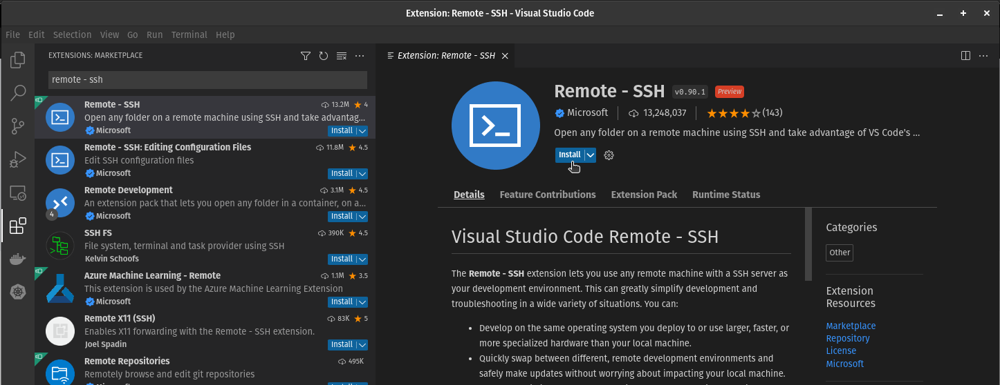
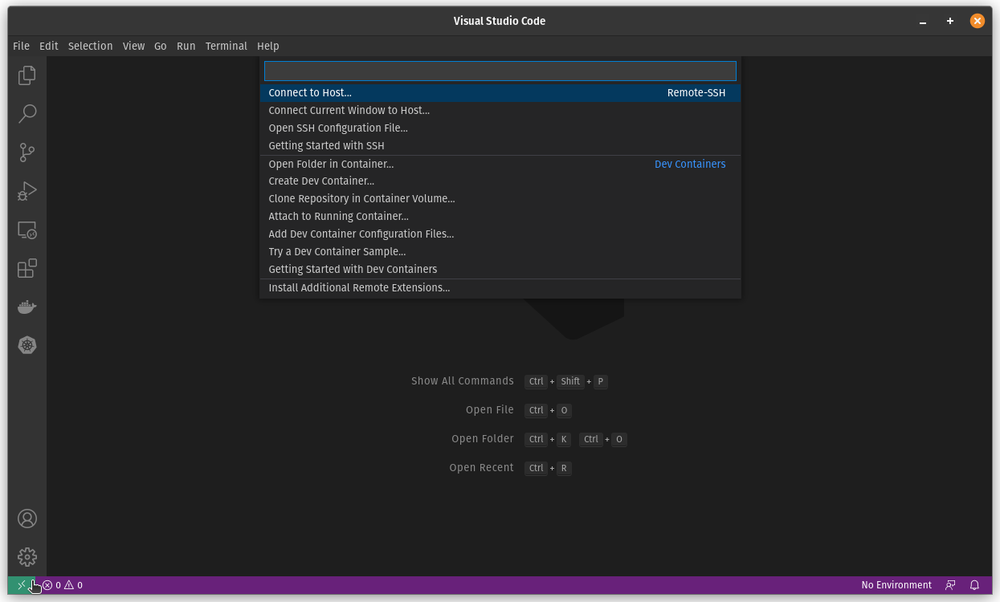
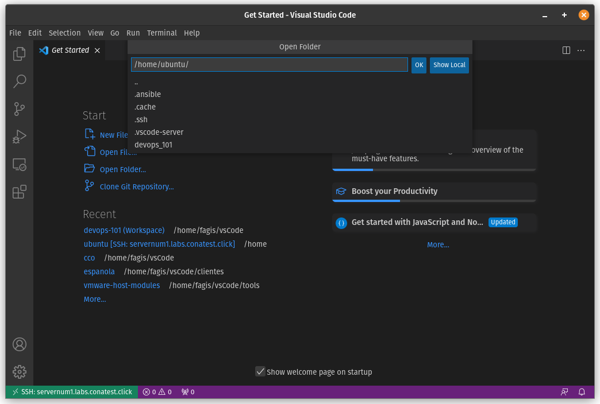

# Docker

_Fuentes:_

- [Documentación oficial](https://docs.docker.com/)
- [Página de Docker](https://www.docker.com/)

## Indice.

---

- [Introducción](#introduccion)
- [Imágenes y contenedores](2_Images.md)
- [Storage](3_Storage.md)
- [Networking](4_Networking.md)
- [Docker compose](5_Docker-Compose.md)

## Introduccion

---

## ¿Qué es Docker?

Docker es la implementación líder de una tecnología llamada Linux containers. Los desarrolladores utilizan contenedores para eliminar los conflictos que se originan al trabajar en la máquina propia mientras colaboran con otros desarrolladores.
Los contenedores también facilitan la puesta en producción y la operación de las aplicaciones.

Mas específicamente, los contenedores son una tecnología, similar a las máquinas virtuales, que permiten automatizar el seteo de un ambiente de desarrollo para el programador. De esta forma, el programador ya no tiene que pasar horas customizando el sistema operativo e instalando dependencias, sino que puede utilizar uno o varios contenedores que ya tienen toda la customización necesaria. Una ventaja adicional es que los contenedores nos permiten experimentar libremente sin preocuparnos por "romper" nuestra máquina.

Los contenedores se han vuelto extremadamente populares porque son ideales para implementar aplicaciones con una arquitectura de microservicios. A diferencia de la arquitectura monolítica tradicional donde hay una base única de código para toda la aplicación, la arquitectura de microservicios implementa varios servicios diferentes, que resuelven pequeños problemas y que cada uno tiene base de código distinta. Una aplicación hoy en día puede estar compuesta por decenas de microservicios que se comunican entre sí.


## Terminología.

**imagen:** una imagen es un archivo (técnicamente son varios) que contiene todo lo necesario para correr un contenedor. Para quien esté familiarizado con la tecnología de máquinas virtuales esto es similar a un .ova/.ovf

**contenedor** un contenedor es una instancia viva de una imagen. Haciendo una analogía con la tecnología de máquinas virtuales esto sería algo similar a una máquina virtual propiamente dicha. Un contenedor corre un comando o un script nativamente sobre el Kernel del sistema operativo (compartido para todos los contenedores del host), a diferencia de la tecnología de máquinas virtules donde se implementa un sistema operativo completo para cada una. Por tal motivo los contenedores son mucho mas "livianos" que las máquinas virtuales.

## Contenedores vs Máquinas virtuales

### Arquitectura de máquinas virtuales.


### Arquitectura de contenedores.


La diferencia principal entre los contenedores y las máquinas virtuales es que las máquinas virtuales corren un sistema operativo completo cada una, mientras que los contenedores comparten el kernel del host. La única información necesaria en una imagen de Docker es la aplicación misma y sus dependencias. Por este motivo, las imágenes de docker son órdenes de magnitud mas pequeñas que un archivo ovf/ova.

### Ventajas principales

- Uso mas eficiente de recursos (CPU, Memoria).
- Menor consumo de disco.
- Levantan mucho mas rápido.
- Fácilmente automatizables.
- Ideales para arquitectura de microservicios.
- Se puede tratar la infraestructura como código.

## Contenedores y Máquinas virtuales

Cómo vimos anteriormente y como veremos también mas adelante, los contenedores presentan muchas ventajas respecto de las máquinas virtuales pero también algunas limitantes (aunque cada vez menos).

Por otro lado, ¿que sucede si quiero utilizar contenedores pero toda mi infraestructura se encuentra virtualizada mediante virtualización tradicional?



Como se ve en el diagrama mas arriba, no existe ningún inconveniente en que co-existan la virtualización mediante contenedores y la virtualización tradicional, de hecho es posible que en algunos escenarios esto sea lo recomendado.

## Docker engine

El motor de Docker, tal como se instala típicamente, consiste de tres componentes:

- Server (`dockerd`)
- REST API
- Client o "docker cli" (`docker`)


El **Server** es el demonio de Docker propiamente dicho, podremos verlo como un proceso llamado `dockerd` dentro del sistema. Este es quien se encarga de crear y gestionar "objetos" de Docker como ser **imágenes, contenedores, redes y volúmenes**.

El **server** dispone de una API REST para recibir instrucciones y brindar información a otras piezas de software.

El **client** o **docker cli**, es una línea de comandos disponible para el usuario. Esta recibe las instrucciones del usuario a través de comandos y las traduce a mensajes HTTP a ser enviados a la API REST. En otras palabras, oculta al usuario la complejidad (del servidor y su API) presentando un conjunto de comandos a través de los cuales gestionar Docker.

## Instalación

En caso de querer instalar Docker, (`dockerd`, API y `docker`), en la máquina local se pueden seguir estas [instrucciones](https://docs.docker.com/install/). Para este curso no utilizaremos Docker localmente sino que accederemos a un ambiente en la nube donde tendremos Docker pre-instalado.

## DockerHub

[DockerHub](http://dockerhub.com) es un repositorio, típicamente público, aunque también puede ser privado, de imágenes de contenedores Docker. En DockerHub hay mas de 100.000 imágenes públicas, desarrolladas por la comunidad que están disponibles para bajar. Dentro de estas imágenes se encuentran las aplicaciones mas comunes que utilizaremos cuando estemos desarrollando como ser: NGINX, MySQL, PostgreSQL, Ubuntu, Python, Node.js, haproxy, etc.

DockerHub está integrado de forma nativa dentro de Docker, por lo que al instalar este último ya tendremos acceso de forma automática a las imágenes públicas de DockerHub, aún sin tener una cuenta registrada.

## Acceso al ambiente de trabajo

Como se mencionó anteriormente, en esta capacitación no trabajaremos directamente sobre las notebooks, sino que cada estudiante tendrá acceso a un servidor (pod) en la nube desde donde se realizarán los laboratorios.

Los servidores disponibles (del 1 al N depeniendo de la cantidad de estudiantes) siguen la siguiente convención de nombres:

```
servernum1.labs.conatest.click
servernum2.labs.conatest.click
...
servernumN.labs.conatest.click
```

👉 Es importante que cada estudiante acceda únicamente a su servidor asignado.

Previo al inicio del curso, debe haber recibido por mail los certificados para conectarse al equipo. Estos son `devops101-labs.pem` el cuál se utiliza directamente con ssh, y `devops101-labs.ppk` el cual se utiliza con el cliente Putty (en Windows). En caso de no haberlo recibido, consulte al instructor.

#### Como acceder desde Linux/Mac

Para acceder al `Pod` desde Linux o Mac, se debe descargar el certificado (.pem) y guardarlo en un directorio de fácil acceso de su máquina.
Ubicarse en dicho directorio y colocarle permisos de solo lectura al archivo, únicamente para el usuario, con el siguiente comando:

```bash
$ chmod 400 devops101-labs.pem
```

Luego se utiliza el comando `ssh` para acceder al servidor, sustituyendo la X por el número de POD asignado:

```bash
$ ssh -i devops101-labs.pem ubuntu@servernumX.labs.conatest.click
```


#### Como acceder desde Windows

Desde Windows, se puede acceder de dos formas.

La primera es utilizando `Windows Power Shell`:

- Descargar el certificado (.pem) recibido y coloclarlo en una carpeta de fácil acceso.
- Abrir la aplicación `Windows Power Shell`, y ubicarse en dicha carpeta.
- Utilizar el comando `ssh` tal como lo haríamos para Linux en el caso anterior:
  ```bash
  > ssh -i devops101-labs.pem ubuntu@servernumX.labs.conatest.click
  ```

La segunda opción es utilizando la herramienta `Putty`:

- Descargar a la notebook el certificado (.ppk) recibido.
- Instalar [Putty](https://www.chiark.greenend.org.uk/~sgtatham/putty/) y abrirlo.
- Dentro del panel "Category" elegir "Session" y luego completar los siguientes campos:

  ```bash
  hostname: ubuntu@servernumX.labs.conatest.click
  connection-type: ssh
  port: 22
  ```
- Dentro de "Category" --> "Connection" --> "SSH" --> "Auth" seleccionar "Browse" y elegir el certificado `devops101-labs.ppk`
- Opcional: puede grabar la configuración de la sesión mediante "Save" para poder volver a utilizarla luego.
- Seleccionar "Open" para conectarse, y luego "Accept" para aceptar la Security Alert (la primera vez).

#### Opcional: configuración ssh file

En caso que utilice `ssh` para conectarse a su `POD`, puede agregar las siguientes entradas al archivo `config` de ssh, para facilitar la conexión:

```bash
Host servernumX.labs.conatest.click
  HostName servernumX.labs.conatest.click
  IdentityFile ~/.ssh/devops101-labs.pem
  User ubuntu
```

- Recuerde sustituir la X por su número de POD asignado.
- En `IdentityFile` debe colocar la ubicación del certificado `.pem` donde lo descargó en su máquina.
- El archivo `config` se encuentra ubicado en el directorio  `~/.ssh/config` en linux, o en `~\.ssh\config` en Windows (si no existe, debe crearlo).
- Si utiliza windows puede utilizar el editor notepad para editar el archivo, pero asegurese de guardarlo sin la extensión .txt que notepad le agrega por defecto.


Una vez modificado el `ssh config file` podrá conectarse al POD, tanto desde Linux como desde Windows Power Shell, simplemente haciendo:

```bash
$ ssh servernumX.labs.conatest.click
```

Esto además resultará sumamente útil para conectarse por medio de Visual Studio Code al `POD`, como veremos a continuación.


#### Opcional: configuración de Visual Studio Code

Si bien no es requerido, recomendamos instalar en su máquina el editor de texto Visual Studio Code, que puede descargar desde [aquí.](https://code.visualstudio.com/)
Esto le permitirá conectarse a su `POD` remoto, directamente desde el editor que corre en su máquina local (por ssh) y así poder editar los archivos que se utilizan durante los laboratorios de forma mucho mas amigable que utilizando el editor `nano` o `vim` de linux. Esto será particularmente útil para la sección de `docker-compose` así como para el desafío final, que veremos en el segundo día de curso.

Este editor es particularmente potente, gracias a la integración de múltiples extensiones que amplían su funcionalidad.
Para poder utilizarlo en el curso, deberemos instalar al menos la extension [Remote - SSH](https://marketplace.visualstudio.com/items?itemName=ms-vscode-remote.remote-ssh), que permite acceder remotamente a un servidor y editar los archivos directamente en el mismo.

La instalación de la extensión es muy sencilla. Una vez instalado el editor, iniciarlo, y luego ir a  `File > Preferences > Extensions` o presionar directamente `<ctrl-shift-X>. `Esto abrirá el panel de configuración de las `EXTENSIONS` y arriba del todo tendrá un panel de búsqueda donde podrá buscar la extensión "Remote - SSH".

Aparecerán múltiples resultados, donde recomendamos instalar la provista por `Microsoft `, tal como muestra la siguiente imagen:



Una vez instalada, aparecerá un pequeño botón verde en la esquina inferior izquierda del editor (es posible que deba reiniciarlo).
Al seleccionarlo, nos dará la opción de conectarnos a un servidor remoto por `SSH Connect to Host...`



Si ya configuró el `ssh config file` del punto anterior, alcanzará con indicar el POD al cual conectarse, esto es: `servernumX.labs.conatest.click. `

De lo contrario, si no realizó el paso anterior, podemos configurar lo necesario en este momento (solo se hace una vez), mediante los siguientes pasos:

- seleccionar la opción `+ Add New SSH Host...`
- agregar el comando ssh completo, es decir: `ssh -i ~/.ssh/devops101-labs.pem ubuntu@servernumX.labs.conatest.click`
- luego nos pedirá la ubicación del ssh config file a utilizar, por ejemplo: `~/.ssh/config` en linux o en `~\.ssh\config` Windows
- esto modificará la configuración del `ssh config` file agregando el acceso al pod, y ya podrá conectarse con el botón `Connect`

👉 recuerde sustituir la `X` por su número de `POD` asignado y colocar la ubicación correcta donde descargó el certificado `.pem`


Al conectarse al servidor remoto por primera vez, es posible que le solicite cuál es la plataforma a la cual conectarse, indique `Linux.`

Por último, una vez conectado con el editor a su pod (lo cual puede verlo en el botón verde abajo a la izquierda), puede abrir la carpeta remota en el servidor, para poder editar los archivos directamente en el mismo.
Para esto seleccion `File > Open Folder` e indique la carpeta `/home/ubuntu/` tal como se muestra en la siguiente imagen, y presione `OK.`



La primera vez, le preguntará si confía en el autor de los archivos, indique que `SI` y seleccione el `checkbox` para que no vuelva a preguntarle.

Aguarde unos segundos, y sobre el panel de la izquierda tendrá acceso al contenido de ese directorio del servidor remoto, donde podrá crear nuevos archivos y/o directorios, así como seleccionar un archivo para editarlo en el panel derecho, guardando los cambios directo al servidor remoto.

## Docker cli

Docker se controla a nivel local mediante una interfaz de línea de comandos `Docker cli`, que por debajo interactúa con el `Docker daemon` a través de la `Docker API`.

### Standalone Commands vs Management Commands

Debido a su desarrollo y evolución, la `docker cli` cuenta con dos tipos de comandos diferentes, que permiten realizar las mismas tareas de dos formas.
En las primeras versiones, la `cli` contaba con una serie de comandos independientes (que siguen siendo válidos) denominados `Standalone Commands`. Suelen ser comandos de tipo "verbos", como por ejemplo `docker run`, `docker pull`, `docker build`, que en general realizan una acción específica. Sin embargo, a medida que la plataforma crecía y se agregaban nuevas funcionalidades, resultaba cada vez mas difícil encontrar "verbos" adecuados para poder reflejar las mismas.

A partir de la versión 1.13+, la `docker cli` evolucionó, para incluir un nuevo conjunto de comandos denominados `Management Commands`,  con el objetivo es agrupar los comandos para que puedan adecuarse a las nuevas funcionalidades y sean mas sencillos de recordar. Los `Management Commands` suelen comenzar con "sustantivos" que se asocian con los diversos componentes de la plataforma, por ejemplo `docker container` o `docker image` seguidos de subcomandos en forma de "verbos", que se asocian a la acción que se realiza, por ejemplo `docker container run` o `docker image ls`.

> ℹ️ A lo largo de esta guía trataremos de utilizar en la mayoría de los casos los `Management Commands`, pero como este curso también ha ido evolucionando desde las primeras versiones hace varios años, es posible que en algunos lugares todavía se haga referencia al antiguo set de `Standalone Commands`, los cuales de todas formas siguen siendo válidos.

Simplementa a modo de ejemplo, si quisieramos listar los contenedores que están corriendo actualmente, utilizando los `Management commands` ejecutaríamos:

```bash
$ docker container ls
```

mientras que con los `Standalone Commands` sería:

```bash
$ docker ls
```

#### Ayuda: `docker help`

Una de las fuentes importantes de referencia es la propia ayuda que proporciona la propia cli, al ejecutar el comando `docker help`:

```
$ docker help
(...)

Management Commands:
  config      Manage Docker configs
  container   Manage containers
  image       Manage images
(...)

Commands:
  attach      Attach local standard input, output, and error streams to a running container
  build       Build an image from a Dockerfile
  commit      Create a new image from a container's changes
  cp          Copy files/folders between a container and the local filesystem
  create      Create a new container
  diff        Inspect changes to files or directories on a container's filesystem
  events      Get real time events from the server
  exec        Run a command in a running container
(...)
 

```

Y podemos también obtener detelles específicos de un Management Command, por ejemplo:

```
$ docker container --help
Usage:  docker container COMMAND

Manage containers

Commands:
  attach      Attach local standard input, output, and error streams to a running container
  commit      Create a new image from a container's changes
  cp          Copy files/folders between a container and the local filesystem
  create      Create a new container
  diff        Inspect changes to files or directories on a container's filesystem
  exec        Run a command in a running container
  export      Export a container's filesystem as a tar archive
  inspect     Display detailed information on one or more containers
(...)
```

O bajar mas de nivel a un comando específico, por ejemplo:

```
$ docker container ls --help
Usage:  docker container ls [OPTIONS]

List containers

Aliases:
  ls, ps, list

Options:
  -a, --all             Show all containers (default shows just running)
  -f, --filter filter   Filter output based on conditions provided
      --format string   Pretty-print containers using a Go template
  -n, --last int        Show n last created containers (includes all states) (default -1)
  -l, --latest          Show the latest created container (includes all states)
      --no-trunc        Don't truncate output
  -q, --quiet           Only display container IDs
  -s, --size            Display total file sizes
```

Comencemos entonces por conocer los comandos mas comunes disponibilizados por Docker a través de su **cli** para el trabajo con **contenedores**.

## Trabajando con Contenedores

### Cómo crear un contenedor: `docker container run`

El comando `docker container run` genera un nuevo contenedor a partir de una imagen y lo pone a correr.

Podemos revisar la ayuda del mismo con `docker container run --help`, donde vemos que la forma de ejecutarlo es: `docker container run [opciones] nombre-de-la-imagen [comando-a-ejecutar]`. En caso de no indicar el comando a ejecutar, el contendor correrá el comando por defecto que está configurado en la imagen (veremos esto en detalle más adelante).

Aquí hay que tener cuidado en no dejarse engañar por el nombre del comando, si bien el mismo se llama `run`, no se utiliza para iniciar un contenedor, sino que se utiliza para crearlo. Pero además de crearlo, también lo inicia, lo pone a correr.

> 💡 La mejor forma de pensar este comando es que sirve para: "correr un comando dentro de un **nuevo contenedor**"

El comando `docker container run` primero busca la imagen del contenedor localmente, y en caso de no encontrarla va a buscarla a un registro de imágenes, que por defecto es [DockerHub](https://hub.docker.com/).

#### Ejemplo:

```bash
$ docker container run hello-world
Unable to find image 'hello-world:latest' locally
latest: Pulling from library/hello-world
9db2ca6ccae0: Pull complete
Digest: sha256:4b8ff392a12ed9ea17784bd3c9a8b1fa3299cac44aca35a85c90c5e3c7afacdc
Status: Downloaded newer image for hello-world:latest

Hello from Docker!
This message shows that your installation appears to be working correctly.

To generate this message, Docker took the following steps:
 1. The Docker client contacted the Docker daemon.
 2. The Docker daemon pulled the "hello-world" image from the Docker Hub.
    (amd64)
 3. The Docker daemon created a new container from that image which runs the
    executable that produces the output you are currently reading.
 4. The Docker daemon streamed that output to the Docker client, which sent it
    to your terminal.

To try something more ambitious, you can run an Ubuntu container with:
 $ docker run -it ubuntu bash

Share images, automate workflows, and more with a free Docker ID:
 https://hub.docker.com/

For more examples and ideas, visit:
 https://docs.docker.com/engine/userguide/

```

Como se puede apreciar en la primera línea de la salida del comando, dado que la imagen `hello-world:latest` no se encuentra localmente, el demonio de Docker la descarga desde [dockerhub](https://hub.docker.com/)

> **Nota:** cada imagen tiene una etiqueta asignada que sirve para que el creador de dicha imagen pueda identificar diferentes versiones de la misma. La etiqueta se especifica colocando `:` inmediatamente después del nombre de la imagen, seguido de la etiqueta en si misma de la siguiente forma `nombredelaimagen:etiqueta`.
> En caso de que se omita el nombre de la etiqueta, Docker utiliza `latest` que hace referencia a la última versión disponible.

#### Opciones de `docker container run`

El comando `docker container run ` acepta varias opciones, a continuación repasaremos las mas comunes o utilizadas:

##### Opción `-it`

Estas dos opciones usualmente se utilizan en conjunto. La opción `-i` (`--interactive`) mantiene `STDIN` abierto para el contenedor, lo que se traduce en que podremos utilizar nuestro teclado para enviarle comandos al contenedor que está corriendo. Mientras que la opción `-t` (`--tty`) asigna una `tty` al contenedor, lo que en otras palabras quiere decir que tendremos acceso a una terminal (la consola) cuando vayamos a interactuar con el mismo.

##### Opción `-d`

La opción `-d` (`--detach`) indica que el contenedor debe de correr en segundo plano (background), como un servicio. Esto es útil cuando el contenedor que estamos creando no necesita interacción por parte del usuario, y fue creado para correr en background sirviendo requests de clientes, por ejemplo un servidor Web, DNS, DHCP, etc.

El siguiente ejemplo muestra como correr un servidor web NGINX en segundo plano:

```bash
$ docker container run -d nginx
9a95e5d34baa8af84eec14569a4966cb40690cafe0c0b28034eb5c9c1d829fd2
$
```

##### Opción `--name`

Esta opción permite darle un nombre al contenedor que estamos creando. En caso de que no se le brinde un nombre, Docker asignará uno generado randómicamente. El nombre permite ejecutar diferentes acciones sobre el contenedor de forma nemotécnica. Lo veremos en detalle mas adelante.

##### Opción `--rm`

Esta opción le indica a Docker que el contedor debe ser eliminado una vez que el mismo se detenga. Por defecto los contenedores permanecen en el sistema una vez apagados, pero si colocamos esta opción, el mismo se elimina cuando termina su ejecución. Esto es muy útil cuando estamos realizando pruebas y no queremos dejar múltilples contenedores en nuestro equipo host que no sean realmente necesarios.

##### Opción `-p`

La opción `-p` (`--publish`) mapea un puerto del contenedor a un puerto del equipo host. Se utiliza cuando se necesita publicar externamente el servicio que proporciona el contenedor. Si por ejemplo tenemos un contenedor corriendo un servidor web que escucha en el puerto 8080, y queremos publicar dicho servicio en el puerto 80 de la máquina `host`, agregaríamos la opción `-p 80:8080`.
Veremos la opción `-p` en mas detalle en la sección [Networking](4_Networking.md).

##### Opción `-e`

La opción `-e` (`--env`) permite pasarle variables de entorno al contenedor. Se utiliza cuando se necesita específicar alguna variable de entorno al momento de correr el contenedor, por ejemplo, si la aplicación (comando) lo requierre para su ejecución.

> ℹ️  El comando `docker container run` acepta muchas opciones más, para conocerlas puede revisar la ayuda del mismo: `docker container run --help`.

##### Ejercicio 1

Partiendo de la imagen llamada `ubuntu` levantar un contenedor que corra una terminal de bash (`/bin/bash`) en modo interactivo, y que se autoelimine al finalizar su ejecución.

<details>
    <summary>Solución</summary>
<pre>
$ docker container run -it --rm ubuntu /bin/bash
Unable to find image 'ubuntu:latest' locally
latest: Pulling from library/ubuntu
e96e057aae67: Pull complete 
Digest: sha256:4b1d0c4a2d2aaf63b37111f34eb9fa89fa1bf53dd6e4ca954d47caebca4005c2
Status: Downloaded newer image for ubuntu:latest
root@98adb368cf78:/#
root@98adb368cf78:/# exit
</pre>
</details>

#### Cómo listar los contenedores: `docker container ls`

El siguiente comando lista los contenedores que están corriendo:

```bash
$ docker container ls
CONTAINER ID        IMAGE               COMMAND                  CREATED             STATUS              PORTS      NAMES
7ed9736d1ec5        nginx               "docker-entrypoint.s…"   3 minutes ago       Up 3 minutes        80/tcp     friendly_bartik
```

Como puede verse, cada contenedor tiene un ID (autogenerado) y un nombre (autogenerado o asignado con la opción `--name`).
Estos campos son fundamentales dado que los utilizaremos en cada vez que nos querramos referir a un contenedor para ejecutar alguna acción.

Para listar todos los contenedores del sistema, los que estén corriendo y los que estén detenidos, se agrega la opción `-a` de la siguiente manera:

```bash
$ docker container ls -a
```

> 👉 es muy común utilizar el comando standalone  `$ docker ps` para listar los contenedores de igual forma que lo hace `docker container ls.`

### Cómo apagar un contenedor: `docker container stop`

Para apagar un contenedor que está corriendo se puede ejecutar `docker container stop` seguido del nombre o el id del contenedor. Por ejemplo:

```bash
$ docker container ls
CONTAINER ID        IMAGE               COMMAND                  CREATED             STATUS              PORTS      NAMES
7ed9736d1ec5        nginx               "docker-entrypoint.s…"   3 minutes ago       Up 3 minutes        80/tcp     friendly_bartik

$ docker container stop friendly_bartik
friendly_bartik

$ docker container ls
CONTAINER ID        IMAGE               COMMAND             CREATED             STATUS              PORTS               NAMES

```

> 👉 asignar nombres nemotécnicos a los contenedores nos evita tener que listarlos previamente para obtener su ID o su nombre autogenerado para poder ejecutar comandos sobre el mismo, como por ejemplo apagarlo.

### Cómo encender un contenedor:  `docker container start`

Para prender un contenedor que se encuentra apagado podemos ejecutar `docker container start` seguido del nombre del contenedor o su ID.

##### Ejemplo

```bash
$ docker container ls -a
CONTAINER ID        IMAGE               COMMAND                  CREATED             STATUS              	PORTS   NAMES
7ed9736d1ec5        nginx               "docker-entrypoint.s…"   3 minutes ago       xited (0) 2 minutes ago    	friendly_bartik

$ docker container start 7ed9736d1ec5
7ed9736d1ec5

$ docker container ls
CONTAINER ID        IMAGE               COMMAND                  CREATED             STATUS              PORTS          NAMES
7ed9736d1ec5        nginx               "docker-entrypoint.s…"   4 minutes ago       Up 1 second         80/tcp   	friendly_bartik
```

> 👉 Asignar nombres nemotécnicos a los contenedores nos ayuda a identificarlos de mejor forma, y no depender de su ID o nombre autogenerado para poder apagarlos.

### Cómo borrar un contenedor: `docker container rm`

Ya vimos como encender y apagar un contenedor, pero ¿qué sucede cuando ya no lo necesitamos?. Los contenedores pueden eliminarse del sistema con el comando `$ docker container rm <nombre-del-contenedor/id-del-contenedor>`. Esto elimina el container por completo, por lo que al ejecutar `$ docker container ls -a` tampoco lo veremos.

```bash
$ docker container rm 7ed9736d1ec5
7ed9736d1ec5

$ docker container ls -a
CONTAINER ID        IMAGE               COMMAND             CREATED             STATUS              PORTS               NAMES
```

> 👉 Es importante notar que este comando elimina el contenedor pero **no elimina la imagen** de la cuál el contenedor proviene. Esto quiere decir que si nosotros quisieramos volver a correr el contenedor, la imagen se encuentra almacenada localmente y por tanto no es necesario descargarla nuevamente.

De esta forma, si volvieramos a crear un contenedor previamente eliminado, a diferencia de la primera vez donde `dockerd` tuvo que descargar la imagen, el contenedor se crearía de forma prácticamente instantánea. Veámos un ejemplo:

1. Creo un contenedor cuya imagen no se encuentra localmente

```bash
$ docker container run -d -it ubuntu
Unable to find image 'ubuntu:latest' locally
latest: Pulling from library/ubuntu
124c757242f8: Pull complete
2ebc019eb4e2: Pull complete
dac0825f7ffb: Pull complete
82b0bb65d1bf: Pull complete
ef3b655c7f88: Pull complete
Digest: sha256:72f832c6184b55569be1cd9043e4a80055d55873417ea792d989441f207dd2c7
Status: Downloaded newer image for ubuntu:latest
d83cb28ee25cc1abda77f8f45248d3f80e4c42f93ddde9cd5338739498e9e66e

```

2. Listo el contenedor, luego lo apago y lo elimino

```bash
$ docker container ls
CONTAINER ID        IMAGE               COMMAND             CREATED             STATUS              PORTS               NAMES
d83cb28ee25c        ubuntu              "/bin/bash"         3 seconds ago       Up 2 seconds                            pedantic_bell

$ docker container stop pedantic_bell
pedantic_bell

$ docker container rm pedantic_bell
pedantic_bell
```

3. Vuelvo a crear el contenedor, lo cuál esta vez es inmediato, dado que la imagen ya se encuentra presente de forma local:

```bash
$ docker container run -d -it ubuntu
b1332396d3fbfe3629a3c3fe5d829995e9d9fd8642bfd234b929e887fb7a81ed
```

4. Listo el nuevo contenedor, y vemos que el ID ahora es diferente dado que se trata de otro contenedor.

```bash

$ docker container ls
CONTAINER ID        IMAGE               COMMAND             CREATED             STATUS              PORTS               NAMES
b1332396d3fb        ubuntu              "/bin/bash"         4 seconds ago       Up 3 seconds                            relaxed_lichterman
```

### Cómo conectarse a un contenedor corriendo en segundo plano: `docker container attach`

Cuando un contenedor está corriendo en segundo plano podemos conectarnos al mismo (a su consola), utilizando el comando `docker container attach`.

```bash
$ docker container run -itd --rm --name ejemplo_attach ubuntu top
7e0da3c794cb1f64ce0ed20dce277741965dfb1ee96a2990dde9ebeb16b9667d

$ docker container attach ejemplo_attach
root@33c2899ecb9e:/#
top - 20:40:11 up 7 days, 22:10,  0 users,  load average: 1.14, 1.02, 0.98
Tasks:   1 total,   1 running,   0 sleeping,   0 stopped,   0 zombie
%Cpu(s):  5.5 us,  1.8 sy,  0.0 ni, 92.4 id,  0.1 wa,  0.0 hi,  0.3 si,  0.0 st
KiB Mem : 12190548 total,   710936 free,  6855016 used,  4624596 buff/cache
KiB Swap: 12475900 total, 12384984 free,    90916 used.  3590716 avail Mem

  PID USER      PR  NI    VIRT    RES    SHR S  %CPU %MEM     TIME+ COMMAND
    1 root      20   0   36640   3104   2676 R   0.0  0.0   0:00.03 top
```

Una vez "dentro" del contenedor, para desconectarnos debemos ejecutar la combinación de teclas `ctrl+p`, `ctrl+q`. Esto permitirá volver a la máquina `host` y que el contendor siga corriendo en segundo plano.

##### Ejercicio 2

1. Ejecutar el siguiente comando:

```bash
$ docker container run -it -d --name ejercicio2 --rm ubuntu /bin/bash
```

2. Verificar que el contenedor se encuentra corriendo.
3. Conectarse a la consola del contenedor.
4. Una vez dentro de la consola ejecutar el comando `exit`.
5. En el equipo `host`, listar nuevamente los contenedores que se encuentran corriendo. Que puede notar?
6. Volver a ejecutar el paso 1.
7. Conectarse una vez mas a la consola del contenedor.
8. Salir del contenedor y volver a la consola del equipo `host`, pero esta vez sin apagar el contenedor.
9. Listar los contenedores y verificar que sigue encendido.
10. Estando en el equipo `host` apagar el contenedor.

<details>
    <summary>Solución</summary>
<pre><code>
  $ docker container ls
  CONTAINER ID   IMAGE     COMMAND   CREATED   STATUS    PORTS     NAMES
  .
  $ docker container run -it -d --name ejercicio2 --rm ubuntu /bin/bash
  e68c8510b4e0b8ad25be05a8604591e57bde2e75b0b48d3c57f84d834a940062
  .
  $ docker container ls
  CONTAINER ID   IMAGE     COMMAND       CREATED         STATUS         PORTS     NAMES
  e68c8510b4e0   ubuntu    "/bin/bash"   6 seconds ago   Up 4 seconds             ejercicio2
  .
  $ docker container attach ejercicio2 
  root@e68c8510b4e0:/# exit
  exit
  .
  $ docker container ls
  CONTAINER ID   IMAGE     COMMAND   CREATED   STATUS    PORTS     NAMES
  .
  $ docker container run -it -d --name ejercicio2 --rm ubuntu /bin/bash
  7db45dbe1b9ca9df8bdf28905326b46bdbc24b1dcc9a3cf76f05c1caedfc4017
  .
  $ docker container ls
  CONTAINER ID   IMAGE     COMMAND       CREATED          STATUS          PORTS     NAMES
  7db45dbe1b9c   ubuntu    "/bin/bash"   11 seconds ago   Up 10 seconds             ejercicio2
  .
  $ docker container attach ejercicio2 
  root@7db45dbe1b9c:/# <ctrl-p><ctrl-q>
  root@7db45dbe1b9c:/# read escape sequence
  .
  $ docker container ls
  CONTAINER ID   IMAGE     COMMAND       CREATED          STATUS          PORTS     NAMES
  7db45dbe1b9c   ubuntu    "/bin/bash"   25 seconds ago   Up 24 seconds             ejercicio2
  .
  $ docker container stop ejercicio2 
  ejercicio2
  .
  $ docker container ls
  CONTAINER ID   IMAGE     COMMAND   CREATED   STATUS    PORTS     NAMES
  .
</code></pre>
</details>

## Trabajando con las Imágenes

Hasta ahora hemos trabajado directamente con los contenedores. Veamos ahora algunos comandos básicos para trabajar con las imágenes, con las cuáles trabajaremos luego en más profundidad, en la sección [Imágenes y contenedores](2_Images.md).

### Cómo listar las imágenes: `docker image ls`

```bash
$ docker image ls
```

Muestra las imágenes que se encuentran descargadas en el equipo `host` local, por ejemplo:

```bash
$ docker images
REPOSITORY                TAG                 IMAGE ID            CREATED             SIZE
nginx                     latest              c246cd3dd41d        5 weeks ago         107.5 MB
hello-world               latest              1815c82652c0        6 weeks ago         1.84 kB
ismaa10/devnetcontainer   latest              d00246b829df        7 weeks ago         488.9 MB
conatel/config-backup     latest              32dde64fc2ca        12 weeks ago        706.8 MB
conatel/config-backup     <none>              fc4791bcc292        3 months ago        706.8 MB
conatel/config-backup     <none>              a2186fa14acc        3 months ago        706.8 MB

```

### Ejercicio 3

Este ejercicio tiene como objetivo experimentar de primera mano la potencia de los contenedores a la hora de simplificar la puesta en producción de un servicio. Nos referimos mas concretamente al hecho de que una vez que la aplicación fue "contenerizada" tendremos la certeza absoluta que correrá sin problemas en cualquier plataforma que soporte Docker.

Concretamente, el objetivo del ejercicio es poner en producción una aplicación, llamada [Ghost](https://ghost.org/), que permite publicar Blogs al público en general. Esta plataforma ya fue "contenerizada" y su imagen está diponible públicamente en [Dockerhub](https://hub.docker.com/_/ghost), bajo el nombre `ghost`.

Los requerimientos para el ejercicio son:

- Ejecutar un contenedor utilizando la imagen `ghost` disponible en dockerhub.
- El contendor debe correr con el nombre `ejercicio3.`
- El contenedor no debe ser eliminado al apagarse.
- El contenedor debe correr en segundo plano.
- El servicio debe quedar publicado al exterior en el puerto `80` del host, teniendo en cuenta que el puerto original de la aplicación `ghost` es `2368`.
- Para que el contenedor se ejecute correctamente, se le debe pasar la variable de entorno `NODE_ENV` con el valor `development`, de lo contrario dará error y el servicio no inciará.
- El comando a utilizar es el que viene por defecto con la imagen: `ghost`

**Verificación:**

- Mediante un navegador acceder a [http://servernumX.labs.conatest.click](http://servernumX.labs.conatest.click), y deberá ver el servicio publicado.
- Apagar el contenedor utilizando `docker stop` y verificar que el servicio ya no está accesible.
- Encender el contenedor utilizando `docker start` y verificar que el servicio vuelve a estar online.
  

<details>
<summary>Pista #1</summary>
La opción para mapear el puerto del contenedor al host es <code>-p puerto-host:puerto-contenedor</code>
</details>

<details>
<summary>Pista #2</summary>
La opción para pasarle una variable de entorno al contenedor es <code>-e VARIABLE=valor</code>
</details>

<details>
    <summary>Solución</summary>
<pre>
<code>
$ docker container run -it -d --name ejercicio3 -p 80:2368 -e NODE_ENV=development ghost
Unable to find image 'ghost:latest' locally
latest: Pulling from library/ghost
e9995326b091: Already exists 
c723fd0ba54b: Pull complete 
5d85eedfbf2f: Pull complete 
2c659d758c47: Pull complete 
205113720a73: Pull complete 
ca494298314e: Pull complete 
88f2c2df7ae5: Pull complete 
3f86652ebe08: Pull complete 
1e8bfba403e7: Pull complete 
Digest: sha256:53784cc1681df843801e6344e1fdbebc80fd1f6c36fa776036bd499a033ab0b5
Status: Downloaded newer image for ghost:latest
d9b61c41f133723a1c598104d02dbd08f8ddb5de9ed5f8b42f8c121736fcc4e6
.
$ docker container ls
CONTAINER ID   IMAGE     COMMAND                  CREATED          STATUS         PORTS                                   NAMES
d9b61c41f133   ghost     "docker-entrypoint.s…"   10 seconds ago   Up 9 seconds   0.0.0.0:80->2368/tcp, :::80->2368/tcp   ejercicio3
.
</code>
</pre>
</details>

### Cómo borrar una imagen: `docker image rm`

Anteriormente vimos como puede eliminarse un contenedor, pero ¿que sucede si además del contenedor queremos eliminar la copia local de la imagen de la cuál proviene?
El comando `docker image rm <id-de-la-imagen/nombre-de-la-imagen>` cumple precisamente esta función.

Es importante notar que esta operación no puede realizarse mientras haya un contenedor que esté usando la imagen, aún cuando el mismo se encuentre apagado.

```bash
$ docker container ls
CONTAINER ID   IMAGE     COMMAND                  CREATED          STATUS         PORTS                                   NAMES
d9b61c41f133   ghost     "docker-entrypoint.s…"   10 seconds ago   Up 9 seconds   0.0.0.0:80->2368/tcp, :::80->2368/tcp   ejercicio3

$ docker stop ejercicio3 
ejercicio3

$ docker image ls
REPOSITORY    TAG       IMAGE ID       CREATED         SIZE
ubuntu        latest    a8780b506fa4   4 days ago      77.8MB
ghost         latest    e7697f79d3c0   5 days ago      566MB
nginx         latest    76c69feac34e   13 days ago     142MB
hello-world   latest    feb5d9fea6a5   13 months ago   13.3kB

$ docker image rm ghost
Error response from daemon: conflict: unable to remove repository reference "ghost" (must force) - container d9b61c41f133 is using its referenced image e7697f79d3c0

```

Si queremos borrar una imagen lo correcto es primero eliminar el contenedor que la está usando (o los contenedores), y luego si, eliminar la imagen.

```bash
$ docker container rm ejercicio3
ejercicio3

$ docker image rm ghost
docker image rm ghost --force
Untagged: ghost:latest
Untagged: ghost@sha256:53784cc1681df843801e6344e1fdbebc80fd1f6c36fa776036bd499a033ab0b5
Deleted: sha256:e7697f79d3c051185ca7827974d25bcc51ee207ab6cda4115159dc52a3b93fe4

```

> 👉 En caso de que se quiera forzar el borrado de la imagen, aunque existan contenedores asociados a la misma, se puede agregar la opción `--force`.

[Siguiente--&gt;](2_Images.md)
